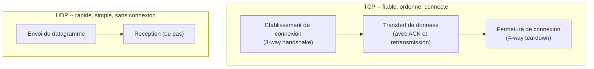
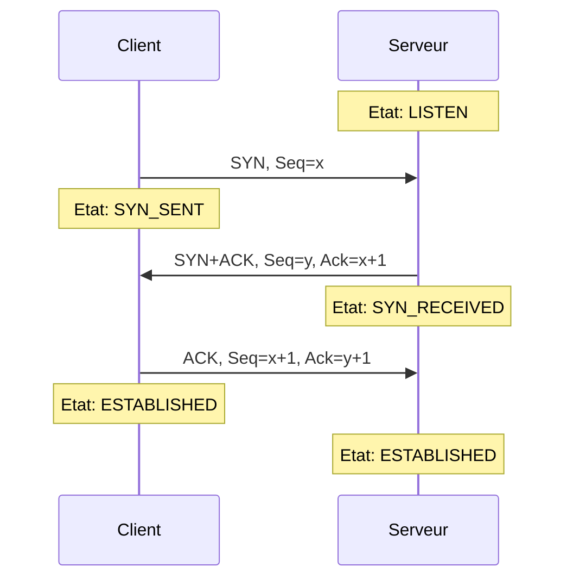
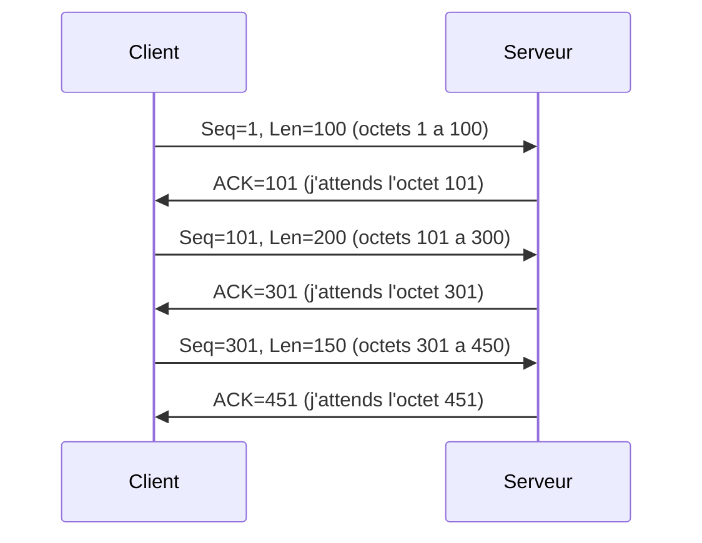
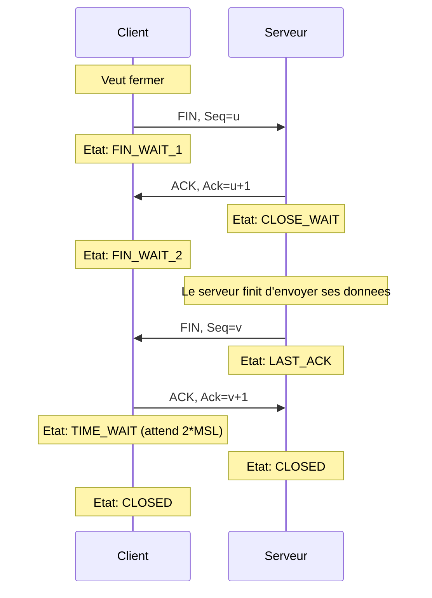
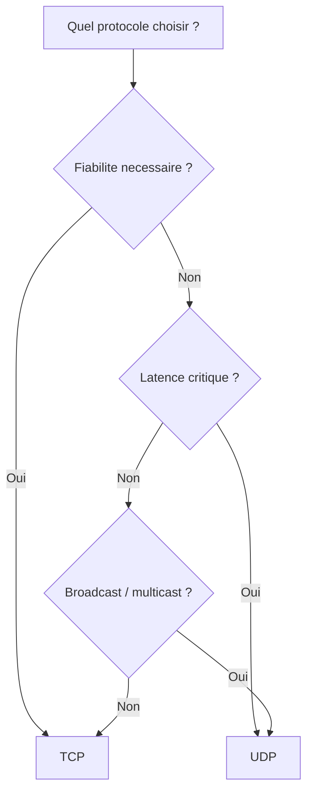

# 05 -- TCP et UDP

## Analogie : le recommande vs la carte postale

Imagine deux facons d'envoyer un message :

**TCP = la lettre recommandee avec accuse de reception**
- Tu deposes ta lettre au bureau de poste.
- Le facteur la remet en main propre au destinataire.
- Le destinataire signe un accuse de reception.
- Si la lettre est perdue en route, le bureau de poste te previent et la renvoie.
- Tu es **certain** que le message est arrive.

**UDP = la carte postale**
- Tu la jettes dans la boite aux lettres.
- Tu esperes qu'elle arrive.
- Pas de confirmation, pas de retour en cas de perte.
- C'est **rapide** et **simple**, mais sans garantie.

Les deux ont leur utilite : pour un contrat legal, tu veux le recommande (TCP). Pour souhaiter "bonnes vacances", une carte postale suffit (UDP).

---

## Intuition visuelle



> TCP etablit une connexion, garantit la livraison et ferme proprement. UDP envoie et espere pour le mieux.

---

## Explication progressive

### Le role de la couche transport

La couche transport a deux missions principales :

1. **Multiplexage / demultiplexage** : permettre a plusieurs applications de partager la meme connexion reseau grace aux **numeros de port**.
2. **Fiabilite** (pour TCP) : garantir que les donnees arrivent completes, dans l'ordre, et sans erreurs.

### Les numeros de port

Un numero de port est un entier sur **16 bits** (0 a 65535) qui identifie une application specifique sur une machine.

**Analogie** : si l'adresse IP est l'adresse d'un immeuble, le port est le numero d'appartement.

| Plage | Nom | Usage |
|-------|-----|-------|
| 0 -- 1023 | Ports bien connus (well-known) | Services standards (HTTP=80, SSH=22...) |
| 1024 -- 49151 | Ports enregistres | Applications specifiques |
| 49152 -- 65535 | Ports dynamiques (ephemeres) | Attribues automatiquement aux clients |

**Ports a connaitre :**

| Port | Protocole | Service |
|------|-----------|---------|
| 20, 21 | TCP | FTP (donnees, controle) |
| 22 | TCP | SSH |
| 23 | TCP | Telnet |
| 25 | TCP | SMTP (envoi d'email) |
| 53 | UDP/TCP | DNS |
| 67, 68 | UDP | DHCP (serveur, client) |
| 80 | TCP | HTTP |
| 110 | TCP | POP3 |
| 143 | TCP | IMAP |
| 443 | TCP | HTTPS |

**Un couple (adresse IP, port) identifie de maniere unique un processus sur le reseau.** On appelle cela un **socket**.

---

## TCP (Transmission Control Protocol)

### Caracteristiques

- **Connecte** : il faut etablir une connexion avant d'echanger des donnees
- **Fiable** : garantit la livraison dans l'ordre, sans perte ni duplication
- **Flux d'octets** : TCP voit les donnees comme un flux continu, pas comme des messages individuels
- **Full-duplex** : les deux cotes peuvent envoyer et recevoir simultanement
- **Controle de flux** : empeche l'emetteur de submerger le recepteur
- **Controle de congestion** : evite de surcharger le reseau

### L'en-tete TCP

```
 0                   1                   2                   3
 0 1 2 3 4 5 6 7 8 9 0 1 2 3 4 5 6 7 8 9 0 1 2 3 4 5 6 7 8 9 0 1
+-+-+-+-+-+-+-+-+-+-+-+-+-+-+-+-+-+-+-+-+-+-+-+-+-+-+-+-+-+-+-+-+
|          Source Port          |       Destination Port        |
+-+-+-+-+-+-+-+-+-+-+-+-+-+-+-+-+-+-+-+-+-+-+-+-+-+-+-+-+-+-+-+-+
|                        Sequence Number                        |
+-+-+-+-+-+-+-+-+-+-+-+-+-+-+-+-+-+-+-+-+-+-+-+-+-+-+-+-+-+-+-+-+
|                    Acknowledgment Number                      |
+-+-+-+-+-+-+-+-+-+-+-+-+-+-+-+-+-+-+-+-+-+-+-+-+-+-+-+-+-+-+-+-+
| Offset|  Res  |U|A|P|R|S|F|          Window Size             |
+-+-+-+-+-+-+-+-+-+-+-+-+-+-+-+-+-+-+-+-+-+-+-+-+-+-+-+-+-+-+-+-+
|           Checksum            |       Urgent Pointer          |
+-+-+-+-+-+-+-+-+-+-+-+-+-+-+-+-+-+-+-+-+-+-+-+-+-+-+-+-+-+-+-+-+
|                    Options (variable)                         |
+-+-+-+-+-+-+-+-+-+-+-+-+-+-+-+-+-+-+-+-+-+-+-+-+-+-+-+-+-+-+-+-+
```

| Champ | Taille | Description |
|-------|--------|-------------|
| Source Port | 16 bits | Port de l'emetteur |
| Destination Port | 16 bits | Port du recepteur |
| Sequence Number | 32 bits | Numero de sequence du premier octet de ce segment |
| Acknowledgment Number | 32 bits | Prochain octet attendu par le recepteur |
| Data Offset | 4 bits | Taille de l'en-tete TCP (en mots de 32 bits) |
| Flags | 6 bits | URG, ACK, PSH, RST, SYN, FIN |
| Window Size | 16 bits | Taille de la fenetre de reception (controle de flux) |
| Checksum | 16 bits | Controle d'integrite |
| Urgent Pointer | 16 bits | Pointeur vers les donnees urgentes |

**Taille minimale de l'en-tete** : 20 octets (sans options). Avec options (MSS, SACK, timestamps) : typiquement 32 octets.

### Les flags TCP

| Flag | Nom | Role |
|------|-----|------|
| SYN | Synchronize | Initie une connexion, synchronise les numeros de sequence |
| ACK | Acknowledge | Confirme la reception de donnees |
| FIN | Finish | Demande la fermeture de la connexion |
| RST | Reset | Reinitialise la connexion (erreur ou refus) |
| PSH | Push | Demande au recepteur de passer les donnees a l'application immediatement |
| URG | Urgent | Indique la presence de donnees urgentes |

---

### Le three-way handshake (ouverture de connexion)

C'est LE mecanisme TCP le plus important a connaitre. Trois paquets pour etablir une connexion :



**Deroulement detaille :**

**Paquet 1 : SYN (Client -> Serveur)**
```
Flags   : SYN = 1
Seq     : x (numero de sequence initial du client, aleatoire)
Ack     : 0
Donnees : aucune
Options : MSS (Maximum Segment Size), Window Scale, SACK Permitted
```
Le client dit : "Je veux me connecter. Mon numero de sequence initial est x."

**Paquet 2 : SYN-ACK (Serveur -> Client)**
```
Flags   : SYN = 1, ACK = 1
Seq     : y (numero de sequence initial du serveur, aleatoire)
Ack     : x + 1 (confirme avoir recu le SYN du client)
Donnees : aucune
```
Le serveur dit : "D'accord, je confirme ta connexion (ACK x+1). Mon numero de sequence initial est y."

**Paquet 3 : ACK (Client -> Serveur)**
```
Flags   : ACK = 1
Seq     : x + 1
Ack     : y + 1 (confirme avoir recu le SYN du serveur)
Donnees : peut deja contenir des donnees
```
Le client dit : "Je confirme ta reponse. La connexion est etablie."

**Pourquoi "three-way" ?** Parce que les deux cotes doivent synchroniser leurs numeros de sequence. Le client doit confirmer qu'il a recu le numero de sequence du serveur.

---

### Transfert de donnees : sequence et acquittement

Une fois la connexion etablie, les donnees circulent avec un systeme de **numeros de sequence** et d'**acquittements**.

**Principe :**
- Le numero de sequence indique la position du premier octet du segment dans le flux.
- L'acquittement (ACK) indique le prochain octet attendu.

**Exemple :**



**Retransmission** : si un segment est perdu, le recepteur ne peut pas acquitter les segments suivants (car il lui manque un morceau). L'emetteur detecte la perte (par timeout ou par triple ACK duplique) et retransmet le segment perdu.

**ACK cummulatif** : un ACK=301 signifie "j'ai recu tout jusqu'a l'octet 300". Si les octets 101-200 sont perdus mais 201-300 sont arrives, le recepteur continue d'envoyer ACK=101 (il attend toujours l'octet 101).

---

### Fermeture de connexion (four-way teardown)

La fermeture est en 4 etapes car la connexion est full-duplex : chaque direction doit etre fermee independamment.



**Etats importants :**
- **CLOSE_WAIT** : le serveur a recu le FIN du client mais n'a pas encore envoye le sien. Il peut encore envoyer des donnees.
- **TIME_WAIT** : le client attend 2 * MSL (Maximum Segment Lifetime, typiquement 2 minutes) avant de liberer le port. Pourquoi ? Pour s'assurer que le dernier ACK est bien arrive et pour laisser mourir les segments retardes.

---

### Controle de flux : la fenetre glissante

Le controle de flux empeche l'emetteur d'envoyer plus vite que le recepteur ne peut traiter.

**Mecanisme** : le recepteur annonce une **taille de fenetre** (Window Size) dans chaque ACK. L'emetteur ne peut pas envoyer plus d'octets que cette fenetre sans avoir recu un ACK.

```
Emetteur                                Recepteur
   |                                        |
   |---- Seq=1, Len=1000 -------->         |  Window = 4000
   |---- Seq=1001, Len=1000 ----->         |
   |---- Seq=2001, Len=1000 ----->         |
   |---- Seq=3001, Len=1000 ----->         |  (fenetre pleine)
   |                                        |
   |<--- ACK=4001, Window=4000 ----------- |  (fenetre avance)
   |---- Seq=4001, Len=1000 ----->         |
   ...
```

Si le recepteur est deborde, il peut reduire sa fenetre : `Window=0` signifie "arrete d'envoyer !".

---

### Controle de congestion

Le controle de congestion evite de surcharger le **reseau** (pas le recepteur, ca c'est le controle de flux).

**Algorithmes principaux :**

**1. Slow Start (demarrage lent)**
- Au debut, la fenetre de congestion (cwnd) commence a 1 MSS.
- A chaque ACK recu, cwnd double (croissance exponentielle).
- Continue jusqu'au seuil (ssthresh).

**2. Congestion Avoidance (evitement de congestion)**
- Au-dessus de ssthresh, cwnd augmente de 1 MSS par RTT (croissance lineaire).
- Plus prudent pour eviter la congestion.

**3. Detection de congestion**
- **Timeout** : perte severe, cwnd retombe a 1 MSS, ssthresh = cwnd/2.
- **Triple ACK duplique** : perte legere (Fast Retransmit), cwnd = cwnd/2.

```
cwnd
  |          /\
  |         /  \
  |        /    \  <-- congestion detectee
  |       /      \     (cwnd/2)
  |      /        \----\
  |     /               \
  |    /                 \
  |   /                   \
  |  /  <-- slow start     \
  | /                       \
  |/ <-- demarrage           ...
  +---------------------------------> temps
```

---

## UDP (User Datagram Protocol)

### Caracteristiques

- **Non connecte** : pas de handshake, pas d'etablissement de connexion
- **Non fiable** : pas de garantie de livraison, pas de retransmission
- **Pas d'ordre** : les datagrammes peuvent arriver dans le desordre
- **Leger** : en-tete de seulement 8 octets (vs 20+ pour TCP)
- **Sans etat** : le serveur ne maintient aucune information sur les clients

### L'en-tete UDP

```
 0                   1                   2                   3
 0 1 2 3 4 5 6 7 8 9 0 1 2 3 4 5 6 7 8 9 0 1 2 3 4 5 6 7 8 9 0 1
+-+-+-+-+-+-+-+-+-+-+-+-+-+-+-+-+-+-+-+-+-+-+-+-+-+-+-+-+-+-+-+-+
|          Source Port          |       Destination Port        |
+-+-+-+-+-+-+-+-+-+-+-+-+-+-+-+-+-+-+-+-+-+-+-+-+-+-+-+-+-+-+-+-+
|            Length             |           Checksum            |
+-+-+-+-+-+-+-+-+-+-+-+-+-+-+-+-+-+-+-+-+-+-+-+-+-+-+-+-+-+-+-+-+
```

| Champ | Taille | Description |
|-------|--------|-------------|
| Source Port | 16 bits | Port de l'emetteur |
| Destination Port | 16 bits | Port du recepteur |
| Length | 16 bits | Taille totale (en-tete + donnees) |
| Checksum | 16 bits | Controle d'integrite (optionnel en IPv4) |

C'est tout. 8 octets. Simple et efficace.

---

### Quand utiliser UDP ?

- **DNS** : les requetes sont petites et la retransmission est geree par l'application
- **Streaming video/audio** : mieux vaut perdre une image que d'attendre une retransmission
- **Jeux en ligne** : la latence est plus importante que la fiabilite
- **VoIP** (telephonie IP) : une seconde de silence vaut mieux qu'une seconde de retard
- **DHCP** : configuration reseau initiale
- **Multicast** : un emetteur, plusieurs recepteurs

---

## TCP vs UDP : comparaison complete

| Critere | TCP | UDP |
|---------|-----|-----|
| Connexion | Oui (3-way handshake) | Non |
| Fiabilite | Oui (ACK, retransmission) | Non |
| Ordre | Oui (numeros de sequence) | Non |
| Controle de flux | Oui (fenetre glissante) | Non |
| Controle de congestion | Oui | Non |
| En-tete | 20+ octets | 8 octets |
| Debit | Variable (s'adapte) | Maximum (pas de restriction) |
| Latence | Plus elevee (handshake, ACK) | Minimale |
| Type de donnees | Flux d'octets | Datagrammes independants |
| Broadcast/Multicast | Non | Oui |



---

## Programmation socket : mise en pratique

Les TPs du cours implementent ces concepts en Java et en C. Voici un resume des patterns de base.

### Socket TCP (Java)

```
Serveur :                        Client :
ServerSocket(port)               Socket(host, port)
    |                                |
    v                                v
accept() --> Socket            connect() (implicite)
    |                                |
    v                                v
getInputStream()               getOutputStream()
getOutputStream()              getInputStream()
    |                                |
    v                                v
recv / send                    send / recv
    |                                |
    v                                v
close()                        close()
```

### Socket UDP (Java)

```
Serveur :                        Client :
DatagramSocket(port)             DatagramSocket()
    |                                |
    v                                v
receive(packet)                  send(packet)
    |                                |
    v                                v
send(packet)                     receive(packet)
    |                                |
    v                                v
close()                          close()
```

**Difference cle** : en TCP, le serveur fait `accept()` et obtient un nouveau socket pour chaque client. En UDP, un seul socket sert pour tous les clients.

### Socket TCP (C)

```
Serveur :                        Client :
socket(SOCK_STREAM)              socket(SOCK_STREAM)
    |                                |
    v                                v
bind(port)                       connect(server_addr)
    |                                |
    v                                v
listen(backlog)                  send() / recv()
    |                                |
    v                                v
accept() --> new_fd              close()
    |
    v
recv() / send()
    |
    v
close(new_fd)
```

### Socket UDP (C)

```
Serveur :                        Client :
socket(SOCK_DGRAM)               socket(SOCK_DGRAM)
    |                                |
    v                                v
bind(port)                       sendto(server_addr)
    |                                |
    v                                v
recvfrom()                       recvfrom()
    |                                |
    v                                v
sendto()                         close()
    |
    v
close()
```

---

## Pieges classiques

### Piege 1 : confondre numero de sequence et numero de segment

Le numero de sequence TCP est un compteur d'**octets**, pas de segments. Si le premier segment contient 100 octets et commence a Seq=1, le segment suivant commence a Seq=101.

### Piege 2 : oublier que SYN et FIN consomment un numero de sequence

SYN et FIN comptent chacun comme 1 octet dans le flux (meme s'ils ne contiennent pas de donnees). C'est pour ca que l'ACK du SYN est Seq_initial + 1.

### Piege 3 : croire que UDP garantit l'ordre

UDP ne garantit **rien** : ni la livraison, ni l'ordre, ni l'absence de doublons. Si tu envoies les datagrammes 1, 2, 3, le recepteur peut recevoir 2, 3, 1 ou meme seulement 1, 3.

### Piege 4 : oublier TIME_WAIT

Apres la fermeture, le client reste en TIME_WAIT pendant 2*MSL. C'est pour ca qu'un serveur peut refuser de redemarrer sur le meme port immediatement (erreur "Address already in use"). Solution : `SO_REUSEADDR`.

### Piege 5 : confondre controle de flux et controle de congestion

- **Controle de flux** = proteger le **recepteur** (fenetre annoncee par le recepteur)
- **Controle de congestion** = proteger le **reseau** (fenetre calculee par l'emetteur)

L'emetteur utilise le minimum des deux fenetres.

### Piege 6 : penser que TCP envoie des messages

TCP est un **flux d'octets**. Il n'y a pas de frontieres de messages. Si le client envoie "Bonjour" puis "Monde", le serveur peut recevoir "BonjourMonde" en une seule lecture, ou "Bon" puis "jourMonde". C'est a l'application de delimiter les messages (avec des `\n`, des longueurs fixes, etc.).

---

## Recapitulatif

1. **La couche transport** assure le multiplexage (ports) et, pour TCP, la fiabilite de bout en bout.

2. **Les ports** (0-65535) identifient les applications. Ports bien connus : 0-1023. Un socket = (IP, port).

3. **TCP** est connecte, fiable et ordonne. Il utilise le three-way handshake (SYN, SYN-ACK, ACK), les numeros de sequence, les acquittements, et la fenetre glissante.

4. **Le three-way handshake** synchronise les numeros de sequence des deux cotes. La fermeture est en 4 etapes (FIN, ACK, FIN, ACK).

5. **Le controle de flux** (fenetre du recepteur) empeche de submerger le recepteur. Le **controle de congestion** (slow start, congestion avoidance) protege le reseau.

6. **UDP** est non connecte, non fiable, sans etat. En-tete de 8 octets. Ideal pour le streaming, DNS, jeux en ligne.

7. **TCP = flux d'octets**, UDP = datagrammes. TCP ne preserve pas les frontieres de messages.

8. **SYN et FIN consomment chacun 1 numero de sequence**, meme sans donnees.
