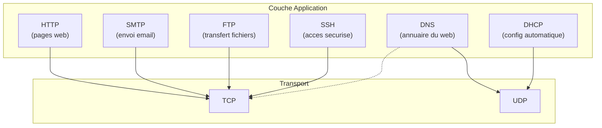
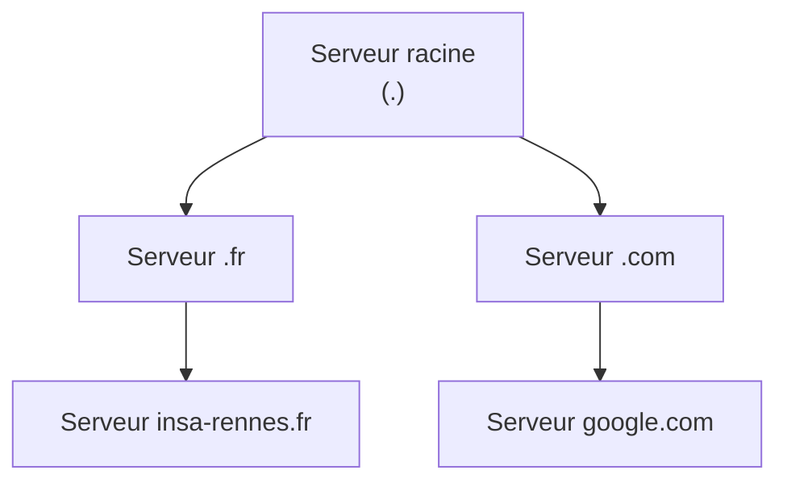
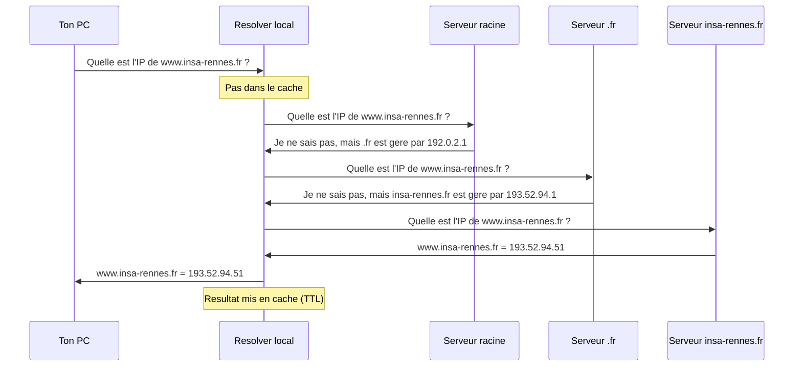
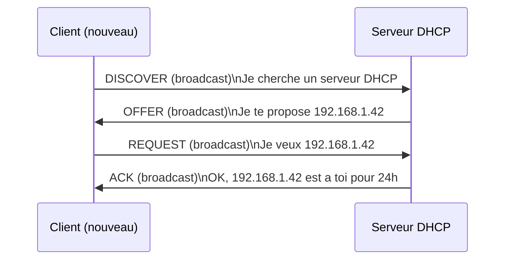
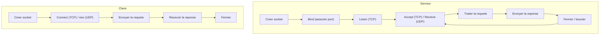

# 06 -- Couche application

## Analogie : les langues et les conventions

Imagine que tu es dans un aeroport international. Tu as deja un moyen de transport (l'avion = couche transport), un itineraire (le routage = couche reseau), et un billet (l'adressage = couche internet). Mais quand tu arrives au comptoir, tu dois encore **parler la meme langue** que l'agent d'embarquement.

La couche application, c'est cette **langue commune**. HTTP est la langue du web. SMTP est la langue de l'email. DNS est la langue de l'annuaire. Chaque protocole applicatif definit les regles de conversation : qui parle en premier, quel format de message utiliser, comment terminer l'echange.

---

## Intuition visuelle



> Chaque protocole applicatif choisit TCP ou UDP selon ses besoins. La plupart des protocoles du web utilisent TCP pour la fiabilite. DNS utilise UDP pour la rapidite (mais TCP pour les gros transferts).

---

## DNS (Domain Name System)

### Le probleme

Les humains retiennent des noms (`www.insa-rennes.fr`). Les machines utilisent des adresses IP (`193.52.94.51`). Il faut un systeme pour traduire les uns en les autres.

### Fonctionnement

DNS est un systeme **hierarchique et distribue** :



**Hierarchie d'un nom de domaine** (lire de droite a gauche) :

```
www . insa-rennes . fr .
 |        |         |   |
 |        |         |   +-- Racine (implicite)
 |        |         +------ TLD (Top-Level Domain)
 |        +---------------- Domaine de second niveau
 +------------------------- Sous-domaine (nom d'hote)
```

### Resolution DNS pas a pas

Quand ton navigateur veut acceder a `www.insa-rennes.fr` :



C'est une resolution **iterative** : le resolver local interroge chaque serveur DNS de proche en proche.

### Types d'enregistrements DNS

| Type | Nom | Description | Exemple |
|------|-----|-------------|---------|
| A | Address | Nom -> adresse IPv4 | `www.insa-rennes.fr -> 193.52.94.51` |
| AAAA | IPv6 Address | Nom -> adresse IPv6 | `www.google.fr -> 2a00:1450:4007::2003` |
| CNAME | Canonical Name | Alias vers un autre nom | `blog.example.com -> example.github.io` |
| MX | Mail Exchanger | Serveur de messagerie | `insa-rennes.fr -> mail.insa-rennes.fr` |
| NS | Name Server | Serveur DNS autoritaire | `insa-rennes.fr -> ns1.insa-rennes.fr` |
| PTR | Pointer | Adresse IP -> nom (resolution inverse) | `193.52.94.51 -> www.insa-rennes.fr` |
| SOA | Start of Authority | Info sur la zone DNS | Serveur primaire, email admin, serial |
| TXT | Text | Texte libre | Verification de domaine, SPF |

### Commandes DNS

```bash
# Resolution simple
nslookup www.insa-rennes.fr
dig www.insa-rennes.fr

# Resolution detaillee
dig +trace www.insa-rennes.fr    # Montre chaque etape de la resolution

# Resolution inverse
nslookup 193.52.94.51
dig -x 193.52.94.51

# Enregistrement MX (email)
dig MX insa-rennes.fr

# Enregistrement NS (serveurs DNS)
dig NS insa-rennes.fr
```

### Protocole DNS

- **Transport** : UDP port 53 (requetes classiques), TCP port 53 (transferts de zone, reponses > 512 octets)
- **Format** : requete/reponse avec identifiant, questions, reponses, autorite, informations supplementaires
- **Cache** : chaque reponse a un TTL (Time To Live) qui definit combien de temps le resultat peut etre cache

---

## HTTP (HyperText Transfer Protocol)

### Le protocole du web

HTTP est le protocole qui permet de charger des pages web. C'est un protocole **texte**, **sans etat**, base sur un modele **requete/reponse**.

### Requete HTTP

```
GET /index.html HTTP/1.1
Host: www.example.com
User-Agent: Mozilla/5.0
Accept: text/html
Connection: keep-alive

```

**Structure :**

| Element | Description | Exemple |
|---------|-------------|---------|
| Methode | Action demandee | GET, POST, PUT, DELETE |
| URI | Ressource demandee | /index.html |
| Version | Version HTTP | HTTP/1.0, HTTP/1.1 |
| Headers | Metadonnees | Host, User-Agent, Accept |
| Corps (body) | Donnees (pour POST/PUT) | Formulaire, JSON |

**Methodes HTTP courantes :**

| Methode | Usage | Corps ? |
|---------|-------|---------|
| GET | Recuperer une ressource | Non |
| POST | Envoyer des donnees (formulaire, API) | Oui |
| PUT | Remplacer une ressource | Oui |
| DELETE | Supprimer une ressource | Non |
| HEAD | Comme GET mais sans corps de reponse | Non |
| OPTIONS | Lister les methodes supportees | Non |

### Reponse HTTP

```
HTTP/1.1 200 OK
Date: Sat, 12 Apr 2026 10:30:00 GMT
Server: Apache/2.4
Content-Type: text/html; charset=UTF-8
Content-Length: 1234
Connection: keep-alive

<!DOCTYPE html>
<html>
  <head><title>Page d'accueil</title></head>
  <body><h1>Bienvenue</h1></body>
</html>
```

**Codes de reponse HTTP :**

| Code | Categorie | Signification |
|------|-----------|---------------|
| 1xx | Information | Requete recue, traitement en cours |
| 2xx | Succes | Requete traitee avec succes |
| 3xx | Redirection | Action supplementaire necessaire |
| 4xx | Erreur client | Requete invalide ou non autorisee |
| 5xx | Erreur serveur | Le serveur a echoue |

**Codes importants :**

| Code | Message | Description |
|------|---------|-------------|
| 200 | OK | Succes |
| 301 | Moved Permanently | Ressource deplacee definitivement |
| 302 | Found | Redirection temporaire |
| 304 | Not Modified | Ressource non modifiee (cache valide) |
| 400 | Bad Request | Requete mal formee |
| 403 | Forbidden | Acces interdit |
| 404 | Not Found | Ressource introuvable |
| 500 | Internal Server Error | Erreur serveur |
| 503 | Service Unavailable | Serveur surcharge ou en maintenance |

### HTTP/1.0 vs HTTP/1.1

| Caracteristique | HTTP/1.0 | HTTP/1.1 |
|----------------|----------|----------|
| Connexion | Fermee apres chaque requete | Keep-alive (persistante) |
| Header Host | Optionnel | **Obligatoire** |
| Pipelining | Non | Oui (mais rarement utilise) |
| Chunked Transfer | Non | Oui |
| Cache | Basique (Expires) | Avance (Cache-Control, ETag) |

**Pourquoi Host est obligatoire en HTTP/1.1 ?** Parce que plusieurs sites web peuvent partager la meme adresse IP (virtual hosting). Le header Host permet au serveur de savoir quel site est demande.

### Test avec curl

```bash
# Requete GET simple
curl http://www.example.com

# Voir les headers de reponse
curl -v http://www.example.com

# Requete POST
curl -X POST -d "name=test" http://www.example.com/form

# Seulement les headers
curl -I http://www.example.com
```

---

## DHCP (Dynamic Host Configuration Protocol)

### Le probleme

Quand tu connectes un nouvel appareil au reseau, il a besoin de :
- Une adresse IP
- Un masque de sous-reseau
- Une passerelle par defaut
- Un serveur DNS

Configurer tout ca manuellement sur chaque appareil serait un cauchemar. DHCP automatise ce processus.

### Le processus DORA

DHCP fonctionne en 4 etapes, appelees **DORA** :



**Details :**

1. **DISCOVER** : le client envoie un broadcast UDP (0.0.0.0:68 -> 255.255.255.255:67) car il n'a pas encore d'adresse IP.
2. **OFFER** : le serveur propose une adresse IP disponible.
3. **REQUEST** : le client accepte l'offre (en broadcast, car d'autres serveurs DHCP ont pu repondre aussi).
4. **ACK** : le serveur confirme l'attribution. Le bail (lease) est cree.

**Le bail DHCP :**
- L'adresse IP est attribuee pour une duree limitee (le bail, typiquement 24h).
- A 50% du bail, le client essaie de renouveler.
- A 87.5% du bail, il essaie avec n'importe quel serveur DHCP.
- A expiration, il doit refaire le processus DORA.

---

## FTP (File Transfer Protocol)

### Particularite : deux connexions

FTP utilise **deux connexions TCP** :

| Connexion | Port serveur | Role |
|-----------|-------------|------|
| Controle | 21 | Commandes et reponses |
| Donnees | 20 (actif) ou ephemere (passif) | Transfert de fichiers |

**Mode actif** : le serveur initie la connexion de donnees vers le client.
**Mode passif** : le client initie la connexion de donnees vers le serveur (plus courant, car compatible avec les firewalls/NAT).

**Commandes FTP courantes :**

| Commande | Description |
|----------|-------------|
| USER | Nom d'utilisateur |
| PASS | Mot de passe |
| LIST | Lister les fichiers |
| RETR | Telecharger un fichier |
| STOR | Envoyer un fichier |
| CWD | Changer de repertoire |
| QUIT | Deconnexion |

---

## Programmation socket : construire ses propres protocoles

### Principe

Les TPs du cours montrent comment creer des applications reseau avec des sockets. La couche application, c'est **votre code** : vous definissez le protocole de communication.

### Patron de conception client-serveur



### Concevoir un protocole applicatif

Quand tu crees ton propre protocole, tu dois definir :

1. **Qui parle en premier ?** Le client (comme HTTP) ou le serveur (comme SMTP qui envoie un message de bienvenue) ?
2. **Format des messages** : texte (facile a debugger) ou binaire (plus compact) ?
3. **Delimiteurs** : comment savoir ou finit un message ? Saut de ligne (`\n`), longueur prefixee, marqueur de fin ?
4. **Etats** : y a-t-il une machine a etats ? (connecte, authentifie, en transfert...)
5. **Gestion des erreurs** : comment signaler une erreur au client ?
6. **Terminaison** : comment fermer proprement la session ?

**Exemple : protocole du TP3 (Plus ou Moins)**

```
Etat: CONNECTE
  Serveur -> Client : "Guess a number between 1 and 100"
  Etat: EN_JEU

Etat: EN_JEU
  Client -> Serveur : un nombre (texte)
  Serveur -> Client : "+" (trop bas) | "-" (trop haut) | "=" (gagne)
  Si "=" -> Etat: TERMINE
  Sinon -> Etat: EN_JEU

Etat: TERMINE
  Connexion fermee
```

### Serveur concurrent vs sequentiel

**Serveur sequentiel** : traite un client a la fois. Les autres attendent.
```java
while (true) {
    Socket client = server.accept();
    handleClient(client);  // bloquant
    client.close();
}
```

**Serveur concurrent** : traite plusieurs clients en parallele (un thread par client).
```java
while (true) {
    Socket client = server.accept();
    new Thread(() -> {
        handleClient(client);
        client.close();
    }).start();
}
```

**Serveur concurrent avec pool de threads** : limite le nombre de threads.
```java
ExecutorService pool = Executors.newFixedThreadPool(10);
while (true) {
    Socket client = server.accept();
    pool.execute(() -> {
        handleClient(client);
        client.close();
    });
}
```

---

## Multicast applicatif

Le TP5 montre l'utilisation du multicast pour une application de chat :

### Rappel multicast

- **Adresse** : 224.0.0.0 a 239.255.255.255
- **Transport** : UDP (pas de connexion)
- **Principe** : les recepteurs s'abonnent a un groupe. L'emetteur envoie une seule copie, le reseau la duplique pour chaque recepteur.

### Socket multicast (C)

```c
// Rejoindre un groupe multicast
struct ip_mreq mreq;
mreq.imr_multiaddr.s_addr = inet_addr("224.0.0.10");
mreq.imr_interface.s_addr = INADDR_ANY;
setsockopt(sock, IPPROTO_IP, IP_ADD_MEMBERSHIP, &mreq, sizeof(mreq));

// Envoyer au groupe
struct sockaddr_in dest;
dest.sin_family = AF_INET;
dest.sin_port = htons(10000);
dest.sin_addr.s_addr = inet_addr("224.0.0.10");
sendto(sock, message, len, 0, (struct sockaddr*)&dest, sizeof(dest));
```

### MAC multicast

L'adresse MAC multicast est derivee de l'adresse IP multicast :
```
IP  : 224.0.0.10   = 1110 0000.0000 0000.0000 0000.0000 1010
MAC : 01:00:5E:00:00:0A
      |           |--- 23 bits de poids faible de l'IP
      +-- prefixe fixe multicast
```

---

## Pieges classiques

### Piege 1 : croire que DNS utilise toujours UDP

DNS utilise **UDP** pour les requetes normales (port 53). Mais il bascule sur **TCP** quand la reponse depasse 512 octets ou pour les transferts de zone (replication entre serveurs DNS).

### Piege 2 : oublier que HTTP est sans etat

HTTP ne retient rien entre deux requetes. Chaque requete est independante. Pour maintenir une "session" (par exemple, rester connecte), on utilise des **cookies** ou des **tokens**.

### Piege 3 : confondre HTTP/1.0 et HTTP/1.1

En **HTTP/1.0**, la connexion TCP est fermee apres chaque requete/reponse. En **HTTP/1.1**, la connexion est **persistante** par defaut (keep-alive) : plusieurs requetes/reponses peuvent passer sur la meme connexion TCP.

### Piege 4 : ne pas savoir que DHCP utilise du broadcast

DHCP utilise des broadcast UDP parce que le client n'a pas encore d'adresse IP quand il envoie son premier message. Il ne peut donc pas utiliser d'adresse unicast.

### Piege 5 : confondre FTP actif et FTP passif

En mode **actif**, c'est le serveur qui se connecte au client pour les donnees (probleme avec les firewalls). En mode **passif**, c'est le client qui se connecte au serveur (plus compatible).

### Piege 6 : oublier le header Host en HTTP/1.1

Le header `Host` est **obligatoire** en HTTP/1.1. Sans lui, le serveur ne sait pas quel site web afficher (virtual hosting). En HTTP/1.0, ce header n'existait pas, et chaque site avait sa propre adresse IP.

---

## Recapitulatif

1. **DNS** traduit les noms de domaine en adresses IP. C'est un systeme hierarchique et distribue. Resolution iterative depuis les serveurs racine. UDP port 53.

2. **HTTP** est le protocole du web. Modele requete/reponse, sans etat. Methodes : GET, POST, PUT, DELETE. Codes de reponse : 2xx succes, 4xx erreur client, 5xx erreur serveur.

3. **HTTP/1.1** apporte les connexions persistantes et le header Host obligatoire.

4. **DHCP** attribue automatiquement les configurations reseau (IP, masque, passerelle, DNS). Processus DORA : Discover, Offer, Request, Ack. UDP broadcast.

5. **FTP** utilise deux connexions TCP : controle (port 21) et donnees (port 20 actif ou ephemere passif).

6. **La programmation socket** permet de creer ses propres protocoles applicatifs. Un bon protocole definit : qui parle en premier, le format des messages, les delimiteurs, les etats et la terminaison.

7. **Le multicast** (224.0.0.0/4) permet une communication un-vers-plusieurs efficace. UDP obligatoire. Les recepteurs s'abonnent avec `IP_ADD_MEMBERSHIP`.

8. **Un serveur concurrent** (threads ou pool de threads) est necessaire pour gerer plusieurs clients simultanement.
