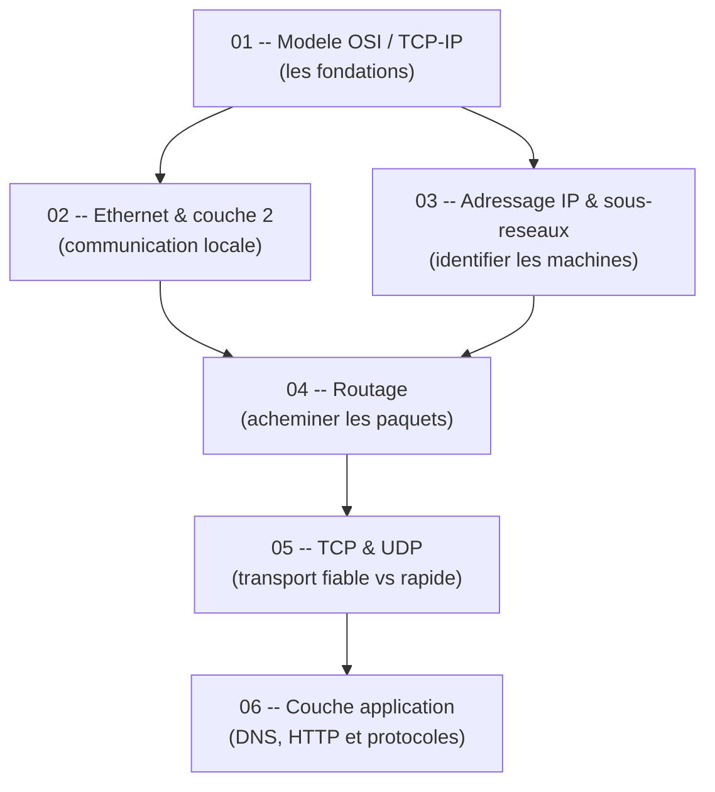

# Guide -- Reseaux (S6)

Bienvenue dans ce guide de reseaux informatiques, concu pour etre accessible meme si tu n'as jamais ouvert un cours de reseaux de ta vie. L'objectif est simple : te permettre de comprendre comment les machines communiquent entre elles, etape par etape, avec des explications claires, des analogies concretes et des schemas que tu peux reproduire sur papier. Chaque chapitre est **autonome** -- tu peux les lire dans l'ordre ou sauter directement a celui qui t'interesse sans etre perdu.

---

## Roadmap d'apprentissage

Voici l'ordre recommande pour progresser efficacement. Chaque etape s'appuie sur les precedentes, mais tu peux toujours revenir en arriere si un concept te manque.

> **Lecture du diagramme** : les fleches indiquent l'ordre logique. Le modele en couches (01) est le socle de tout. Ethernet (02) et l'adressage IP (03) forment deux branches qui convergent vers le routage (04), puis on monte vers le transport (05) et les applications (06).

---

## Prerequisites

Pas besoin d'un diplome en informatique pour suivre ce guide. Voici le strict minimum :

- **Savoir ce qu'est une adresse** -- comme une adresse postale, ca sert a identifier un destinataire.
- **Avoir deja utilise un navigateur web** -- pour comprendre les exemples HTTP et DNS.
- **Idealement avoir acces a un terminal Linux ou Wireshark** -- pour experimenter en parallele (mais ce n'est pas obligatoire pour comprendre).

Si tu sais taper `google.com` dans un navigateur et que tu te demandes comment ca marche derriere, tu as le niveau requis.

---

## Comment utiliser ce guide

1. **Lis dans l'ordre** pour une progression naturelle, ou **saute directement** au chapitre qui t'interesse -- chaque fichier est autonome et complet.
2. **Dessine les schemas toi-meme** en parallele. Les reseaux s'apprennent en visualisant, pas en lisant passivement.
3. **Les diagrammes Mermaid** sont rendus automatiquement sur GitHub et dans Obsidian. Si tu lis les fichiers dans un autre editeur, installe une extension Mermaid pour en profiter.
4. **Ne memorise pas les numeros de protocole** -- comprends d'abord l'intuition, le reste viendra naturellement.
5. **Fais les calculs de sous-reseaux a la main** -- c'est le type d'exercice le plus frequent en DS.

---

## Table des matieres

| # | Chapitre | Description |
|---|----------|-------------|
| 01 | [Modele OSI et TCP/IP](01_modele_osi_tcpip.md) | Comprendre l'architecture en couches des reseaux -- le cadre mental pour tout le reste. |
| 02 | [Ethernet et la couche liaison](02_ethernet.md) | Communication sur un reseau local, adresses MAC, trames, commutation. |
| 03 | [Adressage IP et sous-reseaux](03_adressage_ip.md) | Adresses IPv4, masques, notation CIDR, calculs de sous-reseaux pas a pas. |
| 04 | [Routage](04_routage.md) | Tables de routage, acheminement des paquets, protocoles de routage. |
| 05 | [TCP et UDP](05_tcp_udp.md) | Transport fiable vs transport rapide, ports, connexions, controle de flux. |
| 06 | [Couche application](06_couche_application.md) | DNS, HTTP, programmation socket, protocoles applicatifs. |
| -- | [Cheat sheet](cheat_sheet.md) | Synthese DS : formules, protocoles cles, questions recurrentes, pieges. |

---

## Structure d'un chapitre

Chaque chapitre suit la meme progression pour t'aider a construire ta comprehension pas a pas :

| Etape | Ce que tu y trouves |
|-------|---------------------|
| **Analogie** | Une situation de la vie courante pour ancrer le concept. |
| **Intuition visuelle** | Un schema ou diagramme Mermaid pour visualiser l'idee avant toute technique. |
| **Explication progressive** | Le concept explique en partant du plus simple vers le plus precis. |
| **Schemas protocoles** | Les formats de trames, paquets et segments detailles champ par champ. |
| **Exemples concrets** | Des calculs commentes pas a pas (sous-reseaux, routage, etc.). |
| **Pieges classiques** | Les erreurs frequentes et comment les eviter. |
| **Recapitulatif** | Un resume en quelques points pour reviser rapidement. |

> Cette structure est pensee pour que tu puisses toujours comprendre le *pourquoi* avant le *comment*. Si un schema te bloque, reviens a l'analogie -- elle contient l'essentiel.

---

## Liens avec les TP

Ce guide couvre la theorie. Pour la pratique, les TP du cours sont organises ainsi :

| TP | Lien avec le guide |
|----|-------------------|
| TP1 -- Decouverte reseau | Chapitres 01 a 04 (OSI, Ethernet, IP, routage) |
| TP2 -- UDP/TCP en Java | Chapitre 05 (TCP/UDP) + Chapitre 06 (HTTP) |
| TP3 -- Services TCP | Chapitre 05 (TCP) + Chapitre 06 (protocoles applicatifs) |
| TP4 -- Sockets en C | Chapitre 05 (TCP/UDP) + Chapitre 06 (programmation socket) |
| TP5 -- Chat multicast | Chapitre 03 (adressage multicast) + Chapitre 05 (UDP) |
