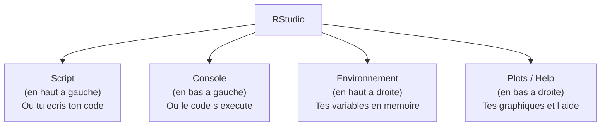

# Introduction a R — Guide complet pour debutants

> **Objectif** : ce guide t'accompagne pas a pas dans la decouverte du langage R.
> Il est ecrit pour quelqu'un qui n'a **jamais programme** et qui decouvre les statistiques.
> Prends ton temps, execute chaque exemple, et n'hesite pas a modifier le code pour experimenter.

---

## Table des matieres

1. [Pourquoi R ?](#1--pourquoi-r-)
2. [Installation](#2--installation)
3. [L'interface RStudio](#3--linterface-rstudio)
4. [Types de donnees de base](#4--types-de-donnees-de-base)
5. [Data frames (tableaux de donnees)](#5--data-frames-tableaux-de-donnees)
6. [Importation de donnees](#6--importation-de-donnees)
7. [Visualisation de base](#7--visualisation-de-base)
8. [Distributions statistiques en R](#8--distributions-statistiques-en-r)
9. [Pieges classiques](#9--pieges-classiques)
10. [Recapitulatif](#10--recapitulatif)

---

## 1 — Pourquoi R ?

### Une analogie pour comprendre

Imagine que tu as devant toi **une calculatrice scientifique ultra-puissante** et **un carnet de notes intelligent** combines en un seul outil. C'est exactement ce qu'est R :

- **La calculatrice** : tu peux faire des calculs simples (additions, moyennes) mais aussi des calculs tres complexes (regressions, tests statistiques, modeles de prediction).
- **Le carnet de notes** : tout ce que tu fais est ecrit dans un script. Tu peux le relire, le modifier, le partager, et surtout le **re-executer** a l'identique. Si ton professeur te demande "comment tu as obtenu ce resultat ?", tu peux montrer chaque etape.

### Ce qu'on peut faire avec R

R est un langage specialise dans l'analyse de donnees. Voici ce qu'il permet de faire :

- **Statistiques descriptives** : calculer des moyennes, medianes, ecarts-types, faire des tableaux de frequences.
- **Graphiques** : creer des histogrammes, des boites a moustaches (boxplots), des nuages de points, et bien plus encore.
- **Tests statistiques** : test de Student, test du Chi-deux, ANOVA, etc.
- **Modeles** : regressions lineaires, regressions logistiques, modeles mixtes.
- **Rapports automatiques** : generer des documents PDF ou HTML directement depuis R (avec R Markdown).

En resume, R est l'outil de reference dans le monde universitaire et dans la recherche pour l'analyse statistique.

### Pourquoi R plutot qu'Excel ?

Tu te demandes peut-etre : "Pourquoi ne pas rester sur Excel ? Je sais deja m'en servir."

Voici les raisons principales :

| Critere | Excel | R |
|---------|-------|---|
| **Reproductibilite** | Difficile de savoir quelles operations ont ete faites | Chaque etape est ecrite dans un script |
| **Automatisation** | Il faut refaire les operations a la main | Un script se relance en un clic |
| **Puissance** | Limite a quelques centaines de milliers de lignes | Peut traiter des millions de lignes |
| **Graphiques** | Limites et parfois moches | Tres beaux graphiques personnalisables |
| **Tests statistiques** | Tres limites | Tous les tests existent |
| **Gratuit** | Non (licence Microsoft) | Oui, 100% gratuit et open source |
| **Communaute** | Peu d'aide en ligne | Enorme communaute, des milliers de packages |

> **En un mot** : Excel est parfait pour un petit tableau simple. R est indispensable des qu'on veut faire de la vraie analyse statistique, reproductible et automatisee.


---

## 2 — Installation

L'installation se fait en **deux etapes** dans cet ordre precis. C'est important de respecter l'ordre car RStudio a besoin que R soit deja installe sur ta machine.

### Etape 1 : Installer R (le moteur)

R est le **moteur de calcul**. C'est lui qui comprend et execute le code.

1. Va sur : [https://cran.r-project.org/](https://cran.r-project.org/)
2. Clique sur le lien correspondant a ton systeme d'exploitation :
   - **Windows** : "Download R for Windows" → "base" → "Download R-x.x.x for Windows"
   - **macOS** : "Download R for macOS" → choisis le fichier `.pkg` correspondant a ton processeur (Intel ou Apple Silicon)
   - **Linux** : suis les instructions pour ta distribution (Ubuntu, Fedora, etc.)
3. Installe le logiciel en laissant les options par defaut (clique "Suivant" a chaque etape).

> **Astuce** : tu n'ouvriras presque jamais R directement. On utilise RStudio a la place, qui est beaucoup plus agreable.

### Etape 2 : Installer RStudio (le tableau de bord)

RStudio est l'**interface graphique** qui rend R agreable a utiliser. Pense a R comme le moteur d'une voiture et RStudio comme le tableau de bord, le volant et les pedales.

1. Va sur : [https://posit.co/downloads/](https://posit.co/downloads/)
2. Telecharge la version gratuite "RStudio Desktop" (Free).
3. Installe le logiciel.
4. Lance RStudio. S'il detecte R automatiquement, tout est bon. Sinon, il te demandera ou se trouve R.

> **Verification** : ouvre RStudio, tape `1 + 1` dans la console (en bas a gauche), puis appuie sur Entree. Si tu vois `[1] 2`, tout fonctionne.

---

## 3 — L'interface RStudio

Quand tu ouvres RStudio, tu vois 4 panneaux. Chacun a un role precis :



### Detail de chaque panneau

#### En haut a gauche : l'editeur de script

C'est ici que tu **ecris ton code**. Le code n'est pas execute immediatement : c'est comme un brouillon que tu prepares avant de le lancer.

- Tu peux ecrire plusieurs lignes de code.
- Tu peux sauvegarder ton script (Ctrl+S) pour le reutiliser plus tard.
- Les fichiers de script R ont l'extension `.R` (par exemple `mon_analyse.R`).

> **Conseil** : ecris toujours ton code dans un script, pas directement dans la console. Comme ca, tu gardes une trace de tout ce que tu fais.

#### En bas a gauche : la console

C'est ici que le code **s'execute reellement** et que les resultats s'affichent. Tu peux aussi taper du code directement dans la console pour des tests rapides (comme taper `2 + 2`), mais ce code ne sera pas sauvegarde.

- Le symbole `>` signifie que R attend une commande.
- Le symbole `+` signifie que R attend la suite de ta commande (tu as oublie de fermer une parenthese, par exemple). Appuie sur `Echap` pour annuler.

#### En haut a droite : l'environnement

Ce panneau montre **toutes les variables** que tu as creees. Par exemple, si tu ecris `x <- 42`, tu verras apparaitre `x` avec la valeur `42` dans ce panneau.

C'est tres pratique pour verifier que tes donnees sont bien chargees et pour voir leur structure.

#### En bas a droite : plots, aide, fichiers

Ce panneau a plusieurs onglets :

- **Plots** : tes graphiques s'affichent ici.
- **Help** : quand tu demandes de l'aide sur une fonction (par exemple `?mean`), la documentation apparait ici.
- **Files** : un explorateur de fichiers.
- **Packages** : la liste des packages installes.

### Comment executer du code

Il y a plusieurs facons d'executer du code depuis l'editeur de script :

| Action | Raccourci | Ce que ca fait |
|--------|-----------|----------------|
| Executer la ligne courante | **Ctrl + Entree** | Execute la ligne ou se trouve le curseur, puis passe a la ligne suivante |
| Executer tout le script | **Ctrl + Shift + Entree** | Execute toutes les lignes du script, du debut a la fin |
| Executer la selection | Selectionner + **Ctrl + Entree** | Execute uniquement les lignes selectionnees |

> **Conseil pour les debutants** : utilise surtout `Ctrl + Entree` pour executer ton code ligne par ligne. Ca te permet de voir le resultat de chaque etape et de comprendre ce qui se passe.

---

## 4 — Types de donnees de base

En R, chaque valeur a un **type**. Comprendre les types, c'est comprendre comment R "pense". Voici les principaux types avec des explications detaillees.

### Les nombres (numeric)

```r
# ── Les nombres ──────────────────────────────────────────

# Un nombre entier
x <- 42
# Ici, on cree une variable "x" et on lui donne la valeur 42.
# Le symbole <- s'appelle "l'operateur d'assignation".
# Il signifie : "mets la valeur 42 dans la boite etiquetee x".

# Un nombre decimal (appele "numeric" en R)
pi_approx <- 3.14159
# Attention : en R, le separateur decimal est le POINT, pas la virgule.
# Ecris 3.14, pas 3,14.

# Verifier le type d'une variable
class(x)          # → "numeric"
is.numeric(x)     # → TRUE

# Operations de base (comme une calculatrice)
10 + 3    # Addition      → 13
10 - 3    # Soustraction   → 7
10 * 3    # Multiplication → 30
10 / 3    # Division       → 3.333...
10 ^ 2    # Puissance      → 100  (10 au carre)
10 %% 3   # Modulo         → 1    (reste de la division entiere)
10 %/% 3  # Division entiere → 3

# Fonctions mathematiques courantes
sqrt(16)    # Racine carree → 4
abs(-5)     # Valeur absolue → 5
log(10)     # Logarithme naturel (ln)
log10(100)  # Logarithme base 10 → 2
exp(1)      # Exponentielle → 2.718... (le nombre e)
round(3.14159, 2)  # Arrondir a 2 decimales → 3.14
ceiling(3.2)       # Arrondir au-dessus → 4
floor(3.8)         # Arrondir au-dessous → 3
```

> **Analogie** : une variable, c'est comme une boite avec une etiquette. `x <- 42` signifie "je prends une boite, je colle l'etiquette `x` dessus, et je mets le nombre 42 a l'interieur". Plus tard, quand je dis `x`, R va ouvrir la boite et me donner ce qu'il y a dedans.

### Le texte (character)

```r
# ── Le texte (character) ─────────────────────────────────

# Une chaine de caracteres = du texte entre guillemets
prenom <- "Alice"
message <- "Bonjour le monde"
# Les guillemets sont obligatoires ! Sans eux, R pense que c'est une variable.

# On peut utiliser des guillemets simples ou doubles
ville <- 'Rennes'     # Guillemets simples → OK
pays  <- "France"     # Guillemets doubles → OK aussi

# Verifier le type
class(prenom)     # → "character"

# Operations sur le texte
nchar(prenom)     # Nombre de caracteres → 5
toupper(prenom)   # En majuscules → "ALICE"
tolower("HELLO")  # En minuscules → "hello"

# Coller des textes ensemble avec paste()
paste("Bonjour", prenom)              # → "Bonjour Alice"
paste("Note :", 15)                   # → "Note : 15"
paste0("Bonjour", prenom)             # → "BonjourAlice" (sans espace)
paste("a", "b", "c", sep = "-")       # → "a-b-c"

# Extraire une partie du texte
substr("Bonjour", 1, 3)  # → "Bon" (caracteres 1 a 3)
```

> **Piege courant** : si tu ecris `prenom <- Alice` sans guillemets, R va chercher une variable appellee `Alice` (qui n'existe probablement pas) et te donnera une erreur. Le texte doit toujours etre entre guillemets.

### Les booleens (logical)

```r
# ── Les booleens (TRUE / FALSE) ──────────────────────────

# Un booleen ne peut avoir que deux valeurs : TRUE ou FALSE
est_etudiant <- TRUE
a_reussi     <- FALSE

# ATTENTION : TRUE et FALSE s'ecrivent en MAJUSCULES en R
# true, True, false, False → erreur !

# On peut abreger : T pour TRUE, F pour FALSE
# Mais c'est deconseille car T et F peuvent etre ecrasees par des variables

# Les booleens viennent souvent de comparaisons
5 > 3     # → TRUE   (5 est-il plus grand que 3 ? Oui)
5 < 3     # → FALSE  (5 est-il plus petit que 3 ? Non)
5 == 5    # → TRUE   (5 est-il egal a 5 ? Oui)
5 != 3    # → TRUE   (5 est-il different de 3 ? Oui)
5 >= 5    # → TRUE   (5 est-il superieur ou egal a 5 ? Oui)
5 <= 3    # → FALSE  (5 est-il inferieur ou egal a 3 ? Non)

# Attention : == (comparaison) vs = (assignation)
# 5 == 3 verifie si 5 est egal a 3
# x = 3 assigne la valeur 3 a x

# Combinaisons logiques
TRUE & TRUE    # ET logique → TRUE  (les deux doivent etre vrais)
TRUE & FALSE   # → FALSE
TRUE | FALSE   # OU logique → TRUE  (au moins un doit etre vrai)
FALSE | FALSE  # → FALSE
!TRUE          # NON logique → FALSE (inverse le booleen)
!FALSE         # → TRUE
```

### Les vecteurs : la structure fondamentale de R

```r
# ── Les vecteurs : la structure de base de R ─────────────

# Un vecteur = une liste ordonnee de valeurs du MEME type.
# C'est la structure la plus importante en R.
# Pense a un vecteur comme un casier avec des compartiments numerotes.

# Creer un vecteur avec c() (c = "combine" ou "concatenate")
notes <- c(12, 15, 9, 17, 11)
prenoms <- c("Alice", "Bob", "Carla")
reussites <- c(TRUE, TRUE, FALSE, TRUE, FALSE)

# Autres facons de creer des vecteurs
1:10           # Sequence de 1 a 10 → 1 2 3 4 5 6 7 8 9 10
seq(0, 1, by=0.1)    # De 0 a 1 par pas de 0.1
seq(0, 100, length.out=5)  # 5 valeurs regulierement espacees entre 0 et 100
rep(0, times=5)       # Repeter 0 cinq fois → 0 0 0 0 0
rep(c(1, 2), times=3) # → 1 2 1 2 1 2
rep(c(1, 2), each=3)  # → 1 1 1 2 2 2

# ── Acceder aux elements d'un vecteur ──
notes[1]       # Premier element → 12
notes[3]       # Troisieme element → 9
notes[c(1, 3)] # Elements 1 et 3 → 12 9
notes[1:3]     # Elements 1 a 3 → 12 15 9
notes[-1]      # Tout SAUF le premier → 15 9 17 11
notes[-c(1,2)] # Tout SAUF les 2 premiers → 9 17 11

# ── Operations sur un vecteur entier (vectorisation) ──
# C'est une des grandes forces de R : les operations s'appliquent
# a TOUS les elements du vecteur automatiquement.
notes + 1         # Ajoute 1 a chaque note → 13 16 10 18 12
notes * 2         # Multiplie chaque note par 2 → 24 30 18 34 22
notes / 20 * 100  # Convertir en pourcentage
notes > 10        # Test pour chaque element → TRUE TRUE FALSE TRUE TRUE

# Selectionner avec une condition
notes[notes > 10]      # Notes strictement superieures a 10 → 12 15 17 11
notes[notes >= 12]     # Notes superieures ou egales a 12 → 12 15 17

# ── Statistiques de base sur un vecteur ──
mean(notes)    # Moyenne → 12.8
median(notes)  # Mediane → 12
sd(notes)      # Ecart-type → 3.27 (mesure de dispersion)
var(notes)     # Variance → 10.7 (ecart-type au carre)
min(notes)     # Minimum → 9
max(notes)     # Maximum → 17
range(notes)   # Min et max → 9 17
sum(notes)     # Somme → 64
length(notes)  # Nombre d'elements → 5
sort(notes)    # Trier par ordre croissant → 9 11 12 15 17
sort(notes, decreasing=TRUE)  # Trier par ordre decroissant → 17 15 12 11 9
table(notes)   # Tableau de frequences (combien de fois chaque valeur apparait)
```

> **Analogie** : un vecteur, c'est comme un train. Chaque wagon (= compartiment) contient une valeur. Tous les wagons contiennent le meme type de marchandise (que des nombres, OU que du texte, OU que des booleens). Si tu melanges, R convertit tout dans le type le plus general (par exemple, `c(1, "hello")` donne `"1" "hello"` — tout devient du texte).

---

## 5 — Data frames (tableaux de donnees)

### C'est quoi un data frame ?

Un **data frame**, c'est l'equivalent d'un **tableau Excel** dans R. C'est la structure que tu utiliseras le plus souvent pour analyser des donnees.

- Chaque **colonne** represente une variable (par exemple : prenom, note, groupe).
- Chaque **ligne** represente une observation (par exemple : un eleve).
- Contrairement a un vecteur, un data frame peut contenir des colonnes de types differents (texte, nombres, booleens).

### Creer un data frame

```r
# Creer un data frame avec data.frame()
# Chaque argument est une colonne : nom_colonne = vecteur_de_valeurs
eleves <- data.frame(
  prenom  = c("Alice", "Bob", "Carla", "David"),
  note    = c(12, 15, 9, 17),
  groupe  = c("A", "B", "A", "B"),
  reussi  = c(TRUE, TRUE, FALSE, TRUE)
)

# Afficher le data frame
print(eleves)
#   prenom note groupe reussi
# 1  Alice   12      A   TRUE
# 2    Bob   15      B   TRUE
# 3  Carla    9      A  FALSE
# 4  David   17      B   TRUE

# Tu peux aussi juste taper le nom de la variable pour l'afficher :
eleves
# Ca fait exactement la meme chose que print(eleves)
```

> **Important** : chaque colonne doit avoir le meme nombre de valeurs. Si tu mets 4 prenoms et 3 notes, R te donnera une erreur.

### Explorer un data frame

Avant d'analyser des donnees, il faut toujours les **explorer** pour verifier qu'elles sont correctes.

```r
# ── Fonctions d'exploration ──

head(eleves)       # Affiche les 6 premieres lignes
                   # (ici on n'en a que 4, donc ca affiche tout)
head(eleves, n=2)  # Affiche les 2 premieres lignes seulement

tail(eleves)       # Affiche les 6 dernieres lignes
tail(eleves, n=2)  # Affiche les 2 dernieres lignes

nrow(eleves)       # Nombre de lignes → 4
ncol(eleves)       # Nombre de colonnes → 4
dim(eleves)        # Dimensions (lignes, colonnes) → 4 4

names(eleves)      # Noms des colonnes → "prenom" "note" "groupe" "reussi"
colnames(eleves)   # Identique a names() pour un data frame

str(eleves)        # Structure : type de chaque colonne, apercu des valeurs
# 'data.frame':	4 obs. of  4 variables:
#  $ prenom: chr  "Alice" "Bob" "Carla" "David"
#  $ note  : num  12 15 9 17
#  $ groupe: chr  "A" "B" "A" "B"
#  $ reussi: logi  TRUE TRUE FALSE TRUE

summary(eleves)    # Resume statistique de chaque colonne
# Pour les colonnes numeriques : min, Q1, mediane, moyenne, Q3, max
# Pour les colonnes texte : nombre de valeurs
```

> **Conseil** : prends l'habitude de toujours executer `str()` et `summary()` quand tu charges de nouvelles donnees. Ca te permet de detecter rapidement les problemes (mauvais types, valeurs manquantes, etc.).

### Acceder aux donnees

```r
# ── Acceder a une colonne ──
eleves$note            # Avec le $ → retourne un vecteur : 12 15 9 17
eleves[, "note"]       # Avec les crochets et le nom → identique
eleves[, 2]            # Avec le numero de colonne (2 = note) → identique
eleves[["note"]]       # Avec les doubles crochets → identique

# ── Acceder a une ligne ──
eleves[1, ]            # Ligne 1 (toutes les colonnes) → Alice 12 A TRUE
eleves[3, ]            # Ligne 3 → Carla 9 A FALSE

# ── Acceder a une cellule precise ──
eleves[2, 3]           # Ligne 2, colonne 3 → "B"
eleves[2, "groupe"]    # Ligne 2, colonne "groupe" → "B" (plus lisible)
eleves$note[2]         # 2eme element de la colonne "note" → 15

# ── Acceder a plusieurs lignes/colonnes ──
eleves[1:2, ]          # Lignes 1 et 2
eleves[, c("prenom", "note")]  # Colonnes prenom et note seulement
```

### Filtrer les donnees

Filtrer, c'est **selectionner certaines lignes** selon une condition. C'est une operation que tu feras tres souvent.

```r
# ── Methode 1 : subset() — la plus lisible pour les debutants ──
subset(eleves, note >= 12)          # Eleves avec note >= 12
subset(eleves, groupe == "A")       # Eleves du groupe A
subset(eleves, note >= 12 & groupe == "A")  # Les deux conditions
subset(eleves, note >= 15 | groupe == "A")  # L'une ou l'autre condition

# ── Methode 2 : avec les crochets — plus classique ──
eleves[eleves$note >= 12, ]         # Meme resultat que le premier subset
eleves[eleves$reussi == TRUE, ]     # Eleves qui ont reussi
eleves[eleves$groupe == "B", ]      # Eleves du groupe B

# ── Ajouter une colonne ──
eleves$mention <- ifelse(eleves$note >= 16, "TB",
                  ifelse(eleves$note >= 14, "B",
                  ifelse(eleves$note >= 12, "AB", "Passable")))
# ifelse(condition, valeur_si_vrai, valeur_si_faux)

# ── Trier un data frame ──
eleves[order(eleves$note), ]                    # Trier par note croissante
eleves[order(eleves$note, decreasing=TRUE), ]   # Trier par note decroissante
```

---

## 6 — Importation de donnees

Dans la vraie vie, on ne tape pas les donnees a la main. On les **importe** depuis un fichier (CSV, TXT, Excel, etc.). C'est une etape cruciale car la plupart des erreurs viennent d'une mauvaise importation.

### Comprendre les fichiers CSV

Un fichier **CSV** (Comma-Separated Values) est un simple fichier texte ou chaque valeur est separee par un caractere special.

Il existe deux grandes conventions :

| Convention | Separateur de colonnes | Separateur decimal | Exemple de ligne | Fonction R |
|------------|------------------------|--------------------|------------------|------------|
| **Internationale** (anglophone) | Virgule `,` | Point `.` | `Alice,12.5,A` | `read.csv()` |
| **Francaise** | Point-virgule `;` | Virgule `,` | `Alice;12,5;A` | `read.csv2()` |

> **Astuce pour savoir lequel utiliser** : ouvre ton fichier CSV avec le Bloc-notes (ou un editeur de texte). Regarde ce qui separe les valeurs. Si c'est une virgule → `read.csv()`. Si c'est un point-virgule → `read.csv2()`.

### Les fonctions d'importation

```r
# ── read.csv() : fichier avec virgules comme separateurs ──
# Fichier ressemble a : prenom,note,groupe
#                        Alice,12,A
#                        Bob,15,B
data_virgule <- read.csv("notes.csv")

# ── read.csv2() : fichier avec point-virgule (format francais) ──
# Fichier ressemble a : prenom;note;groupe
#                        Alice;12;A
#                        Bob;15;B
data_pv <- read.csv2("notes.csv")

# ── read.table() : controle total ──
# Quand les deux fonctions ci-dessus ne fonctionnent pas,
# utilise read.table() qui te laisse tout parametrer :
data_custom <- read.table("notes.txt",
                          header = TRUE,    # 1ere ligne = noms des colonnes
                          sep = "\t",       # separateur = tabulation
                          dec = ",",        # decimal = virgule (format FR)
                          stringsAsFactors = FALSE)  # garder le texte en texte

# ── Importer un fichier Excel ──
# Il faut d'abord installer un package :
# install.packages("readxl")  # A faire une seule fois
library(readxl)               # Charger le package
data_excel <- read_excel("notes.xlsx")
data_excel <- read_excel("notes.xlsx", sheet = "Feuil1")  # Specifier la feuille
```

### Apres l'importation : toujours verifier !

C'est une etape **obligatoire**. Combien de fois un etudiant a perdu du temps parce que les donnees etaient mal importees...

```r
# ── Apres l'importation, toujours verifier ──
head(data_virgule)      # Voir les premieres lignes → les donnees ont-elles l'air normal ?
str(data_virgule)       # Verifier les types de chaque colonne
                        # → les notes sont-elles bien "num" et pas "chr" ?
summary(data_virgule)   # Statistiques rapides → les valeurs sont-elles coherentes ?
dim(data_virgule)       # Combien de lignes et colonnes ?

# Si les colonnes numeriques apparaissent comme du texte ("chr"),
# c'est souvent un probleme de separateur decimal.
# Essaie read.csv2() au lieu de read.csv() (ou inversement).
```

### Definir le repertoire de travail

R cherche les fichiers dans un dossier precis appele **repertoire de travail** (working directory).

```r
# Voir le repertoire de travail actuel
getwd()

# Changer le repertoire de travail
setwd("C:/Users/toi/Documents/stats")
# Attention : utilise des / (slashs) et pas des \ (antislashs)

# Lister les fichiers dans le repertoire de travail
list.files()  # Verifie que ton fichier CSV est bien la
```

> **Conseil** : plutot que de changer le repertoire de travail, cree un **projet RStudio** (File → New Project). Ca gere automatiquement le repertoire de travail et facilite l'organisation.

---

## 7 — Visualisation de base

Les graphiques sont essentiels en statistiques. Ils permettent de **voir** les donnees, de reperer des tendances, des anomalies, et de communiquer les resultats. R dispose d'un systeme de graphiques de base tres puissant.

### Histogramme : distribution d'une variable

Un histogramme montre **comment les valeurs se repartissent**. L'axe horizontal represente les valeurs, l'axe vertical le nombre d'observations dans chaque intervalle.

```r
notes <- c(12, 15, 9, 17, 11, 14, 8, 16, 13, 10)

# ── Histogramme : distribution d'une variable ──
# Usage : voir comment se repartissent les valeurs
# Question a laquelle il repond : "Les notes sont-elles regroupees ou dispersees ?"
hist(notes,
     main  = "Distribution des notes",   # Titre du graphique
     xlab  = "Note",                     # Titre de l'axe horizontal
     ylab  = "Frequence",               # Titre de l'axe vertical
     col   = "steelblue",               # Couleur des barres
     border = "white",                   # Bordure des barres
     breaks = 5)                         # Nombre approximatif de barres

# Le parametre "breaks" controle le nombre d'intervalles :
# breaks = 3  → peu de barres, vue globale
# breaks = 10 → beaucoup de barres, vue detaillee
# R ajuste automatiquement pour que ce soit joli
```

> **Comment lire un histogramme** : si la plupart des barres sont a gauche, les valeurs sont faibles. Si elles forment une cloche au milieu, la distribution est "normale" (ce qu'on verra en cours). Si les barres sont etalees, les valeurs sont tres dispersees.

### Boxplot (boite a moustaches) : resume en 5 nombres

Le boxplot est un des graphiques les plus utilises en statistiques. Il resume la distribution en **5 nombres** : minimum, premier quartile (Q1), mediane, troisieme quartile (Q3), maximum.

```r
# ── Boxplot (boite a moustaches) : resume en 5 nombres ──
# Usage : detecter les valeurs extremes (outliers)
boxplot(notes,
        main = "Boite a moustaches des notes",
        ylab = "Note",
        col  = "lightgreen",
        border = "darkgreen")

# ── Comment lire un boxplot ──
# - La LIGNE au milieu de la boite = mediane (50% des valeurs au-dessus, 50% au-dessous)
# - Le BAS de la boite = Q1 (25% des valeurs sont en dessous)
# - Le HAUT de la boite = Q3 (75% des valeurs sont en dessous)
# - Les MOUSTACHES s'etendent jusqu'au min et max (sauf outliers)
# - Les POINTS au-dela des moustaches = outliers (valeurs extremes)

# Boxplot par groupe (tres utile pour comparer)
eleves <- data.frame(
  note   = c(12, 15, 9, 17, 11, 14, 8, 16, 13, 10),
  groupe = c("A","A","A","A","A","B","B","B","B","B")
)
boxplot(note ~ groupe, data = eleves,
        main = "Notes par groupe",
        xlab = "Groupe",
        ylab = "Note",
        col  = c("lightblue", "salmon"))
# La formule note ~ groupe signifie "note en fonction de groupe"
```

### Nuage de points : relation entre deux variables

Le nuage de points montre s'il existe une **relation** (correlation) entre deux variables.

```r
heures_travail <- c(2, 4, 1, 5, 3, 4, 1, 5, 3, 2)

# ── Nuage de points : relation entre deux variables ──
# Usage : visualiser une correlation
# Question : "Plus on travaille, meilleure est la note ?"
plot(heures_travail, notes,
     main = "Notes en fonction des heures de travail",
     xlab = "Heures de travail",
     ylab = "Note",
     pch  = 19,          # Type de point (19 = cercle plein)
     col  = "tomato",    # Couleur des points
     cex  = 1.2)         # Taille des points (1 = normal, 1.2 = un peu plus gros)

# Ajouter la droite de regression (droite de tendance)
# lm() calcule la regression lineaire (on verra ca en detail plus tard)
abline(lm(notes ~ heures_travail), col = "blue", lwd = 2)
# lwd = epaisseur de la ligne (2 = double de la normale)

# Si les points montent de gauche a droite → correlation positive
# Si les points descendent → correlation negative
# Si les points sont eparpilles → pas de correlation claire
```

### Barplot : comparer des categories

Le barplot (diagramme en barres) est utilise pour **comparer des effectifs** entre des categories.

```r
# ── Barplot : comparer des categories ──
# D'abord, compter les effectifs avec table()
resultats <- table(c("A", "B", "A", "A", "B", "C", "B", "A"))
# resultats contient : A=4, B=3, C=1

barplot(resultats,
        main = "Nombre d'eleves par groupe",
        xlab = "Groupe",
        ylab = "Effectif",
        col  = c("lightblue", "lightgreen", "salmon"))

# ── Camembert (pie chart) ──
# Utilise pour montrer les proportions
pie(resultats,
    main = "Repartition par groupe",
    col  = c("lightblue", "lightgreen", "salmon"))
# Note : les statisticiens preferent generalement les barplots aux camemberts
# car les barres sont plus faciles a comparer visuellement que les angles
```

### Personnaliser les graphiques

```r
# ── Quelques parametres utiles pour tous les graphiques ──

# Couleurs courantes en R :
# "red", "blue", "green", "black", "gray", "orange", "purple"
# "steelblue", "tomato", "salmon", "lightgreen", "lightblue"
# Tu peux aussi utiliser des codes hexadecimaux : "#FF6347"

# Types de points (parametre pch) :
# pch = 0 carre vide    pch = 1 cercle vide (defaut)
# pch = 15 carre plein  pch = 16 cercle plein
# pch = 17 triangle     pch = 19 gros cercle plein

# Types de lignes (parametre lty) :
# lty = 1 continue      lty = 2 tirets
# lty = 3 pointilles    lty = 4 tirets-points

# Sauvegarder un graphique
png("mon_graphique.png", width=800, height=600)  # Ouvre un "fichier image"
hist(notes, main="Mon histogramme", col="steelblue")
dev.off()  # Ferme le fichier (OBLIGATOIRE, sinon le fichier est corrompu)
```

---

## 8 — Distributions statistiques en R

Les distributions de probabilite sont au coeur des statistiques. R integre nativement toutes les distributions importantes. Chaque distribution dispose de **4 fonctions**, identifiees par leur prefixe.

### Les 4 prefixes : d, p, q, r

Voici la logique des prefixes. Une fois comprise, tu pourras l'appliquer a n'importe quelle distribution :

| Prefixe | Signification | Question a laquelle il repond | Exemple avec la loi normale |
|---------|---------------|-------------------------------|----------------------------|
| `d` | **densite** (density) | "Quelle est la hauteur de la courbe en ce point ?" | `dnorm(0)` → 0.3989 |
| `p` | **probabilite cumulee** | "Quelle est la probabilite que X soit inferieur ou egal a cette valeur ?" | `pnorm(1.96)` → 0.975 |
| `q` | **quantile** (inverse de p) | "Quelle valeur correspond a cette probabilite cumulee ?" | `qnorm(0.975)` → 1.96 |
| `r` | **random** (aleatoire) | "Donne-moi des valeurs aleatoires suivant cette loi." | `rnorm(5)` → 5 valeurs |

> **Analogie** : imagine la courbe en cloche de la loi normale.
> - `d` te dit la **hauteur** de la courbe a un endroit precis.
> - `p` te dit la **surface** (aire) sous la courbe a gauche d'un point (= la probabilite).
> - `q` fait l'inverse de `p` : tu donnes une surface, il te donne le point.
> - `r` lance des "des" qui suivent cette distribution.

### Loi Normale

La loi normale (ou gaussienne) est la distribution la plus importante en statistiques. Elle a la forme d'une cloche symetrique.

```r
# ── Loi Normale N(mu=0, sigma=1) ──────────────────────────────

# Densite : hauteur de la cloche au point x
dnorm(0)            # → 0.3989 (la cloche est la plus haute au centre)
dnorm(1)            # → 0.2420 (plus basse quand on s'eloigne du centre)
dnorm(-1)           # → 0.2420 (symetrique !)

# Probabilite cumulee : P(X <= x)
pnorm(0)            # → 0.5    (50% des valeurs sont en dessous de la moyenne)
pnorm(1.96)         # → 0.975  (97.5% des valeurs sont sous 1.96)
pnorm(-1.96)        # → 0.025  (2.5% des valeurs sont sous -1.96)

# Quantile : "quelle valeur a cette probabilite cumulee ?"
qnorm(0.5)          # → 0      (la mediane de N(0,1) est 0)
qnorm(0.975)        # → 1.96   (fameux seuil a 5% bilateral)
qnorm(0.025)        # → -1.96

# Valeurs aleatoires
set.seed(42)        # Fixer la graine pour reproduire les memes resultats
rnorm(5)            # 5 valeurs aleatoires de N(0,1)
rnorm(5, mean=100, sd=15)  # 5 valeurs de N(100, 15), comme un QI

# ── Pour une normale N(mu=170, sigma=10) ──
# Exemple : taille des francais, moyenne 170 cm, ecart-type 10 cm
pnorm(180, mean=170, sd=10)  # P(taille <= 180) → environ 0.84
# Environ 84% des gens mesurent 180 cm ou moins

1 - pnorm(190, mean=170, sd=10)  # P(taille > 190) → environ 0.023
# Seulement 2.3% des gens mesurent plus de 190 cm
```

### Loi de Student

La loi de Student ressemble a la loi normale mais avec des "queues" plus epaisses. Elle est utilisee quand l'echantillon est petit.

```r
# ── Loi de Student t(ddl) ────────────────────────────────

# ddl = degres de liberte. Plus ddl est grand, plus la Student
# ressemble a la normale.

pt(2, df=10)             # P(T <= 2) avec 10 degres de liberte
qt(0.975, df=10)         # Quantile bilateral a 5% → 2.228
# Compare avec qnorm(0.975) = 1.96
# → la Student demande une valeur plus grande car elle est "moins sure"

qt(0.975, df=5)          # → 2.571 (encore plus grand avec moins de ddl)
qt(0.975, df=30)         # → 2.042 (se rapproche de 1.96)
qt(0.975, df=100)        # → 1.984 (tres proche de la normale)
qt(0.975, df=10000)      # → 1.960 (quasi identique a la normale)
```

### Loi du Chi-deux

La loi du Chi-deux est utilisee pour les tests d'independance et les tests d'ajustement.

```r
# ── Loi Chi-deux (ddl) ──────────────────────────────────

pchisq(11.07, df=5)      # → environ 0.95
qchisq(0.95, df=5)       # → 11.07 (valeur critique a 5%)
qchisq(0.95, df=1)       # → 3.84  (tres utilise en pratique)
qchisq(0.95, df=10)      # → 18.31
```

### Loi de Fisher

La loi de Fisher est utilisee pour l'ANOVA (comparaison de moyennes de plusieurs groupes).

```r
# ── Loi de Fisher F(ddl1, ddl2) ─────────────────────────

qf(0.95, df1=3, df2=20)  # Valeur critique F a 5%
pf(3.1, df1=3, df2=20)   # Probabilite cumulee
```

### Visualiser les distributions

Les graphiques aident enormement a comprendre les distributions.

```r
# ── Visualiser la loi normale standard ──
curve(dnorm(x), from=-4, to=4,
      main="Loi normale standard N(0,1)",
      ylab="Densite", xlab="x",
      col="blue", lwd=2)
# Ajouter des lignes verticales pour les seuils importants
abline(v=c(-1.96, 1.96), col="red", lty=2)  # Seuils a 5%
abline(v=0, col="gray", lty=3)               # La moyenne

# ── Comparer normale et Student avec differents ddl ──
curve(dnorm(x), from=-4, to=4, col="black", lwd=2,
      main="Normale vs Student", ylab="Densite")
curve(dt(x, df=5),  add=TRUE, col="red",   lwd=2)
curve(dt(x, df=30), add=TRUE, col="green", lwd=2)
legend("topright",
       legend=c("Normale", "Student df=5", "Student df=30"),
       col=c("black","red","green"), lwd=2)
# On voit bien que Student df=5 a des queues plus epaisses (plus de valeurs extremes)
# et que Student df=30 est quasiment confondue avec la normale

# ── Visualiser la loi du Chi-deux ──
curve(dchisq(x, df=5), from=0, to=20,
      main="Loi du Chi-deux", ylab="Densite",
      col="purple", lwd=2)
curve(dchisq(x, df=1), from=0, to=20, add=TRUE, col="red", lwd=2)
curve(dchisq(x, df=10), from=0, to=20, add=TRUE, col="blue", lwd=2)
legend("topright",
       legend=c("Chi2 df=1", "Chi2 df=5", "Chi2 df=10"),
       col=c("red","purple","blue"), lwd=2)
```

---

## 9 — Pieges classiques

Voici les erreurs que font 90% des debutants en R. Lis cette section attentivement, ca t'evitera des heures de frustration.

### Piege 1 : Les indices commencent a 1 (pas 0)

Si tu as deja programme en Python ou JavaScript, tu es habitue a ce que le premier element soit a l'indice 0. **En R, le premier element est a l'indice 1.**

```r
v <- c(10, 20, 30)
v[1]  # → 10  (premier element)
v[2]  # → 20  (deuxieme element)
v[0]  # → numeric(0)  (VIDE ! Pas une erreur, juste un vecteur vide)
# C'est traitre car R ne te donne pas d'erreur, juste un resultat vide.
```

### Piege 2 : `<-` vs `=` pour l'assignation

```r
# Les deux fonctionnent pour assigner une valeur :
x <- 5     # Methode recommandee en R (convention de la communaute)
x = 5      # Fonctionne aussi, mais deconseille

# POURQUOI utiliser <- ?
# Parce que le signe = est aussi utilise dans les arguments de fonction :
mean(x = c(1, 2, 3))   # Ici, = passe un argument a la fonction
# Si tu utilises toujours <- pour l'assignation, tu ne confonds jamais les deux.

# Raccourci clavier dans RStudio : Alt + - (tiret) tape automatiquement " <- "
```

### Piege 3 : `read.csv` vs `read.csv2`

```r
# Ce piege est TRES frequent chez les etudiants francais.
# Symptome : tu importes un fichier et tu obtiens une seule colonne
# au lieu de plusieurs, ou les nombres sont en texte.

# SOLUTION : ouvre ton fichier dans un editeur de texte (Bloc-notes, Notepad++)
# et regarde le separateur :
# - Virgule (,) entre les valeurs → read.csv()
# - Point-virgule (;) entre les valeurs → read.csv2()

# Si tu utilises la mauvaise fonction, voici ce qui se passe :
# read.csv("fichier_francais.csv")
# → Toutes les valeurs sont collees dans une seule colonne
# → Les nombres decimaux comme "3,14" deviennent du texte
```

### Piege 4 : `NA` (valeurs manquantes) n'est pas 0

`NA` signifie "Not Available" (non disponible). C'est la facon dont R represente une **donnee manquante**. Ce n'est PAS un zero, c'est l'absence de donnee.

```r
notes <- c(12, NA, 15, 9)

# Le probleme : beaucoup de fonctions retournent NA si le vecteur contient un NA
mean(notes)             # → NA  (R refuse de calculer car il manque une valeur)
sum(notes)              # → NA
sd(notes)               # → NA

# La solution : utiliser na.rm = TRUE (rm = remove)
mean(notes, na.rm=TRUE) # → 12  (calcule la moyenne en ignorant les NA)
sum(notes, na.rm=TRUE)  # → 36
sd(notes, na.rm=TRUE)   # → 3

# Detecter les NA
is.na(notes)            # → FALSE TRUE FALSE FALSE
sum(is.na(notes))       # → 1 (nombre de valeurs manquantes)

# Supprimer les NA d'un vecteur
notes_sans_na <- na.omit(notes)  # → 12 15 9
notes_sans_na <- notes[!is.na(notes)]  # Equivalent
```

> **Pourquoi c'est important** : si tu ne geres pas les NA, tous tes calculs vont retourner NA et tu ne comprendras pas pourquoi. C'est l'une des premieres choses a verifier quand un resultat est bizarre.

### Piege 5 : les facteurs (variables categorielles)

Les **facteurs** sont la facon dont R represente les variables categorielles (genre, groupe sanguin, couleur, etc.). Ils sont essentiels pour certains tests statistiques.

```r
# Un simple vecteur de texte
groupes <- c("A", "B", "A", "C", "B", "A")
class(groupes)  # → "character"

# Convertir en facteur
groupes_factor <- factor(groupes)
class(groupes_factor)  # → "factor"
levels(groupes_factor) # → "A" "B" "C" (les categories possibles)

# Pourquoi c'est important ?
# 1. L'ANOVA et certains tests exigent des facteurs
# 2. Les graphiques utilisent les facteurs pour creer des groupes
# 3. On peut definir un ordre pour les facteurs ordinaux
taille <- factor(c("S", "M", "L", "XL"),
                 levels = c("S", "M", "L", "XL"),
                 ordered = TRUE)
# Maintenant R sait que S < M < L < XL
```

### Piege 6 : les parentheses et guillemets

```r
# Chaque parenthese ouvrante ( doit avoir une parenthese fermante )
# Chaque guillemet ouvrant " doit avoir un guillemet fermant "
# Si tu oublies, la console affiche + au lieu de >
# Cela signifie que R attend la suite. Appuie sur Echap pour annuler.

# Erreur courante : oublier une parenthese dans les fonctions imbriquees
mean(c(1, 2, 3)   # ERREUR : il manque une parenthese
mean(c(1, 2, 3))  # CORRECT : deux parentheses fermantes
```

### Piege 7 : le repertoire de travail

```r
# Erreur frequente : "Error in file : cannot open the connection"
# Cela signifie que R ne trouve pas le fichier.
# Verifie :
getwd()       # Ou est-ce que R cherche les fichiers ?
list.files()  # Le fichier est-il bien dans ce dossier ?

# Solution rapide : donner le chemin complet du fichier
data <- read.csv("C:/Users/toi/Documents/notes.csv")
# Attention : utilise / et pas \
```

---

## 10 — Recapitulatif

### Tableau des fonctions essentielles

| Fonction | Ce qu'elle fait | Exemple |
|----------|-----------------|---------|
| `c()` | Creer un vecteur | `c(1, 2, 3)` |
| `mean()` | Moyenne | `mean(notes)` |
| `median()` | Mediane | `median(notes)` |
| `sd()` | Ecart-type | `sd(notes)` |
| `var()` | Variance | `var(notes)` |
| `length()` | Nombre d'elements | `length(notes)` |
| `sum()` | Somme | `sum(notes)` |
| `min()` / `max()` | Minimum / Maximum | `min(notes)` |
| `range()` | Min et max | `range(notes)` |
| `sort()` | Trier un vecteur | `sort(notes)` |
| `table()` | Tableau de frequences | `table(groupes)` |
| `data.frame()` | Creer un tableau | `data.frame(x=c(1,2), y=c(3,4))` |
| `head()` | 6 premieres lignes | `head(df)` |
| `tail()` | 6 dernieres lignes | `tail(df)` |
| `nrow()` / `ncol()` | Nombre de lignes / colonnes | `nrow(df)` |
| `dim()` | Dimensions | `dim(df)` |
| `names()` | Noms des colonnes | `names(df)` |
| `str()` | Structure des donnees | `str(df)` |
| `summary()` | Resume statistique | `summary(df)` |
| `subset()` | Filtrer des donnees | `subset(df, note >= 12)` |
| `read.csv()` | Lire un CSV (virgule) | `read.csv("fichier.csv")` |
| `read.csv2()` | Lire un CSV (point-virgule) | `read.csv2("fichier.csv")` |
| `read.table()` | Lire un fichier texte | `read.table("fichier.txt", header=TRUE)` |
| `hist()` | Histogramme | `hist(notes)` |
| `boxplot()` | Boite a moustaches | `boxplot(notes)` |
| `plot()` | Nuage de points | `plot(x, y)` |
| `barplot()` | Diagramme en barres | `barplot(table(x))` |
| `dnorm()` | Densite normale | `dnorm(0)` |
| `pnorm()` | Proba cumulee normale | `pnorm(1.96)` |
| `qnorm()` | Quantile normal | `qnorm(0.975)` |
| `rnorm()` | Valeurs aleatoires normales | `rnorm(100)` |
| `pt()` / `qt()` | Student (proba / quantile) | `qt(0.975, df=10)` |
| `pchisq()` / `qchisq()` | Chi-deux (proba / quantile) | `qchisq(0.95, df=5)` |
| `is.na()` | Detecter les valeurs manquantes | `is.na(x)` |
| `na.omit()` | Supprimer les NA | `na.omit(x)` |
| `factor()` | Creer un facteur | `factor(groupes)` |
| `class()` | Type d'un objet | `class(x)` |
| `getwd()` / `setwd()` | Repertoire de travail | `getwd()` |

### Aide-memoire : les raccourcis RStudio

| Raccourci | Action |
|-----------|--------|
| `Ctrl + Entree` | Executer la ligne courante |
| `Ctrl + Shift + Entree` | Executer tout le script |
| `Alt + -` | Inserer ` <- ` |
| `Ctrl + S` | Sauvegarder le script |
| `Ctrl + Shift + C` | Commenter / decommenter une ligne |
| `Ctrl + L` | Effacer la console |
| `Tab` | Auto-completion (commence a taper un nom de fonction et appuie sur Tab) |

### Pour aller plus loin

- **Obtenir de l'aide sur une fonction** : tape `?mean` ou `help(mean)` dans la console.
- **Chercher une fonction** : tape `??regression` pour chercher dans toute l'aide.
- **Installer un package** : `install.packages("ggplot2")` (a faire une seule fois).
- **Charger un package** : `library(ggplot2)` (a faire a chaque session).

---

> **Prochain chapitre** : nous verrons les statistiques descriptives en detail (mesures de tendance centrale, de dispersion, tableaux de contingence, etc.) et comment les calculer en R.
