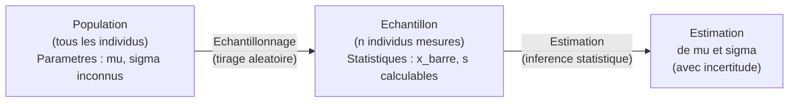

# Chapitre 1 — Estimation statistique

> **Idée centrale en une phrase :** On ne peut pas mesurer tout le monde, alors on mesure quelques personnes et on en déduit une valeur approchée pour tout le monde.

**Prérequis :** [Introduction à R](00_introduction_R.md)
**Chapitre suivant :** [Tests statistiques →](02_tests_statistiques.md)

---

## 1. L'analogie du sondage

### Pourquoi on ne mesure pas tout le monde ?

Imaginons qu'on veuille connaître la taille moyenne de **tous** les Français. Il y a environ **68 millions** de personnes en France. Mesurer chacune d'entre elles serait :

- **Trop long** : même à 1 minute par personne, il faudrait plus de 129 ans sans dormir.
- **Trop cher** : il faudrait des milliers d'enquêteurs, du matériel, des déplacements...
- **Impossible en pratique** : certaines personnes sont inaccessibles, d'autres refuseraient.

### La solution : le sondage

Au lieu de mesurer tout le monde, on choisit **un petit groupe** de personnes — par exemple 1000 — et on les mesure. Si ce groupe est **bien choisi** (c'est-à-dire représentatif de la population), on peut obtenir une estimation fiable de la taille moyenne de tous les Français.

C'est exactement ce que font les instituts de sondage : pour connaître l'opinion de 68 millions de Français sur un sujet politique, ils interrogent environ 1000 personnes. Et ça marche ! Les résultats sont généralement proches de la réalité, à quelques pourcents près.

### Population vs Échantillon

Deux mots clés à retenir :

- **Population** : c'est l'ensemble **complet** de tous les individus qui nous intéressent. C'est le "tout le monde" qu'on ne peut pas mesurer.
- **Échantillon** : c'est le **sous-groupe** qu'on a effectivement mesuré. C'est notre "petit groupe" de personnes.

### La clé : la représentativité

Pour que notre estimation soit bonne, il faut que l'échantillon **ressemble** à la population. Si on ne mesure que des joueurs de basket, on va surestimer la taille moyenne des Français !

Un bon échantillon est obtenu par **tirage aléatoire** : chaque individu de la population a la même chance d'être sélectionné. C'est ce qu'on appelle un **échantillon aléatoire simple**.

> **Analogie de la soupe :** Pour goûter une grande marmite de soupe, tu n'as pas besoin de tout boire. Une seule cuillère suffit... à condition d'avoir bien remué la marmite avant ! "Bien remuer" = tirage aléatoire.

### Schéma du processus



**Lecture du schéma :**

1. On part de la **population** (à gauche) dont on ne connaît pas les caractéristiques exactes (μ et σ sont inconnus).
2. On prélève un **échantillon** par tirage aléatoire (au milieu). Sur cet échantillon, on peut calculer des statistiques (x̄ et s).
3. À partir de ces statistiques, on **estime** les paramètres de la population (à droite), en précisant toujours notre niveau d'incertitude.

---

## 2. Vocabulaire : Population vs Échantillon

Avant d'aller plus loin, il est essentiel de bien distinguer ce qui concerne la **population** (le "vrai" monde, qu'on ne connaît pas) et ce qui concerne l'**échantillon** (ce qu'on a mesuré, qu'on connaît).

| Niveau | Symbole | Nom | Description | Exemple |
|--------|---------|-----|-------------|---------|
| Population | μ (mu) | Moyenne population | Vraie moyenne (inconnue) | Taille moyenne de TOUS les Français |
| Population | σ (sigma) | Écart-type population | Vraie dispersion (inconnue) | Dispersion des tailles de TOUS les Français |
| Population | N | Taille population | Nombre total d'individus | 68 millions |
| Échantillon | x̄ | Moyenne échantillon | Moyenne calculée sur l'échantillon | Taille moyenne de 100 Français mesurés |
| Échantillon | s | Écart-type échantillon | Dispersion calculée sur l'échantillon | Dispersion des 100 tailles mesurées |
| Échantillon | n | Taille échantillon | Nombre d'individus mesurés | 100 |

### Points importants

- Les **lettres grecques** (μ, σ) désignent toujours des paramètres de la **population** (inconnus).
- Les **lettres latines** (x̄, s) désignent toujours des statistiques de l'**échantillon** (calculables).
- L'objectif de l'estimation est de **deviner** μ et σ à partir de x̄ et s.

> **Mnémotechnique :** Grec = Grand (population) / Latin = Limité (échantillon).

---

## 3. Estimateurs ponctuels

Un **estimateur ponctuel**, c'est une formule qui prend les données de l'échantillon et en sort **un seul nombre** censé approcher le paramètre inconnu de la population.

### 3.1 La moyenne x̄

La moyenne de l'échantillon est l'estimateur le plus naturel de la moyenne μ de la population.

**Formule :**

```
x̄ = (x₁ + x₂ + ... + xₙ) / n = (1/n) · Σᵢ xᵢ
```

**Explication mot à mot :**

1. **x₁, x₂, ..., xₙ** : ce sont les **n** valeurs mesurées dans l'échantillon. Par exemple, les tailles de 10 étudiants.
2. **x₁ + x₂ + ... + xₙ** (ou **Σᵢ xᵢ**) : on **additionne** toutes les valeurs entre elles.
3. **/ n** (ou **1/n ·**) : on **divise** le total par le nombre de valeurs.

> **En une phrase :** On additionne toutes les valeurs, et on divise par combien il y en a. C'est exactement ce qu'on fait depuis l'école primaire pour calculer une moyenne !

**Exemple concret :** Si 5 étudiants mesurent 165, 172, 168, 180, 155 cm :
- Somme = 165 + 172 + 168 + 180 + 155 = 840
- Moyenne = 840 / 5 = **168 cm**

### 3.2 La variance corrigée s²

La variance mesure **à quel point les valeurs sont dispersées** autour de la moyenne. C'est l'estimateur de σ² (la variance de la population).

**Formule :**

```
s² = (1/(n-1)) · Σᵢ (xᵢ - x̄)²
```

**Explication de CHAQUE terme :**

| Terme | Signification | Pourquoi ? |
|-------|---------------|------------|
| `xᵢ - x̄` | L'**écart** entre chaque valeur et la moyenne | On mesure "à quel point cette valeur s'éloigne du centre" |
| `(xᵢ - x̄)²` | L'écart **au carré** | On met au carré pour deux raisons : (1) les écarts négatifs comptent autant que les positifs, (2) les grandes déviations sont "punies" plus fort |
| `Σᵢ` | La **somme** de tous ces carrés | On accumule les écarts de toutes les observations |
| `1/(n-1)` | On divise par **n - 1** (pas par n !) | C'est la **correction de Bessel** (voir ci-dessous) |

### 3.3 Pourquoi n-1 et pas n ? (Correction de Bessel)

C'est une question que tout le monde se pose ! Voici deux façons de comprendre :

**Analogie simple :**
Imagine que tu fais la moyenne de tes 3 notes d'un examen : 12, 14, 16. Ta moyenne est 14. Maintenant, si tu veux mesurer la "variabilité" de tes notes, tu as un problème : ta moyenne est elle-même calculée à partir de ces notes. Tu as utilisé une information de tes données pour calculer la moyenne, donc tu as "perdu un degré de liberté". C'est comme si tu n'avais que 2 informations indépendantes au lieu de 3.

**Explication technique :**
Quand on divise par n, on sous-estime systématiquement la vraie variance σ². Diviser par n-1 **corrige** ce biais. On peut le démontrer mathématiquement :
- E[s² avec n] = σ² × (n-1)/n → toujours inférieur à σ² (biaisé)
- E[s² avec n-1] = σ² → tombe juste en moyenne (sans biais)

> **En pratique :** quand n est grand (n > 30), la différence entre diviser par n et par n-1 est négligeable. Mais c'est une bonne habitude de toujours utiliser n-1.

### 3.4 L'écart-type s

L'écart-type est simplement la **racine carrée** de la variance :

```
s = √s²
```

L'avantage de l'écart-type sur la variance, c'est qu'il est dans la **même unité** que les données. Si on mesure des tailles en cm, s est aussi en cm (alors que s² est en cm²).

### 3.5 Propriétés d'un bon estimateur

Comment savoir si un estimateur est "bon" ? Il doit avoir trois propriétés :

**1. Sans biais (non biaisé)**
> "En moyenne, notre estimation tombe juste."

**Analogie des fléchettes :** Imagine que tu lances des fléchettes sur une cible. Un estimateur sans biais, c'est comme un tireur dont les fléchettes se répartissent **autour du centre** de la cible. Parfois à droite, parfois à gauche, mais **en moyenne** pile au centre. La moyenne x̄ est un estimateur sans biais de μ : si tu refais l'expérience plein de fois, la moyenne de tous tes x̄ sera exactement μ.

**2. Convergent (consistant)**
> "Plus l'échantillon est grand, plus on est précis."

**Analogie :** Plus tu lances de fléchettes, plus elles se resserrent autour du centre. Avec 10 données, ton estimation peut être assez loin de la vraie valeur. Avec 10 000 données, tu es presque sûr d'être très proche.

**3. Efficace**
> "C'est le meilleur estimateur possible pour cette information."

**Analogie :** Parmi tous les tireurs sans biais, l'estimateur efficace est celui dont les fléchettes sont **les plus serrées** autour du centre. Il y a peu de dispersion dans ses résultats. La moyenne x̄ est l'estimateur le plus efficace de μ pour des données normales.

### 3.6 Exemple complet en R

```r
# Données : tailles (cm) de 10 étudiants
tailles <- c(165, 172, 168, 180, 155, 170, 163, 177, 169, 174)

# Estimateurs ponctuels
n    <- length(tailles)      # Taille de l'échantillon → 10
xbar <- mean(tailles)        # Moyenne x̄ → 169.3 cm
s2   <- var(tailles)         # Variance corrigée s² (divise par n-1=9)
s    <- sd(tailles)          # Écart-type s → √s²

cat("n =", n, "\n")
cat("x̄ =", xbar, "cm\n")
cat("s² =", s2, "cm²\n")
cat("s =", s, "cm\n")

# Vérification manuelle de la moyenne
xbar_manuel <- sum(tailles) / n
cat("x̄ manuel =", xbar_manuel, "\n")   # Doit être identique à mean()

# Vérification : var() divise bien par n-1
var_manuel <- sum((tailles - xbar)^2) / (n-1)
cat("s² manuel =", var_manuel, "\n")   # Doit être identique à var()
```

**Sortie attendue :**
```
n = 10
x̄ = 169.3 cm
s² = 46.01111 cm²
s = 6.783149 cm
x̄ manuel = 169.3
s² manuel = 46.01111
```

> **Note :** En R, `var()` et `sd()` utilisent **automatiquement** la formule avec n-1. Pas besoin de corriger manuellement.

---

## 4. Le Théorème Central Limite (TCL)

Le TCL est l'un des résultats les plus importants de toute la statistique. Il explique **pourquoi** les méthodes d'estimation fonctionnent.

### 4.1 Explication intuitive

> **L'expérience des dés :** Si tu lances un dé 1 fois, tu obtiens 1, 2, 3, 4, 5 ou 6, chaque valeur ayant la même probabilité (1/6). Le résultat est complètement plat, pas du tout en forme de cloche.
>
> Maintenant, si tu lances **100 dés** et que tu calcules leur **moyenne**, cette moyenne sera presque toujours proche de **3.5** (la valeur théorique). Tu obtiendras rarement une moyenne de 1.2 ou de 5.8.
>
> Si tu répètes cette expérience des "100 dés" un grand nombre de fois, la distribution des moyennes obtenues aura une **forme de cloche** (une courbe en forme de chapeau, symétrique).
>
> **Plus tu lances de dés, plus la cloche est étroite** — et donc plus tes moyennes sont proches de 3.5.

### 4.2 Énoncé formel

Si X₁, X₂, ..., Xₙ sont des variables aléatoires **indépendantes**, de **même loi**, avec espérance μ et variance σ², alors :

```
√n · (x̄ - μ) / σ  →  N(0, 1)   quand n → ∞
```

**Traduction en français :**
- Prenez la moyenne de n observations (x̄)
- Soustrayez la vraie moyenne μ
- Divisez par σ/√n (l'écart-type de la moyenne)
- Le résultat suit approximativement une **loi normale centrée réduite** N(0,1)

### 4.3 Ce qu'il faut retenir

La **moyenne d'un grand échantillon suit approximativement une loi normale**, **peu importe la distribution d'origine** des données.

C'est magique : même si vos données ont une distribution complètement bizarre (uniforme, exponentielle, bimodale...), la moyenne de ces données suivra une belle courbe en cloche dès que n est assez grand.

**En pratique, "assez grand" signifie généralement n ≥ 30.** Pour des distributions très asymétriques, il faut parfois n ≥ 50 ou plus.

### 4.4 Illustration visuelle


*Sur cette image, on voit que la distribution de la moyenne converge vers une loi normale (courbe en cloche) quand n augmente, quelle que soit la distribution de départ.*

### 4.5 Illustration en R

```r
# Illustration du TCL avec une loi uniforme (pas du tout en cloche!)
# Une loi uniforme donne des valeurs équiprobables entre 0 et 1
par(mfrow=c(2,2))   # 4 graphiques sur la même fenêtre

for (n in c(1, 5, 30, 100)) {
  # Simuler 1000 fois la moyenne de n valeurs uniformes
  moyennes <- replicate(1000, mean(runif(n, 0, 1)))
  
  hist(moyennes,
       main  = paste("Distribution de x̄ pour n =", n),
       xlab  = "Valeur de la moyenne",
       col   = "lightblue",
       probability = TRUE,   # Densité au lieu de fréquence
       border = "white")
  
  # Pour n=30 et n=100 : superposer la courbe normale théorique
  if (n >= 30) {
    curve(dnorm(x, mean=0.5, sd=1/(sqrt(12*n))),
          add=TRUE, col="red", lwd=2)
  }
}
# Observation : pour n=1 → distribution plate (uniforme)
# Pour n=30 et n=100 → distribution en cloche (normale)
```

**Ce que vous devriez observer :**

| n | Forme du histogramme | Commentaire |
|---|----------------------|-------------|
| 1 | Plat (uniforme) | C'est la distribution originale |
| 5 | Légèrement en cloche | On commence à voir la forme apparaître |
| 30 | Clairement en cloche | La courbe normale (rouge) colle bien |
| 100 | Cloche très étroite | Presque toutes les moyennes sont entre 0.45 et 0.55 |

---

## 5. Intervalle de confiance pour μ (σ inconnu)

### 5.1 Pourquoi un intervalle et pas juste un nombre ?

Dans la section 3, on a calculé x̄ = 169.3 cm. Mais est-ce que la vraie moyenne μ de toute la population est exactement 169.3 cm ? **Très probablement pas.** Si on avait mesuré 10 autres étudiants, on aurait obtenu une valeur légèrement différente.

L'idée de l'**intervalle de confiance** est d'être honnête sur notre incertitude :

> Au lieu de dire *"la taille moyenne est 169.3 cm"*, on dit *"la taille moyenne est probablement entre 163 et 176 cm, avec 95% de confiance"*.

L'intervalle traduit l'**incertitude due à l'échantillonnage** : on n'a mesuré qu'un petit groupe, pas tout le monde.

### 5.2 La formule

Pour un intervalle de confiance à (1-α)% sur la moyenne μ, quand l'écart-type σ de la population est **inconnu** (ce qui est presque toujours le cas) :

```
IC à (1-α)% : [ x̄ - t(α/2, n-1) · s/√n  ;  x̄ + t(α/2, n-1) · s/√n ]
```

### 5.3 Explication de chaque terme

| Terme | Signification | Détails |
|-------|---------------|---------|
| `x̄` | Centre de l'intervalle | Notre meilleure estimation ponctuelle de μ |
| `t(α/2, n-1)` | Quantile de la loi de **Student** | C'est une valeur qu'on trouve dans une table (ou avec R). Elle dépend du niveau de confiance voulu et de n. Pour α=0.05 et n=10, on a t ≈ 2.26 |
| `s` | Écart-type de l'échantillon | La dispersion observée dans nos données |
| `√n` | Racine carrée de la taille | Plus n est grand, plus √n est grand, et plus l'intervalle est étroit |
| `s/√n` | **Erreur standard** | C'est la précision de notre estimation. C'est la quantité clé ! |
| `α` | Risque | α = 0.05 pour un IC à 95%, α = 0.01 pour un IC à 99% |

### 5.4 Pourquoi la loi de Student et pas la loi normale ?

Quand on ne connaît pas σ et qu'on le remplace par s (calculé sur l'échantillon), on introduit une **incertitude supplémentaire**. La loi de Student en tient compte : elle a des "queues plus épaisses" que la loi normale, ce qui donne des intervalles légèrement plus larges (et donc plus prudents).

Quand n est grand (n ≥ 30), la loi de Student ressemble beaucoup à la loi normale. C'est pour les petits échantillons que la différence compte.

### 5.5 L'interprétation correcte (IMPORTANT)

> **Interprétation correcte :** "Si on répète l'expérience 100 fois (on prend 100 échantillons différents et on construit 100 intervalles), alors **environ 95 intervalles sur 100 contiendront la vraie valeur μ**."

> **Interprétation FAUSSE :** ~~"μ a 95% de chances d'être dans cet intervalle."~~ NON ! μ est une valeur **fixe** (la vraie moyenne de la population). Elle ne "se balade" pas. C'est l'**intervalle** qui est aléatoire (il change à chaque échantillon), pas μ.

**Analogie :** Imagine que μ est un lampadaire fixe dans la rue, et que chaque IC est un lasso que tu lances en passant. Le lampadaire ne bouge pas. Parfois ton lasso l'attrape (l'IC contient μ), parfois non. "95% de confiance" signifie que 95% de tes lancers réussissent.

### 5.6 Illustration visuelle


*Chaque trait horizontal est un IC construit à partir d'un échantillon différent. La ligne verticale est la vraie valeur μ. La plupart des IC contiennent μ, mais pas tous.*

### 5.7 Exemple complet en R

```r
tailles <- c(165, 172, 168, 180, 155, 170, 163, 177, 169, 174)
n    <- length(tailles)
xbar <- mean(tailles)
s    <- sd(tailles)

# ── Méthode 1 : avec t.test() (recommandé) ──────────────
result <- t.test(tailles, conf.level = 0.95)
print(result)
cat("IC 95% :", result$conf.int[1], "à", result$conf.int[2], "cm\n")

# ── Méthode 2 : calcul manuel (pour comprendre) ─────────
alpha   <- 0.05                       # risque
t_crit  <- qt(1 - alpha/2, df=n-1)   # quantile de Student
# qt(0.975, df=9) → 2.262 (on dépasse 1.96 car n est petit)
erreur_standard <- s / sqrt(n)        # précision de l'estimateur
marge           <- t_crit * erreur_standard

cat("Quantile t critique :", t_crit, "\n")
cat("Erreur standard :", erreur_standard, "\n")
cat("Marge d'erreur :", marge, "\n")
cat("IC 95% manuel : [", xbar - marge, ";", xbar + marge, "]\n")

# ── Effet de la taille d'échantillon ────────────────────
cat("\nEffet de n sur la largeur de l'IC :\n")
for (n_sim in c(10, 30, 100, 1000)) {
  t_c  <- qt(0.975, df=n_sim-1)
  marge_sim <- t_c * s / sqrt(n_sim)
  cat("n =", n_sim, "→ marge =", round(marge_sim, 2), "cm\n")
}
# Observation : plus n augmente, plus l'intervalle est étroit
```

**Sortie attendue (approximative) :**
```
Quantile t critique : 2.262157
Erreur standard : 2.145066
Marge d'erreur : 4.852335
IC 95% manuel : [ 164.4477 ; 174.1523 ]

Effet de n sur la largeur de l'IC :
n = 10  → marge = 4.85 cm
n = 30  → marge = 2.53 cm
n = 100 → marge = 1.35 cm
n = 1000 → marge = 0.42 cm
```

> **Observation clé :** En passant de n=10 à n=1000, la marge d'erreur est divisée par plus de 10. C'est la puissance du √n au dénominateur !

---

## 6. Intervalle de confiance pour une proportion

### 6.1 Le contexte

Parfois, on ne s'intéresse pas à une moyenne mais à une **proportion**. Par exemple :
- Quel pourcentage d'étudiants réussissent l'examen ?
- Quel pourcentage de Français sont favorables à une mesure ?
- Quel pourcentage de pièces fabriquées sont défectueuses ?

### 6.2 Exemple

> "42 étudiants sur 150 réussissent l'examen à la première tentative. Quelle est la fourchette réelle du taux de réussite ?"

La proportion observée est p̂ = 42/150 = 0.28 = **28%**. Mais le vrai taux de réussite de toute la population étudiante est-il exactement 28% ? Probablement pas. On a besoin d'un intervalle de confiance.

### 6.3 La formule

```
IC : [ p̂ - z(α/2) · √(p̂(1-p̂)/n)  ;  p̂ + z(α/2) · √(p̂(1-p̂)/n) ]
```

**Explication des termes :**

| Terme | Signification |
|-------|---------------|
| `p̂` (p chapeau) | Proportion observée dans l'échantillon (nombre de succès / taille de l'échantillon) |
| `z(α/2)` | Quantile de la loi **normale** (≈ 1.96 pour un IC à 95%) |
| `p̂(1-p̂)` | Variance de la proportion (analogue à σ²) |
| `√(p̂(1-p̂)/n)` | Erreur standard de la proportion |

> **Pourquoi z et pas t ici ?** Pour les proportions, on utilise la loi normale (z) et non la loi de Student (t), car la formule de la variance est différente et ne nécessite pas d'estimer σ séparément.

### 6.4 Condition d'application

Pour que cette formule soit valide, il faut que l'échantillon soit assez grand pour que l'approximation normale fonctionne :

- **np̂ ≥ 5** (au moins 5 succès)
- **n(1-p̂) ≥ 5** (au moins 5 échecs)

Dans notre exemple : 42 ≥ 5 et 108 ≥ 5 → OK.

### 6.5 Exemple en R

```r
# Situation : 42 étudiants réussissent sur 150
reussites  <- 42
total      <- 150
p_hat      <- reussites / total
cat("Proportion observée :", p_hat, "=", round(100*p_hat, 1), "%\n")

# IC avec prop.test()
result <- prop.test(reussites, total, conf.level=0.95)
print(result)
cat("IC 95% : [", round(result$conf.int[1]*100, 1), "% ;",
                   round(result$conf.int[2]*100, 1), "%]\n")

# Calcul manuel
z_crit <- qnorm(0.975)   # → 1.96
marge  <- z_crit * sqrt(p_hat * (1 - p_hat) / total)
cat("IC manuel : [", round((p_hat-marge)*100,1), "% ;",
                     round((p_hat+marge)*100,1), "%]\n")
```

**Sortie attendue (approximative) :**
```
Proportion observée : 0.28 = 28 %
IC 95% : [ 21.2 % ; 35.8 %]
IC manuel : [ 20.8 % ; 35.2 %]
```

> **Note :** `prop.test()` utilise une correction de continuité, d'ou la légère différence avec le calcul manuel. Les deux résultats sont corrects.

> **Interprétation :** On estime que le vrai taux de réussite est entre 21% et 36% environ. C'est un intervalle assez large car n=150 n'est pas énorme pour une proportion.

---

## 7. Pièges classiques

Voici les erreurs les plus fréquentes chez les débutants. Les connaître, c'est déjà les éviter !

### Piège 1 : Confondre IC et probabilité

**FAUX :** "Il y a 95% de chances que μ soit dans l'intervalle [164.4 ; 174.2]."

**VRAI :** "Si on construisait 100 intervalles à partir de 100 échantillons différents, environ 95 d'entre eux contiendraient μ."

μ est une constante fixe. C'est l'intervalle qui est aléatoire, pas μ.

### Piège 2 : Utiliser z au lieu de t

Quand σ est **inconnu** (ce qui est le cas dans 99% des situations réelles), on doit utiliser la **loi de Student** (fonction `qt()` en R), pas la loi normale (fonction `qnorm()`).

La loi normale (z = 1.96) ne convient que si :
- σ est connu (très rare), ou
- n est très grand (n > 100, auquel cas t ≈ z de toute façon)

### Piège 3 : Confondre écart-type et erreur standard

Ce sont deux choses **très différentes** :

| | Écart-type (s) | Erreur standard (s/√n) |
|---|---|---|
| Mesure | La dispersion des **données individuelles** | La précision de la **moyenne** |
| Formule | s | s / √n |
| Diminue quand n augmente ? | Non (s reste stable) | Oui (divise par √n) |
| Exemple | Les tailles individuelles varient de ±7 cm | La moyenne est précise à ±2 cm près |

### Piège 4 : Ignorer les hypothèses

L'intervalle de confiance sur μ suppose que :
- Les données sont **normalement distribuées**, OU
- L'échantillon est **assez grand** (n ≥ 30) pour que le TCL s'applique

Si vos données sont fortement asymétriques et que n est petit, l'IC peut être trompeur.

**Conseil :** Avant de calculer un IC, faites toujours un histogramme ou un QQ-plot pour vérifier la normalité :

```r
# Vérification visuelle de la normalité
par(mfrow=c(1,2))
hist(tailles, main="Histogramme", col="lightblue", border="white")
qqnorm(tailles); qqline(tailles, col="red")
```

### Piège 5 : Un grand IC n'est pas forcément mauvais

Un intervalle de confiance large signifie simplement qu'on a **peu de données** ou que les données sont **très dispersées**. C'est une information honnête sur notre niveau d'incertitude.

Un IC étroit obtenu avec des données biaisées est bien plus dangereux qu'un IC large obtenu correctement.

> **Règle d'or :** Mieux vaut un intervalle large et honnête qu'un point précis et faux.

---

## 8. Récapitulatif

### Tableau des formules essentielles

| Situation | Formule | Fonction R | Condition |
|-----------|---------|------------|-----------|
| IC sur μ (σ inconnu) | x̄ ± t(α/2, n-1)·s/√n | `t.test(x)` | Données normales ou n ≥ 30 |
| IC sur une proportion | p̂ ± z(α/2)·√(p̂(1-p̂)/n) | `prop.test(k, n)` | np ≥ 5 et n(1-p) ≥ 5 |
| Taille d'échantillon nécessaire | n = (z·σ/e)² | Calcul manuel | σ connu ou estimé, e = marge souhaitée |

### Mémo des fonctions R

| Fonction R | Ce qu'elle fait | Exemple |
|------------|----------------|---------|
| `mean(x)` | Calcule la moyenne x̄ | `mean(c(1,2,3))` → 2 |
| `var(x)` | Calcule la variance corrigée s² (divise par n-1) | `var(c(1,2,3))` → 1 |
| `sd(x)` | Calcule l'écart-type s = √s² | `sd(c(1,2,3))` → 1 |
| `length(x)` | Donne la taille n | `length(c(1,2,3))` → 3 |
| `t.test(x)` | IC sur la moyenne + test de Student | Donne l'IC à 95% par défaut |
| `prop.test(k, n)` | IC sur une proportion | `prop.test(42, 150)` |
| `qt(p, df)` | Quantile de la loi de Student | `qt(0.975, df=9)` → 2.26 |
| `qnorm(p)` | Quantile de la loi normale | `qnorm(0.975)` → 1.96 |

### Checklist avant de calculer un IC

1. [ ] Mon échantillon est-il **aléatoire** ? (pas biaisé par la sélection)
2. [ ] Mes observations sont-elles **indépendantes** ?
3. [ ] La taille n est-elle suffisante ? (n ≥ 30, ou données normales)
4. [ ] Ai-je utilisé la bonne loi ? (Student si σ inconnu, Normale si σ connu ou proportion)
5. [ ] Mon interprétation est-elle correcte ? (c'est l'IC qui est aléatoire, pas μ)

---

## 9. Exercices du cours

### Exercice 1 : Montrer que la moyenne empirique est sans biais

**Enonce :**

Soit $(x_1, \dots, x_n)$ un n-echantillon de variables aleatoires i.i.d. d'esperance $\theta$ et de variance finie. Montrer que $\bar{X}_n = \frac{1}{n}\sum_{i=1}^{n} X_i$ est un estimateur sans biais de $\theta$.

**Solution detaillee :**

On calcule l'esperance de l'estimateur :

```
E[X̄n] = E[(1/n) · ΣXi]
       = (1/n) · ΣE[Xi]        (linearite de l'esperance)
       = (1/n) · n·θ            (car E[Xi] = θ pour tout i)
       = θ
```

Le biais vaut donc :

```
b(X̄n) = E[X̄n] - θ = θ - θ = 0
```

**En R :**

```r
# Verification par simulation : la moyenne des moyennes tend vers theta
theta <- 5
n <- 30
nb_simulations <- 10000

moyennes <- replicate(nb_simulations, mean(rnorm(n, mean = theta, sd = 2)))
cat("Vraie valeur theta :", theta, "\n")
cat("Moyenne des X̄n :", mean(moyennes), "\n")
# Les deux valeurs sont tres proches → sans biais
```

**Ce qu'il faut retenir :** La linearite de l'esperance permet de "rentrer" dans la somme. Le fait que chaque $X_i$ ait la meme esperance $\theta$ simplifie tout. C'est la propriete la plus fondamentale de la moyenne empirique.

---

### Exercice 2 : Montrer que la variance empirique S²n est biaisee

**Enonce :**

Montrer que $S_n^2 = \frac{1}{n}\sum_{i=1}^{n}(X_i - \bar{X}_n)^2$ est un estimateur biaise de $\sigma^2$, mais asymptotiquement sans biais. Montrer ensuite que la variance corrigee $\tilde{S}_n^2 = \frac{1}{n-1}\sum_{i=1}^{n}(X_i - \bar{X}_n)^2$ est sans biais.

**Solution detaillee :**

**Etape 1 : Calculer E[S²n]**

On utilise le resultat classique :

```
E[S²n] = E[(1/n)·Σ(Xi - X̄n)²]
       = σ² - V(X̄n)
       = σ² - σ²/n
       = (n-1)/n · σ²
```

**Etape 2 : Identifier le biais**

```
b(S²n) = E[S²n] - σ²
       = (n-1)/n · σ² - σ²
       = -σ²/n
       ≠ 0
```

Le biais est $-\sigma^2/n$, qui est strictement negatif : $S_n^2$ **sous-estime** systematiquement $\sigma^2$.

**Etape 3 : Asymptotiquement sans biais**

Quand $n \to \infty$, le biais $-\sigma^2/n \to 0$. Donc $S_n^2$ est **asymptotiquement sans biais**.

**Etape 4 : La variance corrigee est sans biais**

```
S̃²n = n/(n-1) · S²n = (1/(n-1)) · Σ(Xi - X̄n)²

E[S̃²n] = n/(n-1) · E[S²n]
        = n/(n-1) · (n-1)/n · σ²
        = σ²
```

Donc $\tilde{S}_n^2$ est sans biais pour $\sigma^2$.

**En R :**

```r
# Illustration : var() divise par n-1 (sans biais), pas par n (biaise)
set.seed(42)
sigma2 <- 4
n <- 10
nb_sim <- 10000

# Simuler nb_sim echantillons
S2n_biaise <- numeric(nb_sim)
S2n_corrige <- numeric(nb_sim)

for (i in 1:nb_sim) {
  x <- rnorm(n, mean = 0, sd = sqrt(sigma2))
  S2n_biaise[i]  <- sum((x - mean(x))^2) / n        # division par n
  S2n_corrige[i] <- sum((x - mean(x))^2) / (n - 1)  # division par n-1
}

cat("Vraie variance sigma² :", sigma2, "\n")
cat("Moyenne de S²n (biaise) :", mean(S2n_biaise), "\n")
cat("Moyenne de S̃²n (corrige) :", mean(S2n_corrige), "\n")
# S̃²n tombe juste en moyenne, S²n sous-estime
```

**Ce qu'il faut retenir :** Diviser par $n$ sous-estime la variance. Diviser par $n-1$ corrige ce biais. C'est la raison de la correction de Bessel, et c'est ce que fait la fonction `var()` en R.

---

### Exercice 3 : Convergence en moyenne quadratique

**Enonce :**

Montrer que $\bar{X}_n$ converge en moyenne quadratique vers $\theta$.

**Solution detaillee :**

L'erreur quadratique moyenne (EQM) se decompose en variance + biais au carre :

```
EQM(X̄n) = V(X̄n) + [b(X̄n)]²
```

On a deja montre que $\bar{X}_n$ est sans biais, donc $b(\bar{X}_n) = 0$. Il reste :

```
EQM(X̄n) = V(X̄n) + 0²
         = V(X̄n)
         = V((1/n)·ΣXi)
         = (1/n²) · Σ V(Xi)       (independance des Xi)
         = (1/n²) · n · V(X)
         = V(X) / n
```

Quand $n \to \infty$ :

```
EQM(X̄n) = V(X)/n → 0
```

Donc $\bar{X}_n$ **converge en moyenne quadratique** vers $\theta$.

**En R :**

```r
# Illustration : l'EQM diminue quand n augmente
theta <- 10
sigma2 <- 4
nb_sim <- 5000

cat("EQM theorique vs empirique :\n")
for (n in c(10, 50, 100, 500, 1000)) {
  moyennes <- replicate(nb_sim, mean(rnorm(n, mean = theta, sd = sqrt(sigma2))))
  eqm_empirique <- mean((moyennes - theta)^2)
  eqm_theorique <- sigma2 / n
  cat("n =", n, " | EQM theorique =", round(eqm_theorique, 4),
      " | EQM empirique =", round(eqm_empirique, 4), "\n")
}
```

**Ce qu'il faut retenir :** L'EQM d'un estimateur sans biais se reduit a sa variance. Pour $\bar{X}_n$, la variance decroit en $1/n$, ce qui garantit la convergence. Plus on a de donnees, plus notre estimation est precise.

---

### Exercice 4 : Estimateur consistant (Bernoulli)

**Enonce :**

Soit $X \sim B(\theta)$ (loi de Bernoulli). Montrer que $\bar{X}_n$ est un estimateur consistant de $\theta$ en utilisant l'inegalite de Bienayme-Tchebychev.

**Solution detaillee :**

**Rappel de l'inegalite de Bienayme-Tchebychev :** Pour toute variable aleatoire $Y$ d'esperance $\mu$ et de variance finie, et pour tout $a > 0$ :

```
P(|Y - μ| > a) ≤ V(Y) / a²
```

**Application a X̄n :**

On sait que $E[\bar{X}_n] = \theta$ et :

```
V(X̄n) = V(X)/n = θ(1-θ)/n
```

car pour une loi de Bernoulli $B(\theta)$, on a $V(X) = \theta(1-\theta)$.

En appliquant Bienayme-Tchebychev :

```
P(|X̄n - θ| > a) ≤ V(X̄n) / a²
                  = θ(1-θ) / (n·a²)
```

Pour tout $a > 0$ fixe, quand $n \to \infty$ :

```
P(|X̄n - θ| > a) ≤ θ(1-θ)/(n·a²) → 0
```

Donc $\bar{X}_n$ **converge en probabilite** vers $\theta$ : c'est un estimateur **consistant**.

**En R :**

```r
# Illustration : la proportion empirique converge vers theta
theta <- 0.3
nb_sim <- 5000

cat("Convergence de X̄n vers theta =", theta, ":\n")
for (n in c(10, 50, 100, 500, 2000)) {
  estimations <- replicate(nb_sim, mean(rbinom(n, 1, theta)))
  # Proportion des estimations a plus de 0.05 de theta
  prop_loin <- mean(abs(estimations - theta) > 0.05)
  cat("n =", n, " | P(|X̄n - θ| > 0.05) ≈", round(prop_loin, 4), "\n")
}
# La probabilite diminue vers 0
```

**Ce qu'il faut retenir :** La consistance signifie que notre estimateur devient de plus en plus precis quand $n$ augmente. L'inegalite de Bienayme-Tchebychev est un outil general pour prouver la consistance : il suffit que la variance de l'estimateur tende vers 0.

---

### Exercice 5 : Methode des moments

**Enonce :**

Donner les estimateurs par la methode des moments pour les lois suivantes :
- a) Loi de Bernoulli $B(\theta)$
- b) Loi exponentielle $E(\theta)$
- c) Loi normale $N(\mu, \sigma^2)$

**Solution detaillee :**

**Principe de la methode des moments :** On egalise les moments theoriques (fonctions des parametres) avec les moments empiriques (calcules sur l'echantillon), puis on resout le systeme.

**a) Bernoulli B(θ) — un parametre, un moment**

```
Moment theorique d'ordre 1 : E[X] = θ
Moment empirique d'ordre 1 : X̄n = (1/n)·ΣXi

On egalise : θ = X̄n
Donc : θ̂ = X̄n
```

L'estimateur des moments est simplement la proportion de succes dans l'echantillon.

**b) Exponentielle E(θ) — un parametre, un moment**

```
Moment theorique d'ordre 1 : E[X] = 1/θ
Moment empirique d'ordre 1 : X̄n

On egalise : 1/θ = X̄n
Donc : θ̂ = 1/X̄n
```

**c) Normale N(μ, σ²) — deux parametres, deux moments**

```
Moment theorique d'ordre 1 : E[X] = μ
Moment theorique d'ordre 2 : E[X²] = σ² + μ²

Moment empirique d'ordre 1 : X̄n
Moment empirique d'ordre 2 : (1/n)·ΣXi²

Systeme :
  μ = X̄n                    → μ̂ = X̄n
  σ² + μ² = (1/n)·ΣXi²      → σ̂² = (1/n)·ΣXi² - X̄n²
```

On reconnait que $\hat{\sigma}^2 = \frac{1}{n}\sum X_i^2 - \bar{X}_n^2 = \frac{1}{n}\sum(X_i - \bar{X}_n)^2 = S_n^2$ (variance empirique non corrigee).

**En R :**

```r
# a) Bernoulli
x_bern <- c(1, 0, 1, 1, 0, 0, 1, 0, 1, 1)
theta_hat <- mean(x_bern)
cat("Bernoulli : θ̂ =", theta_hat, "\n")

# b) Exponentielle
x_exp <- rexp(100, rate = 2)   # theta = 2
theta_hat_exp <- 1 / mean(x_exp)
cat("Exponentielle : θ̂ =", round(theta_hat_exp, 3), "(vrai theta = 2)\n")

# c) Normale
x_norm <- rnorm(100, mean = 5, sd = 3)
mu_hat <- mean(x_norm)
sigma2_hat <- mean(x_norm^2) - mean(x_norm)^2
cat("Normale : μ̂ =", round(mu_hat, 3), "(vrai μ = 5)\n")
cat("Normale : σ̂² =", round(sigma2_hat, 3), "(vrai σ² = 9)\n")
```

**Ce qu'il faut retenir :** La methode des moments est simple et intuitive : on remplace les moments theoriques par leurs equivalents empiriques. Pour $k$ parametres, on a besoin de $k$ moments.

---

### Exercice 6 : Maximum de vraisemblance

**Enonce :**

Ecrire la fonction de vraisemblance pour les lois suivantes :
- a) Bernoulli $B(\theta)$
- b) Exponentielle $E(\theta)$
- c) Normale $N(\mu, \sigma^2)$

**Solution detaillee :**

**Principe du maximum de vraisemblance (EMV) :** On cherche la valeur du parametre qui rend les donnees observees **les plus probables**. La vraisemblance est le produit des probabilites (ou densites) de chaque observation.

**a) Bernoulli B(θ)**

Chaque $X_i$ vaut 0 ou 1, avec $P(X_i = 1) = \theta$ et $P(X_i = 0) = 1-\theta$.

```
Ln(θ) = Π P(Xi = xi)
       = Π θ^xi · (1-θ)^(1-xi)
       = θ^(Σxi) · (1-θ)^(n-Σxi)

Log-vraisemblance :
ln(Ln) = (Σxi)·ln(θ) + (n-Σxi)·ln(1-θ)

Derivee = Σxi/θ - (n-Σxi)/(1-θ) = 0
→ θ̂ = Σxi/n = X̄n
```

**b) Exponentielle E(θ)**

La densite est $f(x) = \theta \cdot e^{-\theta x}$ pour $x \geq 0$.

```
Ln(θ) = Π θ·exp(-θ·xi)
       = θ^n · exp(-θ·Σxi)

Log-vraisemblance :
ln(Ln) = n·ln(θ) - θ·Σxi

Derivee = n/θ - Σxi = 0
→ θ̂ = n/Σxi = 1/X̄n
```

**c) Normale N(μ, σ²)**

La densite est $f(x) = \frac{1}{\sigma\sqrt{2\pi}} \exp\left(-\frac{(x-\mu)^2}{2\sigma^2}\right)$.

```
Ln(μ,σ²) = Π (1/(σ√(2π))) · exp(-(xi-μ)²/(2σ²))
          = (1/(σ^n·(2π)^(n/2))) · exp(-Σ(xi-μ)²/(2σ²))

Log-vraisemblance :
ln(Ln) = -n/2·ln(2π) - n·ln(σ) - Σ(xi-μ)²/(2σ²)

Derivees partielles :
∂/∂μ = Σ(xi-μ)/σ² = 0  →  μ̂ = X̄n
∂/∂σ² = -n/(2σ²) + Σ(xi-μ̂)²/(2σ⁴) = 0  →  σ̂² = (1/n)·Σ(xi-X̄n)²
```

Note : l'EMV de $\sigma^2$ donne la variance non corrigee (division par $n$, pas $n-1$).

**En R :**

```r
# EMV pour une loi exponentielle - illustration graphique
set.seed(42)
x <- rexp(50, rate = 3)   # vrai theta = 3

# Log-vraisemblance en fonction de theta
theta_grid <- seq(0.5, 6, length.out = 200)
log_vrais <- sapply(theta_grid, function(th) {
  sum(dexp(x, rate = th, log = TRUE))
})

plot(theta_grid, log_vrais, type = "l", lwd = 2,
     xlab = "theta", ylab = "Log-vraisemblance",
     main = "EMV pour E(theta)")
theta_emv <- 1 / mean(x)
abline(v = theta_emv, col = "red", lwd = 2, lty = 2)
abline(v = 3, col = "blue", lwd = 2, lty = 2)
legend("topright", c(paste("EMV =", round(theta_emv, 2)), "Vrai theta = 3"),
       col = c("red", "blue"), lty = 2, lwd = 2)
```

**Ce qu'il faut retenir :** L'EMV maximise la vraisemblance des donnees observees. On passe souvent par la log-vraisemblance (plus facile a deriver). Pour les lois classiques, l'EMV coincide souvent avec l'estimateur des moments.

---

## 10. Exercices de TD

### Exercice TD1.1 : Methode des moments (Geometrique, Gamma, Uniforme)

**Enonce :**

Determiner les estimateurs par la methode des moments pour :
1. La loi geometrique $G(p)$
2. La loi gamma $\Gamma(\alpha, \beta)$
3. La loi uniforme $U[a, b]$

**Solution detaillee :**

**1. Loi geometrique G(p)**

```
Moment theorique : E[X] = 1/p

On egalise avec le moment empirique :
1/p = X̄n
→ p̂ = 1/X̄n
```

**2. Loi gamma Γ(α, β)**

Deux parametres → on a besoin de deux moments :

```
E[X] = α/β
V[X] = α/β²

Moment empirique d'ordre 1 : X̄n = α/β
Moment empirique d'ordre 2 : S²n = α/β²

De la 2e equation : β = α/S²n · (1/β) → en divisant :
S²n / X̄n = (α/β²) / (α/β) = 1/β → β̂ = X̄n/S²n

En reinjectant : α̂ = β̂·X̄n = X̄n²/S²n
```

Resultats :

```
α̂ = X̄n² / S²n
β̂ = X̄n / S²n
```

**3. Loi uniforme U[a, b]**

Deux parametres → deux moments :

```
E[X] = (a+b)/2
V[X] = (b-a)²/12

Du 1er moment : a + b = 2·X̄n
Du 2e moment  : (b-a)² = 12·S²n → b - a = 2√(3·S²n)

Systeme :
  a + b = 2·X̄n
  b - a = 2·√(3·S²n)

En resolvant :
  â = X̄n - √(3·S²n)
  b̂ = X̄n + √(3·S²n)
```

**En R :**

```r
# 1. Geometrique
x_geom <- rgeom(200, prob = 0.4) + 1   # rgeom commence a 0, on decale
p_hat <- 1 / mean(x_geom)
cat("Geometrique : p̂ =", round(p_hat, 3), "(vrai p = 0.4)\n")

# 2. Gamma
x_gamma <- rgamma(200, shape = 3, rate = 2)
alpha_hat <- mean(x_gamma)^2 / var(x_gamma)
beta_hat  <- mean(x_gamma) / var(x_gamma)
cat("Gamma : α̂ =", round(alpha_hat, 3), "(vrai α = 3)\n")
cat("Gamma : β̂ =", round(beta_hat, 3), "(vrai β = 2)\n")

# 3. Uniforme
x_unif <- runif(200, min = 2, max = 8)
a_hat <- mean(x_unif) - sqrt(3 * var(x_unif))
b_hat <- mean(x_unif) + sqrt(3 * var(x_unif))
cat("Uniforme : â =", round(a_hat, 3), "(vrai a = 2)\n")
cat("Uniforme : b̂ =", round(b_hat, 3), "(vrai b = 8)\n")
```

**Ce qu'il faut retenir :** Pour $k$ parametres, on utilise $k$ moments. Le systeme a resoudre devient un systeme de $k$ equations a $k$ inconnues. Pour la loi gamma et la loi uniforme, il faut utiliser les deux premiers moments.

---

### Exercice TD1.2 : EMV (Geometrique, Gaussien)

**Enonce :**

Determiner les estimateurs du maximum de vraisemblance pour :
1. La loi geometrique $G(p)$
2. La loi normale $N(m, 1)$ (variance connue)
3. La loi normale $N(m, \sigma^2)$ (variance inconnue)

**Solution detaillee :**

**1. Geometrique G(p)**

La probabilite est $P(X = k) = p(1-p)^{k-1}$ pour $k \geq 1$.

```
Ln(p) = Π p·(1-p)^(xi-1) = p^n · (1-p)^(Σxi - n)

Log-vraisemblance :
ln(Ln) = n·ln(p) + (Σxi - n)·ln(1-p)

Derivee :
n/p - (Σxi - n)/(1-p) = 0
n(1-p) = p(Σxi - n)
n - np = pΣxi - np
n = p·Σxi
→ p̂ = n/Σxi = 1/X̄n
```

**2. Normale N(m, 1)**

```
ln(Ln) = -n/2·ln(2π) - (1/2)·Σ(xi - m)²

Derivee par rapport a m :
Σ(xi - m) = 0
Σxi = n·m
→ m̂ = X̄n
```

**3. Normale N(m, σ²)**

```
ln(Ln) = -n/2·ln(2π) - n·ln(σ) - Σ(xi-m)²/(2σ²)

∂/∂m : Σ(xi - m)/σ² = 0  →  m̂ = X̄n

∂/∂(σ²) : -n/(2σ²) + Σ(xi - m̂)²/(2σ⁴) = 0
→ σ̂² = (1/n)·Σ(xi - X̄n)²
```

**Ce qu'il faut retenir :** Pour les lois classiques, l'EMV et l'estimateur des moments donnent souvent le meme resultat. L'EMV de $\sigma^2$ donne toujours la version non corrigee (division par $n$), contrairement a la variance de R qui divise par $n-1$.

---

### Exercice TD1.3 : Accidents aux passages a niveau (Poisson)

**Enonce :**

On dispose du nombre d'accidents annuels aux passages a niveau sur 13 annees (1985-1997) :
- 1985: 3, 1988: 2, 1991: 1, 1993: 1, 1995: 1, 1997: 1
- Les annees non listees : 0 accident

Total : 7 accidents sur 13 annees. On suppose $X \sim P(\theta)$ (loi de Poisson). Determiner l'EMV de $\theta$, son biais, son EQM, et etudier sa consistance et normalite asymptotique.

**Solution detaillee :**

**EMV pour une loi de Poisson :**

```
P(X = k) = θ^k · exp(-θ) / k!

Ln(θ) = Π (θ^xi · exp(-θ) / xi!)
ln(Ln) = Σxi·ln(θ) - n·θ - Σln(xi!)

Derivee : Σxi/θ - n = 0
→ θ̂ = Σxi/n = X̄n = 7/13 ≈ 0.538
```

**Biais :**

```
E[θ̂] = E[X̄n] = θ     (la moyenne est sans biais pour le parametre de Poisson)
b(θ̂) = 0  →  sans biais
```

**EQM :**

```
EQM(θ̂) = V(θ̂) + b²(θ̂) = V(X̄n) = V(X)/n = θ/n
```

Car pour une loi de Poisson, $V(X) = \theta$.

**Consistance :**

```
EQM(θ̂) = θ/n → 0  quand n → ∞
```

Donc $\hat{\theta}$ est consistant.

**Normalite asymptotique (par le TCL) :**

```
√n · (θ̂ - θ) / √θ  →  N(0, 1)  quand n → ∞

Donc θ̂ est asymptotiquement normal : θ̂ ~ N(θ, θ/n) pour n grand.
```

**En R :**

```r
# Donnees des accidents
accidents <- c(3, 0, 0, 2, 0, 0, 1, 0, 1, 0, 1, 0, 1)
n <- length(accidents)

theta_hat <- mean(accidents)
cat("n =", n, "\n")
cat("θ̂ = X̄n =", round(theta_hat, 3), "\n")
cat("EQM estimee = θ̂/n =", round(theta_hat / n, 4), "\n")

# IC asymptotique a 95%
z <- qnorm(0.975)
ic_bas  <- theta_hat - z * sqrt(theta_hat / n)
ic_haut <- theta_hat + z * sqrt(theta_hat / n)
cat("IC asymptotique 95% : [", round(ic_bas, 3), ";", round(ic_haut, 3), "]\n")
```

**Ce qu'il faut retenir :** Pour une loi de Poisson, l'EMV est simplement la moyenne empirique. Il est sans biais, consistant et asymptotiquement normal. L'EQM vaut $\theta/n$.

---

### Exercice TD1.4 : Delta-methode

**Enonce :**

Soit $X$ une v.a. d'esperance $m = E(X) = \frac{1}{1-\theta}$. L'estimateur des moments de $\theta$ est $\hat{\theta}_n = 1 - 1/\bar{X}_n$. Etudier la normalite asymptotique de $\hat{\theta}_n$ par la delta-methode.

**Solution detaillee :**

**Rappel de la delta-methode :** Si $\sqrt{n}(\bar{X}_n - m) \xrightarrow{d} N(0, \sigma^2)$, alors pour toute fonction $g$ derivable en $m$ avec $g'(m) \neq 0$ :

```
√n · (g(X̄n) - g(m))  →  N(0, σ² · [g'(m)]²)
```

**Application :**

On a $\hat{\theta}_n = g(\bar{X}_n)$ avec $g(x) = 1 - 1/x$.

```
g(x) = 1 - 1/x
g'(x) = 1/x²
g'(m) = 1/m² = (1-θ)²
```

Par le TCL, $\sqrt{n}(\bar{X}_n - m) \to N(0, \sigma^2)$.

Par la delta-methode :

```
√n · (θ̂n - θ)  →  N(0, σ² · (1-θ)⁴)

car [g'(m)]² = [(1-θ)²]² = (1-θ)⁴
```

Donc $\hat{\theta}_n$ est asymptotiquement normal :

```
θ̂n ~ N(θ, σ²·(1-θ)⁴/n)  pour n grand
```

**Ce qu'il faut retenir :** La delta-methode permet de transferer la normalite asymptotique de $\bar{X}_n$ a toute transformation differentiable $g(\bar{X}_n)$. La variance est multipliee par $[g'(m)]^2$.

---

### Exercice TD1.5 : Comparaison d'estimateurs (Exponentielle)

**Enonce :**

Soit $X \sim E(\lambda)$. On pose $Y = \sum_{i=1}^n X_i \sim \Gamma(n, \lambda)$ et $\hat{\lambda}_n = n/Y = 1/\bar{X}_n$. Etudier le biais, la variance, l'EQM, la consistance et la normalite asymptotique de $\hat{\lambda}_n$.

**Solution detaillee :**

**Biais :** $\hat{\lambda}_n = n/Y$ ou $Y \sim \Gamma(n, \lambda)$.

```
E[1/Y] pour Y ~ Γ(n,λ) :
E[n/Y] = n·λ/(n-1)     (resultat classique pour l'inverse d'une Gamma)

b(λ̂n) = E[λ̂n] - λ = nλ/(n-1) - λ = λ/(n-1)
```

L'estimateur est biaise (surestime $\lambda$), mais le biais $\lambda/(n-1) \to 0$ : il est asymptotiquement sans biais.

**Variance :**

```
V(λ̂n) = n²·λ²/((n-1)²·(n-2))    pour n > 2
```

**EQM :**

```
EQM(λ̂n) = V(λ̂n) + b²(λ̂n)
         = n²·λ²/((n-1)²·(n-2)) + λ²/(n-1)²
```

Pour $n$ grand, l'EQM tend vers 0, donc l'estimateur est **consistant**.

**Normalite asymptotique :**

Par la delta-methode avec $g(x) = 1/x$ et $m = E[X] = 1/\lambda$ :

```
g'(x) = -1/x²
g'(m) = -λ²

√n·(λ̂n - λ) → N(0, σ²·λ⁴)

Or σ² = V(X) = 1/λ², donc :

√n·(λ̂n - λ) → N(0, λ²)
```

**Ce qu'il faut retenir :** L'inverse de la moyenne est un estimateur naturel du parametre d'une loi exponentielle. Il est legerement biaise pour des petits echantillons, mais consistant et asymptotiquement normal.

---

### Exercice TD1.6 : Synthese (Uniforme U[kθ, (k+1)θ])

**Enonce :**

Soit $X \sim U[k\theta, (k+1)\theta]$ ou $k$ est un entier positif connu. Trouver l'estimateur des moments, etudier son biais, sa consistance et sa normalite asymptotique.

**Solution detaillee :**

**Moments de la loi U[kθ, (k+1)θ] :**

```
E[X] = (kθ + (k+1)θ) / 2 = (2k+1)θ / 2
V[X] = ((k+1)θ - kθ)² / 12 = θ² / 12
```

**Estimateur des moments :**

```
X̄n = (2k+1)θ/2
→ θ̂n = 2/(2k+1) · X̄n
```

**Biais :**

```
E[θ̂n] = 2/(2k+1) · E[X̄n] = 2/(2k+1) · (2k+1)θ/2 = θ
```

L'estimateur est **sans biais**.

**Consistance :**

```
V(θ̂n) = (2/(2k+1))² · V(X̄n)
       = 4/((2k+1)²) · V(X)/n
       = 4/((2k+1)²) · θ²/(12n)
       = θ² / (3(2k+1)²n)
       → 0  quand n → ∞
```

Comme $\hat{\theta}_n$ est sans biais et de variance tendant vers 0, il est **consistant**.

**Normalite asymptotique (par le TCL) :**

```
√n · (θ̂n - θ)  →  N(0, θ²/(3(2k+1)²))
```

Donc pour $n$ grand :

```
θ̂n ~ N(θ, θ²/(3(2k+1)²n))
```

**En R :**

```r
# Simulation pour k=2, theta=3 → U[6, 9]
k <- 2
theta <- 3
n <- 200
nb_sim <- 5000

estimations <- replicate(nb_sim, {
  x <- runif(n, min = k * theta, max = (k + 1) * theta)
  2 / (2 * k + 1) * mean(x)
})

cat("Vrai theta :", theta, "\n")
cat("Moyenne des estimations :", round(mean(estimations), 4), "(sans biais)\n")
cat("Variance empirique :", round(var(estimations), 6), "\n")
cat("Variance theorique :", round(theta^2 / (3 * (2*k+1)^2 * n), 6), "\n")
```

**Ce qu'il faut retenir :** Meme pour des lois inhabituelles, la methode des moments fournit un estimateur explicite. Les outils classiques (linearite de l'esperance, variance d'une somme, TCL) permettent d'etudier ses proprietes de maniere systematique.

---

## Exemples du cours

Les exemples ci-dessous sont directement issus du cours (Chapitre 1 -- Estimation ponctuelle de parametres).

### Exemple introductif : Production d'objets manufactures

**Enonce (cours, p.5-6) :**
Dans une production de 10 000 objets manufactures, une certaine proportion θ est defectueuse. On preleve 20 objets au hasard. On note X_i la v.a. qui vaut 1 si l'objet i est defectueux et 0 sinon. On suppose X_i ~ B(θ).

**Modelisation :**
Le nombre d'objets defectueux dans l'echantillon suit une loi binomiale :

```
Somme(X_i, i=1..20) ~ Bin(20, θ)
```

**Trois problemes se posent :**
1. **Estimation ponctuelle** : determiner une valeur de θ "la plus proche possible" de la vraie valeur
2. **Intervalle de confiance** : determiner [θ1, θ2] susceptible de contenir la vraie valeur
3. **Test statistique** : tester si θ = θ_0 contre θ ≠ θ_0

**En R :**

```r
# Simulation de l'exemple introductif
set.seed(42)
theta_vrai <- 0.05  # Proportion reelle de defectueux
n <- 20

# Un echantillon
x <- rbinom(n, size = 1, prob = theta_vrai)
cat("Echantillon :", x, "\n")
cat("Nombre de defectueux :", sum(x), "\n")
cat("Estimation de theta (proportion) :", mean(x), "\n")
```

---

### Exemple 1.1 : Controle de qualite

**Enonce (cours, p.9) :**
Une chaine de production produit un tres grand nombre de pieces. On s'interesse a la proportion inconnue p de pieces defectueuses. On preleve independamment n pieces et on les controle.

**Modele statistique :**
- Observation : x = (x_1, ..., x_n) ou x_i = 1 si defectueuse, 0 sinon
- Espace des observations : X = {0, 1}^n
- X_i ~ B(p) avec p = P(X_i = 1) inconnu
- Modele : ({0,1}^n, P({0,1}^n), {B(p)^⊗n ; p ∈ [0,1]})

**En R :**

```r
# Simulation du controle de qualite
set.seed(123)
p_vrai <- 0.03  # 3% de defectueux
n <- 100

echantillon <- rbinom(n, size = 1, prob = p_vrai)
p_estime <- mean(echantillon)
cat("Proportion estimee de defectueux :", p_estime, "\n")
cat("Proportion reelle :", p_vrai, "\n")
```

---

### Exemple 1.2 : Fiabilite d'un appareil

**Enonce (cours, p.10) :**
On observe la duree de vie d'un appareil sans usure (a taux de defaillance constant). L'observation X suit une loi E(λ) avec λ inconnu.

**Modele statistique :**
- (R+, B(R+), {E(λ) ; λ > 0})^n

---

### Exemple 2.1 : Fiabilite (donnees numeriques)

**Enonce (cours, p.16) :**
On dispose des donnees suivantes sur la duree de vie de 10 appareils :

```
x_1 = 91.6,  x_2 = 35.7,  x_3 = 251.3,  x_4 = 24.3,  x_5 = 5.4
x_6 = 67.3,  x_7 = 170.9, x_8 = 9.5,    x_9 = 118.4, x_10 = 57.1
```

**Resolution :**
X_i ~ E(λ) et E[X] = 1/λ. Un estimateur naturel de λ est l'inverse de la moyenne empirique :

```
λ̂ = 1 / X̄_10 = 10 / Somme(x_i) = 1 / 83.15 ≈ 0.012
```

**En R :**

```r
x <- c(91.6, 35.7, 251.3, 24.3, 5.4, 67.3, 170.9, 9.5, 118.4, 57.1)
x_bar <- mean(x)
lambda_hat <- 1 / x_bar

cat("Moyenne empirique :", x_bar, "\n")
cat("Estimation de lambda :", round(lambda_hat, 4), "\n")
```

**Interpretation :** Le taux de defaillance estime est d'environ 0.012 par unite de temps, soit une duree de vie moyenne estimee a 83.15 unites de temps.

---

### Exemple 2.2 : Moyenne empirique -- estimateur sans biais

**Enonce (cours, p.21) :**
Soit (x_1, ..., x_n) un n-echantillon dont la loi sous-jacente est d'esperance θ et de variance finie. Montrer que X̄_n est un estimateur sans biais de θ.

**Resolution :**

```
E(X̄_n) = E(1/n · Somme(X_i))
        = 1/n · Somme(E(X_i))
        = 1/n · n · θ
        = θ
```

Donc b(X̄_n) = E(X̄_n) - θ = 0 : l'estimateur est sans biais.

**Convergence en moyenne quadratique (cours, p.26) :**

```
V(X̄_n) = V(1/n · Somme(X_i)) = 1/n² · n · σ² = σ²/n → 0 quand n → +∞
```

Comme X̄_n est sans biais et V(X̄_n) → 0, il converge en moyenne quadratique vers θ.

---

### Exemple 2.3 : Variance empirique -- estimateur biaise

**Enonce (cours, p.22) :**
Montrer que S²_n = 1/n · Somme(X_i - X̄_n)² est un estimateur biaise de σ², et que S̃²_n = 1/(n-1) · Somme(X_i - X̄_n)² est sans biais.

**Resolution :**

```
E(S²_n) = (n-1)/n · σ²  ≠  σ²    (biaise, sous-estime σ²)

E(S̃²_n) = σ²                      (sans biais)
```

Le biais de S²_n est b(S²_n) = -σ²/n, qui tend vers 0 : l'estimateur est **asymptotiquement sans biais**.

**En R :**

```r
# Difference entre var() (divise par n-1) et une division par n
set.seed(42)
x <- rnorm(20, mean = 5, sd = 2)

S2_n <- mean((x - mean(x))^2)           # Division par n (biaise)
S2_tilde <- var(x)                       # Division par n-1 (sans biais, fonction R)

cat("S²_n (biaise) :", round(S2_n, 4), "\n")
cat("S̃²_n (sans biais, var()) :", round(S2_tilde, 4), "\n")
cat("Rapport (n-1)/n :", (length(x)-1)/length(x), "\n")
```

---

### Exemple 2.4 : Consistance dans le modele de Bernoulli

**Enonce (cours, p.29) :**
Soit ({0,1}, P({0,1}), {B(θ), θ ∈ ]0,1[})^n un modele de Bernoulli. Montrer que X̄_n est un estimateur consistant de θ.

**Resolution :**
- X̄_n est sans biais : E(X̄_n) = θ
- V(X̄_n) = θ(1-θ)/n → 0
- Donc EQM(X̄_n) = V(X̄_n) → 0
- Par la proposition 2.2, X̄_n est consistant.

---

### Exemple 2.5 : Comparaison de trois estimateurs pour U[0, θ]

**Enonce (cours, p.32-33) :**
Soit (x_1, ..., x_n) un n-echantillon de loi U[0, θ], θ > 0. On considere trois estimateurs :

```
T_{n,1} = 2·X̄_n
T_{n,2} = max(X_1, ..., X_n)
T_{n,3} = (n+1)/n · max(X_1, ..., X_n)
```

**Tableau comparatif :**

| Estimateur | Biais | EQM |
|---|---|---|
| T_{n,1} = 2·X̄_n | 0 | θ²/(3n) |
| T_{n,2} = max(X_i) | -θ/(n+1) | 2θ²/((n+1)(n+2)) ~ 2θ²/n² |
| T_{n,3} = (n+1)/n · max(X_i) | 0 | θ²/(n(n+2)) ~ θ²/n² |

**Interpretation :**
- Les trois estimateurs sont consistants (EQM → 0).
- T_{n,3} est le meilleur : il est sans biais et a la plus petite EQM.
- T_{n,2} est biaise mais son EQM decroit plus vite (en 1/n²) que celle de T_{n,1} (en 1/n).

**En R :**

```r
# Comparaison des trois estimateurs par simulation
set.seed(42)
theta <- 5
n <- 30
nb_sim <- 10000

resultats <- replicate(nb_sim, {
  x <- runif(n, 0, theta)
  c(T1 = 2 * mean(x),
    T2 = max(x),
    T3 = (n + 1) / n * max(x))
})

cat("--- Biais ---\n")
cat("T1 :", round(mean(resultats["T1",]) - theta, 4), "\n")
cat("T2 :", round(mean(resultats["T2",]) - theta, 4), "\n")
cat("T3 :", round(mean(resultats["T3",]) - theta, 4), "\n")

cat("\n--- EQM ---\n")
cat("T1 :", round(mean((resultats["T1",] - theta)^2), 4),
    " (theorique :", round(theta^2/(3*n), 4), ")\n")
cat("T2 :", round(mean((resultats["T2",] - theta)^2), 4),
    " (theorique :", round(2*theta^2/((n+1)*(n+2)), 4), ")\n")
cat("T3 :", round(mean((resultats["T3",] - theta)^2), 4),
    " (theorique :", round(theta^2/(n*(n+2)), 4), ")\n")
```

---

### Exemple 2.6 : Modele de Poisson et delta-methode

**Enonce (cours, p.37) :**
Soit (X_1, ..., X_n) un n-echantillon de loi de Poisson de parametre θ.
1. Montrer que X̄_n est un estimateur asymptotiquement normal de θ.
2. Montrer que e^(-X̄_n) est un estimateur de P{X = 0} asymptotiquement normal.

**Resolution :**
1. Par le TCL : √n(X̄_n - θ) → N(0, θ) car V(X) = θ pour une loi de Poisson.
   Donc la variance asymptotique est Σ(θ) = θ.

2. On applique la delta-methode avec g(x) = e^(-x) et g'(x) = -e^(-x) :
   √n(e^(-X̄_n) - e^(-θ)) → N(0, θ · e^(-2θ))

**En R :**

```r
# Verification par simulation
set.seed(42)
theta <- 3
n <- 500
nb_sim <- 5000

estimations <- replicate(nb_sim, {
  x <- rpois(n, lambda = theta)
  c(xbar = mean(x), exp_neg = exp(-mean(x)))
})

# Variance asymptotique theorique de X̄_n
cat("Var(X̄_n) empirique :", round(var(estimations["xbar",]), 6), "\n")
cat("Var theorique (theta/n) :", round(theta/n, 6), "\n")

# Variance asymptotique theorique de exp(-X̄_n) par delta-methode
cat("\nVar(exp(-X̄_n)) empirique :", round(var(estimations["exp_neg",]), 8), "\n")
cat("Var theorique (theta*exp(-2*theta)/n) :",
    round(theta * exp(-2*theta) / n, 8), "\n")
```

---

### Exemple 2.7 : Methode des moments

**Enonce (cours, p.41) :**
A l'aide de la methode des moments, donner un estimateur de θ pour :
1. B(θ)
2. E(θ)
3. N(μ, σ²) avec θ = (μ, σ²)

**Resolution :**

**1. Loi de Bernoulli B(θ) :**
E[X] = θ, donc l'EMM de θ est X̄_n.

**2. Loi exponentielle E(θ) :**
E[X] = 1/θ, donc θ = 1/E[X] et l'EMM de θ est 1/X̄_n.

**3. Loi normale N(μ, σ²) :**
- E[X] = μ → EMM de μ = X̄_n
- E[X²] = μ² + σ², donc σ² = E[X²] - (E[X])² → EMM de σ² = 1/n · Somme(X_i²) - X̄_n² = S²_n

---

### Exemple 2.11 : Estimateurs du maximum de vraisemblance

**Enonce (cours, p.48) :**
Donner l'EMV de θ pour :
1. B(θ)
2. E(θ)
3. U[0, θ]

**Resolution :**

**1. Loi de Bernoulli B(θ) :**
```
L_n(θ) = Produit(θ^{x_i} · (1-θ)^{1-x_i})
ln L_n(θ) = Somme(x_i) · ln(θ) + (n - Somme(x_i)) · ln(1-θ)
d/dθ ln L_n = Somme(x_i)/θ - (n - Somme(x_i))/(1-θ) = 0
→ θ̂ = X̄_n
```

**2. Loi exponentielle E(θ) :**
```
L_n(θ) = θ^n · exp(-θ · Somme(x_i))
ln L_n(θ) = n·ln(θ) - θ · Somme(x_i)
d/dθ ln L_n = n/θ - Somme(x_i) = 0
→ θ̂ = n / Somme(x_i) = 1/X̄_n
```

**3. Loi uniforme U[0, θ] :**
```
L_n(θ) = (1/θ)^n · 1_{max(x_i) ≤ θ}
```
L_n est decroissante en θ pour θ ≥ max(x_i), donc le maximum est atteint en :
```
θ̂ = max(X_1, ..., X_n)
```

**En R :**

```r
# Verification des EMV par simulation
set.seed(42)
n <- 100

# 1. Bernoulli
theta_B <- 0.3
x_B <- rbinom(n, 1, theta_B)
cat("EMV Bernoulli :", mean(x_B), " (vrai :", theta_B, ")\n")

# 2. Exponentielle
theta_E <- 2
x_E <- rexp(n, rate = theta_E)
cat("EMV Exponentielle :", round(1/mean(x_E), 4), " (vrai :", theta_E, ")\n")

# 3. Uniforme
theta_U <- 5
x_U <- runif(n, 0, theta_U)
cat("EMV Uniforme :", round(max(x_U), 4), " (vrai :", theta_U, ")\n")
cat("EMV corrige (n+1)/n * max :", round((n+1)/n * max(x_U), 4), "\n")
```

---

**Prerequis :** [Introduction a R](00_introduction_R.md)
**Chapitre suivant :** [Tests statistiques →](02_tests_statistiques.md)
