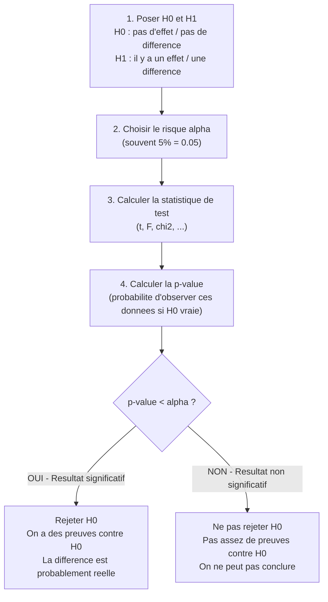
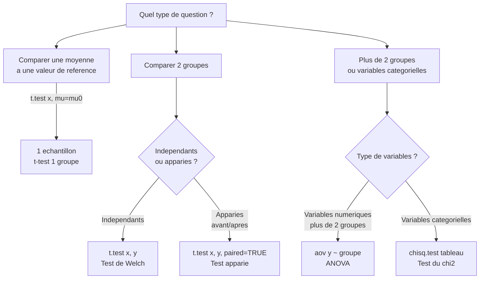

# Chapitre 2 — Tests statistiques

> **Idée centrale en une phrase :** Un test statistique permet de décider si une différence observée est réelle ou simplement due au hasard.

**Prérequis :** [Estimation →](01_estimation.md)
**Chapitre suivant :** [Régression linéaire simple →](03_regression_simple.md)

---

## 1. L'analogie du tribunal

Pour comprendre les tests statistiques, imaginons un **tribunal**. Cette analogie est très utile car elle illustre parfaitement la logique que suivent tous les tests.

### L'accusé et les hypothèses

Dans un procès, il y a une règle fondamentale : **la présomption d'innocence**. L'accusé est considéré comme innocent tant qu'on n'a pas prouvé sa culpabilité. En statistique, c'est exactement la même chose :

- **H0 (hypothèse nulle)** = "L'accusé est innocent"
  - C'est l'hypothèse par défaut, le statu quo.
  - En statistique, H0 affirme qu'il n'y a **pas d'effet**, **pas de différence**, **rien de spécial**.
  - Exemples : "Le médicament ne fait rien", "Les deux groupes ont la même moyenne", "Le dé est équilibré".

- **H1 (hypothèse alternative)** = "L'accusé est coupable"
  - C'est ce qu'on cherche à démontrer, l'hypothèse qu'on suspecte être vraie.
  - H1 affirme qu'il **y a un effet**, **une différence**, **quelque chose de spécial**.
  - Exemples : "Le médicament est efficace", "Les deux groupes ont des moyennes différentes", "Le dé est truqué".

### La charge de la preuve

Au tribunal, c'est au procureur de **prouver la culpabilité**, pas à l'accusé de prouver son innocence. De la même façon, en statistique :

- On **cherche des preuves contre H0** (on ne prouve pas H1 directement).
- Les "preuves" sont nos **données**. Si les données sont très incompatibles avec H0, on a de bonnes raisons de rejeter H0.
- Si les données sont compatibles avec H0, on ne peut pas conclure que H0 est vraie — on dit simplement qu'on n'a pas assez de preuves pour la rejeter.

### La p-value : la force des preuves

La **p-value** répond à la question suivante :

> **"Si H0 était vraie (si l'accusé était innocent), quelle est la probabilité d'observer des données aussi extrêmes que celles que nous avons ?"**

Concrètement :
- **Si la p-value est très petite** (par exemple 0.001) → les données sont très peu compatibles avec H0 → c'est comme si des preuves accablantes avaient été trouvées → **on rejette H0**.
- **Si la p-value est grande** (par exemple 0.40) → les données sont tout à fait compatibles avec H0 → c'est comme s'il n'y avait pas assez de preuves → **on ne peut pas rejeter H0**.

### Le seuil α : combien de risque accepte-t-on ?

Au tribunal, il faut un niveau de preuve suffisant pour condamner. En statistique, on fixe un **seuil de signification α** (alpha) :

- **α = 5% = 0.05** est le seuil le plus courant.
- Cela signifie qu'on **accepte de se tromper 1 fois sur 20** en rejetant H0 à tort.
- Si la p-value < α → on rejette H0 (le résultat est dit "statistiquement significatif").
- Si la p-value ≥ α → on ne rejette pas H0 (le résultat est dit "non significatif").

Pourquoi 5% ? C'est une convention historique. Dans certains domaines (physique des particules), on utilise des seuils beaucoup plus stricts (5σ ≈ 0.00003%). En médecine, on utilise parfois 1%.

### La démarche complète en un diagramme



---

## 2. Vocabulaire essentiel

### H0 et H1 : formuler ses hypothèses

La formulation correcte des hypothèses est **la première étape** de tout test. H0 est toujours l'hypothèse "ennuyeuse" (rien ne se passe), H1 est l'hypothèse "intéressante" (quelque chose se passe).

**Exemples concrets de formulations :**

| Situation | H0 (hypothèse nulle) | H1 (hypothèse alternative) |
|-----------|----------------------|---------------------------|
| La moyenne des notes est-elle 12 ? | H0 : μ = 12 | H1 : μ ≠ 12 |
| Le médicament a-t-il un effet ? | H0 : μ_traitement = μ_placebo | H1 : μ_traitement ≠ μ_placebo |
| Le dé est-il équilibré ? | H0 : chaque face a une proba de 1/6 | H1 : au moins une face a une proba différente |
| Les filles réussissent-elles mieux ? | H0 : μ_filles = μ_garçons | H1 : μ_filles > μ_garçons |

**Attention** au sens du test :
- **Test bilatéral** (≠) : on teste si c'est différent, dans n'importe quel sens.
- **Test unilatéral** (> ou <) : on teste dans un seul sens (plus grand OU plus petit).

### Les deux types d'erreurs

Comme au tribunal, on peut se tromper de deux façons différentes :

| | **H0 est vraie** (innocence réelle) | **H0 est fausse** (culpabilité réelle) |
|---|---|---|
| **On rejette H0** (on condamne) | ❌ **Erreur de type I** (faux positif) — "Condamner un innocent" — Probabilité = α | ✅ Décision correcte (puissance = 1−β) |
| **On ne rejette pas H0** (on acquitte) | ✅ Décision correcte | ❌ **Erreur de type II** (faux négatif) — "Acquitter un coupable" — Probabilité = β |

Explications détaillées :

- **α (alpha) = risque de 1ère espèce** : c'est la probabilité de rejeter H0 alors qu'elle est vraie. On le **contrôle directement** en fixant le seuil (généralement 5%). C'est la probabilité de crier "Eurêka !" alors qu'il n'y a rien.

- **β (bêta) = risque de 2ème espèce** : c'est la probabilité de ne pas rejeter H0 alors qu'elle est fausse. β **dépend** de la taille de l'échantillon (n), de la vraie différence (l'effet réel), et de la variabilité des données. C'est la probabilité de passer à côté d'un vrai effet.

- **Puissance = 1 − β** : c'est la probabilité de détecter une vraie différence quand elle existe. Plus la puissance est grande, mieux c'est. On vise généralement une puissance de 80% ou plus.

**Comment augmenter la puissance ?**
- Augmenter la taille de l'échantillon (n)
- Augmenter le seuil α (mais on augmente le risque d'erreur de type I)
- Étudier un effet plus grand (pas toujours possible)
- Réduire la variabilité des mesures

### La p-value : ce qu'elle est et ce qu'elle n'est pas

La p-value est probablement le concept le plus **mal compris** en statistique. Prenons le temps de bien la définir.

**Ce que la p-value EST :**

- ✅ La p-value est **P(données aussi extrêmes ou plus extrêmes | H0 vraie)**
- ✅ C'est la probabilité, **en supposant que H0 est vraie**, d'observer des données au moins aussi extrêmes que celles obtenues.
- ✅ C'est une mesure de la **compatibilité** entre les données et H0.
- ✅ Plus elle est petite, plus les données sont **incompatibles** avec H0.

**Ce que la p-value N'EST PAS :**

- ❌ **Ce n'est PAS P(H0 vraie | données)** — la probabilité que H0 soit vraie sachant les données. C'est l'erreur la plus fréquente ! La p-value ne dit pas "il y a 3% de chances que H0 soit vraie".
- ❌ **Ce n'est PAS la probabilité de se tromper** en rejetant H0. Si on rejette H0, la probabilité de se tromper dépend aussi de la probabilité a priori de H0.
- ❌ **Ce n'est PAS une mesure de l'importance de l'effet**. Un effet minuscule peut donner une p-value très petite si l'échantillon est très grand. Un effet énorme peut donner une p-value grande si l'échantillon est très petit.


*Sur ce graphique, la p-value correspond à l'aire sous la courbe au-delà de la statistique de test observée. Plus cette aire est petite, plus nos données sont extrêmes sous H0.*

---

## 3. Test de Student sur une moyenne (t-test à 1 échantillon)

### Quand l'utiliser ?

On veut tester si la **moyenne d'une population** est égale à une valeur donnée μ₀. On dispose d'un échantillon et on se demande : "Est-ce que la moyenne de cet échantillon est suffisamment éloignée de μ₀ pour qu'on puisse conclure que la vraie moyenne est différente ?"

**Exemples :**
- "La moyenne de la promo est-elle bien 12 ?" → H0 : μ = 12
- "Le poids moyen des paquets est-il bien 500g ?" → H0 : μ = 500
- "Le temps moyen de trajet est-il de 30 minutes ?" → H0 : μ = 30

### Statistique de test

La statistique de test mesure **à quel point** notre moyenne observée s'éloigne de μ₀ :

```
T = (x̄ - μ₀) / (s / √n)
```

Où :
- **x̄** = moyenne observée de l'échantillon
- **μ₀** = valeur de référence (celle de H0)
- **s** = écart-type de l'échantillon
- **n** = taille de l'échantillon
- **s / √n** = erreur standard de la moyenne

**Interprétation intuitive :** T est le nombre d'erreurs-standard dont notre moyenne observée s'éloigne de μ₀. Si T est proche de 0, notre moyenne est compatible avec μ₀. Si T est grand (en valeur absolue), notre moyenne est loin de μ₀.

**Sous H0 : T suit une loi de Student à (n−1) degrés de liberté.**

### Exemple complet en R

```r
# ── Exemple : les notes de la promo sont-elles vraiment à 12/20 ? ──
notes <- c(12, 15, 9, 17, 11, 14, 8, 16, 13, 10)

cat("Moyenne observée:", mean(notes), "\n")   # → 12.5
cat("Écart-type:", sd(notes), "\n")

# H0 : μ = 12   (la moyenne est 12)
# H1 : μ ≠ 12   (la moyenne est différente de 12) → test bilatéral
result <- t.test(notes, mu = 12)
print(result)

# Lecture du résultat :
# t = ... : valeur de la statistique de test
# df = 9  : degrés de liberté (n-1 = 10-1)
# p-value : si < 0.05 → on rejette H0
# 95% CI  : intervalle de confiance pour μ

# ── Test unilatéral : H1 : μ > 12 ──
t.test(notes, mu = 12, alternative = "greater")
# Utiliser "greater" si H1: μ > μ0, "less" si H1: μ < μ0

# ── Test unilatéral : H1 : μ < 12 ──
t.test(notes, mu = 12, alternative = "less")

# ── Visualiser la statistique de test ──
t_obs <- (mean(notes) - 12) / (sd(notes) / sqrt(length(notes)))
cat("t observé :", t_obs, "\n")
t_crit <- qt(0.975, df = length(notes) - 1)
cat("t critique (bilatéral 5%) :", t_crit, "\n")
cat("Décision : t_obs", ifelse(abs(t_obs) > t_crit, ">", "≤"),
    "t_crit →", ifelse(abs(t_obs) > t_crit, "rejeter H0", "ne pas rejeter H0"), "\n")
```

---

## 4. Comparaison de deux moyennes

### 4a — Deux groupes indépendants (test de Welch)

#### Quand l'utiliser ?

On veut comparer les moyennes de **deux groupes distincts** (les individus d'un groupe ne sont pas les mêmes que ceux de l'autre). Par exemple : hommes vs femmes, traitement vs placebo, groupe A vs groupe B.

**Hypothèses :**
- H0 : μ₁ = μ₂ (les deux groupes ont la même moyenne)
- H1 : μ₁ ≠ μ₂ (les deux groupes ont des moyennes différentes)

**Pourquoi Welch et pas Student classique ?** Le test de Welch est une version améliorée du t-test classique : il **ne suppose pas** que les deux groupes ont la même variance. C'est le test par défaut dans R avec `t.test()`, et c'est celui qu'il faut utiliser en pratique.

```r
# ── Exemple : comparer les notes de deux groupes de TD ──
groupe_A <- c(12, 15, 11, 14, 13, 16, 10, 15, 12, 14)
groupe_B <- c(14, 17, 16, 18, 15, 13, 17, 16, 15, 18)

# Visualiser d'abord (toujours regarder les données avant de tester !)
boxplot(groupe_A, groupe_B,
        names = c("Groupe A", "Groupe B"),
        col   = c("lightblue", "lightcoral"),
        main  = "Comparaison des deux groupes",
        ylab  = "Note")

# Test de Welch (ne suppose PAS l'égalité des variances)
result <- t.test(groupe_A, groupe_B)
print(result)

# ── Interpréter ──
cat("Moyenne groupe A:", mean(groupe_A), "\n")
cat("Moyenne groupe B:", mean(groupe_B), "\n")
cat("Différence observée:", mean(groupe_B) - mean(groupe_A), "\n")
cat("p-value:", result$p.value, "\n")
if (result$p.value < 0.05) {
  cat("→ Différence significative : les groupes sont différents\n")
} else {
  cat("→ Différence non significative : on ne peut pas conclure\n")
}
```

### 4b — Deux groupes appariés (test apparié)

#### Quand l'utiliser ?

On mesure les **mêmes individus** à deux moments différents (avant/après un traitement, début/fin de semestre) ou dans deux conditions différentes (bras gauche/bras droit). Chaque observation du premier groupe est **liée** à une observation du second groupe.

**Hypothèses :**
- H0 : μ_diff = 0 (pas de différence moyenne entre avant et après)
- H1 : μ_diff ≠ 0 (il y a une différence)

**Pourquoi un test apparié ?** En comparant chaque individu à lui-même, on élimine la variabilité inter-individuelle. C'est beaucoup plus puissant qu'un test sur groupes indépendants.

```r
# ── Exemple : évaluation d'une formation ──
# Mêmes étudiants testés avant et après une formation
avant <- c(10, 12, 9, 11, 13, 8, 14, 10, 12, 11)
apres <- c(12, 14, 12, 13, 15, 11, 16, 12, 14, 13)

# Visualiser l'évolution individuelle
plot(1:10, avant, type = "b", col = "blue", ylim = c(7, 17),
     main = "Évolution des notes avant/après formation",
     xlab = "Étudiant", ylab = "Note")
lines(1:10, apres, type = "b", col = "red")
legend("topleft", legend = c("Avant", "Après"), col = c("blue", "red"), lty = 1)

# Test apparié : H0 : pas d'amélioration
result <- t.test(avant, apres, paired = TRUE)
print(result)

# Équivalent : faire un t.test sur les différences
differences <- apres - avant
t.test(differences, mu = 0)
cat("Amélioration moyenne:", mean(differences), "points\n")
cat("Chaque étudiant a progressé de", mean(differences), "points en moyenne\n")
```

---

## 5. Test du Chi2 (χ²)

Le test du Chi2 (prononcer "ki-deux") est utilisé pour les **variables catégorielles** (non numériques). Il existe deux variantes principales.

### 5a — Test d'indépendance

#### Quand l'utiliser ?

On veut savoir si **deux variables catégorielles sont liées** entre elles, c'est-à-dire si la valeur de l'une influence la distribution de l'autre.

**Exemples :**
- "Le résultat à l'examen dépend-il du groupe de TD ?"
- "Le sexe influence-t-il le choix de la spécialité ?"
- "Y a-t-il un lien entre le tabagisme et le cancer ?"

**Hypothèses :**
- H0 : les deux variables sont **indépendantes** (pas de lien)
- H1 : les deux variables sont **dépendantes** (il y a un lien)

#### Formule de la statistique

```
χ² = Σᵢ Σⱼ (Oᵢⱼ - Eᵢⱼ)² / Eᵢⱼ
```

Où :
- **Oᵢⱼ** = effectif **observé** dans la case (i, j) du tableau
- **Eᵢⱼ** = effectif **attendu** sous H0 (si les variables étaient indépendantes)
- Eᵢⱼ = (total ligne i × total colonne j) / total général

**Interprétation :** Le χ² mesure l'écart global entre ce qu'on observe et ce qu'on attendrait si les variables étaient indépendantes. Plus le χ² est grand, plus les données s'éloignent de l'indépendance.

```r
# ── Exemple : le résultat dépend-il du groupe de TD ? ──
tableau <- matrix(
  c(20, 30,   # Groupe A : 20 réussis, 30 échoués
    25, 25,   # Groupe B : 25 réussis, 25 échoués
    15, 35),  # Groupe C : 15 réussis, 35 échoués
  nrow = 2,
  byrow = FALSE,
  dimnames = list(
    c("Réussi", "Échoué"),
    c("Groupe A", "Groupe B", "Groupe C")
  )
)

# Afficher le tableau de contingence
print(tableau)

# Visualiser les données
barplot(tableau, beside = TRUE, legend = TRUE,
        col = c("lightgreen", "salmon"),
        main = "Résultats par groupe de TD",
        xlab = "Groupe", ylab = "Effectif")

# Test du Chi2
result <- chisq.test(tableau)
print(result)
# H0 : résultat indépendant du groupe de TD
# Si p < 0.05 → dépendance significative

# Effectifs attendus sous H0 (si les variables étaient indépendantes)
cat("Effectifs attendus sous H0 :\n")
print(result$expected)

# Les résidus : quelles cases contribuent le plus à la dépendance ?
cat("Résidus standardisés :\n")
print(result$residuals)
# Un résidu > 2 ou < -2 indique une case qui contribue fortement
```

### 5b — Test de conformité (ajustement)

#### Quand l'utiliser ?

On veut savoir si une **distribution observée** correspond à une **distribution théorique** attendue.

**Exemples :**
- "Le dé est-il truqué ?" (distribution uniforme attendue)
- "Les naissances sont-elles réparties uniformément sur les jours de la semaine ?"
- "Les groupes sanguins suivent-ils la distribution connue de la population ?"

```r
# ── Exemple : le dé est-il truqué ? ──
# On lance un dé 60 fois et on compte les résultats
observes  <- c(8, 12, 9, 11, 10, 10)   # fréquences observées pour les faces 1 à 6
attendus  <- rep(10, 6)                  # fréquences attendues (60/6 = 10 pour chaque face)

# Afficher les données
names(observes) <- paste("Face", 1:6)
barplot(observes, col = "steelblue",
        main = "Résultats observés vs attendus",
        ylab = "Fréquence", ylim = c(0, 15))
abline(h = 10, col = "red", lty = 2, lwd = 2)  # ligne des effectifs attendus
legend("topright", legend = "Attendu (10)", col = "red", lty = 2)

# H0 : le dé est équilibré (chaque face a une proba 1/6)
result <- chisq.test(observes, p = rep(1/6, 6))
print(result)

# Si p > 0.05 → on ne rejette pas H0 → pas de preuve que le dé soit truqué
```

---

## 6. Choisir le bon test

Face à un problème, comment savoir quel test utiliser ? Voici un arbre de décision :



**Conseils pratiques :**
- Si vous comparez des **moyennes** → pensez au **t-test**.
- Si vous avez des **catégories** (oui/non, groupes, couleurs) → pensez au **Chi2**.
- Si vous avez **plus de 2 groupes** avec des données numériques → pensez à l'**ANOVA** (chapitre suivant).
- En cas de doute, demandez-vous : "Est-ce que mes données sont des nombres ou des catégories ?"

---

## 7. Hypothèses à vérifier avant un test

Chaque test statistique repose sur des **conditions d'application**. Si ces conditions ne sont pas remplies, les résultats du test ne sont pas fiables.

### Pour le t-test (1 échantillon et 2 groupes)

1. **Normalité des données** : les données doivent suivre approximativement une loi normale. Cependant, grâce au Théorème Central Limite (TCL), si **n ≥ 30**, cette condition est automatiquement satisfaite.

2. **Indépendance des observations** : chaque mesure doit être indépendante des autres. Par exemple, les notes de différents étudiants sont indépendantes, mais les notes d'un même étudiant à différents examens ne le sont pas.

### Pour le test de Welch

- Mêmes conditions que le t-test classique.
- **Avantage** : les variances des deux groupes **n'ont pas besoin d'être égales**. C'est pour cela que le test de Welch est préféré au t-test classique de Student.

### Pour le test du Chi2

- Les **effectifs attendus** doivent tous être **≥ 5**. Si ce n'est pas le cas, il faut regrouper des catégories ou utiliser le test exact de Fisher.

### Vérifier la normalité en R

```r
# ── Vérifier la normalité des données ──
notes <- c(12, 15, 9, 17, 11, 14, 8, 16, 13, 10)

# Test de Shapiro-Wilk : H0 = les données sont normalement distribuées
shapiro.test(notes)
# Si p > 0.05 → on ne rejette pas la normalité → OK pour le t-test
# Si p < 0.05 → les données ne semblent pas normales → attention !

# Visualisation QQ-plot
# Si les points suivent la droite rouge → les données sont normales
qqnorm(notes, main = "QQ-plot des notes")
qqline(notes, col = "red", lwd = 2)

# Histogramme avec courbe normale superposée
hist(notes, breaks = 5, freq = FALSE, col = "lightblue",
     main = "Distribution des notes", xlab = "Note")
curve(dnorm(x, mean = mean(notes), sd = sd(notes)),
      add = TRUE, col = "red", lwd = 2)
```

**Que faire si les données ne sont pas normales et n < 30 ?**
- Utiliser un **test non paramétrique** (qui ne suppose pas la normalité) :
  - Au lieu du t-test 1 échantillon → `wilcox.test(x, mu = μ₀)`
  - Au lieu du t-test 2 groupes → `wilcox.test(x, y)`
  - Au lieu du t-test apparié → `wilcox.test(x, y, paired = TRUE)`

---

## 8. Pièges classiques

Les tests statistiques sont souvent mal utilisés ou mal interprétés. Voici les erreurs les plus fréquentes :

### Piège 1 : "p > 0.05 signifie que H0 est vraie"

**FAUX.** On ne prouve **jamais** H0. "Pas de preuve d'un effet" n'est pas la même chose que "preuve qu'il n'y a pas d'effet". Si votre échantillon est trop petit, vous pouvez très bien ne pas détecter un vrai effet (erreur de type II).

> Analogie : ne pas trouver ses clés ne prouve pas qu'elles n'existent pas.

### Piège 2 : "La p-value est la probabilité de se tromper"

**FAUX.** La p-value est P(données | H0), c'est-à-dire la probabilité d'observer ces données **si H0 est vraie**. Ce n'est pas P(H0 | données), la probabilité que H0 soit vraie **sachant les données**. Ce sont deux choses très différentes (cf. théorème de Bayes).

### Piège 3 : Oublier le type de test (unilatéral vs bilatéral)

Un test **bilatéral** (H1 : μ ≠ μ₀) teste les deux directions. Un test **unilatéral** (H1 : μ > μ₀ ou H1 : μ < μ₀) teste une seule direction. La p-value d'un test unilatéral est la moitié de celle du test bilatéral. Choisir le mauvais type peut changer drastiquement vos conclusions.

**Règle :** n'utilisez un test unilatéral que si vous avez une raison **a priori** (avant de voir les données) de tester dans un seul sens.

### Piège 4 : Significatif ≠ Important

Avec un échantillon très grand (n = 10 000), même une différence **minuscule** (0.1 point) peut devenir statistiquement significative. "Significatif" signifie seulement "peu probable sous H0", pas "important en pratique". Toujours regarder aussi la **taille de l'effet** (la différence observée et l'intervalle de confiance).

### Piège 5 : Multiplier les tests sans correction

Si vous testez 20 hypothèses avec α = 5%, vous avez en moyenne **1 résultat faussement significatif** (20 × 0.05 = 1). C'est le problème des **comparaisons multiples**.

**Solution :** appliquer une correction, par exemple la **correction de Bonferroni** : diviser α par le nombre de tests effectués.

```r
# Exemple : 5 tests effectués, on veut un α global de 5%
alpha_corrige <- 0.05 / 5   # = 0.01
# On compare chaque p-value à 0.01 au lieu de 0.05

# Ou utiliser p.adjust() en R :
p_values <- c(0.03, 0.12, 0.001, 0.04, 0.08)
p_ajustees <- p.adjust(p_values, method = "bonferroni")
print(p_ajustees)
# Seules les p-values ajustées < 0.05 sont significatives
```

---

## 9. Récapitulatif

### Tableau de référence des tests

| Test | Quand l'utiliser | H0 | Fonction R | Hypothèses |
|------|-----------------|-----|------------|------------|
| t-test 1 groupe | Tester μ vs valeur de ref | μ = μ₀ | `t.test(x, mu=μ₀)` | normalité ou n≥30 |
| t-test 2 groupes indép. | Comparer 2 groupes distincts | μ₁ = μ₂ | `t.test(x, y)` | normalité ou n≥30 |
| t-test apparié | Avant/après (mêmes individus) | μ_diff = 0 | `t.test(x, y, paired=TRUE)` | normalité des différences |
| Chi2 indépendance | 2 variables catégorielles liées ? | indépendance | `chisq.test(tableau)` | effectifs ≥ 5 |
| Chi2 conformité | Distribution conforme au modèle ? | conformité | `chisq.test(obs, p=attendus)` | effectifs ≥ 5 |

### Les réflexes à avoir

1. **Toujours visualiser** les données avant de faire un test (boxplot, histogramme, nuage de points).
2. **Formuler H0 et H1** clairement avant de calculer quoi que ce soit.
3. **Vérifier les hypothèses** du test (normalité, indépendance, effectifs).
4. **Lire la p-value** et la comparer au seuil α.
5. **Regarder l'intervalle de confiance** pour apprécier la taille de l'effet.
6. **Ne jamais dire "H0 est vraie"** — on dit "on ne peut pas rejeter H0".
7. **Ne jamais confondre significativité statistique et importance pratique.**

---

## 10. Exercices du cours (TD2)

### Exercice 1 : Tests sur une loi normale

**Énoncé :** On dispose d'un échantillon de taille n=25 avec ∑xᵢ = 5.25 et ∑xᵢ² = 12. Le risque est α = 5%.

1. Tester H0 : {m = 0} contre H1 : {m ≠ 0} (bilatéral).
2. Tester H0 : {m ≤ 0} contre H1 : {m > 0} (unilatéral à droite).
3. Tester H0 : {σ² ≤ 1} contre H1 : {σ² > 1}.

**Solution détaillée :**

**Question 1 — Test bilatéral sur la moyenne :**

On calcule d'abord les statistiques descriptives :
- x̄ = ∑xᵢ / n = 5.25 / 25 = 0.21
- s² = (∑xᵢ² − n·x̄²) / (n−1) = (12 − 25 × 0.0441) / 24 = (12 − 1.1025) / 24 ≈ 0.454
- s ≈ 0.674

Statistique de test (variance inconnue, loi normale) :
```
T = x̄ / (s/√n) = 0.21 / (0.674/√25) = 0.21 / 0.1348 ≈ 1.558
```

Sous H0, T suit une loi de Student à n−1 = 24 degrés de liberté. La valeur critique pour un test bilatéral à 5% est t(0.975, 24) = 2.064.

|T| = 1.558 < 2.064 → **on ne rejette pas H0**. On n'a pas de preuve que la moyenne soit différente de 0.

**Question 2 — Test unilatéral à droite sur la moyenne :**

La statistique de test est la même : T = 1.558. Pour un test unilatéral à droite à 5%, la valeur critique est t(0.95, 24) = 1.711.

T = 1.558 < 1.711 → **on ne rejette pas H0**. On n'a pas de preuve que la moyenne soit strictement positive.

**Question 3 — Test sur la variance :**

On teste H0 : {σ² ≤ 1} contre H1 : {σ² > 1}. La statistique de test est :
```
χ² = (n−1)·s² / σ₀² = 24 × 0.454 / 1 = 10.9
```

Sous H0, cette statistique suit une loi du Chi2 à 24 degrés de liberté. Le quantile χ²(0.95, 24) = 36.415.

10.9 < 36.415 → **on ne rejette pas H0**. Pas de preuve que la variance dépasse 1.

**En R :**

```r
# Données
n <- 25
sum_x <- 5.25
sum_x2 <- 12

x_bar <- sum_x / n                          # 0.21
s2 <- (sum_x2 - n * x_bar^2) / (n - 1)     # ≈ 0.454
s <- sqrt(s2)                                # ≈ 0.674

# Q1 : Test bilatéral H0: m=0
T_obs <- x_bar / (s / sqrt(n))
p_bilat <- 2 * (1 - pt(abs(T_obs), df = n - 1))
cat("T =", T_obs, "  p-value =", p_bilat, "\n")

# Q2 : Test unilatéral H0: m<=0 vs H1: m>0
p_unilat <- 1 - pt(T_obs, df = n - 1)
cat("T =", T_obs, "  p-value (unilatéral) =", p_unilat, "\n")

# Q3 : Test sur la variance H0: sigma²<=1 vs H1: sigma²>1
chi2_obs <- (n - 1) * s2 / 1
p_var <- 1 - pchisq(chi2_obs, df = n - 1)
cat("Chi2 =", chi2_obs, "  p-value =", p_var, "\n")
```

**Ce qu'il faut retenir :**
- Quand la variance est inconnue, on utilise la loi de Student (et non la loi normale).
- Un test unilatéral est plus puissant dans une direction, mais ne détecte rien dans l'autre.
- Le test sur la variance utilise la statistique du Chi2, pas celle de Student.

---

### Exercice 2 : Loi exponentielle

**Énoncé :** On observe n=250 valeurs d'une loi exponentielle E(θ) avec x̄ = 0.6. Tester H0 : {θ = 0.5} contre H1 : {θ ≠ 0.5}.

**Solution détaillée :**

Pour X ~ E(θ), on a E[X] = 1/θ. Sous H0 avec θ₀ = 0.5, on attend E[X] = 1/0.5 = 2.

Par le Théorème Central Limite, √n·(X̄ₙ − 1/θ₀) / (1/θ₀) converge vers N(0,1).

La statistique de test est :
```
T = √n · (X̄ − 1/θ₀) / (1/θ₀) = √250 · (0.6 − 2) / 2 = 15.81 × (−0.7) ≈ −11.07
```

|T| = 11.07 est extrêmement grand. La p-value ≈ 0 → **on rejette H0**.

Alternative avec l'EMV : θ̂ = 1/X̄ = 1/0.6 ≈ 1.667, très loin de θ₀ = 0.5.

**En R :**

```r
n <- 250
x_bar <- 0.6
theta0 <- 0.5

# Statistique de test par TCL
T_obs <- sqrt(n) * (x_bar - 1/theta0) / (1/theta0)
p_value <- 2 * pnorm(-abs(T_obs))
cat("T =", T_obs, "  p-value =", p_value, "\n")

# EMV
theta_hat <- 1 / x_bar
cat("EMV de theta :", theta_hat, "\n")
```

**Ce qu'il faut retenir :**
- Le TCL permet de construire un test même quand la loi exacte de la statistique de test est inconnue, à condition que n soit grand.
- Pour une loi exponentielle, E[X] = 1/θ : tester θ revient à tester la moyenne.

---

### Exercice 3 : Comparaison de disques durs (deux échantillons)

**Énoncé :** On compare la durée de vie de deux types de disques durs.
- Type A : 232, 228, 237, 225, 214, 213, 205, 233, 219, 236 (nA = 10)
- Type B : 222, 234, 244, 235, 229, 260, 232, 224 (nB = 8)

Tester si les durées de vie moyennes sont différentes.

**Solution détaillée :**

Calcul des statistiques :
- x̄A = (232+228+237+225+214+213+205+233+219+236)/10 = 224.2
- s̃²A ≈ 116.4
- x̄B = (222+234+244+235+229+260+232+224)/8 = 235.0
- s̃²B ≈ 143.7

Test de Welch (on ne suppose pas l'égalité des variances) :
- H0 : mA = mB
- H1 : mA ≠ mB

```
T = (x̄A − x̄B) / √(s̃²A/nA + s̃²B/nB)
```

Les degrés de liberté sont approximés par la formule de Welch-Satterthwaite.

**En R :**

```r
A <- c(232, 228, 237, 225, 214, 213, 205, 233, 219, 236)
B <- c(222, 234, 244, 235, 229, 260, 232, 224)

cat("Moyenne A :", mean(A), "  Variance A :", var(A), "\n")
cat("Moyenne B :", mean(B), "  Variance B :", var(B), "\n")

# Test de Welch (par défaut dans R)
result <- t.test(A, B)
print(result)

# Visualisation
boxplot(A, B, names = c("Type A", "Type B"),
        col = c("lightblue", "lightcoral"),
        main = "Durée de vie des disques durs",
        ylab = "Durée de vie")
```

**Ce qu'il faut retenir :**
- Le test de Welch est le test par défaut pour comparer deux moyennes indépendantes en R.
- Il ne suppose pas l'égalité des variances (contrairement au t-test classique de Student avec `var.equal = TRUE`).
- Toujours visualiser avec un boxplot avant de conclure.

---

### Exercice 4 : Audit (test de proportion)

**Énoncé :** Un audit porte sur n=235 dossiers. On trouve k=29 dossiers non conformes. Tester H0 : {p ≤ 0.08} contre H1 : {p > 0.08} au seuil 5%.

**Solution détaillée :**

On estime la proportion : p̂ = 29/235 ≈ 0.1234.

La statistique de test (test de proportion par approximation normale) est :
```
Z = (p̂ − p₀) / √(p₀(1−p₀)/n) = (0.1234 − 0.08) / √(0.08 × 0.92 / 235)
  = 0.0434 / √(0.0003132) = 0.0434 / 0.0177 ≈ 2.45
```

Pour un test unilatéral à droite au seuil 5%, la valeur critique est z(0.95) = 1.645.

Z = 2.45 > 1.645 → **on rejette H0**. La proportion de dossiers non conformes est significativement supérieure à 8%. Avis défavorable.

**En R :**

```r
# Test de proportion
prop.test(29, 235, p = 0.08, alternative = "greater")

# Calcul manuel
n <- 235
k <- 29
p0 <- 0.08
p_hat <- k / n

Z <- (p_hat - p0) / sqrt(p0 * (1 - p0) / n)
p_value <- 1 - pnorm(Z)
cat("p̂ =", p_hat, "  Z =", Z, "  p-value =", p_value, "\n")
```

**Ce qu'il faut retenir :**
- Le test de proportion utilise l'approximation normale (valable si np₀ ≥ 5 et n(1−p₀) ≥ 5).
- `prop.test()` en R applique par défaut une correction de continuité.
- Un test unilatéral est adapté quand la question est directionnelle (ici : "y a-t-il trop de non-conformes ?").

---

### Exercice 5 : QCM — Choix de statistique et région de rejet

**Énoncé :** Questions conceptuelles sur le choix de la bonne statistique de test, la forme de la région de rejet, et le test du Chi2 sur la variance.

**Solution détaillée :**

Points clés à retenir :

1. **Choix de la statistique de test :**
   - Moyenne avec variance connue → statistique Z (loi normale)
   - Moyenne avec variance inconnue → statistique T (loi de Student)
   - Variance → statistique χ² (loi du Chi2)
   - Comparaison de variances → statistique F (loi de Fisher)

2. **Forme de la région de rejet :**
   - Test bilatéral (H1 : θ ≠ θ₀) → rejet si |T| > valeur critique (deux queues)
   - Test unilatéral à droite (H1 : θ > θ₀) → rejet si T > valeur critique (queue droite)
   - Test unilatéral à gauche (H1 : θ < θ₀) → rejet si T < valeur critique (queue gauche)

3. **Test du Chi2 sur la variance :**
   - H0 : σ² = σ₀² → statistique (n−1)s²/σ₀² suit un χ²(n−1)
   - Le test sur la variance est toujours unilatéral à droite pour H1 : σ² > σ₀²

**Ce qu'il faut retenir :**
- La nature du paramètre testé (moyenne, variance, proportion) détermine la loi de la statistique de test.
- La forme de H1 (≠, >, <) détermine la forme de la région de rejet.

---

### Exercice 6 : Nombre de pannes (Poisson)

**Énoncé :** On observe n=100 machines avec ∑Xᵢ = 115 pannes. X ~ P(θ). Tester H0 : {θ = 1} contre H1 : {θ ≠ 1} au seuil 5%.

**Solution détaillée :**

X̄ = ∑Xᵢ / n = 115 / 100 = 1.15.

Pour une loi de Poisson P(θ), E[X] = Var(X) = θ. Par le TCL :
```
Z = √n · (X̄ − θ₀) / √θ₀ = √100 · (1.15 − 1) / √1 = 10 × 0.15 = 1.5
```

Test bilatéral : p-value = 2 × P(Z > 1.5) = 2 × 0.0668 ≈ 0.134.

p-value = 0.134 > 0.05 → **on ne rejette pas H0**. Pas de preuve que le nombre moyen de pannes diffère de 1.

**En R :**

```r
n <- 100
sum_x <- 115
theta0 <- 1

x_bar <- sum_x / n
Z <- sqrt(n) * (x_bar - theta0) / sqrt(theta0)
p_value <- 2 * (1 - pnorm(abs(Z)))
cat("X̄ =", x_bar, "  Z =", Z, "  p-value =", p_value, "\n")
# p-value ≈ 0.134 > 0.05 → ne pas rejeter H0
```

**Ce qu'il faut retenir :**
- Pour une loi de Poisson, la variance est égale à la moyenne : Var(X) = θ.
- On utilise cette propriété dans la statistique de test : l'écart-type sous H0 est √θ₀.
- Le TCL s'applique dès que n est assez grand (ici n=100, largement suffisant).

---

### Exercice 7 : Gonflage d'airbags

**Énoncé :**
- Dispositif A : 27, 28, 38, 32, 30, 28, 27, 30, 29, 31 (nA = 10)
- Le cahier des charges impose que le temps moyen de gonflage soit inférieur à 32 ms.

1. Tester si le dispositif A est conforme (H0 : mA ≥ 32 vs H1 : mA < 32).
2. On mesure aussi le dispositif B : 25, 22, 29, 26, 26, 31, 30, 27 (nB = 8).
   a) Tester l'égalité des variances (test F de Fisher).
   b) Comparer les moyennes des deux dispositifs.

**Solution détaillée :**

**Question 1 — Conformité du dispositif A :**

- x̄A = (27+28+38+32+30+28+27+30+29+31)/10 = 300/10 = 30
- s̃²A = Σ(xᵢ − x̄)² / (n−1) ≈ 10.22
- s̃A ≈ 3.20

Test unilatéral à gauche :
```
T = (x̄A − 32) / (s̃A/√nA) = (30 − 32) / (3.20/√10) = −2 / 1.012 ≈ −1.977
```

Valeur critique : t(0.05, 9) = −1.833.

T = −1.977 < −1.833 → **on rejette H0**. Le temps moyen de gonflage est significativement inférieur à 32 ms. Le dispositif A est conforme.

**Question 2a — Test F d'égalité des variances :**

- s̃²A ≈ 10.22, s̃²B ≈ 9.43
- F = s̃²A / s̃²B = 10.22 / 9.43 ≈ 1.084

On compare à F(0.975, 9, 7) et F(0.025, 9, 7). La valeur de F est très proche de 1, donc **on ne rejette pas l'égalité des variances**.

**Question 2b — Comparaison des moyennes :**

- x̄A = 30, x̄B = 27
- Puisque les variances sont considérées égales, on peut utiliser le t-test classique (pooled).
- On teste H0 : mA = mB contre H1 : mA ≠ mB (ou H1 : mB < mA selon la question).

**En R :**

```r
A <- c(27, 28, 38, 32, 30, 28, 27, 30, 29, 31)
B <- c(25, 22, 29, 26, 26, 31, 30, 27)

# Q1 : Conformité du dispositif A
cat("Moyenne A :", mean(A), "  Écart-type A :", sd(A), "\n")
t.test(A, mu = 32, alternative = "less")

# Q2a : Test F d'égalité des variances
var.test(A, B)

# Q2b : Comparaison des moyennes (variances égales)
t.test(A, B, var.equal = TRUE)

# Ou test de Welch (variances inégales, plus robuste)
t.test(A, B)

# Visualisation
boxplot(A, B, names = c("Dispositif A", "Dispositif B"),
        col = c("lightblue", "lightcoral"),
        main = "Temps de gonflage des airbags (ms)",
        ylab = "Temps (ms)")
abline(h = 32, col = "red", lty = 2)
legend("topright", "Seuil = 32 ms", col = "red", lty = 2)
```

**Ce qu'il faut retenir :**
- Le test F (`var.test()`) compare les variances de deux groupes. Si on ne rejette pas, on peut utiliser `var.equal = TRUE` dans `t.test()`.
- Pour un test de conformité à un cahier des charges, on formule H0 comme l'hypothèse "non conforme" et H1 comme "conforme". Rejeter H0 signifie que le produit est conforme.
- En pratique, le test de Welch est plus robuste et peut être préféré même si les variances semblent égales.

---

## Exemples du cours

Les exemples ci-dessous sont directement issus du cours (Chapitre 2 -- Tests statistiques).

### Problemes de decision et consequences des erreurs

**Enonce (cours, p.3-4) :**
Dans de nombreux domaines, on est amene a prendre des decisions dans un contexte incertain. Le cours presente quatre situations concretes et les consequences d'une mauvaise decision :

**Informatique :**
- On conclut a tort que le systeme n'est pas fiable → depenses inutiles, parts de marche perdues
- On decide a tort que le logiciel est fiable → clientele insatisfaite, degradation de l'image de marque

**Finance :**
- On lance a tort l'operation → risque de perdre beaucoup d'argent
- On ne lance pas a tort → risque de se priver d'un benefice important

**Sante :**
- On vaccine a tort → cout des vaccins non utilises
- On ne vaccine pas a tort → risque de pandemie a large echelle

**Justice :**
- On peut condamner un innocent ou acquitter un coupable

**Lecon :** En general, une des erreurs est plus grave que l'autre. C'est ce qui guide le choix de H0 : on place en H0 l'hypothese dont le rejet a tort (erreur de type I) est la plus grave, et on controle ce risque au niveau α.

---

### Demarche systematique d'un test statistique

**Enonce (cours, p.11) :**
Le cours presente la procedure en 7 etapes :

1. Formuler les hypotheses H0 et H1
2. Fixer le niveau α (typiquement 1%, 5% ou 10%)
3. Choisir une statistique de test T de loi connue sous H0
4. Determiner la region critique R telle que P(T ∈ R | H0) = α
5. Calculer t0 a partir de l'echantillon
6. Regle de decision : conserver H0 si t0 ∉ R, rejeter H0 si t0 ∈ R
7. Conclure

**Alternative par la p-valeur (cours, p.14) :**
1. Formuler H0 et H1
2. Fixer le niveau α
3. Choisir la statistique de test T
4. Calculer t0
5. Calculer la p-valeur α_c associee a t0
6. Decision : conserver H0 si α_c > α, rejeter H0 si α_c ≤ α
7. Conclure

**En R :**

```r
# Illustration de la p-valeur pour un test bilateral
# sous H0 : T ~ N(0,1)
t0 <- 2.3
p_value_bilat <- 2 * (1 - pnorm(abs(t0)))
cat("t0 =", t0, "\n")
cat("p-valeur bilaterale :", round(p_value_bilat, 4), "\n")
cat("Decision au seuil 5% :", ifelse(p_value_bilat < 0.05, "Rejet de H0", "On conserve H0"), "\n")

# Visualisation graphique
curve(dnorm(x), from = -4, to = 4, ylab = "Densite", main = "p-valeur bilaterale")
x_left <- seq(-4, -abs(t0), length = 100)
x_right <- seq(abs(t0), 4, length = 100)
polygon(c(x_left, rev(x_left)), c(dnorm(x_left), rep(0, 100)), col = "lightblue")
polygon(c(x_right, rev(x_right)), c(dnorm(x_right), rep(0, 100)), col = "lightblue")
abline(v = c(-t0, t0), col = "red", lty = 2)
legend("topright", paste("p-valeur =", round(p_value_bilat, 4)), bty = "n")
```

---

### Test sur la moyenne d'un echantillon gaussien (σ² connue)

**Enonce (cours, p.20) :**
Soient X_1, ..., X_n i.i.d. de loi N(m, σ²) avec σ² connue.

**Test bilateral :** H0 : m = m0 vs H1 : m ≠ m0

Statistique de test sous H0 :

```
T0 = √n · (X̄_n - m0) / σ  ~  N(0, 1)
```

Region de rejet : R = ]-∞, -z_{1-α/2}[ ∪ ]z_{1-α/2}, +∞[

**En R :**

```r
# Exemple : test sur la moyenne avec variance connue
n <- 25
x_bar <- 52.3
sigma <- 5
m0 <- 50
alpha <- 0.05

t0 <- sqrt(n) * (x_bar - m0) / sigma
z_crit <- qnorm(1 - alpha/2)

cat("Statistique t0 :", round(t0, 4), "\n")
cat("Valeur critique z :", round(z_crit, 4), "\n")
cat("Decision :", ifelse(abs(t0) > z_crit, "Rejet de H0", "On conserve H0"), "\n")

# p-valeur
p_val <- 2 * (1 - pnorm(abs(t0)))
cat("p-valeur :", round(p_val, 4), "\n")
```

---

### Test sur la moyenne d'un echantillon gaussien (σ² inconnue)

**Enonce (cours, p.21) :**
Soient X_1, ..., X_n i.i.d. de loi N(m, σ²) avec σ² inconnue.

Statistique de test sous H0 : m = m0 :

```
T0 = √n · (X̄_n - m0) / S̃_n  ~  T_{n-1}    (loi de Student)
```

**En R :**

```r
# Test t de Student (variance inconnue)
set.seed(42)
x <- rnorm(15, mean = 102, sd = 8)
m0 <- 100

# Test bilateral
t.test(x, mu = m0, alternative = "two.sided")

# Test unilateral : H0: m <= m0 vs H1: m > m0
t.test(x, mu = m0, alternative = "greater")
```

---

### Test sur la variance d'un echantillon gaussien (m inconnue)

**Enonce (cours, p.23) :**
Soient X_1, ..., X_n i.i.d. de loi N(m, σ²) avec m inconnue.

Statistique de test sous H0 : σ² = σ²_0 :

```
T0 = (n-1) · S̃²_n / σ²_0  ~  χ²_{n-1}
```

Region de rejet pour le test bilateral :
```
R = ]0, χ²_{n-1; α/2}[ ∪ ]χ²_{n-1; 1-α/2}, +∞[
```

**En R :**

```r
# Test du chi-deux sur la variance
x <- c(23.1, 25.3, 22.8, 24.7, 23.5, 26.1, 22.0, 24.2, 25.8, 23.9)
sigma2_0 <- 4  # Variance supposee sous H0
n <- length(x)
alpha <- 0.05

T0 <- (n - 1) * var(x) / sigma2_0
chi2_low <- qchisq(alpha/2, df = n - 1)
chi2_up <- qchisq(1 - alpha/2, df = n - 1)

cat("T0 :", round(T0, 4), "\n")
cat("Region de rejet : ]0,", round(chi2_low, 4), "[ U ]", round(chi2_up, 4), ", +inf[\n")
cat("Decision :", ifelse(T0 < chi2_low | T0 > chi2_up, "Rejet de H0", "On conserve H0"), "\n")

# p-valeur
p_val <- 2 * min(pchisq(T0, df = n-1), 1 - pchisq(T0, df = n-1))
cat("p-valeur :", round(p_val, 4), "\n")
```

---

### Test de Fisher : comparaison de deux variances

**Enonce (cours, p.29-30) :**
On considere deux echantillons gaussiens independants de tailles n1 et n2. On souhaite tester :

H0 : σ²_X = σ²_Y  vs  H1 : σ²_X ≠ σ²_Y

Statistique de test sous H0 :

```
T0 = S̃²_X / S̃²_Y  ~  F_{n1-1, n2-1}
```

En pratique, on place la plus grande variance au numerateur.

**En R :**

```r
# Test de Fisher
set.seed(42)
x <- rnorm(20, mean = 50, sd = 5)
y <- rnorm(25, mean = 48, sd = 7)

var.test(x, y)
```

---

### Test de Student : comparaison de deux moyennes (variances egales)

**Enonce (cours, p.31-32) :**
On considere deux echantillons gaussiens independants avec σ²_X = σ²_Y.

Statistique de test sous H0 : m_X = m_Y :

```
T0 = √(n1 + n2 - 2) · (X̄ - Ȳ) / (√(1/n1 + 1/n2) · √((n1-1)S̃²_X + (n2-1)S̃²_Y))  ~  T_{n1+n2-2}
```

**En R :**

```r
# Test de comparaison de moyennes
set.seed(42)
x <- rnorm(20, mean = 50, sd = 5)
y <- rnorm(25, mean = 48, sd = 5)

# D'abord tester l'egalite des variances
var.test(x, y)

# Puis comparer les moyennes (variances egales)
t.test(x, y, var.equal = TRUE)
```

---

### Test asymptotique de comparaison de moyennes (variances inegales)

**Enonce (cours, p.33) :**
Quand les variances sont inegales, on utilise le test de Welch. Sous H0 : m_X = m_Y :

```
T0 = (X̄ - Ȳ) / √(S̃²_X/n1 + S̃²_Y/n2)  → N(0, 1)  (pour n1, n2 grands)
```

**En R :**

```r
# Test de Welch (par defaut dans R)
set.seed(42)
x <- rnorm(20, mean = 50, sd = 5)
y <- rnorm(25, mean = 48, sd = 8)

t.test(x, y)  # Welch par defaut (var.equal = FALSE)
```

---

*Chapitre suivant : [Régression linéaire simple →](03_regression_simple.md)*
