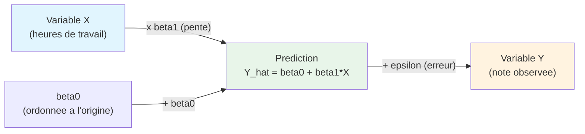
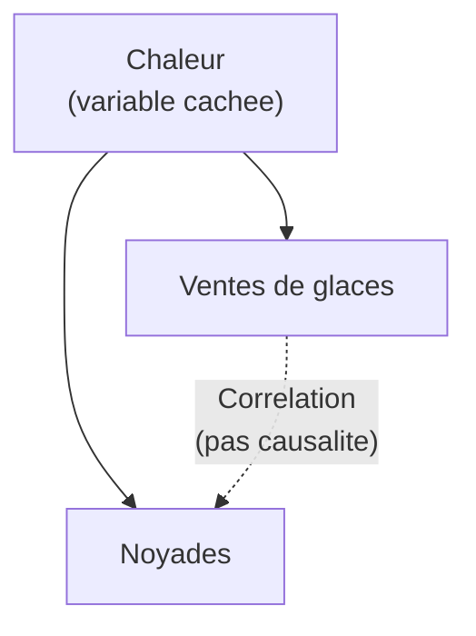
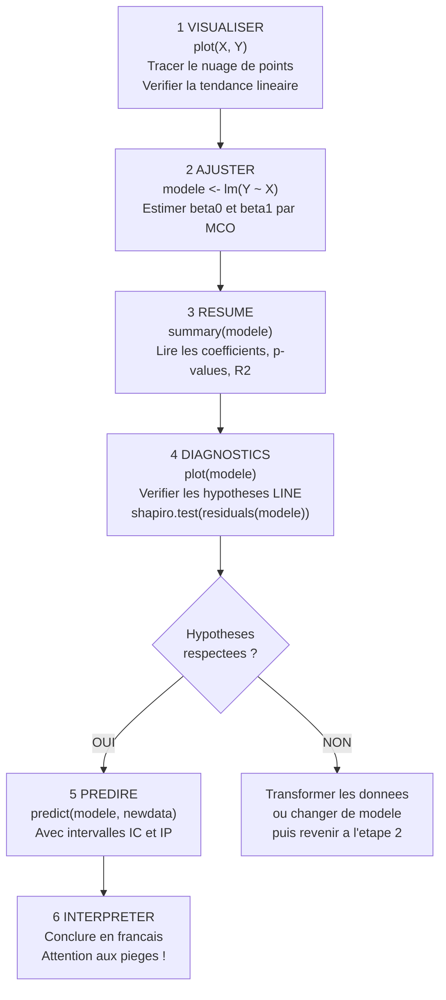

# Chapitre 3 — Régression linéaire simple

> **Idée centrale :** Trouver la "meilleure droite" qui permet de prédire une variable Y à partir d'une variable X.

**Prérequis :** [Tests statistiques](02_tests_statistiques.md)  
**Chapitre suivant :** [Régression multiple →](04_regression_multiple.md)

---

## 1. L'analogie : prédire ta note à partir des heures de travail

### Pourquoi une droite ?

Imaginons qu'on veuille **prédire la note d'un étudiant** à un examen à partir du **nombre d'heures qu'il a révisé**. On demande à 15 étudiants combien d'heures ils ont travaillé, et on note leur résultat à l'examen.

Si on dessine un nuage de points avec les heures en abscisse (axe horizontal) et la note en ordonnée (axe vertical), on observe généralement une **tendance** : plus on travaille, plus la note est haute. Les points ne sont pas parfaitement alignés (la vie est compliquée !), mais ils suivent globalement une direction.

La **régression linéaire simple**, c'est trouver **LA droite** qui résume le mieux cette tendance — la droite qui passe "au milieu" du nuage de points de la façon la plus juste possible.


*Sur cette image, chaque point est une observation (un étudiant). La droite rouge est la droite de régression : elle résume la tendance générale du nuage.*

### Pourquoi c'est utile ?

Une fois qu'on a cette droite, on peut :

- **Prédire** : "Si un étudiant travaille 8 heures, quelle note peut-il espérer ?"
- **Quantifier la relation** : "Combien de points gagne-t-on en moyenne par heure de travail supplémentaire ?"
- **Évaluer la force du lien** : "Les heures de travail expliquent-elles bien les différences de notes, ou est-ce que d'autres facteurs (talent, stress, sommeil) comptent autant ?"

> **Analogie de la boussole :** La droite de régression est comme une boussole qui donne la direction générale du nuage de points. Elle ne prédit pas exactement chaque point (il y a toujours du bruit), mais elle indique la tendance.

---

## 2. Le modèle : Y = β0 + β1·X + ε

### L'équation fondamentale

Le modèle de régression linéaire simple s'écrit :

```
Y = β0 + β1·X + ε
```

C'est **l'équation la plus importante** de ce chapitre. Chaque terme a un rôle bien précis. Prenons le temps de les détailler un par un.

### Explication de chaque terme

| Terme | Nom | Rôle | Analogie |
|-------|-----|------|----------|
| **Y** | Variable réponse (ou dépendante) | C'est ce qu'on veut **prédire** ou **expliquer** | La note à l'examen |
| **X** | Variable explicative (ou indépendante) | C'est ce qu'on utilise **pour prédire** Y | Les heures de travail |
| **β0** (bêta zéro) | Ordonnée à l'origine (intercept) | La valeur de Y quand X = 0 | "Si tu ne travailles pas du tout (0 heures), ta note serait β0" |
| **β1** (bêta un) | Pente de la droite (slope) | L'effet de X sur Y : quand X augmente de 1 unité, Y change de β1 unités | "Chaque heure de travail en plus te rapporte β1 points" |
| **ε** (epsilon) | Terme d'erreur (résidu) | Tout ce que le modèle **ne capture pas** : le hasard, les facteurs non mesurés | Le talent, le stress, la chance au sujet de l'examen... |

### β0 : l'ordonnée à l'origine

β0 est le point où la droite **coupe l'axe vertical** (l'axe des Y). C'est la valeur prédite de Y quand X vaut exactement 0.

**Attention :** l'interprétation de β0 n'a pas toujours de sens concret ! Si X représente la taille d'un adulte (jamais 0), alors β0 correspond à "le poids d'un adulte de taille 0 cm", ce qui est absurde. Dans ces cas, β0 est un artefact mathématique nécessaire au modèle, mais on ne l'interprète pas littéralement.

### β1 : la pente

β1 est **le coefficient le plus important**. Il mesure l'effet de X sur Y.

- **β1 > 0** : la droite monte → quand X augmente, Y augmente aussi (relation positive). Exemple : plus on travaille, plus la note est haute.
- **β1 < 0** : la droite descend → quand X augmente, Y diminue (relation négative). Exemple : plus on boit d'alcool, plus le temps de réaction augmente.
- **β1 = 0** : la droite est plate → X n'a aucun effet sur Y. La connaissance de X ne permet pas de mieux prédire Y.

**Interprétation :** "Quand X augmente de 1 unité, Y augmente **en moyenne** de β1 unités."

### ε : le terme d'erreur

ε représente tout ce que le modèle ne peut pas expliquer. C'est la **différence entre la valeur réelle** de Y et la **valeur prédite** par la droite.

Pour un étudiant donné :
- S'il est **au-dessus** de la droite → ε > 0 (il a fait mieux que prévu)
- S'il est **en dessous** de la droite → ε < 0 (il a fait moins bien que prévu)
- S'il est **exactement sur** la droite → ε = 0 (la prédiction est parfaite)

On suppose que ces erreurs suivent certaines règles (voir section 6 sur les hypothèses LINE).

### Schéma du modèle



**Lecture du schéma :**

1. On prend la valeur de **X** (par exemple 5 heures de travail).
2. On la multiplie par **β1** (par exemple 1.5 points par heure) et on ajoute **β0** (par exemple 4 points de base).
3. On obtient la **prédiction** Ŷ = 4 + 1.5 × 5 = 11.5.
4. La **note réelle** Y de cet étudiant est Ŷ + ε. Si ε = +0.5, sa note réelle est 12.

### Exemple numérique

Supposons que le modèle estimé soit : **Note = 4 + 1.5 × Heures**

| Heures (X) | Prédiction (Ŷ) | Calcul |
|-------------|-----------------|--------|
| 0 | 4.0 | 4 + 1.5 × 0 |
| 2 | 7.0 | 4 + 1.5 × 2 |
| 5 | 11.5 | 4 + 1.5 × 5 |
| 8 | 16.0 | 4 + 1.5 × 8 |
| 10 | 19.0 | 4 + 1.5 × 10 |

**Interprétation :**
- β0 = 4 : "Un étudiant qui ne travaille pas du tout aurait en moyenne 4/20."
- β1 = 1.5 : "Chaque heure de travail supplémentaire rapporte en moyenne 1.5 points."

---

## 3. Méthode des Moindres Carrés Ordinaires (MCO)

### L'intuition : minimiser les "erreurs"

On a un nuage de points et on veut tracer LA meilleure droite. Mais qu'est-ce qu'une "bonne" droite ? C'est une droite qui passe **le plus près possible** de tous les points.

Pour mesurer "le plus près possible", on utilise les **distances verticales** entre chaque point et la droite. Ces distances sont les **résidus** (les ε̂).

Pourquoi les distances **verticales** et pas perpendiculaires ? Parce qu'on veut minimiser l'erreur de **prédiction de Y**. Or on prédit Y verticalement (pour une valeur de X donnée, on lit Y sur la droite).

### Le principe des MCO

La méthode des MCO consiste à trouver les valeurs de β0 et β1 qui **minimisent la somme des carrés des résidus** :

```
Minimiser : S(β0, β1) = Σᵢ (yᵢ - β0 - β1·xᵢ)²
```

**Explication mot à mot :**

| Terme | Signification |
|-------|---------------|
| `yᵢ` | La valeur réelle (observée) de Y pour l'observation i |
| `β0 + β1·xᵢ` | La valeur prédite par la droite pour l'observation i |
| `yᵢ - β0 - β1·xᵢ` | Le résidu = l'erreur de prédiction pour l'observation i |
| `(...)²` | On met au carré pour que les erreurs positives et négatives comptent autant, et pour "punir" davantage les grosses erreurs |
| `Σᵢ` | On fait la somme sur toutes les observations |

> **Analogie :** Imagine que tu plantes un piquet (la droite) au milieu d'un champ, et que chaque point du nuage est relié au piquet par un élastique vertical. La position du piquet qui **minimise la tension totale des élastiques** (la somme des carrés des distances), c'est la position MCO.

### Les formules des estimateurs

En résolvant le problème de minimisation (par dérivation et mise à zéro), on obtient les formules suivantes :

**Formule de la pente β̂1 :**

```
β̂1 = Cov(X, Y) / Var(X)
```

Où :
- **Cov(X, Y)** = la covariance entre X et Y = `(1/(n-1)) · Σᵢ (xᵢ - x̄)(yᵢ - ȳ)`
- **Var(X)** = la variance de X = `(1/(n-1)) · Σᵢ (xᵢ - x̄)²`

**Interprétation intuitive de β̂1 :** La covariance mesure "comment X et Y bougent ensemble". La variance de X mesure "comment X bouge seul". Le rapport des deux donne "combien Y bouge quand X bouge de 1 unité".

**Formule de l'ordonnée à l'origine β̂0 :**

```
β̂0 = ȳ - β̂1 · x̄
```

**Interprétation :** β̂0 est calculé de sorte que la droite passe **exactement** par le point moyen (x̄, ȳ) du nuage. C'est une propriété fondamentale de la droite de régression.

### Exemple complet en R

```r
# ── Données : heures de travail et notes ────────────────────
heures <- c(2, 3, 4, 5, 5, 6, 7, 8, 8, 9, 10, 11, 12, 13, 14)
notes  <- c(5, 6, 7, 8, 9, 9, 10, 12, 11, 13, 14, 14, 16, 17, 18)

# ── Étape 1 : Visualiser le nuage de points ─────────────────
plot(heures, notes,
     main = "Notes en fonction des heures de travail",
     xlab = "Heures de travail",
     ylab = "Note (/20)",
     pch  = 19,         # points ronds pleins
     col  = "steelblue",
     cex  = 1.5)        # taille des points
# Observation : les points semblent suivre une tendance linéaire croissante

# ── Étape 2 : Ajuster le modèle de régression ───────────────
modele <- lm(notes ~ heures)
# lm() = "linear model" (modèle linéaire)
# notes ~ heures se lit : "notes EN FONCTION DE heures"
# R cherche automatiquement β0 et β1 par MCO

# ── Étape 3 : Afficher les coefficients ─────────────────────
print(modele)
# Intercept = β̂0 (ordonnée à l'origine)
# heures   = β̂1 (pente)

cat("β̂0 (intercept) =", coef(modele)[1], "\n")
cat("β̂1 (pente)     =", coef(modele)[2], "\n")
cat("Équation : Note =", round(coef(modele)[1], 2),
    "+", round(coef(modele)[2], 2), "× Heures\n")

# ── Étape 4 : Tracer la droite de régression ────────────────
plot(heures, notes,
     main = "Régression : Notes ~ Heures",
     xlab = "Heures de travail",
     ylab = "Note (/20)",
     pch  = 19, col = "steelblue", cex = 1.5)
abline(modele, col = "red", lwd = 2)
# abline() trace la droite de régression en rouge sur le graphique

# Ajouter l'équation sur le graphique
legend("topleft",
       legend = paste("Ŷ =", round(coef(modele)[1], 2),
                      "+", round(coef(modele)[2], 2), "× X"),
       col = "red", lwd = 2, bty = "n")

# ── Vérification manuelle des formules ──────────────────────
# Calcul de β̂1 = Cov(X,Y) / Var(X)
cov_xy  <- cov(heures, notes)    # covariance
var_x   <- var(heures)           # variance de X
beta1_m <- cov_xy / var_x        # pente calculée manuellement
cat("Cov(X,Y) =", cov_xy, "\n")
cat("Var(X)   =", var_x, "\n")
cat("β̂1 manuel =", beta1_m, "\n")

# Calcul de β̂0 = ȳ - β̂1 · x̄
beta0_m <- mean(notes) - beta1_m * mean(heures)
cat("β̂0 manuel =", beta0_m, "\n")
# Les valeurs manuelles doivent être identiques à celles de lm()
```

**Sortie attendue (approximative) :**
```
β̂0 (intercept) = 1.87
β̂1 (pente)     = 1.14
Équation : Note = 1.87 + 1.14 × Heures
```

**Interprétation :**
- β̂0 ≈ 1.87 : un étudiant qui ne travaille pas du tout aurait en moyenne environ 2/20.
- β̂1 ≈ 1.14 : chaque heure de travail supplémentaire rapporte en moyenne **1.14 points**.

---

## 4. Interpréter `summary(modele)` ligne par ligne

### Le résumé complet

`summary()` est la fonction la plus utile pour analyser un modèle de régression en R. Elle affiche énormément d'informations. Prenons le temps de **tout** décortiquer.

```r
# ── Afficher le résumé complet du modèle ─────────────────────
resume <- summary(modele)
print(resume)
```

**Sortie typique (approximative avec nos données) :**

```
Call:
lm(formula = notes ~ heures)

Residuals:
     Min       1Q   Median       3Q      Max
 -1.1523  -0.5809  -0.0095   0.4762   1.4191

Coefficients:
             Estimate Std. Error t value Pr(>|t|)
(Intercept)   1.8714     0.6483   2.887  0.01262 *
heures        1.1381     0.0747  15.236  3.18e-09 ***
---
Signif. codes:  0 '***' 0.001 '**' 0.01 '*' 0.05 '.' 0.1 ' ' 1

Residual standard error: 0.7874 on 13 degrees of freedom
Multiple R-squared:  0.9469,    Adjusted R-squared:  0.9428
F-statistic: 232.1 on 1 and 13 DF,  p-value: 3.18e-09
```

### Décryptage de chaque partie

#### Partie 1 : `Call`

```
Call:
lm(formula = notes ~ heures)
```

C'est simplement le rappel de la commande que vous avez tapée. R vous confirme quel modèle a été ajusté.

#### Partie 2 : `Residuals`

```
Residuals:
     Min       1Q   Median       3Q      Max
 -1.1523  -0.5809  -0.0095   0.4762   1.4191
```

C'est un résumé des **résidus** (les écarts entre les vraies valeurs et les prédictions). Les 5 nombres sont : minimum, 1er quartile, médiane, 3ème quartile, maximum.

**Ce qu'on veut voir :** La médiane doit être proche de 0, et les valeurs doivent être à peu près symétriques (Min et Max de magnitude similaire, 1Q et 3Q de magnitude similaire). Si c'est le cas, les résidus sont bien centrés et symétriques — c'est bon signe.

#### Partie 3 : `Coefficients` (LE tableau le plus important)

```
Coefficients:
             Estimate Std. Error t value Pr(>|t|)
(Intercept)   1.8714     0.6483   2.887  0.01262 *
heures        1.1381     0.0747  15.236  3.18e-09 ***
```

Chaque ligne correspond à un coefficient du modèle. Décortiquons **chaque colonne** :

| Colonne | Signification | Détail |
|---------|---------------|--------|
| `Estimate` | La **valeur estimée** du coefficient | β̂0 = 1.87 et β̂1 = 1.14 |
| `Std. Error` | L'**erreur standard** du coefficient | C'est la précision de l'estimation. Plus c'est petit, plus l'estimation est précise |
| `t value` | La **statistique de test** t = Estimate / Std.Error | C'est le test H0 : "ce coefficient vaut 0" vs H1 : "ce coefficient est non nul" |
| `Pr(>|t|)` | La **p-value** du test | Si p < 0.05, le coefficient est significativement différent de 0 |

**Les codes de signification (les étoiles) :**

| Code | Signification | Seuil |
|------|---------------|-------|
| `***` | Très hautement significatif | p < 0.001 |
| `**` | Hautement significatif | p < 0.01 |
| `*` | Significatif | p < 0.05 |
| `.` | Tendanciellement significatif | p < 0.1 |
| ` ` (rien) | Non significatif | p ≥ 0.1 |

**Dans notre exemple :**
- `heures` a `***` → la pente est **très significative** → il y a bien un lien entre les heures de travail et la note.
- `(Intercept)` a `*` → l'ordonnée à l'origine est significativement différente de 0.

> **Question clé :** "Est-ce que la variable X a un effet sur Y ?" → Regarder la p-value de la ligne correspondant à X. Si p < 0.05, OUI, l'effet est significatif.

#### Partie 4 : `Residual standard error`

```
Residual standard error: 0.7874 on 13 degrees of freedom
```

- **0.7874** : c'est l'estimation de σ, l'écart-type des résidus. C'est une mesure de la **précision typique** des prédictions. Ici, nos prédictions sont en moyenne à ±0.79 points de la réalité.
- **13 degrees of freedom** : 15 observations − 2 paramètres estimés (β0 et β1) = 13 degrés de liberté.

#### Partie 5 : `R-squared` et `Adjusted R-squared`

```
Multiple R-squared:  0.9469,    Adjusted R-squared:  0.9428
```

Le **R²** (coefficient de détermination) est **la mesure phare** de la qualité du modèle. On le détaille dans la section suivante. Ici, R² = 0.947 signifie que le modèle explique 94.7% de la variabilité des notes.

Le **R² ajusté** corrige le R² pour le nombre de variables explicatives. En régression simple (1 seule variable X), les deux sont quasi identiques. Il devient important en régression multiple.

#### Partie 6 : `F-statistic`

```
F-statistic: 232.1 on 1 and 13 DF,  p-value: 3.18e-09
```

Le test F teste si le modèle dans son ensemble est significatif :
- **H0 :** le modèle n'explique rien (β1 = 0)
- **H1 :** le modèle explique quelque chose (β1 ≠ 0)

En régression simple, la p-value du test F est **identique** à celle du test t sur β1 (car il n'y a qu'une seule variable). Ici, p = 3.18e-09 est extrêmement petite → le modèle est très significatif.

### Extraire chaque composant en R

```r
# ── Extraire les éléments du résumé ──────────────────────────
resume <- summary(modele)

# Coefficients
cat("β̂0 =", coef(modele)[1], "\n")          # intercept
cat("β̂1 =", coef(modele)[2], "\n")          # pente

# Erreurs standards
cat("SE(β̂0) =", resume$coefficients[1, 2], "\n")
cat("SE(β̂1) =", resume$coefficients[2, 2], "\n")

# Valeurs t
cat("t(β̂0) =", resume$coefficients[1, 3], "\n")
cat("t(β̂1) =", resume$coefficients[2, 3], "\n")

# P-values
cat("p-value(β̂0) =", resume$coefficients[1, 4], "\n")
cat("p-value(β̂1) =", resume$coefficients[2, 4], "\n")

# R² et R² ajusté
cat("R²         =", resume$r.squared, "\n")
cat("R² ajusté  =", resume$adj.r.squared, "\n")

# Statistique F et sa p-value
cat("F-statistic =", resume$fstatistic[1], "\n")
# P-value du test F global
f_pvalue <- pf(resume$fstatistic[1],
               resume$fstatistic[2],
               resume$fstatistic[3],
               lower.tail = FALSE)
cat("p-value (F) =", f_pvalue, "\n")

# Résidu standard (estimation de sigma)
cat("Sigma (RSE) =", resume$sigma, "\n")

# Intervalles de confiance à 95% pour les coefficients
cat("\nIntervalles de confiance (95%) :\n")
print(confint(modele, level = 0.95))
```

---

## 5. R² : le coefficient de détermination

### La formule

Le R² mesure **quelle proportion de la variabilité de Y est expliquée par le modèle**. Sa formule est :

```
R² = 1 - SCR / SCT
```

Où :
- **SCR** (Somme des Carrés des Résidus) = `Σᵢ (yᵢ - ŷᵢ)²` = la variabilité **non expliquée** par le modèle
- **SCT** (Somme des Carrés Totale) = `Σᵢ (yᵢ - ȳ)²` = la variabilité **totale** de Y

On peut aussi écrire :

```
R² = SCE / SCT
```

Où **SCE** (Somme des Carrés Expliqués) = `Σᵢ (ŷᵢ - ȳ)²` = la variabilité expliquée par le modèle.

Et on a la décomposition fondamentale : **SCT = SCE + SCR** (variabilité totale = expliquée + non expliquée).

### Interprétation

Le R² est toujours compris entre 0 et 1 :

| R² | Interprétation | Signification |
|----|----------------|---------------|
| 0 | Le modèle n'explique **rien** | X ne donne aucune information sur Y. La droite est plate, les prédictions ne sont pas meilleures que la moyenne ȳ |
| 0.3 | Le modèle explique 30% | X explique une partie de Y, mais d'autres facteurs non mesurés comptent beaucoup |
| 0.7 | Le modèle explique 70% | Le lien est assez fort, X est un bon prédicteur de Y |
| 0.95 | Le modèle explique 95% | Lien très fort, presque toute la variation de Y est capturée par X |
| 1 | Le modèle explique **tout** | Tous les points sont exactement sur la droite. Cela n'arrive quasiment jamais avec des données réelles |

> **Analogie de la tarte :** Imagine la variabilité totale de Y comme une tarte. Le R² indique quelle part de la tarte est "mangée" (expliquée) par le modèle. La part restante (1 − R²) représente tout ce qu'on n'a pas capturé : le hasard, les autres variables non mesurées, etc.

### Lien avec le coefficient de corrélation

En régression linéaire simple, il existe une relation directe entre R² et le **coefficient de corrélation r de Pearson** :

```
R² = r²
```

Si r = 0.9 (forte corrélation positive), alors R² = 0.81 → le modèle explique 81% de la variabilité.

### Calcul en R

```r
# ── Calculer R² de plusieurs manières ────────────────────────
resume <- summary(modele)

# Méthode 1 : directement depuis summary()
cat("R² =", resume$r.squared, "\n")

# Méthode 2 : depuis le coefficient de corrélation
r <- cor(heures, notes)
cat("r (corrélation) =", r, "\n")
cat("R² = r² =", r^2, "\n")

# Méthode 3 : calcul manuel avec SCR et SCT
predictions <- fitted(modele)         # ŷ = valeurs prédites par le modèle
residus     <- residuals(modele)      # ε̂ = yᵢ - ŷᵢ

SCT <- sum((notes - mean(notes))^2)   # variabilité totale
SCR <- sum(residus^2)                 # variabilité non expliquée
SCE <- sum((predictions - mean(notes))^2)  # variabilité expliquée

cat("SCT =", SCT, "\n")
cat("SCE =", SCE, "(expliquée)\n")
cat("SCR =", SCR, "(résiduelle)\n")
cat("SCE + SCR =", SCE + SCR, "(doit être ≈ SCT)\n")
cat("R² = 1 - SCR/SCT =", 1 - SCR/SCT, "\n")
cat("R² = SCE/SCT     =", SCE/SCT, "\n")
```

### Attention : corrélation ≠ causalité

Ce piège est **si important** qu'il mérite sa propre sous-section.

Un R² élevé (ou une corrélation forte) signifie que X et Y **varient ensemble**. Cela **ne prouve pas** que X **cause** Y.

**L'exemple classique des glaces et des noyades :**

Il existe une forte corrélation positive entre les ventes de glaces et le nombre de noyades. Faut-il interdire les glaces pour sauver des vies ? Évidemment non ! La vraie raison est une **variable cachée** : la chaleur. Quand il fait chaud, les gens achètent plus de glaces ET se baignent plus (d'où plus de noyades).



**Autres exemples absurdes de corrélation sans causalité :**
- Le nombre de films avec Nicolas Cage est corrélé au nombre de noyades en piscine.
- La consommation de fromage est corrélée au nombre de morts par étranglement dans les draps.

> **Règle d'or :** La corrélation est une condition **nécessaire** mais **pas suffisante** pour la causalité. Pour établir une causalité, il faut un **protocole expérimental contrôlé** (essai randomisé), pas une simple observation de corrélation.

---

## 6. Les hypothèses LINE

Le modèle de régression linéaire repose sur **quatre hypothèses fondamentales** qui doivent être vérifiées pour que les résultats soient fiables. L'acronyme **LINE** permet de les retenir facilement.

### L — Linéarité

**La relation entre X et Y doit être linéaire** (une droite, pas une courbe).

Si la vraie relation est courbe (par exemple Y = X²), ajuster une droite n'a pas de sens : le modèle sera systématiquement faux.

**Comment vérifier ?** Tracer le nuage de points X vs Y. Si les points forment une courbe, une parabole ou un U, la relation n'est pas linéaire.

### I — Indépendance

**Les résidus doivent être indépendants les uns des autres.**

Cela signifie que l'erreur d'une observation ne doit pas influencer l'erreur d'une autre. Cette hypothèse est souvent violée avec des **données temporelles** : si une erreur est positive un jour, elle tend à être positive le lendemain aussi (autocorrélation).

**Comment vérifier ?** En pratique, c'est surtout une question de design expérimental. Si vos données sont des mesures sur des individus différents et indépendants, c'est généralement OK. Pour des séries temporelles, on utilise le test de Durbin-Watson.

### N — Normalité

**Les résidus doivent suivre une loi normale.**

Cela ne signifie pas que X ou Y doivent être normaux ! Ce sont les **résidus** (les erreurs ε) qui doivent être normalement distribués.

**Comment vérifier ?** Le QQ-plot (graphique quantile-quantile) des résidus et le test de Shapiro-Wilk.

### E — Égalité des variances (homoscédasticité)

**La dispersion des résidus doit être constante** quel que soit le niveau de X.

Si la dispersion des points autour de la droite augmente (forme d'"éventail" ou de "cône"), on parle d'**hétéroscédasticité** et les tests ne sont plus fiables.

**Exemple :** Si les notes des étudiants qui travaillent peu varient beaucoup (de 2 à 10) mais celles des étudiants qui travaillent beaucoup varient peu (de 15 à 18), il y a hétéroscédasticité.

### Vérification graphique en R

La fonction `plot()` appliquée à un modèle de régression produit automatiquement **4 graphiques de diagnostic** extrêmement utiles :

```r
# ── Les 4 graphiques de diagnostic ──────────────────────────
par(mfrow = c(2, 2))   # Disposer 4 graphiques en grille 2×2
plot(modele)
par(mfrow = c(1, 1))   # Revenir à un seul graphique
```

**Graphique 1 : Residuals vs Fitted** (résidus en fonction des valeurs prédites)

- **Axe X** : les valeurs prédites (ŷ)
- **Axe Y** : les résidus (yᵢ − ŷᵢ)
- **Ce qu'on veut voir** : un nuage de points **aléatoire**, sans structure, centré autour de 0. La ligne rouge lissée doit être à peu près horizontale.
- **Problème si** : on voit une courbe (= la relation n'est pas linéaire), un éventail (= hétéroscédasticité), ou un motif quelconque.

**Graphique 2 : Normal Q-Q** (QQ-plot des résidus)

- **Axe X** : les quantiles théoriques de la loi normale
- **Axe Y** : les quantiles des résidus standardisés
- **Ce qu'on veut voir** : les points doivent être **alignés sur la diagonale** en pointillés.
- **Problème si** : les points s'éloignent de la droite aux extrémités (queues lourdes) ou forment un S (asymétrie).

**Graphique 3 : Scale-Location** (racine carrée des résidus standardisés)

- **Ce qu'on veut voir** : un nuage horizontal, sans tendance. La ligne rouge doit être à peu près plate.
- **Problème si** : la ligne rouge monte ou descend → les résidus ne sont pas homoscédastiques (l'hypothèse E est violée).

**Graphique 4 : Residuals vs Leverage** (résidus vs influence)

- Identifie les **points influents** : les observations qui ont un effet disproportionné sur la droite de régression.
- Les lignes en pointillés indiquent les **distances de Cook**. Un point au-delà de ces lignes est potentiellement influent.
- **Ce qu'on veut voir** : tous les points à l'intérieur des lignes de Cook.
- **Problème si** : un ou plusieurs points sont en dehors → ils tirent la droite vers eux de façon excessive.

### Vérification statistique de la normalité

```r
# ── Test de Shapiro-Wilk sur les résidus ────────────────────
# H0 : les résidus suivent une loi normale
# H1 : les résidus ne suivent PAS une loi normale
shapiro.test(residuals(modele))

# Si p > 0.05 → on ne rejette pas H0 → normalité OK
# Si p < 0.05 → normalité douteuse → attention aux tests

# ── QQ-plot manuel pour mieux visualiser ─────────────────────
qqnorm(residuals(modele),
       main = "QQ-plot des résidus",
       pch = 19, col = "steelblue")
qqline(residuals(modele), col = "red", lwd = 2)
```

### Que faire si une hypothèse est violée ?

| Hypothèse violée | Symptôme | Solution possible |
|-------------------|----------|-------------------|
| **L** (Linéarité) | Courbe dans le graphique résidus vs fitted | Transformer X (log, racine), ajouter un terme X², utiliser une régression non linéaire |
| **I** (Indépendance) | Motif temporel dans les résidus | Modèle de série temporelle, ajouter un effet temporel |
| **N** (Normalité) | Points éloignés de la diagonale du QQ-plot | Transformer Y (log), augmenter n (TCL), utiliser des méthodes robustes |
| **E** (Égalité des variances) | Éventail dans le graphique résidus vs fitted | Transformer Y (log), régression pondérée (WLS), erreurs standards robustes |

---

## 7. Prédiction

### Les trois types de prédiction

Une fois le modèle ajusté, on peut l'utiliser pour **prédire** la valeur de Y pour de nouvelles valeurs de X. R propose trois types de prédiction avec la fonction `predict()`.

#### Type 1 : Prédiction ponctuelle

C'est simplement la valeur Ŷ calculée avec l'équation de la droite. Pas d'intervalle, juste un nombre.

#### Type 2 : Intervalle de confiance (IC)

L'intervalle de confiance donne une fourchette pour la **moyenne de Y** à un niveau donné de X. Il répond à la question :

> "Quelle est la note **moyenne** de **tous** les étudiants qui travaillent 7 heures ?"

C'est un intervalle autour de la **valeur attendue** E(Y|X=7).

#### Type 3 : Intervalle de prédiction (IP)

L'intervalle de prédiction donne une fourchette pour la valeur de Y d'**un individu donné**. Il répond à la question :

> "Quelle sera la note d'**un** étudiant particulier qui travaille 7 heures ?"

### Pourquoi l'IP est toujours plus large que l'IC ?

C'est une question fréquente et importante.

- L'**IC** ne prend en compte que l'**incertitude sur la position de la droite** (on ne connaît pas parfaitement β0 et β1).
- L'**IP** prend en compte cette même incertitude **plus** la **variabilité individuelle** (le ε de chaque individu). Même si on connaissait parfaitement la droite, les individus ne tombent pas exactement dessus.

> **Analogie :** L'IC est comme prédire la **température moyenne** de demain à Paris. L'IP est comme prédire la **température exacte** qu'il fera chez toi. La moyenne est plus facile à prédire que la valeur individuelle.

### Code R complet

```r
# ── Prédiction pour de nouvelles valeurs de X ────────────────
nouvelles_heures <- data.frame(heures = c(5, 7, 10, 15))

# Prédiction ponctuelle
pred_point <- predict(modele, newdata = nouvelles_heures)
cat("Prédictions ponctuelles :\n")
print(data.frame(heures = nouvelles_heures$heures, note_predite = pred_point))

# Intervalle de confiance (pour la MOYENNE de Y)
pred_ic <- predict(modele, newdata = nouvelles_heures,
                   interval = "confidence", level = 0.95)
cat("\nIntervalles de confiance (moyenne de Y) :\n")
print(cbind(nouvelles_heures, pred_ic))
# "fit" = prédiction, "lwr" = borne basse, "upr" = borne haute

# Intervalle de prédiction (pour un INDIVIDU)
pred_ip <- predict(modele, newdata = nouvelles_heures,
                   interval = "prediction", level = 0.95)
cat("\nIntervalles de prédiction (individu) :\n")
print(cbind(nouvelles_heures, pred_ip))

# ── Visualisation des bandes de confiance et prédiction ──────
# Créer une grille fine de valeurs X pour lisser les bandes
grille <- data.frame(heures = seq(min(heures), max(heures), length.out = 100))

# Calculer les bandes pour chaque X de la grille
bande_ic <- predict(modele, newdata = grille, interval = "confidence")
bande_ip <- predict(modele, newdata = grille, interval = "prediction")

# Tracer le graphique
plot(heures, notes,
     main = "Régression avec bandes de confiance et prédiction",
     xlab = "Heures de travail",
     ylab = "Note (/20)",
     pch  = 19, col = "steelblue", cex = 1.5,
     ylim = range(bande_ip))   # adapter l'échelle Y aux bandes

# Droite de régression
abline(modele, col = "red", lwd = 2)

# Bande de confiance (IC) en bleu clair
lines(grille$heures, bande_ic[, "lwr"], col = "blue", lty = 2, lwd = 1.5)
lines(grille$heures, bande_ic[, "upr"], col = "blue", lty = 2, lwd = 1.5)

# Bande de prédiction (IP) en gris
lines(grille$heures, bande_ip[, "lwr"], col = "gray50", lty = 3, lwd = 1.5)
lines(grille$heures, bande_ip[, "upr"], col = "gray50", lty = 3, lwd = 1.5)

# Légende
legend("topleft",
       legend = c("Droite de régression",
                  "IC 95% (moyenne)",
                  "IP 95% (individu)"),
       col = c("red", "blue", "gray50"),
       lty = c(1, 2, 3), lwd = c(2, 1.5, 1.5),
       bty = "n")
```

**Observation :** Les bandes de prédiction (gris) sont **toujours plus larges** que les bandes de confiance (bleu). Les deux bandes sont plus étroites au centre du nuage (près de x̄) et plus larges aux extrémités — c'est normal, on est plus précis "au milieu" de nos données.

---

## 8. Pièges classiques

### Piège 1 : L'extrapolation

L'extrapolation consiste à utiliser le modèle pour prédire Y **en dehors** de la plage des données observées.

**Exemple :** Si nos données couvrent des heures de travail entre 2 et 14, prédire la note pour 30 heures est une extrapolation. Le modèle donnerait Note = 1.87 + 1.14 × 30 = 36 points... sur 20 ! Absurde.

La relation linéaire est peut-être valable entre 2 et 14 heures, mais rien ne garantit qu'elle reste vraie au-delà. La note plafonne à 20, il y a des rendements décroissants (la 15ème heure de révision est moins utile que la 3ème), etc.

> **Règle :** Ne jamais prédire en dehors de la plage de X observée. Si vos X vont de 2 à 14, vos prédictions ne sont fiables qu'entre 2 et 14.

### Piège 2 : Corrélation ≠ Causalité

On l'a déjà abordé dans la section 5, mais c'est **si important** qu'on le répète.

Un R² élevé signifie que X et Y **varient ensemble**. Cela ne signifie **pas** que modifier X va modifier Y. Il peut y avoir :
- Une **variable confondante** (comme la chaleur pour glaces/noyades).
- Un **effet inverse** (Y cause X au lieu de X cause Y). Les étudiants qui ont de bonnes notes sont peut-être plus motivés, et donc travaillent plus — et non l'inverse.
- Un **pur hasard** (corrélation fallacieuse).

### Piège 3 : Ignorer les hypothèses du modèle

Ajuster un modèle linéaire est **très facile** en R (`lm()` tient en une ligne). Mais si les hypothèses LINE ne sont pas vérifiées :
- Les **p-values** peuvent être fausses.
- Les **intervalles de confiance** peuvent être trompeurs.
- Les **prédictions** peuvent être systématiquement biaisées.

> **Règle :** Toujours examiner les 4 graphiques de diagnostic (`plot(modele)`) **avant** d'interpréter les résultats.

### Piège 4 : Sur-interpréter le R²

- Un R² de 0.30 ne veut pas dire que le modèle est "mauvais". En sciences humaines, R² = 0.30 peut être excellent (car le comportement humain est très variable). En physique, R² = 0.95 peut être insuffisant.
- Un R² élevé ne garantit pas que le modèle est correct. Un modèle peut avoir un R² élevé et pourtant violer les hypothèses LINE.
- Le R² **augmente toujours** quand on ajoute des variables, même si elles sont inutiles. C'est pour cela qu'on utilise le R² ajusté en régression multiple.

### Piège 5 : Les points influents (leviers et outliers)

Un seul point aberrant peut **bouleverser** toute la droite de régression. Il y a deux types de points problématiques :

- **Outlier** (point aberrant) : une observation dont le résidu est très grand (le point est loin de la droite, verticalement).
- **Levier** (leverage) : une observation dont le X est très éloigné des autres X (le point est à l'écart horizontalement).

Un point qui est à la fois un outlier et un levier est **très influent** : il "tire" la droite vers lui.

```r
# ── Détecter les points influents ────────────────────────────
# Distance de Cook : mesure l'influence de chaque observation
cook <- cooks.distance(modele)
cat("Distances de Cook :\n")
print(round(cook, 4))

# Règle empirique : un point est influent si Cook > 4/n
seuil <- 4 / length(heures)
influents <- which(cook > seuil)
if (length(influents) > 0) {
  cat("Points influents (Cook > 4/n =", round(seuil, 3), ") :", influents, "\n")
} else {
  cat("Aucun point influent détecté.\n")
}

# Visualiser les distances de Cook
plot(cook, type = "h",
     main = "Distances de Cook",
     ylab = "Distance de Cook",
     xlab = "Numéro d'observation")
abline(h = seuil, col = "red", lty = 2)
```

### Piège 6 : Confondre la droite de régression Y~X et X~Y

La droite de régression de Y en fonction de X **n'est pas** la même que celle de X en fonction de Y. Ce sont deux droites différentes (sauf si R² = 1, auquel cas les deux coïncident).

- `lm(notes ~ heures)` prédit les notes à partir des heures.
- `lm(heures ~ notes)` prédit les heures à partir des notes.

Ces deux modèles donnent des coefficients différents ! Toujours bien réfléchir à ce qui est la variable réponse (Y, ce qu'on veut prédire) et ce qui est la variable explicative (X, ce qu'on utilise pour prédire).

### Piège 7 : Oublier de regarder les données

C'est le piège le plus basique mais le plus courant. **Toujours tracer un graphique avant d'ajuster un modèle.** Le célèbre **Quartet d'Anscombe** illustre parfaitement ce point : 4 jeux de données ont exactement les mêmes statistiques (moyenne, variance, corrélation, droite de régression, R²) mais des nuages de points complètement différents.

```r
# ── Le Quartet d'Anscombe : 4 datasets, mêmes stats ! ───────
data(anscombe)
par(mfrow = c(2, 2))
for (i in 1:4) {
  x <- anscombe[, i]
  y <- anscombe[, i + 4]
  plot(x, y, main = paste("Jeu", i),
       pch = 19, col = "steelblue",
       xlim = c(3, 20), ylim = c(3, 13))
  abline(lm(y ~ x), col = "red", lwd = 2)
}
par(mfrow = c(1, 1))
# Observation : les 4 ont R² ≈ 0.67, mais seul le jeu 1 est vraiment linéaire !
```

---

## 9. Récapitulatif

### Workflow en 6 étapes

Voici la marche à suivre systématique pour toute analyse de régression linéaire simple :



### Tableau récapitulatif des fonctions R

| Étape | Fonction R | Ce qu'elle fait | Exemple |
|-------|-----------|-----------------|---------|
| Visualiser | `plot(x, y)` | Nuage de points | `plot(heures, notes)` |
| Ajuster | `lm(y ~ x)` | Estimer le modèle par MCO | `modele <- lm(notes ~ heures)` |
| Résumé | `summary(modele)` | Coefficients, p-values, R² | `summary(modele)` |
| Coefficients | `coef(modele)` | Extraire β̂0 et β̂1 | `coef(modele)` |
| IC coefficients | `confint(modele)` | IC à 95% sur les coefficients | `confint(modele, level = 0.95)` |
| Droite | `abline(modele)` | Tracer la droite sur le graphique | `abline(modele, col = "red")` |
| Diagnostics | `plot(modele)` | Les 4 graphiques de diagnostic | `par(mfrow=c(2,2)); plot(modele)` |
| Normalité | `shapiro.test()` | Test de normalité des résidus | `shapiro.test(residuals(modele))` |
| Prédiction | `predict()` | Prédire Y pour de nouvelles valeurs de X | `predict(modele, newdata = ...)` |
| IC prédiction | `predict(..., interval = "confidence")` | Bande de confiance (moyenne) | Voir section 7 |
| IP prédiction | `predict(..., interval = "prediction")` | Bande de prédiction (individu) | Voir section 7 |
| Résidus | `residuals(modele)` | Extraire les résidus ε̂ | `residuals(modele)` |
| Valeurs prédites | `fitted(modele)` | Extraire les Ŷ | `fitted(modele)` |
| Influence | `cooks.distance(modele)` | Distances de Cook | `cooks.distance(modele)` |
| Corrélation | `cor(x, y)` | Coefficient r de Pearson | `cor(heures, notes)` |
| Covariance | `cov(x, y)` | Covariance de X et Y | `cov(heures, notes)` |

### Checklist avant de conclure

1. [ ] Ai-je **visualisé** le nuage de points ? La relation semble-t-elle linéaire ?
2. [ ] Le coefficient β1 est-il **significatif** ? (p-value < 0.05)
3. [ ] Le **R²** est-il raisonnable pour mon domaine ?
4. [ ] Les **diagnostics** sont-ils satisfaisants ? (résidus normaux, homoscédastiques, pas de structure)
5. [ ] Y a-t-il des **points influents** qui faussent le modèle ?
6. [ ] Mes **prédictions** sont-elles dans la plage des données observées ? (pas d'extrapolation)
7. [ ] Ai-je bien distingué **corrélation** et **causalité** ?
8. [ ] Ai-je choisi le bon **intervalle** ? (confiance pour la moyenne, prédiction pour un individu)

---

## Exemples du cours

Les exemples ci-dessous sont directement issus du cours (Chapitre 3 -- Regression lineaire simple).

### Exemple introductif : Geyser Old Faithful

**Enonce (cours, p.6-8) :**
Le geyser Old Faithful, situe dans le parc national de Yellowstone (USA), produit l'un des plus grands jets d'eau chaude et de vapeur au monde. On a releve deux variables quantitatives sur 272 eruptions :

- x : duree de l'eruption (en minutes)
- y : duree d'attente jusqu'a l'eruption suivante (en minutes)

**Objectif :** Expliquer la duree d'attente en fonction de la duree de l'eruption precedente.

Premieres observations du jeu de donnees :

| Duree de l'eruption | Duree d'attente |
|---|---|
| 3.600 | 79 |
| 1.800 | 54 |
| 3.333 | 74 |
| ... | ... |

Le nuage de points revele une relation lineaire : il est raisonnable de modeliser y = β0 + β1·x.

**En R :**

```r
# Chargement des donnees Old Faithful (disponible nativement dans R)
data(faithful)
head(faithful)
# eruptions : duree de l'eruption (min)
# waiting   : duree d'attente (min)

# Nuage de points
plot(faithful$waiting, faithful$eruptions,
     xlab = "Duree d'attente (min)",
     ylab = "Duree de l'eruption (min)",
     main = "Geyser Old Faithful (n = 272)",
     pch = 16, col = "steelblue")
```

---

### Coefficients de la regression : Old Faithful

**Resultats du cours (p.46) :**
La sortie R du modele de regression donne :

| | Estimate | Std. Error | t value | Pr(>\|t\|) |
|---|---|---|---|---|
| (Intercept) | -1.8740 | 0.1601 | -11.70 | 0.0000 |
| waiting | 0.0756 | 0.0022 | 34.09 | 0.0000 |

**Interpretation :**
- β̂0 = -1.874 : ordonnee a l'origine (valeur theorique de la duree d'eruption quand l'attente est 0)
- β̂1 = 0.0756 : pour chaque minute supplementaire d'attente, la duree d'eruption augmente en moyenne de 0.0756 minute (environ 4.5 secondes)
- Les deux coefficients sont **significativement differents de 0** (p-valeurs < 0.05)

**En R :**

```r
# Ajustement du modele
modele <- lm(eruptions ~ waiting, data = faithful)
summary(modele)

# Coefficients
coef(modele)
# (Intercept)     waiting
#   -1.8740       0.0756

# Droite de regression sur le nuage
plot(faithful$waiting, faithful$eruptions,
     xlab = "Duree d'attente (min)",
     ylab = "Duree de l'eruption (min)",
     main = "Regression : eruptions ~ attente",
     pch = 16, col = "steelblue")
abline(modele, col = "red", lwd = 2)
```

---

### R² et table d'analyse de la variance : Old Faithful

**Resultats du cours (p.43) :**

**Coefficient de determination :**

```
R² = SCM / SCT = 286.48 / (286.48 + 66.56) = 0.8115
```

81% de la variabilite de la duree d'attente est expliquee par le modele.

**Table ANOVA :**

| | Df | Sum Sq | Mean Sq | F value | Pr(>F) |
|---|---|---|---|---|---|
| Waiting | 1 | 286.48 | 286.48 | 1162.06 | 0.0000 |
| Residuals | 270 | 66.56 | 0.25 | | |

**Interpretation :**
- La p-valeur du test F est inferieure a 5% → β1 est significativement different de 0
- La duree d'eruption precedente a un **effet significatif** sur la duree d'attente
- F = 1162.06 est tres grand : la relation est fortement significative
- σ̂² = CMR = 0.25, soit σ̂ ≈ 0.50 minute

**En R :**

```r
# Table ANOVA
anova(modele)

# Coefficient de determination
summary(modele)$r.squared
# [1] 0.8115

# Verification manuelle
SCT <- sum((faithful$eruptions - mean(faithful$eruptions))^2)
SCM <- sum((fitted(modele) - mean(faithful$eruptions))^2)
SCR <- sum(residuals(modele)^2)

cat("SCT =", round(SCT, 2), "\n")
cat("SCM =", round(SCM, 2), "\n")
cat("SCR =", round(SCR, 2), "\n")
cat("R² = SCM/SCT =", round(SCM/SCT, 4), "\n")
cat("F = (n-2)*R²/(1-R²) =", round(270 * 0.8115 / (1-0.8115), 2), "\n")
```

---

### Intervalles de confiance et de prediction : Old Faithful

**Enonce (cours, p.27, 30-31) :**
Pour une valeur x0, on peut construire :
- Un **intervalle de confiance** sur E(Y|x0) = β0 + β1·x0 (bande de confiance)
- Un **intervalle de prediction** sur une future observation Y0 (bande de prediction)

L'intervalle de prediction est toujours plus large car il integre en plus l'incertitude sur ε0.

**En R :**

```r
# Intervalles de confiance et de prediction
x0 <- data.frame(waiting = seq(40, 100, by = 1))

IC <- predict(modele, newdata = x0, interval = "confidence", level = 0.95)
IP <- predict(modele, newdata = x0, interval = "prediction", level = 0.95)

# Graphique avec les deux bandes
plot(faithful$waiting, faithful$eruptions,
     xlab = "Duree d'attente (min)",
     ylab = "Duree de l'eruption (min)",
     main = "Old Faithful : IC et IP a 95%",
     pch = 16, col = "gray60", cex = 0.7)
abline(modele, col = "red", lwd = 2)

# Bande de confiance (rouge)
lines(x0$waiting, IC[,"lwr"], col = "red", lty = 2)
lines(x0$waiting, IC[,"upr"], col = "red", lty = 2)

# Bande de prediction (bleue)
lines(x0$waiting, IP[,"lwr"], col = "blue", lty = 2)
lines(x0$waiting, IP[,"upr"], col = "blue", lty = 2)

legend("topleft",
       c("Droite de regression", "IC 95%", "IP 95%"),
       col = c("red", "red", "blue"), lty = c(1, 2, 2), lwd = c(2, 1, 1))

# Prediction pour une attente de 70 minutes
predict(modele, newdata = data.frame(waiting = 70), interval = "prediction")
```

---

### Validation du modele : analyse des residus

**Principe (cours, p.33-36) :**
Avant d'utiliser le modele, il faut verifier les hypotheses :

1. **Linearite** : les residus doivent etre repartis aleatoirement autour de 0 (pas de structure)
2. **Homoscedasticite** : la variance des residus doit etre constante
3. **Normalite** : les residus doivent suivre une loi normale
4. **Independance** : chaque observation correspond a une experience independante

**En R :**

```r
# Diagnostics du modele Old Faithful
par(mfrow = c(2, 2))
plot(modele)

# Test de normalite des residus
shapiro.test(residuals(modele))
```

---

**Prérequis :** [Tests statistiques](02_tests_statistiques.md)  
**Chapitre suivant :** [Régression multiple →](04_regression_multiple.md)
