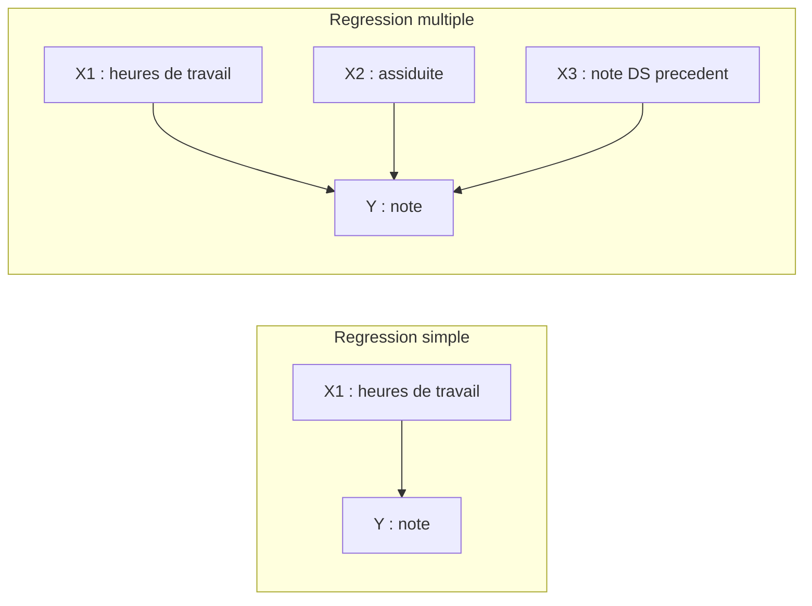
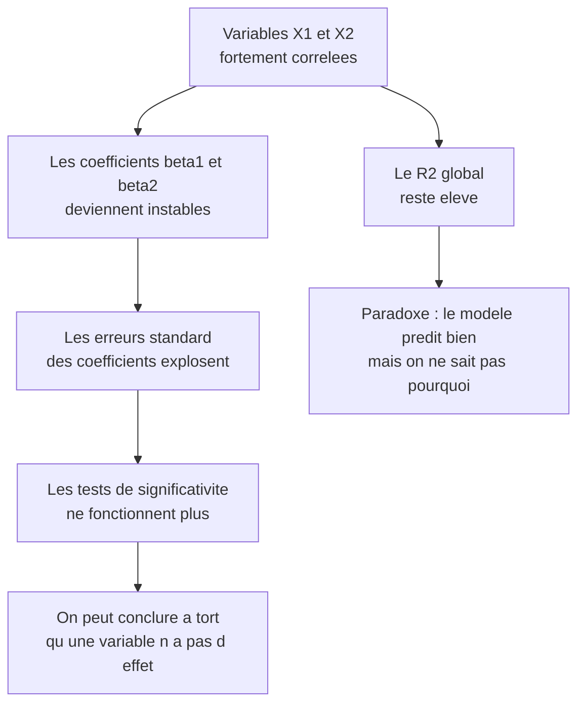
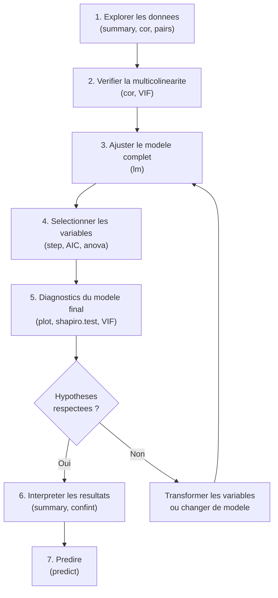

# Chapitre 4 — Régression multiple

> **Idée centrale :** Prédire une variable Y à partir de PLUSIEURS variables explicatives X1, X2, ..., Xp.

**Prérequis :** [Régression simple](03_regression_simple.md)  
**Chapitre suivant :** [ANOVA à un facteur →](05_anova_1_facteur.md)

---

## 1. Extension naturelle de la régression simple

### Le problème : un seul facteur ne suffit pas

En régression simple, on prédit Y à l'aide d'**une seule** variable explicative X. Par exemple, on prédit la note d'un étudiant uniquement à partir de ses heures de travail. C'est un bon début, mais dans la vraie vie, la note dépend de **plusieurs facteurs** :

- Les **heures de travail** à la maison.
- L'**assiduité** en cours (présence, participation).
- Les **résultats du DS précédent** (le niveau de départ).
- La **qualité du sommeil** la veille de l'examen.
- Etc.

La régression multiple permet de prendre en compte **tous ces facteurs en même temps** pour obtenir une prédiction plus précise.

### Analogie de la recette de cuisine

Imagine que tu veuilles prédire la **qualité d'un gâteau**. En régression simple, tu ne regarderais qu'un seul ingrédient — par exemple, la quantité de sucre. C'est utile, mais insuffisant : la qualité du gâteau dépend aussi de la quantité de farine, du temps de cuisson, de la température du four, etc.

La régression multiple, c'est comme regarder **tous les ingrédients et réglages en même temps** pour comprendre ce qui fait un bon gâteau.

### L'équation du modèle

En régression simple, le modèle s'écrivait :

$$Y = \beta_0 + \beta_1 \cdot X + \varepsilon$$

En régression multiple, on ajoute simplement des variables :

$$Y = \beta_0 + \beta_1 \cdot X_1 + \beta_2 \cdot X_2 + \dots + \beta_p \cdot X_p + \varepsilon$$

Décortiquons chaque terme :

| Terme | Nom | Rôle | Exemple (prédire la note) |
|-------|-----|------|---------------------------|
| Y | Variable réponse | Ce qu'on veut prédire | La note à l'examen |
| β₀ | Ordonnée à l'origine (intercept) | Note prédite quand toutes les X valent 0 | Note "de base" sans rien faire |
| β₁ | Coefficient de X₁ | Effet de X₁ sur Y, **toutes choses égales par ailleurs** | Chaque heure travaillée ajoute β₁ points |
| β₂ | Coefficient de X₂ | Effet de X₂ sur Y, **toutes choses égales par ailleurs** | Chaque % d'assiduité en plus ajoute β₂ points |
| βₚ | Coefficient de Xₚ | Effet de Xₚ sur Y, **toutes choses égales par ailleurs** | Idem pour la p-ème variable |
| ε | Erreur (résidu) | Ce que le modèle n'explique pas | Facteurs aléatoires, chance, stress... |

### Concept clé : "toutes choses égales par ailleurs"

C'est **le** concept le plus important de la régression multiple. Quand on dit « β₁ = 2 », cela signifie :

> « Si on augmente X₁ d'une unité **en gardant toutes les autres variables identiques**, alors Y augmente de 2 en moyenne. »

C'est comme dans un laboratoire où on ne change qu'**un seul paramètre à la fois** pour isoler son effet.

**Exemple concret :**

- β₁ = 2 pour les heures de travail → « Une heure de travail en plus, **à assiduité et résultats précédents identiques**, fait gagner 2 points en moyenne. »
- β₂ = 3 pour l'assiduité → « 1 unité d'assiduité en plus, **à heures de travail et résultats précédents identiques**, fait gagner 3 points en moyenne. »

C'est pour cela qu'on parle d'**effet partiel** ou d'**effet net** de chaque variable : on isole l'effet de chaque facteur en "nettoyant" l'influence des autres.

### Schéma : régression simple vs multiple



**Lecture du schéma :** En régression simple (à gauche), une seule flèche arrive sur Y. En régression multiple (à droite), plusieurs flèches arrivent sur Y, chacune représentant l'effet d'une variable explicative différente.

---

## 2. Formule matricielle

### Pourquoi les matrices ?

Quand on a p variables explicatives et n observations, écrire le système d'équations une par une devient vite ingérable. Les matrices permettent de tout condenser en **une seule formule compacte**. Pas de panique : on va tout décortiquer étape par étape.

### Le système d'équations

Pour n observations (n étudiants) et p variables explicatives, on a :

```
Étudiant 1 : y₁ = β₀ + β₁·x₁₁ + β₂·x₁₂ + ... + βₚ·x₁ₚ + ε₁
Étudiant 2 : y₂ = β₀ + β₁·x₂₁ + β₂·x₂₂ + ... + βₚ·x₂ₚ + ε₂
...
Étudiant n : yₙ = β₀ + β₁·xₙ₁ + β₂·xₙ₂ + ... + βₚ·xₙₚ + εₙ
```

C'est long ! On peut tout écrire d'un coup avec des matrices.

### Les matrices du modèle

On définit trois matrices :

**1. Le vecteur des observations y** (ce qu'on veut prédire) — dimensions : **(n × 1)**

$$\mathbf{y} = \begin{pmatrix} y_1 \\ y_2 \\ \vdots \\ y_n \end{pmatrix}$$

Exemple : les 50 notes des étudiants, empilées dans une colonne.

**2. La matrice du plan X** (les variables explicatives) — dimensions : **(n × (p+1))**

$$\mathbf{X} = \begin{pmatrix} 1 & x_{11} & x_{12} & \dots & x_{1p} \\ 1 & x_{21} & x_{22} & \dots & x_{2p} \\ \vdots & \vdots & \vdots & \ddots & \vdots \\ 1 & x_{n1} & x_{n2} & \dots & x_{np} \end{pmatrix}$$

- La **première colonne de 1** correspond à l'intercept β₀ (c'est une astuce pour inclure la constante dans la multiplication matricielle).
- Chaque ligne = un étudiant.
- Chaque colonne (après la première) = une variable explicative.

**3. Le vecteur des coefficients β** — dimensions : **((p+1) × 1)**

$$\boldsymbol{\beta} = \begin{pmatrix} \beta_0 \\ \beta_1 \\ \beta_2 \\ \vdots \\ \beta_p \end{pmatrix}$$

### L'équation matricielle compacte

Tout le système se résume à :

$$\mathbf{y} = \mathbf{X} \boldsymbol{\beta} + \boldsymbol{\varepsilon}$$

C'est exactement le même système d'équations qu'avant, mais écrit en une seule ligne.

### La solution : les moindres carrés

On cherche le vecteur β qui **minimise la somme des carrés des erreurs** (les résidus). La solution est :

$$\hat{\boldsymbol{\beta}} = (\mathbf{X}^\top \mathbf{X})^{-1} \mathbf{X}^\top \mathbf{y}$$

Décomposons cette formule terme par terme :

| Élément | Signification | Dimensions |
|---------|--------------|------------|
| X⊤ | Transposée de X (lignes ↔ colonnes) | (p+1) × n |
| X⊤X | Produit "X transposé fois X" | (p+1) × (p+1) |
| (X⊤X)⁻¹ | Inverse de la matrice X⊤X | (p+1) × (p+1) |
| X⊤y | Produit "X transposé fois y" | (p+1) × 1 |
| (X⊤X)⁻¹ X⊤y | Le vecteur des coefficients estimés | (p+1) × 1 |

> **Analogie :** Pense à (X⊤X)⁻¹X⊤y comme une "division matricielle". On ne peut pas diviser des matrices au sens classique, mais cette formule fait un travail équivalent : elle "isole" β dans l'équation y = Xβ.

### Code R : la régression multiple en pratique

```r
# ──────────────────────────────────────────────
# Création des données simulées
# ──────────────────────────────────────────────
set.seed(42)                          # Pour la reproductibilité
n <- 50                               # 50 étudiants

# Variables explicatives
heures    <- runif(n, 0, 6)           # Heures de travail (entre 0 et 6h)
assiduite <- runif(n, 0, 1)           # Assiduité (entre 0 = jamais et 1 = toujours)

# Variable réponse : note = 5 + 2*heures + 3*assiduité + bruit
# Les "vrais" coefficients sont : β₀=5, β₁=2, β₂=3
notes <- 5 + 2 * heures + 3 * assiduite + rnorm(n, 0, 1)

# Regrouper dans un data.frame
df <- data.frame(notes, heures, assiduite)

# ──────────────────────────────────────────────
# Ajuster le modèle de régression multiple
# ──────────────────────────────────────────────
modele <- lm(notes ~ heures + assiduite, data = df)

# Afficher le résumé complet
summary(modele)
```

**Sortie typique (commentée) :**

```
Coefficients:
              Estimate Std. Error t value Pr(>|t|)
(Intercept)    5.0832     0.3987   12.75  < 2e-16 ***   # β₀ ≈ 5 ✓
heures         1.9745     0.0732   26.97  < 2e-16 ***   # β₁ ≈ 2 ✓
assiduite      2.8503     0.5421    5.26  3.6e-06 ***   # β₂ ≈ 3 ✓
```

On retrouve bien des valeurs proches des "vrais" coefficients (5, 2, 3). Les étoiles `***` indiquent que tous les coefficients sont très significativement différents de 0.

### Code R : vérification par le calcul matriciel

```r
# ──────────────────────────────────────────────
# Calcul matriciel "à la main" pour vérifier
# ──────────────────────────────────────────────

# Construire la matrice X (avec colonne de 1 pour l'intercept)
X <- cbind(1, heures, assiduite)    # Matrice n×3 (1 colonne de 1 + 2 variables)
y <- notes                          # Vecteur des notes

# Appliquer la formule β = (X'X)⁻¹ X'y
beta_chapeau <- solve(t(X) %*% X) %*% t(X) %*% y

# Afficher les résultats
cat("Coefficients calculés à la main :\n")
print(beta_chapeau)

cat("\nCoefficients calculés par lm() :\n")
print(coef(modele))
```

**Explications des fonctions R :**

| Fonction R | Opération mathématique | Description |
|-----------|----------------------|-------------|
| `cbind(1, heures, assiduite)` | Construction de X | Colle les colonnes côte à côte |
| `t(X)` | X⊤ | Transposée de la matrice X |
| `%*%` | Multiplication matricielle | Différent de `*` (élément par élément) |
| `solve(A)` | A⁻¹ | Inverse d'une matrice carrée |
| `t(X) %*% X` | X⊤X | Produit "transposé fois original" |
| `solve(t(X) %*% X) %*% t(X) %*% y` | (X⊤X)⁻¹X⊤y | La formule complète des moindres carrés |

> **Point important :** Les résultats des deux méthodes (lm() et calcul matriciel) sont **identiques**. La fonction `lm()` utilise en interne des algorithmes plus sophistiqués (décomposition QR) pour des raisons de stabilité numérique, mais le résultat est le même.

---

## 3. R² ajusté

### Le problème du R² ordinaire

Rappel : le R² (coefficient de détermination) mesure la proportion de la variabilité de Y expliquée par le modèle. Il vaut entre 0 (le modèle n'explique rien) et 1 (le modèle explique tout).

$$R^2 = 1 - \frac{SS_{res}}{SS_{tot}} = 1 - \frac{\sum(y_i - \hat{y}_i)^2}{\sum(y_i - \bar{y})^2}$$

Le problème, c'est que le R² a un **défaut majeur** en régression multiple :

> **Le R² ne peut qu'augmenter (ou rester stable) quand on ajoute une variable, même si cette variable est inutile.**

### Analogie du CV qui s'allonge

C'est comme un étudiant qui rallonge son CV en ajoutant des activités sans rapport avec le poste visé : « champion de toupie en CM2 », « j'ai un chat ». Le CV s'allonge (R² augmente), mais il n'est pas meilleur pour autant. Le R² ajusté, c'est le recruteur qui **pénalise** les lignes inutiles.

### Pourquoi le R² augmente toujours ?

Mathématiquement, quand on ajoute une variable, le modèle a **un degré de liberté en plus** pour s'ajuster aux données. Même si la variable ajoutée est du bruit pur (par exemple, le numéro de téléphone de l'étudiant), le modèle trouvera toujours un petit lien par hasard. La somme des carrés des résidus (SS_res) ne peut que diminuer ou rester stable, donc R² ne peut qu'augmenter.

### La solution : le R² ajusté

Le R² ajusté **pénalise** l'ajout de variables inutiles. Sa formule est :

$$R^2_{adj} = 1 - \frac{SS_{res} / (n - p - 1)}{SS_{tot} / (n - 1)} = 1 - (1 - R^2) \cdot \frac{n - 1}{n - p - 1}$$

Où :
- **n** = nombre d'observations
- **p** = nombre de variables explicatives (sans compter l'intercept)

Le facteur (n - 1) / (n - p - 1) est toujours supérieur à 1 (car p ≥ 1), ce qui veut dire que R²adj est toujours **inférieur ou égal** à R². Plus on ajoute de variables (p augmente), plus la pénalité est forte.

### Quand utiliser R² vs R²adj ?

| Situation | Utiliser |
|-----------|---------|
| Régression simple (1 seule variable) | R² suffit |
| Régression multiple (plusieurs variables) | **R²adj obligatoire** |
| Comparer deux modèles avec un nombre différent de variables | **R²adj obligatoire** |
| Communiquer la qualité d'un modèle final | R²adj de préférence |

### Code R : comparer R² et R²adj

```r
# ──────────────────────────────────────────────
# Ajoutons une variable INUTILE (bruit pur)
# ──────────────────────────────────────────────
set.seed(123)
bruit <- rnorm(n)                     # Variable complètement aléatoire

# Modèle 1 : heures + assiduité (les bonnes variables)
modele1 <- lm(notes ~ heures + assiduite, data = df)

# Modèle 2 : heures + assiduité + bruit (variable inutile ajoutée)
modele2 <- lm(notes ~ heures + assiduite + bruit, data = df)

# Comparaison
cat("=== Modèle 1 (2 variables utiles) ===\n")
cat("R²     :", summary(modele1)$r.squared, "\n")
cat("R² adj :", summary(modele1)$adj.r.squared, "\n\n")

cat("=== Modèle 2 (2 variables utiles + 1 inutile) ===\n")
cat("R²     :", summary(modele2)$r.squared, "\n")
cat("R² adj :", summary(modele2)$adj.r.squared, "\n")
```

**Résultat attendu :**

```
=== Modèle 1 (2 variables utiles) ===
R²     : 0.9421
R² adj : 0.9396

=== Modèle 2 (2 variables utiles + 1 inutile) ===
R²     : 0.9425       ← R² a augmenté (même pour du bruit !)
R² adj : 0.9387       ← R² ajusté a DIMINUÉ (il pénalise le bruit)
```

**Conclusion :** Le R² augmente mécaniquement en ajoutant du bruit, mais le R² ajusté diminue, ce qui nous alerte : cette variable ne vaut pas la peine d'être ajoutée.

> **Règle pratique :** Quand le R²adj diminue en ajoutant une variable, c'est le signe que cette variable n'apporte rien au modèle. Ne la gardez pas.

---

## 4. Multicolinéarité

### Le problème en une phrase

La multicolinéarité, c'est quand **deux variables explicatives sont fortement corrélées entre elles**. Le modèle n'arrive plus à distinguer l'effet de l'une de l'effet de l'autre.

### Analogie des jumeaux

Imagine deux jumeaux identiques — appelons-les "heures de travail" et "heures de révision". Ils sont presque toujours ensemble : quand l'un augmente, l'autre aussi. Si tu veux savoir lequel des deux est responsable d'une bonne note, tu ne peux pas ! Ils font toujours tout ensemble. C'est exactement le problème de la multicolinéarité.

Plus concrètement :
- **heures de travail à la maison** et **heures de révision** sont très corrélées (celui qui travaille beaucoup à la maison révise aussi beaucoup).
- **taille en cm** et **taille en pouces** sont parfaitement corrélées (c'est la même information dans deux unités différentes).
- **revenu annuel** et **revenu mensuel** sont parfaitement corrélées.

### Les conséquences de la multicolinéarité



**Lecture du schéma :** Quand X₁ et X₂ sont très corrélées, les coefficients deviennent instables, ce qui fait gonfler les erreurs standard, rendant les tests de significativité non fiables. On peut alors conclure à tort qu'une variable n'a pas d'effet. Le paradoxe, c'est que le R² global peut rester élevé : le modèle prédit bien, mais on ne sait pas quelle variable est responsable.

### Le VIF (Variance Inflation Factor)

Le VIF mesure **à quel point la variance d'un coefficient est "gonflée" par la multicolinéarité**. On le calcule pour chaque variable explicative.

**Principe du VIF :** Pour la variable Xⱼ, on fait une régression de Xⱼ sur **toutes les autres** variables explicatives, et on calcule le R² de cette régression (noté R²ⱼ). Ensuite :

$$VIF_j = \frac{1}{1 - R^2_j}$$

**Interprétation :**
- Si Xⱼ n'est corrélée avec aucune autre variable : R²ⱼ = 0 → VIF = 1 (pas de problème).
- Si Xⱼ est moyennement corrélée : R²ⱼ = 0.5 → VIF = 2 (acceptable).
- Si Xⱼ est fortement corrélée : R²ⱼ = 0.8 → VIF = 5 (limite).
- Si Xⱼ est très fortement corrélée : R²ⱼ = 0.9 → VIF = 10 (problème !).

### Seuils de décision

| VIF | Interprétation | Action |
|-----|---------------|--------|
| 1 | Pas de colinéarité | Tout va bien |
| 1 à 5 | Colinéarité modérée | Acceptable en général |
| 5 à 10 | Colinéarité élevée | Commencer à s'inquiéter, envisager de retirer une variable |
| > 10 | Colinéarité sévère | Action nécessaire : retirer une variable ou combiner les variables corrélées |

> **Règle pratique :** Un seuil de VIF > 5 est souvent utilisé comme signal d'alerte. Certains auteurs utilisent VIF > 10 comme seuil critique. Dans le doute, soyez prudent et utilisez le seuil de 5.

### Code R : détecter la multicolinéarité

```r
# ──────────────────────────────────────────────
# Créons un exemple AVEC multicolinéarité
# ──────────────────────────────────────────────
set.seed(42)
n <- 50

heures_maison  <- runif(n, 0, 6)
# "heures_revision" est presque la même chose que "heures_maison" + un peu de bruit
heures_revision <- heures_maison + rnorm(n, 0, 0.3)   # Très corrélées !
assiduite       <- runif(n, 0, 1)

notes <- 5 + 2 * heures_maison + 3 * assiduite + rnorm(n, 0, 1)

df_colin <- data.frame(notes, heures_maison, heures_revision, assiduite)

# ──────────────────────────────────────────────
# Vérifier la corrélation entre les variables
# ──────────────────────────────────────────────
cor(df_colin[, c("heures_maison", "heures_revision", "assiduite")])
#                heures_maison heures_revision assiduite
# heures_maison          1.000           0.986     0.041
# heures_revision        0.986           1.000     0.038
# assiduite              0.041           0.038     1.000
# ↑ Corrélation de 0.986 entre heures_maison et heures_revision : ALERTE !

# ──────────────────────────────────────────────
# Ajuster le modèle et calculer les VIF
# ──────────────────────────────────────────────
modele_colin <- lm(notes ~ heures_maison + heures_revision + assiduite, data = df_colin)
summary(modele_colin)

# Calculer les VIF
library(car)         # Charger le package 'car' (Companion to Applied Regression)
vif(modele_colin)
#  heures_maison heures_revision       assiduite
#         39.27           39.15            1.00
# ↑ VIF > 10 pour les deux variables d'heures : multicolinéarité sévère !
```

**Ce qu'on observe :** Les VIF de `heures_maison` et `heures_revision` sont supérieurs à 10, ce qui confirme une multicolinéarité sévère. Il faut en retirer une des deux (ou les combiner en une seule variable, par exemple "heures totales").

### Que faire en cas de multicolinéarité ?

1. **Retirer une des variables redondantes** : garder celle qui a le plus de sens pour votre question.
2. **Combiner les variables corrélées** : créer une variable "heures totales" = moyenne ou somme des deux.
3. **Centrer-réduire les variables** : cela ne résout pas la multicolinéarité, mais peut aider numériquement.
4. **Utiliser la régression ridge** (méthode avancée) : elle pénalise les gros coefficients et gère mieux la multicolinéarité.

---

## 5. Sélection de variables (AIC)

### Pourquoi sélectionner des variables ?

En régression multiple, on pourrait être tenté de mettre **toutes les variables disponibles** dans le modèle. Après tout, le R² ne peut qu'augmenter, non ? Le problème, c'est que :

1. **Parcimonie :** Un modèle simple est plus facile à interpréter et à communiquer. « La note dépend des heures de travail et de l'assiduité » est plus clair que « La note dépend de 15 variables dont le signe astrologique ».

2. **Surajustement (overfitting) :** Un modèle avec trop de variables s'ajuste au **bruit** des données d'entraînement et prédit mal de nouvelles données. C'est comme un étudiant qui apprend par coeur les réponses d'un examen passé : il a 20/20 sur cet examen, mais 5/20 sur le suivant.

3. **Multicolinéarité :** Plus on ajoute de variables, plus on risque d'en avoir des corrélées entre elles.

### Le critère AIC (Akaike Information Criterion)

L'AIC est un critère qui **équilibre** la qualité de l'ajustement et la complexité du modèle :

$$AIC = -2 \ln(L) + 2k$$

Où :
- **L** = vraisemblance du modèle (mesure à quel point les données sont "vraisemblables" sous ce modèle). Plus L est grand, mieux le modèle s'ajuste.
- **k** = nombre de paramètres estimés (nombre de coefficients β, y compris l'intercept, + la variance des erreurs).
- **−2 ln(L)** : qualité de l'ajustement (plus c'est petit, mieux c'est).
- **+2k** : pénalité pour la complexité (plus il y a de paramètres, plus c'est grand).

> **Règle :** On cherche le modèle qui a l'**AIC le plus bas**. C'est un compromis entre bien prédire et rester simple.

### Analogie de la valise

Tu prépares une valise pour un voyage. Chaque objet que tu ajoutes rend la valise plus lourde (+2k, la pénalité). Mais chaque objet utile rend le voyage meilleur (−2 ln(L), la qualité). La meilleure valise n'est pas la plus pleine ni la plus vide, mais celle qui contient **exactement ce dont tu as besoin** — pas plus, pas moins.

### La méthode step() en R

La fonction `step()` explore automatiquement différents sous-modèles en ajoutant ou retirant des variables, et garde celui qui a l'AIC le plus bas.

Il existe trois directions de recherche :

| Direction | Description | Quand l'utiliser |
|-----------|------------|-----------------|
| `"forward"` | Part du modèle vide et ajoute des variables une par une | Quand on part de zéro |
| `"backward"` | Part du modèle complet et retire des variables une par une | Quand on a déjà toutes les variables |
| `"both"` | Peut ajouter ET retirer à chaque étape | Le plus flexible, recommandé par défaut |

### Code R : sélection de variables avec step()

```r
# ──────────────────────────────────────────────
# Créons un jeu de données avec des variables utiles et inutiles
# ──────────────────────────────────────────────
set.seed(42)
n <- 50

heures     <- runif(n, 0, 6)
assiduite  <- runif(n, 0, 1)
bruit1     <- rnorm(n)             # Variable inutile 1
bruit2     <- runif(n, 0, 100)     # Variable inutile 2

# Seules heures et assiduité influencent la note
notes <- 5 + 2 * heures + 3 * assiduite + rnorm(n, 0, 1)

df_select <- data.frame(notes, heures, assiduite, bruit1, bruit2)

# ──────────────────────────────────────────────
# Modèle complet (avec toutes les variables)
# ──────────────────────────────────────────────
modele_complet <- lm(notes ~ heures + assiduite + bruit1 + bruit2, data = df_select)
cat("AIC du modèle complet :", AIC(modele_complet), "\n")

# ──────────────────────────────────────────────
# Sélection automatique par step()
# ──────────────────────────────────────────────
modele_optimal <- step(modele_complet, direction = "both")
# step() affiche chaque étape : quelles variables sont testées,
# quel AIC on obtient, et quelle variable est retirée/ajoutée.

cat("\nAIC du modèle optimal :", AIC(modele_optimal), "\n")
summary(modele_optimal)
```

**Ce qu'on attend :** `step()` devrait retirer `bruit1` et `bruit2` (les variables inutiles) et garder uniquement `heures` et `assiduite`.

### Comparaison de modèles avec anova()

La fonction `anova()` permet de comparer deux modèles **emboîtés** (l'un est une version simplifiée de l'autre) avec un test F :

```r
# ──────────────────────────────────────────────
# Comparaison de modèles emboîtés
# ──────────────────────────────────────────────
modele_reduit  <- lm(notes ~ heures + assiduite, data = df_select)
modele_complet <- lm(notes ~ heures + assiduite + bruit1 + bruit2, data = df_select)

# Test : les variables bruit1 et bruit2 apportent-elles quelque chose ?
anova(modele_reduit, modele_complet)
```

**Interprétation du résultat :**
- **H₀ :** Les variables supplémentaires (bruit1, bruit2) n'apportent rien (leurs coefficients sont 0).
- **H₁ :** Au moins une des variables supplémentaires a un effet non nul.
- Si la p-value est **grande** (> 0.05), on ne rejette pas H₀ : les variables supplémentaires sont inutiles.
- Si la p-value est **petite** (< 0.05), on rejette H₀ : au moins une variable supplémentaire est utile.

> **Attention :** `anova()` pour comparer deux modèles ne fonctionne que si un modèle est un **sous-ensemble** de l'autre (modèle emboîté). On ne peut pas comparer deux modèles avec des variables complètement différentes.

---

## 6. Diagnostics du modèle

### Pourquoi vérifier le modèle ?

Un modèle de régression repose sur des **hypothèses**. Si ces hypothèses ne sont pas respectées, les résultats (coefficients, p-values, intervalles de confiance) peuvent être faux. C'est comme utiliser une balance qui n'est pas calibrée : elle donne des chiffres, mais on ne peut pas leur faire confiance.

### Les hypothèses à vérifier

| Hypothèse | Signification | Comment vérifier |
|-----------|--------------|-----------------|
| Linéarité | La relation entre Y et les X est bien linéaire | Graphique Résidus vs Valeurs ajustées |
| Normalité des résidus | Les erreurs suivent une loi normale | QQ-plot, test de Shapiro-Wilk |
| Homoscédasticité | La variance des erreurs est constante | Graphique Scale-Location |
| Indépendance des erreurs | Les erreurs ne sont pas corrélées entre elles | Graphique Résidus vs Ordre, test de Durbin-Watson |
| Pas de multicolinéarité | Les variables explicatives ne sont pas trop corrélées | VIF (vu section 4) |
| Pas de points influents | Aucune observation ne domine le modèle | Distance de Cook, graphique Residuals vs Leverage |

### Code R : les 4 graphiques diagnostiques

```r
# ──────────────────────────────────────────────
# Les 4 graphiques diagnostiques de base
# ──────────────────────────────────────────────
par(mfrow = c(2, 2))    # Afficher 4 graphiques sur une même page (2 lignes, 2 colonnes)
plot(modele)
par(mfrow = c(1, 1))    # Revenir à l'affichage normal
```

Ces 4 graphiques sont :

**1. Residuals vs Fitted (Résidus vs Valeurs ajustées)**
- **Ce qu'on veut voir :** Un nuage de points **sans structure**, réparti aléatoirement autour de 0.
- **Si on voit une courbe :** La relation n'est pas linéaire → il faut ajouter des termes non linéaires (X², log(X), etc.).
- **Si on voit un entonnoir :** La variance n'est pas constante (hétéroscédasticité).

**2. Normal Q-Q (Quantile-Quantile)**
- **Ce qu'on veut voir :** Les points alignés **sur la diagonale**.
- **Si les points s'écartent aux extrémités :** Les résidus ne suivent pas une loi normale. Cela peut poser problème pour les tests de significativité et les intervalles de confiance.

**3. Scale-Location (ou Spread-Location)**
- **Ce qu'on veut voir :** Une bande **horizontale** de points, sans tendance.
- **Si on voit une tendance croissante :** La variance augmente avec les valeurs ajustées (hétéroscédasticité).

**4. Residuals vs Leverage (Résidus vs Levier)**
- **Ce qu'on veut voir :** Tous les points **à l'intérieur** des lignes pointillées (distances de Cook < 0.5).
- **Si un point est au-delà des lignes pointillées :** C'est un point **influent** qui à lui seul modifie beaucoup le modèle. Il faut l'examiner de plus près (erreur de saisie ? valeur aberrante ?).

### Code R : diagnostic complet avec VIF

```r
# ──────────────────────────────────────────────
# Diagnostic complet
# ──────────────────────────────────────────────

# 1. Graphiques diagnostiques
par(mfrow = c(2, 2))
plot(modele)
par(mfrow = c(1, 1))

# 2. Test de normalité des résidus (Shapiro-Wilk)
shapiro.test(residuals(modele))
# Si p-value > 0.05 : on ne rejette pas la normalité (c'est bon)
# Si p-value < 0.05 : les résidus ne sont probablement pas normaux

# 3. Multicolinéarité (VIF)
library(car)
vif(modele)
# VIF < 5 pour toutes les variables : pas de problème

# 4. Résumé du modèle
summary(modele)
```

### Que faire si une hypothèse est violée ?

| Problème détecté | Solution possible |
|-----------------|-------------------|
| Non-linéarité | Ajouter des termes quadratiques (X²), des interactions, ou transformer Y (log, racine) |
| Non-normalité des résidus | Transformer Y (log, racine carrée), augmenter la taille de l'échantillon |
| Hétéroscédasticité | Transformer Y (log), utiliser les moindres carrés pondérés (WLS) |
| Points influents | Vérifier s'il y a une erreur de saisie, ajuster le modèle avec et sans le point, rapporter les deux |
| Multicolinéarité | Retirer une variable redondante, combiner des variables, utiliser la régression ridge |

---

## 7. Pièges classiques

Voici les erreurs les plus fréquentes que commettent les débutants (et parfois les experts !) en régression multiple. Chacune est illustrée et suivie de la bonne pratique.

### Piège 1 : Ajouter des variables sans tester leur utilité

**L'erreur :** « Plus il y a de variables, mieux c'est ! » Faux. Chaque variable ajoutée consomme un degré de liberté, peut introduire de la multicolinéarité, et rend le modèle plus difficile à interpréter.

**La bonne pratique :** Tester chaque variable ajoutée avec :
- Le R² ajusté (doit augmenter, pas seulement le R²).
- L'AIC (doit diminuer).
- Un test de significativité individuel (p-value du coefficient < 0.05).
- La comparaison de modèles avec `anova()`.

```r
# Avant d'ajouter une variable, comparer les modèles
modele_sans <- lm(notes ~ heures, data = df)
modele_avec <- lm(notes ~ heures + assiduite, data = df)

# R² ajusté
summary(modele_sans)$adj.r.squared   # Sans assiduité
summary(modele_avec)$adj.r.squared   # Avec assiduité (devrait être plus grand)

# Test formel
anova(modele_sans, modele_avec)      # p-value < 0.05 ? → Garder la variable
```

### Piège 2 : Oublier de centrer/réduire les variables

**L'erreur :** Comparer directement les coefficients β pour savoir quelle variable est "la plus importante". Mais si X₁ est en heures (0 à 6) et X₂ est en pourcentage (0 à 100), les unités ne sont pas comparables !

**La bonne pratique :** Centrer-réduire les variables (soustraire la moyenne, diviser par l'écart-type) avant de comparer les coefficients :

```r
# Centrer-réduire avec scale()
df_std <- data.frame(
  notes     = df$notes,
  heures    = scale(df$heures),       # (heures - moyenne) / écart-type
  assiduite = scale(df$assiduite)     # (assiduite - moyenne) / écart-type
)

modele_std <- lm(notes ~ heures + assiduite, data = df_std)
summary(modele_std)
# Maintenant les coefficients sont comparables :
# le plus grand (en valeur absolue) correspond à la variable la plus influente.
```

> **Note :** Centrer-réduire ne change **pas** la qualité du modèle (R², p-values globales), mais change l'échelle des coefficients pour les rendre comparables.

### Piège 3 : Regarder le R² au lieu du R² ajusté

**L'erreur :** « Mon modèle avec 20 variables a un R² de 0.99, il est génial ! » En fait, avec 20 variables et 25 observations, le modèle s'ajuste presque parfaitement au bruit.

**La bonne pratique :** Toujours regarder le R² ajusté en régression multiple. Si R² = 0.99 mais R²adj = 0.85, cela veut dire que beaucoup de variables sont inutiles.

### Piège 4 : Ignorer la multicolinéarité

**L'erreur :** Ne pas calculer les VIF et conclure qu'une variable « n'est pas significative » alors qu'elle est simplement masquée par une autre variable corrélée.

**La bonne pratique :** Toujours calculer les VIF **avant** d'interpréter les coefficients :

```r
library(car)
vif(modele)
# Si un VIF > 5 : attention, l'interprétation du coefficient est douteuse
```

### Piège 5 : Le surajustement (overfitting)

**L'erreur :** Le modèle s'ajuste parfaitement aux données d'entraînement mais prédit très mal de nouvelles données. C'est le signe qu'il a "appris le bruit" au lieu d'apprendre la structure.

**Comment le détecter :**
- Grand écart entre R² et R² ajusté.
- Le modèle prédit mal sur de nouvelles données (validation croisée).
- Trop de variables par rapport au nombre d'observations.

**Règle approximative :** Il faut au minimum **10 à 20 observations par variable explicative**. Avec 50 observations, on ne devrait pas dépasser 3 à 5 variables.

```r
# Règle : n / p >= 10 (idéalement >= 20)
n <- nrow(df)
p <- length(coef(modele)) - 1   # Nombre de variables (sans l'intercept)
cat("Ratio n/p :", n / p, "\n")
cat("Si < 10, risque de surajustement !\n")
```

---

## 8. Récapitulatif

### Workflow complet de la régression multiple

Voici les étapes à suivre systématiquement pour toute analyse de régression multiple :



**Lecture du schéma :** On commence par explorer les données, puis on vérifie la multicolinéarité. On ajuste un modèle complet, on sélectionne les variables utiles, puis on vérifie les hypothèses. Si elles sont respectées, on interprète et prédit. Sinon, on retourne à l'étape 3 avec des transformations.

### Tableau récapitulatif des fonctions R

| Fonction R | Rôle | Exemple d'utilisation |
|-----------|------|----------------------|
| `lm()` | Ajuster un modèle de régression | `lm(y ~ x1 + x2, data = df)` |
| `summary()` | Résumé du modèle (coefficients, R², p-values) | `summary(modele)` |
| `coef()` | Extraire les coefficients estimés | `coef(modele)` |
| `confint()` | Intervalles de confiance des coefficients | `confint(modele, level = 0.95)` |
| `predict()` | Prédire Y pour de nouvelles valeurs de X | `predict(modele, newdata = data.frame(x1 = 3, x2 = 0.8))` |
| `residuals()` | Extraire les résidus du modèle | `residuals(modele)` |
| `fitted()` | Extraire les valeurs ajustées (prédictions) | `fitted(modele)` |
| `vif()` | Calculer les facteurs d'inflation de la variance | `library(car); vif(modele)` |
| `step()` | Sélection automatique de variables par AIC | `step(modele, direction = "both")` |
| `AIC()` | Calculer le critère AIC d'un modèle | `AIC(modele)` |
| `anova()` | Comparer deux modèles emboîtés (test F) | `anova(modele_reduit, modele_complet)` |
| `plot()` | Graphiques diagnostiques (4 graphiques) | `par(mfrow=c(2,2)); plot(modele)` |
| `shapiro.test()` | Test de normalité de Shapiro-Wilk | `shapiro.test(residuals(modele))` |
| `cor()` | Matrice de corrélation entre variables | `cor(df[, c("x1", "x2", "x3")])` |
| `scale()` | Centrer-réduire une variable | `scale(df$x1)` |
| `pairs()` | Matrice de nuages de points (toutes les paires de variables) | `pairs(df)` |

### Exemple complet de bout en bout

```r
# ══════════════════════════════════════════════
# EXEMPLE COMPLET : prédire la note d'un étudiant
# ══════════════════════════════════════════════

# --- 1. Données ---
set.seed(42)
n <- 50
heures     <- runif(n, 0, 6)
assiduite  <- runif(n, 0, 1)
note_DS    <- rnorm(n, 12, 3)       # Note du DS précédent (moyenne 12, écart-type 3)
bruit      <- rnorm(n)              # Variable sans rapport

notes <- 5 + 2 * heures + 3 * assiduite + 0.3 * note_DS + rnorm(n, 0, 1)
df <- data.frame(notes, heures, assiduite, note_DS, bruit)

# --- 2. Exploration ---
summary(df)
cor(df)                             # Matrice de corrélation
pairs(df)                           # Nuages de points

# --- 3. Modèle complet ---
modele_complet <- lm(notes ~ heures + assiduite + note_DS + bruit, data = df)
summary(modele_complet)

# --- 4. Multicolinéarité ---
library(car)
vif(modele_complet)                 # Tous VIF < 5 ? OK

# --- 5. Sélection de variables ---
modele_optimal <- step(modele_complet, direction = "both")
summary(modele_optimal)

# --- 6. Diagnostics ---
par(mfrow = c(2, 2))
plot(modele_optimal)
par(mfrow = c(1, 1))
shapiro.test(residuals(modele_optimal))

# --- 7. Interprétation ---
confint(modele_optimal)             # Intervalles de confiance

# --- 8. Prédiction ---
nouveau <- data.frame(heures = 4, assiduite = 0.8, note_DS = 14)
predict(modele_optimal, newdata = nouveau, interval = "prediction")
# Donne la note prédite + intervalle de prédiction à 95%
```

---

## Points clés à retenir

| Concept | L'essentiel |
|---------|------------|
| Régression multiple | Y = β₀ + β₁X₁ + ... + βₚXₚ + ε — prédire Y avec plusieurs variables |
| Toutes choses égales par ailleurs | Chaque βⱼ mesure l'effet de Xⱼ en fixant les autres variables |
| Formule matricielle | β = (X'X)⁻¹X'y — la solution des moindres carrés |
| R² ajusté | Corrige le R² pour le nombre de variables — **toujours** utiliser en régression multiple |
| Multicolinéarité | Variables corrélées → coefficients instables → vérifier avec VIF |
| Sélection de variables | Choisir le modèle le plus parcimonieux — AIC, step(), anova() |
| Diagnostics | Vérifier linéarité, normalité, homoscédasticité, points influents |

---

## Exercices du cours

### Exercice TD3 : Régression multiple

**Énoncé :** On cherche à expliquer une variable Y en fonction de trois variables explicatives X1, X2, X3 avec n = 18 observations. Le modèle est :

$$Y_i = \beta_0 + \beta_1 x_{1i} + \beta_2 x_{2i} + \beta_3 x_{3i} + \varepsilon_i, \quad \varepsilon_i \sim \mathcal{N}(0, \sigma^2) \text{ iid}$$

On dispose des résultats suivants :

$$(X'X)^{-1} = 10^{-4} \times \begin{pmatrix} 555 & 0 & 0 & 0 \\ 0 & 3.6 & -14.7 & 9.2 \\ 0 & -14.7 & 1219 & 3.8 \\ 0 & 9.2 & 3.8 & 1000 \end{pmatrix}$$

$$b = (X'X)^{-1}X'y = (-5.92,\; 0.133,\; 0.55,\; 2.1)'$$

$$\|y - Xb\|^2 = 1.4$$

**Solution détaillée :**

**1. Écriture matricielle du modèle**

Le modèle s'écrit Y = Xβ + E avec :

- Y : vecteur (n × 1) des observations, de dimension 18 × 1
- X : matrice du plan (n × 4), chaque ligne contient (1, x1i, x2i, x3i), de dimension 18 × 4
- β : vecteur des paramètres (4 × 1), β = (β0, β1, β2, β3)'
- E : vecteur des erreurs (n × 1), de dimension 18 × 1, avec E ~ N(0, σ²In)

**2. Estimation ponctuelle de β**

L'estimateur des moindres carrés est β̂ = (X'X)⁻¹X'Y. Son estimation ponctuelle sur les données observées est :

$$b = (-5.92,\; 0.133,\; 0.55,\; 2.1)'$$

Ainsi : β̂0 = -5.92, β̂1 = 0.133, β̂2 = 0.55, β̂3 = 2.1.

**3. Loi de β̂**

Sous les hypothèses du modèle gaussien :

$$\hat{\beta} \sim \mathcal{N}(\beta,\; \sigma^2 (X'X)^{-1})$$

Chaque composante suit : β̂j ~ N(βj, σ² · [(X'X)⁻¹]jj). Par exemple :
- V(β̂0) = σ² · 10⁻⁴ · 555
- V(β̂1) = σ² · 10⁻⁴ · 3.6
- V(β̂2) = σ² · 10⁻⁴ · 1219
- V(β̂3) = σ² · 10⁻⁴ · 1000

**4. β̂2 et β̂3 sont-elles indépendantes ?**

La covariance entre β̂2 et β̂3 vaut :

$$\text{Cov}(\hat{\beta}_2, \hat{\beta}_3) = \sigma^2 \cdot [(X'X)^{-1}]_{23} = \sigma^2 \cdot 10^{-4} \cdot 3.8$$

Cette covariance est **non nulle**, donc β̂2 et β̂3 ne sont **pas indépendantes**.

Calcul de V(β̂2 - 2β̂3) :

$$V(\hat{\beta}_2 - 2\hat{\beta}_3) = V(\hat{\beta}_2) + 4 \cdot V(\hat{\beta}_3) - 4 \cdot \text{Cov}(\hat{\beta}_2, \hat{\beta}_3)$$

$$= \sigma^2 \cdot 10^{-4} \cdot (1219 + 4 \times 1000 - 4 \times 3.8) = \sigma^2 \cdot 10^{-4} \cdot 5203.8$$

**5. Estimateur sans biais de σ²**

L'estimateur sans biais de σ² est :

$$\hat{\sigma}^2 = \frac{\|y - Xb\|^2}{n - p - 1} = \frac{1.4}{18 - 4} = \frac{1.4}{14} = 0.1$$

On a n = 18 observations et p + 1 = 4 paramètres (intercept + 3 variables), donc n - (p+1) = 14 degrés de liberté.

**6. Estimation de V(β̂2)**

$$\widehat{V(\hat{\beta}_2)} = \hat{\sigma}^2 \cdot [(X'X)^{-1}]_{22} = 0.1 \times 10^{-4} \times 1219 = 0.1 \times 0.1219 = 0.01219$$

L'estimation ponctuelle de β2 est 0.55, avec une variance estimée de 0.01219, soit un écart-type estimé de √0.01219 ≈ 0.110.

**7. Test de significativité de β2**

Test : H0 : {β2 = 0} contre H1 : {β2 ≠ 0}

Sous H0, la statistique de test suit une loi de Student :

$$T = \frac{\hat{\beta}_2}{\sqrt{\widehat{V(\hat{\beta}_2)}}} = \frac{0.55}{\sqrt{0.01219}} = \frac{0.55}{0.110} \approx 4.98$$

Règle de décision au risque α = 5% : on compare |T| au quantile t(0.975, 14) ≈ 2.145.

Ici |T| = 4.98 > 2.145, donc on **rejette H0** : la variable X2 a un effet significatif sur Y au seuil 5%.

**En R :**

```r
# --- Données de l'exercice ---
n <- 18
p <- 3  # nombre de variables explicatives (sans intercept)

# Matrice (X'X)^{-1}
XtX_inv <- 1e-4 * matrix(c(
  555,    0,      0,     0,
  0,      3.6,   -14.7,  9.2,
  0,     -14.7,  1219,   3.8,
  0,      9.2,    3.8,  1000
), nrow = 4, byrow = TRUE)

# Vecteur des coefficients estimés
b <- c(-5.92, 0.133, 0.55, 2.1)

# Norme des résidus au carré
RSS <- 1.4

# --- Calculs ---
# Estimateur de sigma²
sigma2_hat <- RSS / (n - p - 1)
cat("sigma² estimé :", sigma2_hat, "\n")

# Variance estimée de chaque coefficient
var_beta <- sigma2_hat * diag(XtX_inv)
cat("Variances estimées des beta :", var_beta, "\n")
cat("Ecarts-types estimés :", sqrt(var_beta), "\n")

# Covariance entre beta2 et beta3
cov_b2_b3 <- sigma2_hat * XtX_inv[3, 4]
cat("Cov(beta2, beta3) :", cov_b2_b3, "\n")

# Variance de beta2 - 2*beta3
var_diff <- var_beta[3] + 4 * var_beta[4] - 4 * cov_b2_b3
cat("V(beta2 - 2*beta3) :", var_diff, "\n")

# Test de significativité de beta2
T_stat <- b[3] / sqrt(var_beta[3])
cat("Statistique T pour beta2 :", T_stat, "\n")
cat("Quantile t(0.975, 14) :", qt(0.975, 14), "\n")
cat("Rejet de H0 :", abs(T_stat) > qt(0.975, 14), "\n")
```

**Ce qu'il faut retenir :**
- En régression multiple, β̂ = (X'X)⁻¹X'Y suit une loi normale multivariée N(β, σ²(X'X)⁻¹).
- Les composantes de β̂ ne sont pas nécessairement indépendantes : il faut vérifier les termes hors-diagonale de (X'X)⁻¹.
- L'estimateur sans biais de σ² divise la somme des carrés des résidus par n - (p+1), les degrés de liberté résiduels.
- Le test de significativité d'un coefficient utilise la loi de Student avec n - (p+1) ddl.

---

## Exemples du cours

Les exemples ci-dessous sont directement issus du cours (Chapitre 4 -- Regression lineaire multiple).

### Exemple jouet

**Enonce (cours, p.5) :**
On dispose des donnees suivantes pour illustrer la regression multiple :

| obs | x1 | x2 | y |
|---|---|---|---|
| 1 | -1 | -1 | -4 |
| 2 | -1 | 1 | 2 |
| 3 | 1 | -1 | 0 |
| 4 | 1 | 1 | 2 |
| moy. | 0 | 0 | 0 |
| variance | 1 | 1 | 6 |

**Modele :** Y_i = β0 + β1·x_{i1} + β2·x_{i2} + ε_i

---

### Exercice 1 : Ecriture matricielle (cours, p.15)

**Enonce :** Ecrire le modele, donner l'ecriture matricielle et estimer β̂.

**Resolution :**

```
Y = Xβ + ε

Y = (-4, 2, 0, 2)'

X = | 1  -1  -1 |     β = | β0 |
    | 1  -1   1 |         | β1 |
    | 1   1  -1 |         | β2 |
    | 1   1   1 |

X'X = | 4  0  0 |     (X'X)⁻¹ = | 1/4  0    0   |
      | 0  4  0 |                | 0    1/4  0   |
      | 0  0  4 |                | 0    0    1/4 |

X'Y = | 0 |
      | 0 |
      | 4 |

β̂ = (X'X)⁻¹ X'Y = | 0 |
                     | 0 |
                     | 1 |
```

Donc β̂0 = 0, β̂1 = 0, β̂2 = 1.

**En R :**

```r
# Exemple jouet
x1 <- c(-1, -1, 1, 1)
x2 <- c(-1, 1, -1, 1)
y  <- c(-4, 2, 0, 2)

modele <- lm(y ~ x1 + x2)
coef(modele)
# (Intercept)          x1          x2
#           0           0           1
```

---

### Exercice 3 : Estimation de la variance residuelle (cours, p.19)

**Enonce :** Completer le tableau des valeurs ajustees et des residus, puis estimer σ².

**Resolution :**

| obs | x1 | x2 | y | ŷ = 0 + 0·x1 + 1·x2 | ε̂ = y - ŷ |
|---|---|---|---|---|---|
| 1 | -1 | -1 | -4 | -1 | -3 |
| 2 | -1 | 1 | 2 | 1 | 1 |
| 3 | 1 | -1 | 0 | -1 | 1 |
| 4 | 1 | 1 | 2 | 1 | 1 |

```
Somme(ε̂²) = (-3)² + 1² + 1² + 1² = 9 + 1 + 1 + 1 = 12

σ̂² = Somme(ε̂²) / (n - p - 1) = 12 / (4 - 2 - 1) = 12 / 1 = 12
```

**En R :**

```r
# Residus et variance residuelle
fitted(modele)     # -1  1 -1  1
residuals(modele)  # -3  1  1  1
sum(residuals(modele)^2)  # 12
summary(modele)$sigma^2   # 12  (ou sigma = sqrt(12))
```

---

### Exercice 4 : Table d'ANOVA de l'exemple jouet (cours, p.28)

**Enonce :** Completer la table d'analyse de la variance.

**Resolution :**

```
SCT = Somme(y_i - ȳ)² = (-4)² + 2² + 0² + 2² = 24     (car ȳ = 0)
SCM = Somme(ŷ_i - ȳ)² = (-1)² + 1² + (-1)² + 1² = 4   (car ȳ = 0 et ŷ = ±1)
SCR = SCT - SCM = 24 - 4 = 20
     (Verification : (-3)² + 1² + 1² + 1² = 12 ≠ 20 ?)
```

Attention, en realite :

```
SCR = Somme(ε̂²) = 12
SCM = SCT - SCR = 24 - 12 = 12
```

| Variabilite | SC | ddl | CM | F | p.crit. |
|---|---|---|---|---|---|
| Modele | SCM = 12 | 2 | CMM = 6 | F = 6/12 = 0.5 | 0.41 |
| Residuelle | SCR = 12 | 1 | CMR = 12 | | |
| Totale | SCT = 24 | 3 | | | |

**Conclusion :** La p-valeur (0.41) est superieure a 5%. On conserve H0 = {β1 = β2 = 0}. Les variables x1 et x2 n'ont pas d'effet significatif sur y au risque de 5%.

**En R :**

```r
# Table ANOVA
anova(modele)
# Df Sum Sq Mean Sq F value Pr(>F)
# x1   1      0       0    0.0    1.0
# x2   1     12      12    1.0    0.5
# Residuals 1 12      12

summary(modele)
# F-statistic: 0.5 on 2 and 1 DF,  p-value: 0.7071
```

---

### Exemple des chenilles processionnaires

**Enonce (cours, p.40-45) :**
Les chenilles processionnaires du pin projettent des poils urticants. On etudie l'influence de caracteristiques de peuplements forestiers sur la densite de processionnaires pour :
- fournir des recommandations aux forestiers
- construire un modele predictif

**Donnees :** 33 parcelles forestieres de 10 hectares, avec 10 variables explicatives :

| Variable | Description |
|---|---|
| Alti | altitude (m) |
| Pente | pente (degres) |
| NbPin | nombre de pins par placette |
| Haut | hauteur (m) du pin central |
| Diam | diametre du pin central |
| Dens | densite de vegetation |
| Orient | orientation (1=sud, 2=nord) |
| Hdom | hauteur de l'arbre dominant |
| Strat | nombre de strates de vegetation |
| Mela | melange du peuplement (1=non, 2=oui) |
| NbNid | nombre moyen de nids par arbre (variable reponse) |

**Modele :**

```
LogNid_i = β0 + β1·Alti_i + β2·Pente_i + ... + β10·Mela_i + ε_i
```

Note : On utilise le **logarithme** du nombre de nids (LogNid) car le modele sur NbNid directement ne verifie pas l'homoscedasticite des residus.

---

### Sorties R des chenilles processionnaires (cours, p.44)

**Qualite globale du modele :**

```
Residual standard error: 0.8268 on 22 degrees of freedom
Multiple R-squared:  0.6968
Adjusted R-squared:  0.5589
F-statistic: 5.055 on 10 and 22 DF,  p-value: 0.0007441
```

**Interpretation :**
- R² = 0.6968 : 69.68% de la variabilite de log(NbNid) est expliquee par le modele
- R²_aj = 0.5589 : apres ajustement pour le nombre de variables, 55.89% de la variabilite est expliquee
- Test global : F = 5.055, p-valeur = 0.0007 < 5% → on rejette H0, au moins un βj ≠ 0

---

### Coefficients des chenilles processionnaires (cours, p.45)

| | Estimate | Std. Error | t value | Pr(>\|t\|) |
|---|---|---|---|---|
| (Intercept) | 11.3009 | 3.1566 | 3.58 | 0.0017 |
| **Alti** | **-0.0045** | **0.0016** | **-2.88** | **0.0086** |
| **Pente** | **-0.0536** | **0.0218** | **-2.45** | **0.0225** |
| NbPin | 0.0746 | 0.1002 | 0.74 | 0.4647 |
| **Haut** | **-1.3283** | **0.5701** | **-2.33** | **0.0294** |
| **Diam** | **0.2361** | **0.1046** | **2.26** | **0.0343** |
| Dens | -0.4511 | 1.5729 | -0.29 | 0.7770 |
| Orient | -0.1878 | 1.0080 | -0.19 | 0.8539 |
| Hdom | 0.1856 | 0.2363 | 0.79 | 0.4406 |
| Strat | -1.2660 | 0.8612 | -1.47 | 0.1557 |
| Mela | -0.5372 | 0.7734 | -0.69 | 0.4946 |

Les variables en gras sont significatives au seuil de 5%.

**Interpretation :**
- **Altitude** (β̂ = -0.0045, p = 0.009) : plus la parcelle est en altitude, moins il y a de nids
- **Pente** (β̂ = -0.0536, p = 0.023) : plus la pente est forte, moins il y a de nids
- **Hauteur du pin** (β̂ = -1.3283, p = 0.029) : les pins plus hauts ont moins de nids
- **Diametre du pin** (β̂ = 0.2361, p = 0.034) : les pins de plus gros diametre ont plus de nids
- Les 6 autres variables (NbPin, Dens, Orient, Hdom, Strat, Mela) ne sont pas significatives

**Recommandation pour les forestiers :** Il y aura d'autant moins de nids de chenilles que la parcelle est en altitude, en pente, et que le pin central est haut et de petit diametre.

**En R :**

```r
# Chargement des donnees (supposees dans un fichier chenilles.csv)
# chenilles <- read.csv("chenilles.csv")

# Modele complet sur NbNid (probleme d'homoscedasticite)
# modele1 <- lm(NbNid ~ Alti + Pente + NbPin + Haut + Diam +
#                        Dens + Orient + Hdom + Strat + Mela, data = chenilles)
# par(mfrow = c(1, 2)); plot(modele1, which = c(1, 2))

# Modele sur LogNid (hypotheses verifiees)
# modele2 <- lm(log(NbNid) ~ Alti + Pente + NbPin + Haut + Diam +
#                              Dens + Orient + Hdom + Strat + Mela, data = chenilles)
# summary(modele2)
# anova(modele2)

# Selection de variables par AIC (stepwise)
# step(modele2, direction = "both")
```

---

*[← Régression simple](03_regression_simple.md) | [ANOVA à un facteur →](05_anova_1_facteur.md)*
