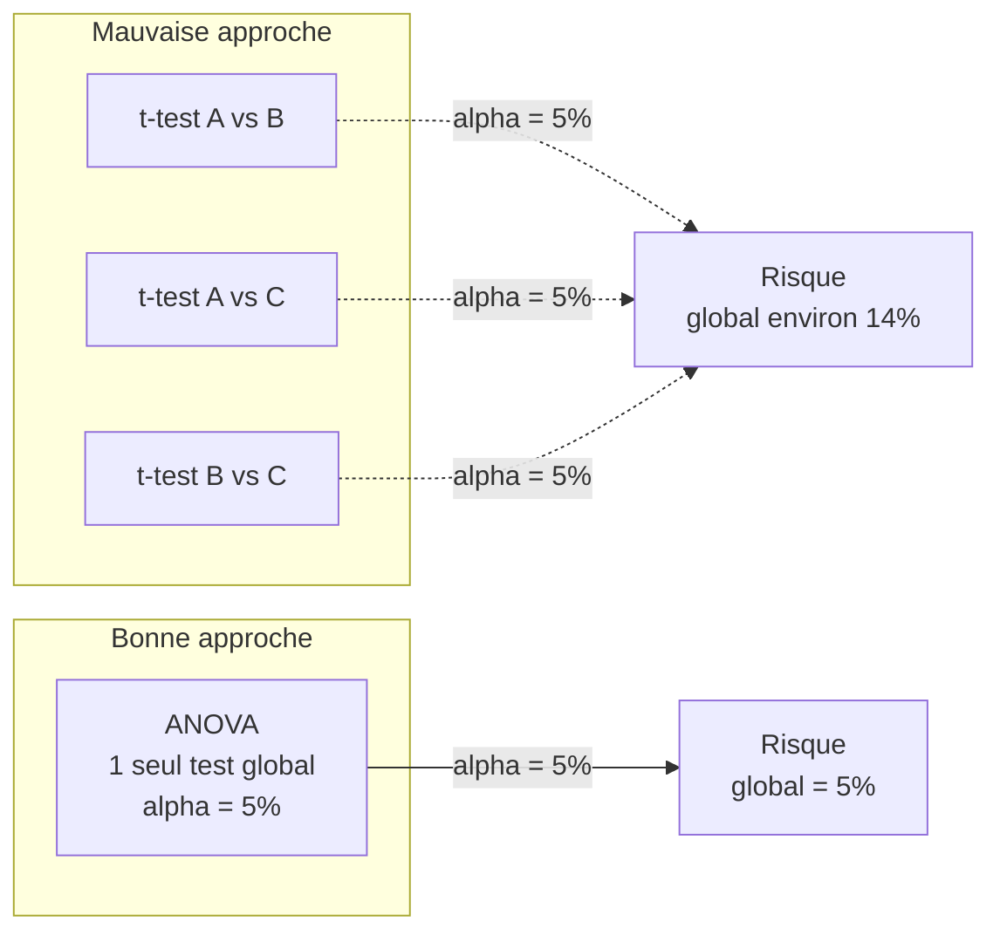
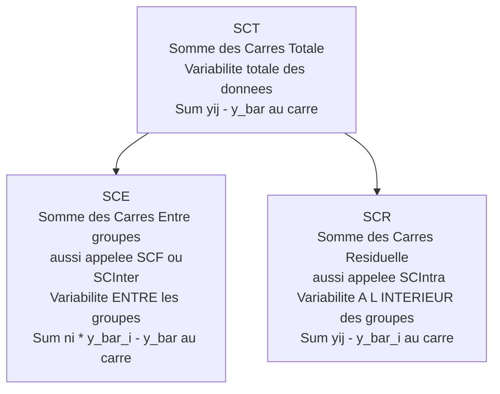
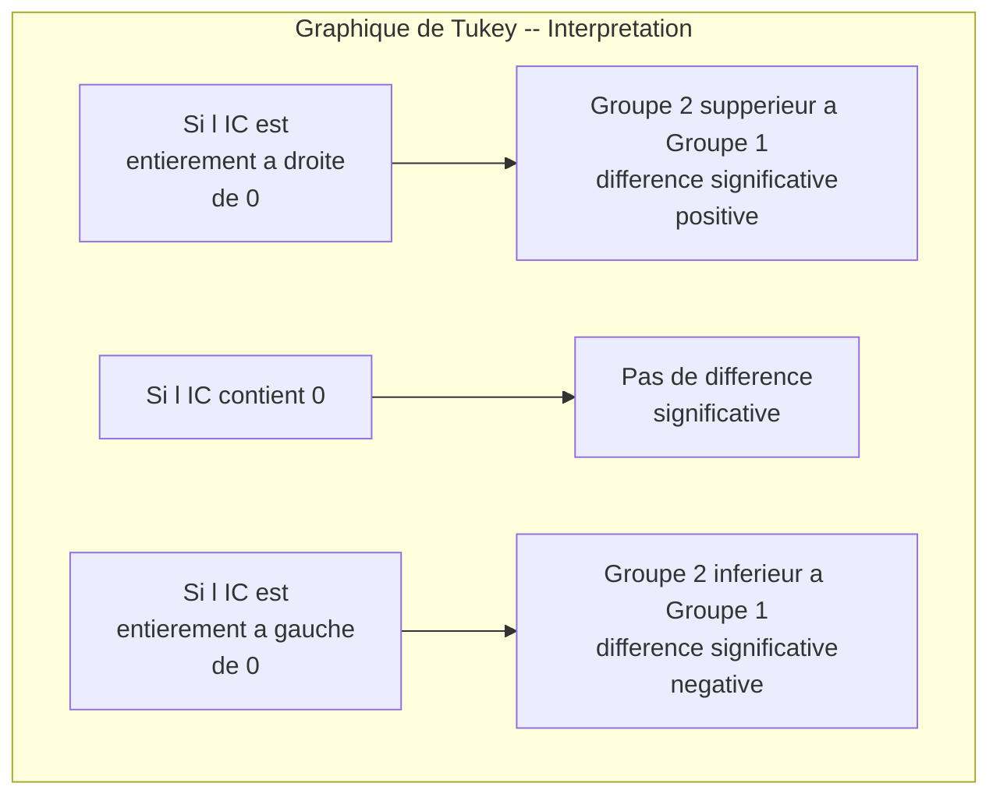
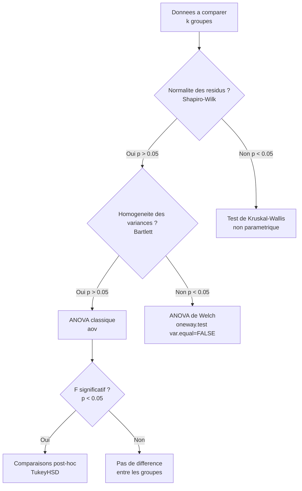
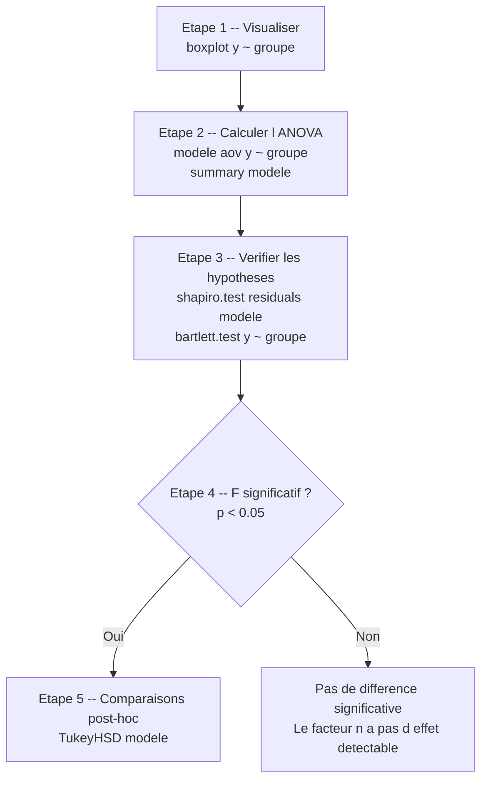

# Chapitre 5 — ANOVA à un facteur

> **Idée centrale :** Comparer les moyennes de PLUS DE 2 groupes en une seule fois, en décomposant la variance totale.

**Prérequis :** [Régression multiple](04_regression_multiple.md)  
**Chapitre suivant :** [ANOVA à deux facteurs →](06_anova_2_facteurs.md)

---

## 1. L'analogie des groupes de TD

### La situation

Imagine que tu es enseignant à l'INSA et que tu as **trois groupes de TD** (A, B et C) pour le même cours de statistiques. À la fin du semestre, tu regardes les notes de chaque groupe et tu te demandes :

> **"Est-ce que les trois groupes ont le même niveau, ou est-ce qu'au moins un groupe est significativement différent des autres ?"**

Voici les notes que tu observes :

| Groupe A | Groupe B | Groupe C |
|----------|----------|----------|
| 12 | 16 | 9  |
| 15 | 18 | 11 |
| 11 | 17 | 10 |
| 13 | 15 | 12 |
| 14 | 19 | 8  |

Les moyennes sont : A = 13, B = 17, C = 10. Le groupe B semble meilleur et le groupe C semble plus faible. Mais est-ce une **vraie** différence, ou est-ce simplement la variabilité naturelle entre étudiants ?

### Pourquoi ne pas faire 3 t-tests ?

Ta première idée serait peut-être de comparer les groupes deux à deux avec des tests de Student :

- Test 1 : A vs B
- Test 2 : A vs C
- Test 3 : B vs C

Cela semble logique, mais il y a un **gros problème** : l'accumulation du risque d'erreur.

### Le problème de l'accumulation du risque alpha

Quand tu fais **un seul** test au seuil alpha = 5%, tu acceptes un risque de 5% de te tromper (rejeter H0 alors qu'elle est vraie). La probabilité de **ne pas** se tromper est donc 95% = 0.95.

Mais quand tu fais **3 tests indépendants** :

- Probabilité de ne se tromper sur aucun des 3 tests = 0.95 x 0.95 x 0.95 = 0.857
- Probabilité de se tromper **au moins une fois** = 1 - 0.857 = **0.143 = 14.3%**

Tu es passé d'un risque de **5%** à un risque de **14.3%** ! Et plus tu ajoutes de groupes, pire c'est :

| Nombre de groupes | Nombre de comparaisons 2 à 2 | Risque global (alpha = 5%) |
|-------------------|-------------------------------|---------------------------|
| 3 | 3 | 14.3% |
| 4 | 6 | 26.5% |
| 5 | 10 | 40.1% |
| 10 | 45 | 90.1% |

Avec 10 groupes, tu as **90% de chances** de déclarer au moins une fausse différence ! C'est comme lancer un dé et prétendre qu'il est truqué dès qu'on obtient un 6. Si on ne lance qu'une fois, c'est improbable. Si on lance 50 fois, c'est presque garanti.

> **Analogie du policier zélé :** Imagine un policier qui contrôle 20 conducteurs au hasard et qui considère chaque contrôle comme "suspect" s'il y a 5% de chances d'erreur. En moyenne, il arrêtera un innocent sur les 20. Plus il contrôle de personnes, plus il fera de faux positifs.

### La solution : l'ANOVA

L'ANOVA (Analysis of Variance = Analyse de la Variance) résout ce problème en faisant **un seul test global** qui compare toutes les moyennes en même temps. Le risque d'erreur reste à 5%, peu importe le nombre de groupes.

C'est comme si, au lieu de comparer les groupes deux par deux, tu prenais du recul et tu te demandais :

> **"Globalement, est-ce que le facteur 'groupe' a un effet sur les notes ?"**



---

## 2. Le principe de la décomposition de la variance

### L'intuition fondamentale

L'idée géniale de l'ANOVA est de répondre à la question "les moyennes sont-elles différentes ?" en analysant... **les variances**. Cela peut sembler contre-intuitif, mais c'est en fait très logique.

Prenons un exemple visuel. Imagine deux scénarios :

**Scénario 1 — Moyennes différentes, faible variabilité intra-groupe :**

```
Groupe A :  ● ● ● ● ●
Groupe B :                    ● ● ● ● ●
Groupe C :  ● ● ● ● ●
            |---------|---------|---------|
            8    10   12   14   16   18   20
```

Ici, les groupes sont clairement séparés. La variabilité **entre** les groupes est grande par rapport à la variabilité **à l'intérieur** de chaque groupe.

**Scénario 2 — Moyennes proches, forte variabilité intra-groupe :**

```
Groupe A :    ●     ●      ●       ●     ●
Groupe B :      ●      ●       ●      ●      ●
Groupe C :   ●      ●       ●      ●     ●
             |---------|---------|---------|
             8    10   12   14   16   18   20
```

Ici, les groupes se chevauchent complètement. La variabilité **entre** les groupes est faible par rapport à la variabilité **à l'intérieur** de chaque groupe.

L'ANOVA compare ces deux sources de variabilité. Si la variabilité entre groupes est **beaucoup plus grande** que la variabilité intra-groupe, alors les moyennes sont probablement différentes.

### La décomposition : SCT = SCE + SCR

L'ANOVA décompose la **variabilité totale** des données en deux parties :



Détaillons chaque terme.

### SCT — Somme des Carrés Totale

La SCT mesure la **variabilité totale** de toutes les observations, sans tenir compte des groupes. C'est comme si tu mettais toutes les notes dans un seul grand sac et que tu regardais à quel point elles sont dispersées autour de la moyenne générale.

**Formule :**

$$
SCT = \sum_{i=1}^{k} \sum_{j=1}^{n_i} (y_{ij} - \bar{y})^2
$$

**Explication terme par terme :**

- **k** : le nombre de groupes (ici 3 : A, B, C)
- **n_i** : le nombre d'observations dans le groupe i (ici 5 pour chaque groupe)
- **y_ij** : la j-ème observation du groupe i (par exemple, y_23 = la 3e note du groupe B = 17)
- **y-barre (ȳ)** : la moyenne générale de toutes les observations confondues
- **(y_ij - ȳ)²** : l'écart au carré entre chaque observation et la moyenne générale

> **En français :** on prend chaque note, on calcule à quel point elle s'éloigne de la moyenne générale, on met au carré (pour éviter que les écarts positifs et négatifs s'annulent), et on additionne tout.

### SCE — Somme des Carrés Entre groupes (ou facteur)

La SCE mesure la variabilité **entre les groupes**. Elle quantifie à quel point les moyennes des groupes diffèrent de la moyenne générale. C'est la partie de la variabilité qui est **expliquée** par le facteur "groupe".

**Formule :**

$$
SCE = \sum_{i=1}^{k} n_i \cdot (\bar{y}_i - \bar{y})^2
$$

**Explication terme par terme :**

- **ȳ_i** : la moyenne du groupe i (par exemple, ȳ_A = 13, ȳ_B = 17, ȳ_C = 10)
- **(ȳ_i - ȳ)²** : l'écart au carré entre la moyenne du groupe i et la moyenne générale
- **n_i** : on multiplie par le nombre d'observations du groupe (pondération — un grand groupe "pèse" plus)

> **En français :** on regarde à quel point chaque moyenne de groupe s'éloigne de la moyenne générale. Si les moyennes de groupe sont très différentes les unes des autres, la SCE sera grande.

### SCR — Somme des Carrés Résiduelle (ou intra-groupes)

La SCR mesure la variabilité **à l'intérieur de chaque groupe**. Elle quantifie la dispersion des observations autour de leur propre moyenne de groupe. C'est la variabilité **non expliquée** par le facteur "groupe" — le "bruit" naturel.

**Formule :**

$$
SCR = \sum_{i=1}^{k} \sum_{j=1}^{n_i} (y_{ij} - \bar{y}_i)^2
$$

**Explication terme par terme :**

- **(y_ij - ȳ_i)²** : l'écart au carré entre chaque observation et la moyenne de son propre groupe
- On additionne ces écarts pour **tous** les groupes

> **En français :** même à l'intérieur d'un même groupe, les notes ne sont pas identiques. Cette variabilité "résiduelle" est due au hasard, aux différences individuelles, etc. C'est le bruit de fond.

### La relation fondamentale

La beauté de l'ANOVA réside dans cette relation :

$$
\boxed{SCT = SCE + SCR}
$$

Autrement dit :

> **Variabilité totale = Variabilité entre groupes + Variabilité intra-groupes**

Ou encore :

> **Total = Signal + Bruit**

Si la SCE (signal) est grande par rapport à la SCR (bruit), alors les groupes sont probablement différents. Si la SCE est petite par rapport à la SCR, les différences entre groupes sont noyées dans le bruit.

### Calcul numérique sur notre exemple

Reprenons nos notes :

- Groupe A : 12, 15, 11, 13, 14 → ȳ_A = 13.0
- Groupe B : 16, 18, 17, 15, 19 → ȳ_B = 17.0
- Groupe C : 9, 11, 10, 12, 8 → ȳ_C = 10.0
- Moyenne générale : ȳ = (13 + 17 + 10) x 5 / 15 = 200 / 15 = 13.33

**Calcul de la SCE :**

$$
SCE = 5 \times (13 - 13.33)^2 + 5 \times (17 - 13.33)^2 + 5 \times (10 - 13.33)^2
$$
$$
SCE = 5 \times 0.11 + 5 \times 13.44 + 5 \times 11.11 = 0.56 + 67.22 + 55.56 = 123.33
$$

**Calcul de la SCR :**

Pour le groupe A : (12-13)² + (15-13)² + (11-13)² + (13-13)² + (14-13)² = 1 + 4 + 4 + 0 + 1 = 10
Pour le groupe B : (16-17)² + (18-17)² + (17-17)² + (15-17)² + (19-17)² = 1 + 1 + 0 + 4 + 4 = 10
Pour le groupe C : (9-10)² + (11-10)² + (10-10)² + (12-10)² + (8-10)² = 1 + 1 + 0 + 4 + 4 = 10

$$
SCR = 10 + 10 + 10 = 30
$$

**Vérification :**

$$
SCT = SCE + SCR = 123.33 + 30 = 153.33
$$

On peut vérifier que la SCT calculée directement donne le même résultat (en sommant les (y_ij - 13.33)² pour toutes les observations).

---

## 3. Le tableau ANOVA et la statistique F

### Les degrés de liberté (ddl)

Avant de construire le tableau, il faut comprendre les **degrés de liberté**. C'est le nombre de "valeurs libres" qui contribuent à chaque somme de carrés.

- **ddl total** = N - 1 (N = nombre total d'observations). Ici : 15 - 1 = 14.
- **ddl entre** = k - 1 (k = nombre de groupes). Ici : 3 - 1 = 2.
- **ddl résiduel** = N - k (total moins groupes). Ici : 15 - 3 = 12.

Et comme pour les SC : **ddl_total = ddl_entre + ddl_résiduel** (14 = 2 + 12).

> **Analogie :** si tu as 3 moyennes de groupe et que tu connais la moyenne générale, tu peux calculer la 3e moyenne à partir des 2 premières. Il n'y a donc que 2 valeurs "libres" → ddl_entre = 2.

### Les carrés moyens (CM)

On divise chaque somme de carrés par ses degrés de liberté pour obtenir les **carrés moyens** (ou "variances estimées") :

$$
CM_{entre} = \frac{SCE}{k - 1} \qquad CM_{résiduel} = \frac{SCR}{N - k}
$$

Dans notre exemple :

$$
CM_{entre} = \frac{123.33}{2} = 61.67 \qquad CM_{résiduel} = \frac{30}{12} = 2.50
$$

### La statistique F : le ratio signal / bruit

La statistique de test F est simplement le **ratio** entre la variance entre groupes et la variance intra-groupes :

$$
\boxed{F = \frac{CM_{entre}}{CM_{résiduel}}}
$$

Dans notre exemple :

$$
F = \frac{61.67}{2.50} = 24.67
$$

**Comment interpréter F :**

- **F = 1** → la variabilité entre groupes est égale à la variabilité intra-groupes → pas de différence entre les groupes (les moyennes de groupe bougent autant que le bruit).
- **F >> 1** → la variabilité entre groupes est beaucoup plus grande que la variabilité intra-groupes → les groupes sont probablement différents.
- **F < 1** → très rare et indique qu'il n'y a pas de différence (ou un problème dans les données).

Ici, F = 24.67 est largement supérieur à 1. Les différences entre groupes sont environ **25 fois plus grandes** que la variabilité naturelle à l'intérieur des groupes. C'est un signal fort.

### Le tableau ANOVA complet

Voici le tableau ANOVA standard, avec nos valeurs numériques :

| Source de variation | SC (Somme des Carrés) | ddl (degrés de liberté) | CM (Carré Moyen) | F | p-value |
|---------------------|----------------------|------------------------|-------------------|-------|---------|
| **Entre groupes** (facteur) | 123.33 | 2 | 61.67 | 24.67 | 0.000063 |
| **Résiduelle** (intra-groupes) | 30.00 | 12 | 2.50 | — | — |
| **Totale** | 153.33 | 14 | — | — | — |

**Lecture du tableau :**

1. **Source** : d'où vient la variabilité (entre groupes ou intra-groupes).
2. **SC** : la quantité de variabilité attribuée à chaque source.
3. **ddl** : le nombre de degrés de liberté.
4. **CM** : la variabilité "par degré de liberté" (SC / ddl).
5. **F** : le ratio signal/bruit (CM_entre / CM_résiduel).
6. **p-value** : la probabilité d'observer un F aussi grand si H0 était vraie (si les groupes avaient la même moyenne).

### Hypothèses du test

- **H0** : toutes les moyennes de groupe sont égales (mu_A = mu_B = mu_C)
- **H1** : au moins une moyenne de groupe est différente des autres

### Conclusion pour notre exemple

p-value = 0.000063 < 0.05 → on rejette H0 → **au moins un groupe a une moyenne significativement différente des autres**.

Mais attention : l'ANOVA ne dit **pas** quel groupe est différent. Elle dit juste "il y a au moins une différence quelque part". Pour savoir laquelle, il faut passer aux **comparaisons post-hoc** (section 4).

### Code R complet

```r
# =============================================
# ANOVA à un facteur — Exemple complet
# =============================================

# --- Étape 1 : Créer les données ---
groupe_A <- c(12, 15, 11, 13, 14)
groupe_B <- c(16, 18, 17, 15, 19)
groupe_C <- c(9, 11, 10, 12, 8)

# Combiner toutes les notes dans un seul vecteur
notes <- c(groupe_A, groupe_B, groupe_C)

# Créer le facteur "groupe" correspondant
# rep("A", 5) crée le vecteur c("A","A","A","A","A")
# factor() transforme en variable catégorielle (obligatoire pour l'ANOVA)
groupes <- factor(rep(c("A", "B", "C"), each = 5))

# Vérifier la structure
data.frame(notes, groupes)

# --- Étape 2 : Visualiser avec un boxplot ---
# TOUJOURS visualiser AVANT de tester !
boxplot(notes ~ groupes,
        col = c("lightblue", "lightgreen", "salmon"),
        main = "Notes par groupe de TD",
        xlab = "Groupe",
        ylab = "Note",
        las = 1)  # las=1 rend les étiquettes de l'axe Y horizontales

# Ajouter les moyennes sur le boxplot (petits points rouges)
means <- tapply(notes, groupes, mean)
points(1:3, means, pch = 18, col = "red", cex = 1.5)

# --- Étape 3 : Calculer les moyennes par groupe ---
cat("Moyenne par groupe :\n")
tapply(notes, groupes, mean)
# A    B    C
# 13   17   10

cat("\nMoyenne générale :", mean(notes), "\n")
# 13.33333

# --- Étape 4 : Réaliser l'ANOVA ---
# aov() = analysis of variance
# La formule notes ~ groupes signifie "notes en fonction de groupes"
modele_anova <- aov(notes ~ groupes)

# --- Étape 5 : Afficher le tableau ANOVA ---
summary(modele_anova)
#             Df Sum Sq Mean Sq F value   Pr(>F)
# groupes      2 123.33   61.67    24.67 6.34e-05 ***
# Residuals   12  30.00    2.50

# Lecture de la sortie R :
# - Df        = degrés de liberté (2 pour groupes, 12 pour résidus)
# - Sum Sq    = sommes des carrés (SCE = 123.33, SCR = 30.00)
# - Mean Sq   = carrés moyens (CM = SC / Df)
# - F value   = statistique F (24.67)
# - Pr(>F)    = p-value (6.34e-05 = 0.0000634)
# - Les étoiles (***) indiquent le niveau de signification
```

**Interprétation de la sortie R :**

La p-value est 6.34e-05, soit environ 0.000063. C'est très largement inférieur à 0.05. On rejette H0 avec une forte confiance : les trois groupes n'ont **pas** la même moyenne.

Les codes de signification de R :

| Symbole | Signification | Seuil |
|---------|--------------|-------|
| `***` | Très hautement significatif | p < 0.001 |
| `**` | Hautement significatif | p < 0.01 |
| `*` | Significatif | p < 0.05 |
| `.` | Tendance | p < 0.10 |
| (rien) | Non significatif | p >= 0.10 |

---

## 4. Comparaisons multiples post-hoc : test de Tukey HSD

### Pourquoi les comparaisons post-hoc ?

L'ANOVA nous dit qu'**au moins un groupe est différent**, mais elle ne dit pas **lequel**. C'est comme si un médecin te disait "vous avez une infection quelque part" sans préciser où. Utile, mais insuffisant !

Pour identifier **quelles** paires de groupes sont significativement différentes, on utilise des **tests post-hoc** (post-hoc = "après coup", en latin). Le plus utilisé est le test de **Tukey HSD** (Honestly Significant Difference = Différence Honnêtement Significative).

### Pourquoi Tukey et pas des t-tests ?

On revient au problème de la section 1 : si on fait des t-tests entre toutes les paires, on accumule le risque alpha. Le test de Tukey **corrige** ce problème en ajustant les p-values pour tenir compte du nombre de comparaisons. Le risque global reste à 5%.

### Code R et interprétation

```r
# --- Test de Tukey HSD ---
# On lui passe le modèle ANOVA qu'on a déjà calculé
tukey_result <- TukeyHSD(modele_anova)

# Afficher les résultats
tukey_result
#   Tukey multiple comparisons of means
#     95% family-wise confidence level
#
# $groupes
#     diff   lwr    upr     p adj
# B-A    4  1.61   6.39  0.0022
# C-A   -3 -5.39  -0.61  0.0149
# B-C    7  4.61   9.39  0.0000

# --- Graphique des intervalles de confiance ---
# Si l'IC ne contient PAS 0, la différence est significative
plot(TukeyHSD(modele_anova),
     las = 1,
     col = "steelblue")
```

### Lecture détaillée de la sortie

Le résultat du test de Tukey est un tableau avec une ligne par paire de groupes :

| Comparaison | diff | lwr | upr | p adj |
|-------------|------|-----|-----|-------|
| B - A | 4.0 | 1.61 | 6.39 | 0.0022 |
| C - A | -3.0 | -5.39 | -0.61 | 0.0149 |
| B - C | 7.0 | 4.61 | 9.39 | 0.0000 |

**Explication de chaque colonne :**

- **diff** : la différence entre les deux moyennes. Par exemple, B - A = 17 - 13 = 4 (le groupe B a en moyenne 4 points de plus que le groupe A).
- **lwr** (lower) : borne inférieure de l'intervalle de confiance à 95% pour la différence.
- **upr** (upper) : borne supérieure de l'intervalle de confiance à 95% pour la différence.
- **p adj** (p-value ajustée) : la p-value corrigée pour les comparaisons multiples.

### La règle de décision avec l'intervalle de confiance

> **Si l'intervalle de confiance [lwr, upr] ne contient PAS 0, alors la différence est significative.**

Pourquoi ? Si 0 n'est pas dans l'intervalle, cela signifie que la vraie différence n'est probablement pas nulle. Les deux groupes sont probablement différents.

Appliquons cette règle :

- **B - A** : IC = [1.61, 6.39] → 0 n'est PAS dans l'intervalle → **différence significative** (p = 0.0022). Le groupe B a des notes significativement plus élevées que A.
- **C - A** : IC = [-5.39, -0.61] → 0 n'est PAS dans l'intervalle → **différence significative** (p = 0.0149). Le groupe C a des notes significativement plus faibles que A.
- **B - C** : IC = [4.61, 9.39] → 0 n'est PAS dans l'intervalle → **différence significative** (p = 0.0000). Le groupe B a des notes significativement plus élevées que C.

**Conclusion :** les trois groupes sont **tous** significativement différents les uns des autres. L'ordre est : C < A < B.

### Le graphique de Tukey

Le graphique `plot(TukeyHSD(...))` montre les intervalles de confiance horizontalement :

- Chaque ligne représente une comparaison entre deux groupes.
- Le point au milieu est la différence estimée.
- Les "moustaches" horizontales sont l'intervalle de confiance.
- La **ligne verticale en pointillé à 0** est la référence.
- Si un intervalle **ne touche pas** cette ligne verticale → la différence est significative.



---

## 5. Vérification des hypothèses

### Les 3 hypothèses de l'ANOVA

L'ANOVA repose sur trois hypothèses importantes. Si elles ne sont pas respectées, les résultats peuvent être **faux**. Il faut donc toujours les vérifier.

| Hypothèse | Ce que cela signifie | Comment vérifier |
|-----------|---------------------|-----------------|
| **Indépendance** | Les observations ne s'influencent pas entre elles | Conception de l'expérience (pas de test statistique simple) |
| **Normalité** | Les résidus suivent une loi normale | Test de Shapiro-Wilk |
| **Homogénéité des variances** | Les variances sont égales dans chaque groupe | Test de Bartlett ou test de Levene |

### Hypothèse 1 : Indépendance

Cette hypothèse concerne la **conception de l'étude**, pas les données elles-mêmes. Elle est vérifiée si :

- Les observations d'un groupe n'influencent pas celles des autres groupes.
- Les observations à l'intérieur d'un groupe ne s'influencent pas entre elles.

**Exemples de violation :** si les étudiants d'un même groupe ont révisé ensemble, leurs notes ne sont plus indépendantes. Si on mesure le même étudiant plusieurs fois (mesures répétées), les observations ne sont pas indépendantes.

> **En pratique :** on ne peut pas tester l'indépendance statistiquement. Il faut réfléchir à la façon dont les données ont été collectées.

### Hypothèse 2 : Normalité des résidus

Les **résidus** (la différence entre chaque observation et la moyenne de son groupe) doivent suivre une loi normale.

```r
# --- Vérification de la normalité ---

# Extraire les résidus du modèle ANOVA
residus <- residuals(modele_anova)

# Méthode 1 : Test de Shapiro-Wilk
# H0 : les résidus suivent une loi normale
# H1 : les résidus ne suivent PAS une loi normale
shapiro.test(residus)
# Shapiro-Wilk normality test
# W = 0.96, p-value = 0.72

# Interprétation :
# p-value = 0.72 > 0.05 → on ne rejette PAS H0
# → Pas de preuve contre la normalité ✓

# Méthode 2 : QQ-plot (graphique quantile-quantile)
# Si les points sont proches de la diagonale → normalité respectée
qqnorm(residus, main = "QQ-plot des résidus")
qqline(residus, col = "red", lwd = 2)

# Méthode 3 : Histogramme des résidus
hist(residus,
     breaks = 8,
     col = "lightblue",
     main = "Distribution des résidus",
     xlab = "Résidus",
     probability = TRUE)  # probability=TRUE pour afficher des densités
curve(dnorm(x, mean = mean(residus), sd = sd(residus)),
      col = "red", lwd = 2, add = TRUE)  # courbe normale théorique
```

**Interprétation du test de Shapiro-Wilk :**

- Si p-value **> 0.05** : on ne rejette pas H0 → les résidus sont compatibles avec une loi normale. L'hypothèse est respectée.
- Si p-value **< 0.05** : on rejette H0 → les résidus ne suivent probablement pas une loi normale. L'hypothèse est violée.

> **Attention :** le test de Shapiro-Wilk est très sensible quand l'échantillon est grand (n > 50). Avec beaucoup de données, même un léger écart à la normalité sera détecté. Dans ce cas, privilégie le QQ-plot pour juger visuellement si l'écart est important ou non.

### Hypothèse 3 : Homogénéité des variances (homoscédasticité)

Les variances doivent être **les mêmes** dans chaque groupe. On dit aussi que les groupes sont **homoscédastiques**.

```r
# --- Vérification de l'homogénéité des variances ---

# Méthode 1 : Test de Bartlett
# H0 : les variances sont égales dans tous les groupes
# H1 : au moins une variance est différente
bartlett.test(notes ~ groupes)
# Bartlett test of homogeneity of variances
# Bartlett's K-squared = 0, df = 2, p-value = 1

# Interprétation :
# p-value = 1 > 0.05 → on ne rejette PAS H0
# → Les variances sont homogènes ✓
# (ici p=1 car les 3 groupes ont exactement la même variance = 2.5)

# Méthode 2 : Vérification visuelle (comparer les variances)
cat("Variances par groupe :\n")
tapply(notes, groupes, var)
# A   B   C
# 2.5 2.5 2.5

# Règle empirique : si le ratio entre la plus grande
# et la plus petite variance est < 3, c'est acceptable.
cat("Ratio max/min des variances :",
    max(tapply(notes, groupes, var)) / min(tapply(notes, groupes, var)), "\n")
# Ratio = 1 (parfait dans notre exemple)
```

**Interprétation du test de Bartlett :**

- Si p-value **> 0.05** : les variances sont compatibles avec l'hypothèse d'égalité. L'ANOVA est valide.
- Si p-value **< 0.05** : les variances sont significativement différentes. L'ANOVA classique peut donner des résultats trompeurs.

> **Note :** le test de Bartlett est lui-même sensible à la non-normalité. Si les données ne sont pas normales, utilise plutôt le test de **Levene** (disponible dans le package `car` : `leveneTest(notes ~ groupes)`).

### Que faire si les hypothèses sont violées ?

Si la normalité ou l'homogénéité des variances n'est pas respectée, tu as plusieurs options :

**Option 1 — Test de Kruskal-Wallis (alternative non paramétrique)**

C'est l'équivalent non paramétrique de l'ANOVA. Il ne suppose ni normalité, ni égalité des variances. Il compare les **rangs** des observations plutôt que les valeurs elles-mêmes.

```r
# --- Test de Kruskal-Wallis ---
# Alternative non paramétrique à l'ANOVA
# H0 : les distributions sont les mêmes dans tous les groupes
# H1 : au moins un groupe a une distribution différente
kruskal.test(notes ~ groupes)
# Kruskal-Wallis chi-squared = 11.58, df = 2, p-value = 0.003

# Interprétation :
# p-value = 0.003 < 0.05 → on rejette H0
# → Au moins un groupe est différent (même conclusion que l'ANOVA)
```

**Option 2 — Test de Welch pour ANOVA (si variances inégales)**

Si seule l'homogénéité des variances est violée (mais normalité OK) :

```r
# --- ANOVA de Welch ---
# Ne suppose PAS l'égalité des variances
oneway.test(notes ~ groupes, var.equal = FALSE)
# One-way analysis of means (not assuming equal variances)
# F = 24.67, num df = 2, denom df = 8, p-value = 0.000389
```

**Arbre de décision :**



---

## 6. Pièges classiques

Voici les erreurs les plus fréquentes quand on utilise l'ANOVA. Prends 5 minutes pour les lire attentivement — elles te feront gagner beaucoup de temps.

### Piège 1 : Faire l'ANOVA sans vérifier les hypothèses

C'est l'erreur la plus courante chez les débutants. On lance `aov()`, on regarde la p-value, et on conclut. Mais si les hypothèses ne sont pas respectées (normalité, homogénéité des variances), le résultat peut être **complètement faux**.

> **Bonne pratique :** toujours vérifier les hypothèses **avant** de conclure. Les 3 lignes de code supplémentaires (`shapiro.test()`, `bartlett.test()`, QQ-plot) prennent 30 secondes et peuvent sauver ton analyse.

```r
# MAUVAIS : conclure sans vérifier
modele <- aov(notes ~ groupes)
summary(modele)  # et on conclut directement...

# BON : vérifier d'abord
modele <- aov(notes ~ groupes)
shapiro.test(residuals(modele))   # normalité
bartlett.test(notes ~ groupes)    # homogénéité des variances
qqnorm(residuals(modele))         # vérification visuelle
summary(modele)                   # ENSUITE on conclut
```

### Piège 2 : Oublier les comparaisons post-hoc

L'ANOVA dit "au moins un groupe est différent". Si tu t'arrêtes là, tu ne sais toujours pas **lequel**. C'est comme faire un diagnostic médical qui dit "vous êtes malade" sans dire de quoi.

> **Bonne pratique :** si l'ANOVA est significative (p < 0.05), enchaîne **toujours** avec `TukeyHSD()`.

### Piège 3 : "p > 0.05 = tous les groupes sont identiques"

**FAUX.** Une p-value supérieure à 0.05 ne prouve **pas** que les groupes sont identiques. Elle dit seulement qu'on n'a **pas assez de preuves** pour affirmer qu'ils sont différents. C'est la différence entre "innocent" et "non coupable" — un acquittement au tribunal ne prouve pas l'innocence, il signifie qu'il n'y a pas assez de preuves pour condamner.

Les raisons possibles d'une p-value non significative :

- Les groupes sont vraiment identiques (aucun effet).
- Les groupes sont différents, mais l'échantillon est **trop petit** pour le détecter (manque de puissance).
- Les groupes sont différents, mais la variabilité intra-groupe est **trop grande** (bruit élevé).

> **Bonne formulation :** "On n'a pas mis en évidence de différence significative entre les groupes" (et non "les groupes sont identiques").

### Piège 4 : Confondre significatif statistiquement et important en pratique

Une p-value très petite (par exemple p = 0.0001) ne signifie **pas** que l'effet est important dans la vraie vie. Avec un échantillon suffisamment grand, même une différence **minuscule** (par exemple 0.1 point de note) peut être "statistiquement significative".

> **Exemple :** si on compare les notes de 10 000 étudiants dans 3 groupes, et que les moyennes sont 12.00, 12.05 et 12.10, l'ANOVA pourrait trouver p < 0.05. Mais une différence de 0.1 point, est-ce vraiment important pour un enseignant ? Probablement pas.

**Bonne pratique :** regarde aussi la **taille de l'effet** (eta-carré) pour juger de l'importance pratique :

```r
# Eta-carré : proportion de la variance expliquée par le facteur
eta_carre <- 123.33 / 153.33
cat("Eta² =", round(eta_carre, 3), "\n")
# Eta² = 0.804

# Interprétation de l'eta-carré :
# 0.01 = petit effet
# 0.06 = effet moyen
# 0.14 = grand effet
# Ici 0.804 = effet très grand (80.4% de la variabilité est expliquée par le groupe)
```

### Piège 5 : Ne pas visualiser les données d'abord

Un boxplot ou un graphique de points peut révéler des choses qu'un simple tableau de chiffres ne montre pas : des outliers (valeurs aberrantes), des distributions asymétriques, des patterns inattendus.

> **Règle d'or :** toujours faire un `boxplot()` ou un `stripchart()` **AVANT** de lancer l'ANOVA. Cela prend 10 secondes et peut t'éviter des heures de confusion.

```r
# Boxplot + points individuels superposés
boxplot(notes ~ groupes,
        col = c("lightblue", "lightgreen", "salmon"),
        main = "Toujours visualiser d'abord !")
# Ajouter les points individuels pour voir la distribution exacte
stripchart(notes ~ groupes,
           vertical = TRUE,
           method = "jitter",   # décale légèrement les points pour qu'ils ne se superposent pas
           pch = 19,            # points pleins
           col = "darkgray",
           add = TRUE)          # ajouter au graphique existant
```

### Résumé des pièges

| Piège | Erreur | Bonne pratique |
|-------|--------|----------------|
| 1 | Ne pas vérifier les hypothèses | `shapiro.test()` + `bartlett.test()` avant de conclure |
| 2 | Oublier les post-hoc | `TukeyHSD()` si p < 0.05 |
| 3 | "p > 0.05 = identiques" | Dire "pas de preuve de différence" |
| 4 | Significatif = important | Calculer l'eta-carré (taille d'effet) |
| 5 | Ne pas visualiser | `boxplot()` AVANT l'analyse |

---

## 7. Récapitulatif

### Workflow en 5 étapes

Voici la procédure complète à suivre pour chaque ANOVA, dans l'ordre :



### Étape par étape en détail

| Étape | Objectif | Code R | Ce que tu obtiens |
|-------|----------|--------|-------------------|
| 1 | Visualiser les distributions | `boxplot(y ~ groupe)` | Un apercu visuel des différences et de la variabilité |
| 2 | Tester globalement | `modele <- aov(y ~ groupe)` puis `summary(modele)` | Le tableau ANOVA avec la p-value du test F |
| 3 | Valider les hypothèses | `shapiro.test(residuals(modele))` et `bartlett.test(y ~ groupe)` | Confirmation que l'ANOVA est fiable |
| 4 | Décider | Lire la p-value du summary | Significatif ou non |
| 5 | Identifier les différences | `TukeyHSD(modele)` et `plot(TukeyHSD(modele))` | Quels groupes diffèrent et de combien |

### Tableau récapitulatif des fonctions R

| Fonction | Rôle | Syntaxe |
|----------|------|---------|
| `aov()` | Calculer l'ANOVA | `aov(variable ~ facteur)` |
| `summary()` | Afficher le tableau ANOVA | `summary(modele_aov)` |
| `TukeyHSD()` | Comparaisons post-hoc | `TukeyHSD(modele_aov)` |
| `shapiro.test()` | Tester la normalité | `shapiro.test(residuals(modele))` |
| `bartlett.test()` | Tester l'homogénéité des variances | `bartlett.test(variable ~ facteur)` |
| `kruskal.test()` | Alternative non paramétrique | `kruskal.test(variable ~ facteur)` |
| `oneway.test()` | ANOVA de Welch (variances inégales) | `oneway.test(variable ~ facteur, var.equal=FALSE)` |
| `boxplot()` | Visualiser les distributions | `boxplot(variable ~ facteur)` |
| `residuals()` | Extraire les résidus | `residuals(modele_aov)` |
| `tapply()` | Calculer une stat par groupe | `tapply(variable, facteur, mean)` |

### Formules essentielles

| Formule | Nom | Description |
|---------|-----|-------------|
| SCT = Sigma(y_ij - y-barre)² | Somme des carrés totale | Variabilité totale |
| SCE = Sigma n_i * (y-barre_i - y-barre)² | Somme des carrés entre | Variabilité entre groupes |
| SCR = Sigma(y_ij - y-barre_i)² | Somme des carrés résiduelle | Variabilité intra-groupes |
| SCT = SCE + SCR | Décomposition de la variance | Relation fondamentale |
| F = CM_entre / CM_résiduel | Statistique de Fisher | Ratio signal / bruit |
| eta² = SCE / SCT | Eta-carré | Taille de l'effet (proportion de variance expliquée) |

### Aide-mémoire rapide

> **L'ANOVA en une phrase :** on décompose la variabilité totale en variabilité entre groupes (signal) et variabilité intra-groupes (bruit), et on regarde si le signal est significativement plus grand que le bruit.

> **Quand utiliser l'ANOVA :** quand tu veux comparer les moyennes de **3 groupes ou plus**. Pour 2 groupes, un t-test suffit (et donne exactement le même résultat que l'ANOVA : F = t²).

> **Après l'ANOVA :** si c'est significatif, utilise `TukeyHSD()` pour savoir **quels** groupes diffèrent. Si ce n'est pas significatif, n'interprète pas les différences de moyennes — elles sont probablement dues au hasard.

---

## Exercices du cours

### Exercice TD3 : ANOVA à un facteur

**Énoncé :** On étudie l'effet de J = 3 médicaments sur le taux de lymphocytes. Pour chaque traitement j, on dispose de nj = 11 patients, soit un total de n = 33 observations. On note yij la mesure du i-ème patient sous le traitement j.

**Partie 1 — Décomposition de la variance**

Montrer que SCT = SCE + SCR, c'est-à-dire :

$$\sum_{j=1}^{J} \sum_{i=1}^{n_j} (y_{ij} - \bar{y})^2 = \sum_{j=1}^{J} n_j (\bar{y}_j - \bar{y})^2 + \sum_{j=1}^{J} \sum_{i=1}^{n_j} (y_{ij} - \bar{y}_j)^2$$

**Solution détaillée :**

On décompose l'écart de chaque observation à la moyenne générale :

$$y_{ij} - \bar{y} = (y_{ij} - \bar{y}_j) + (\bar{y}_j - \bar{y})$$

En mettant au carré et en sommant sur tous les individus :

$$\sum_{j=1}^{J} \sum_{i=1}^{n_j} (y_{ij} - \bar{y})^2 = \sum_{j=1}^{J} \sum_{i=1}^{n_j} (y_{ij} - \bar{y}_j)^2 + \sum_{j=1}^{J} \sum_{i=1}^{n_j} (\bar{y}_j - \bar{y})^2 + 2 \sum_{j=1}^{J} \sum_{i=1}^{n_j} (y_{ij} - \bar{y}_j)(\bar{y}_j - \bar{y})$$

Le **terme croisé** (double produit) s'annule. En effet, pour chaque groupe j, le facteur (ȳj - ȳ) est une constante qu'on peut sortir de la somme sur i :

$$\sum_{i=1}^{n_j} (y_{ij} - \bar{y}_j)(\bar{y}_j - \bar{y}) = (\bar{y}_j - \bar{y}) \sum_{i=1}^{n_j} (y_{ij} - \bar{y}_j) = (\bar{y}_j - \bar{y}) \times 0 = 0$$

Car par définition de la moyenne ȳj, la somme des écarts à la moyenne d'un groupe vaut toujours zéro.

De plus, comme (ȳj - ȳ)² ne dépend pas de i, on a :

$$\sum_{i=1}^{n_j} (\bar{y}_j - \bar{y})^2 = n_j (\bar{y}_j - \bar{y})^2$$

D'où la relation SCT = SCE + SCR, avec :
- **SCE** (B) = variabilité **inter-groupes** (due aux traitements) = ∑ nj(ȳj - ȳ)²
- **SCR** (C) = variabilité **intra-groupes** (bruit résiduel) = ∑∑(yij - ȳj)²

**Partie 2 — Tableau ANOVA à compléter**

On dispose du tableau ANOVA partiel suivant (3 traitements, 11 patients/traitement, n = 33) :

| Source | ddl | SC | CM | F |
|--------|-----|------|------|------|
| Inter (traitement) | 2 | **a** | **b** | **d** |
| Intra (résiduel) | 30 | 176131 | **c** | |
| Total | 32 | 223493 | | |

**Solution détaillée :**

**Calcul de a (SC Inter) :**

$$a = SCT - SCR = 223493 - 176131 = 47362$$

**Calcul de b (CM Inter) :**

$$b = \frac{SCE}{J - 1} = \frac{47362}{3 - 1} = \frac{47362}{2} = 23681$$

**Calcul de c (CM Intra) :**

$$c = \frac{SCR}{n - J} = \frac{176131}{33 - 3} = \frac{176131}{30} \approx 5871.03$$

**Calcul de d (statistique F) :**

$$d = \frac{CM_{Inter}}{CM_{Intra}} = \frac{23681}{5871.03} \approx 4.034$$

Le tableau complété :

| Source | ddl | SC | CM | F |
|--------|-----|--------|---------|-------|
| Inter (traitement) | 2 | 47362 | 23681 | 4.034 |
| Intra (résiduel) | 30 | 176131 | 5871.03 | |
| Total | 32 | 223493 | | |

**(a) Hypothèses du test :**

- H0 : μ1 = μ2 = μ3 (toutes les moyennes de traitement sont égales)
- H1 : au moins une moyenne diffère des autres

**(b) Pourcentage de variabilité due au traitement :**

$$\eta^2 = \frac{SCE}{SCT} = \frac{47362}{223493} \approx 0.212 = 21.2\%$$

Le traitement explique environ 21.2% de la variabilité totale du taux de lymphocytes.

**(c) Valeurs du tableau :** voir ci-dessus (a = 47362, b = 23681, c = 5871.03, d = 4.034).

**(d) Décision au risque 5% :**

On compare F_obs = 4.034 au quantile F(0.95, 2, 30) = 3.316.

Comme F_obs = 4.034 > 3.316, on **rejette H0** au risque 5%. Il existe une différence significative entre les traitements sur le taux de lymphocytes.

**En R :**

```r
# --- Données du tableau ANOVA ---
J <- 3        # nombre de traitements
n <- 33       # nombre total d'observations
nj <- 11      # patients par traitement

SCT <- 223493
SCR <- 176131

# --- Calculs ---
# a : SC Inter
SCE <- SCT - SCR
cat("a (SC Inter) :", SCE, "\n")

# b : CM Inter
CM_inter <- SCE / (J - 1)
cat("b (CM Inter) :", CM_inter, "\n")

# c : CM Intra
CM_intra <- SCR / (n - J)
cat("c (CM Intra) :", round(CM_intra, 2), "\n")

# d : statistique F
F_obs <- CM_inter / CM_intra
cat("d (F) :", round(F_obs, 3), "\n")

# Eta-carré : proportion de variabilité expliquée
eta2 <- SCE / SCT
cat("Eta² (% variabilité traitement) :", round(eta2 * 100, 1), "%\n")

# Quantile de la loi F pour la décision
F_crit <- qf(0.95, df1 = J - 1, df2 = n - J)
cat("F critique (0.95, 2, 30) :", round(F_crit, 3), "\n")
cat("Rejet de H0 :", F_obs > F_crit, "\n")

# p-value exacte
p_value <- 1 - pf(F_obs, df1 = J - 1, df2 = n - J)
cat("p-value :", round(p_value, 4), "\n")

# --- Vérification avec la décomposition SCT = SCE + SCR ---
cat("\nVérification : SCE + SCR =", SCE + SCR, "= SCT =", SCT, "\n")
```

**Ce qu'il faut retenir :**
- La décomposition SCT = SCE + SCR repose sur l'annulation du terme croisé, qui vaut zéro car la somme des écarts à la moyenne d'un groupe est toujours nulle.
- Le tableau ANOVA se remplit en cascade : SC Inter = SCT - SCR, puis CM = SC/ddl, puis F = CM_Inter/CM_Intra.
- L'eta-carré (SCE/SCT) mesure la part de variabilité expliquée par le facteur -- c'est un indicateur de taille d'effet.
- La décision se fait en comparant F_obs au quantile F(1-α, J-1, n-J).

---

## Exemples du cours

Les exemples ci-dessous sont directement issus du cours (Chapitre 5 -- ANOVA a un facteur).

### Exemple du ble : trois varietes

**Enonce (cours, p.6-7) :**
Trois varietes de bles ont ete cultivees sur deux parcelles chacune. On mesure le rendement.

| parcelle | variete | rendement |
|---|---|---|
| 1 | 1 | 2 |
| 2 | 1 | 2 |
| 3 | 2 | 1 |
| 4 | 2 | 5 |
| 5 | 3 | 3 |
| 6 | 3 | 5 |

**Moyennes par variete :**
- Variete 1 : ȳ_1 = 2
- Variete 2 : ȳ_2 = 3
- Variete 3 : ȳ_3 = 4
- Moyenne generale : ȳ = 3

**Question :** Y a-t-il un effet de la variete sur le rendement ?

---

### Exercice 1 : Estimation avec contrainte d'orthogonalite (cours, p.17)

**Enonce :** En utilisant la contrainte naturelle Somme(n_i · α_i) = 0, determiner les parametres.

**Resolution :**

```
Contrainte : α1 + α2 + α3 = 0  (plan equilibre, n_i = 2)

μ̂ = ȳ = 3
α̂1 = ȳ_1 - ȳ = 2 - 3 = -1
α̂2 = ȳ_2 - ȳ = 3 - 3 = 0
α̂3 = ȳ_3 - ȳ = 4 - 3 = 1
```

Verification : α̂1 + α̂2 + α̂3 = -1 + 0 + 1 = 0

---

### Exercice 2 : Estimation avec contrainte temoin (cours, p.19)

**Enonce :** En utilisant la contrainte α1 = 0 (defaut R), determiner les parametres.

**Resolution :**

```
μ̂ = ȳ_1 = 2
α̂1 = 0
α̂2 = ȳ_2 - ȳ_1 = 3 - 2 = 1
α̂3 = ȳ_3 - ȳ_1 = 4 - 2 = 2
```

**Interpretation (contrainte temoin) :** α̂_i represente la difference de rendement moyen entre la variete i et la variete de reference (variete 1).

---

### Exercice 3 : Estimation de la variance (cours, p.23)

**Enonce :** Calculer les residus et estimer σ.

**Resolution :**

| obs | variete | y | ŷ = ȳ_i | ε̂ = y - ŷ |
|---|---|---|---|---|
| 1 | 1 | 2 | 2 | 0 |
| 2 | 1 | 2 | 2 | 0 |
| 3 | 2 | 1 | 3 | -2 |
| 4 | 2 | 5 | 3 | 2 |
| 5 | 3 | 3 | 4 | -1 |
| 6 | 3 | 5 | 4 | 1 |

```
Somme(ε̂²) = 0 + 0 + 4 + 4 + 1 + 1 = 10

σ̂² = Somme(ε̂²) / (n - I) = 10 / (6 - 3) = 10/3

σ̂ = √(10/3) ≈ 1.826
```

---

### Exercice 4 : Coefficient de determination (cours, p.27)

**Enonce :** Determiner R².

**Resolution :**

```
SST = Somme(y_ij - ȳ)² = (2-3)² + (2-3)² + (1-3)² + (5-3)² + (3-3)² + (5-3)²
    = 1 + 1 + 4 + 4 + 0 + 4 = 14

SSM = Somme(n_i · (ȳ_i - ȳ)²) = 2·(-1)² + 2·0² + 2·1² = 2 + 0 + 2 = 4

SSR = SST - SSM = 14 - 4 = 10

R² = SSM / SST = 4 / 14 = 0.286
```

Seuls 28.6% de la variabilite du rendement est expliquee par la variete.

---

### Exercice 5 : Table d'ANOVA du ble (cours, p.32)

**Enonce :** Completer la table d'analyse de la variance.

**Resolution :**

| Source | SS | ddl | CM | F0 |
|---|---|---|---|---|
| Facteur (variete) | 4 | I-1 = 2 | CMM = 4/2 = 2 | F0 = 2/(10/3) = 0.6 |
| Erreur | 10 | n-I = 3 | CMR = 10/3 = 3.33 | |
| Total | 14 | n-1 = 5 | | |

Le quantile f_{2,3;0.95} = 9.55. Comme F0 = 0.6 < 9.55, on conserve H0.

**Conclusion :** L'effet de la variete n'est pas significatif au risque de 5%.

**En R :**

```r
variete <- factor(c(1, 1, 2, 2, 3, 3))
rendement <- c(2, 2, 1, 5, 3, 5)

modele <- lm(rendement ~ variete)
anova(modele)

# Df Sum Sq Mean Sq F value Pr(>F)
# variete    2      4    2.0    0.6  0.611
# Residuals  3     10    3.333
```

---

### Exemple : Traitement de l'asthme

**Enonce (cours, p.45-46) :**
On compare 3 traitements contre l'asthme (A, B, C). Le traitement B est un nouveau traitement. On mesure la duree (en jours) avant la prochaine crise.

**Donnees :**

| Traitement A (n1=11) | Traitement B (n2=17) | Traitement C (n3=15) |
|---|---|---|
| 26, 27, 26, 26, 30, 30, 33, 36, 38, 38, 39, 46, 47, 51, 51, 56, 75 | 29, 42, 44, 44, 45, 48, 48, 52, 56, 56, 58, 58, 60, 61, 63, 63, 69 | 35, 36, 38, 38, 41, 42, 45, 50, 65 |

Note : le tableau du cours repartit les valeurs differemment. Les moyennes sont :
- ȳ_A = 40.27
- ȳ_B = 52.70
- ȳ_C = 41.47

Le dispositif est **desequilibre** (n1 ≠ n2 ≠ n3).

---

### Table d'ANOVA du traitement de l'asthme (cours, p.47)

| | Df | Sum Sq | Mean Sq | F value | Pr(>F) |
|---|---|---|---|---|---|
| Traitement | 2 | 1426.83 | 713.42 | 5.47 | 0.0080 |
| Residuals | 40 | 5219.44 | 130.49 | | |

**Interpretation :**
- p-valeur = 0.008 < 5% → on rejette H0
- Le traitement a une influence significative sur la duree avant la prochaine crise d'asthme
- σ̂ = √130.49 = 11.42 jours

---

### Coefficients du modele des effets (cours, p.49)

Avec la contrainte temoin (α1 = 0, defaut R) :

| | Estimate | Std. Error | t value | Pr(>\|t\|) |
|---|---|---|---|---|
| (Intercept) | 40.2727 | 3.4442 | 11.69 | 0.0000 |
| Traitement B | 12.4332 | 4.4202 | 2.81 | 0.0076 |
| Traitement C | 1.1939 | 4.5345 | 0.26 | 0.7937 |

**Interpretation :**
- μ̂ = 40.27 : duree moyenne avant crise pour le traitement A (reference)
- α̂_B = 12.43 (p = 0.008) : la duree moyenne avec le traitement B est significativement plus longue qu'avec A (+12.4 jours)
- α̂_C = 1.19 (p = 0.794) : la duree moyenne avec le traitement C n'est pas significativement differente de A
- R² = 0.2147, R²_aj = 0.1754

---

### Comparaisons multiples de Bonferroni (cours, p.50)

**Resultats :**

```
Pairwise comparisons using t tests with pooled SD

    A     B
B  0.023  -
C  1.000  0.025

P value adjustment method: bonferroni
```

**Interpretation :**
- A vs B : p = 0.023 < 5% → les traitements A et B sont significativement differents
- A vs C : p = 1.000 > 5% → les traitements A et C sont equivalents
- B vs C : p = 0.025 < 5% → les traitements B et C sont significativement differents

**Conclusion finale :** Le traitement B parait etre le meilleur : la duree avant la prochaine crise d'asthme est significativement plus longue avec B qu'avec A et C, tandis que A et C sont equivalents.

**En R :**

```r
# Donnees du traitement de l'asthme
traitement <- factor(c(rep("A", 11), rep("B", 17), rep("C", 15)))
duree <- c(26, 27, 26, 26, 30, 30, 33, 36, 38, 38, 39,
           29, 42, 44, 44, 45, 48, 48, 52, 56, 56, 58, 58, 60, 61, 63, 63, 69,
           35, 36, 38, 38, 41, 42, 45, 46, 47, 50, 51, 51, 56, 65, 75)

# ANOVA
modele <- lm(duree ~ traitement)
anova(modele)

# Coefficients (contrainte temoin)
summary(modele)

# Comparaisons multiples de Bonferroni
pairwise.t.test(duree, traitement, p.adjust.method = "bonferroni")

# Ou test HSD de Tukey
TukeyHSD(aov(duree ~ traitement))
```
