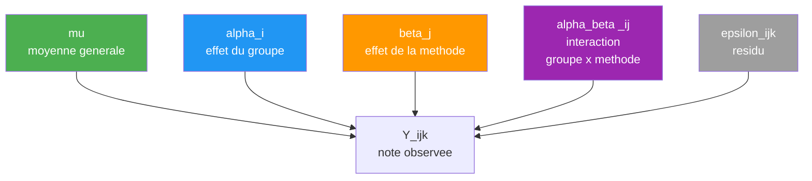
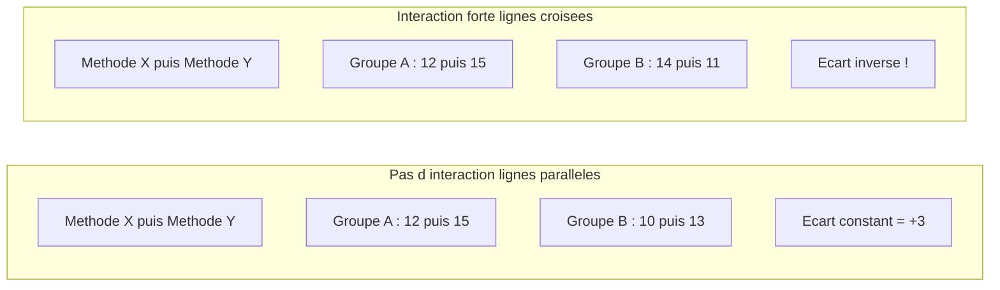
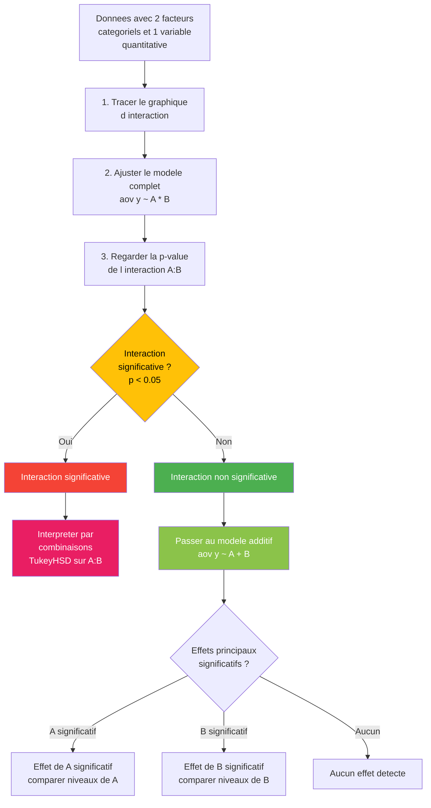

# Chapitre 6 — ANOVA à deux facteurs

> **Idée centrale :** Analyser l'effet de DEUX facteurs catégoriels sur une variable quantitative, et détecter si ces facteurs interagissent entre eux.

**Prérequis :** [ANOVA à un facteur](05_anova_1_facteur.md)  
**Retour au sommaire :** [← Guide complet](README.md)

---

## 1. Extension naturelle : pourquoi deux facteurs ?

### Le problème avec un seul facteur

Au chapitre précédent, on a appris à comparer plusieurs groupes avec l'ANOVA à un facteur. Par exemple : "les notes moyennes diffèrent-elles entre les groupes de TD ?" C'est déjà très utile, mais la réalité est rarement aussi simple.

Reprenons l'exemple des notes. Imagine que tu es enseignant et que tu veux comprendre ce qui influence les résultats de tes étudiants. Tu as deux questions en tête :

1. **Est-ce que le groupe de TD a un effet sur les notes ?** (Facteur A : groupe A ou groupe B)
2. **Est-ce que la méthode de travail a un effet sur les notes ?** (Facteur B : méthode X ou méthode Y)

Tu pourrais faire deux ANOVA à un facteur séparées. Mais tu passerais à côté d'une information cruciale : **l'interaction entre les deux facteurs**.

### Qu'est-ce qu'une interaction ?

Voici la question clé que seule l'ANOVA à deux facteurs peut poser :

> **Est-ce que l'effet de la méthode de travail change selon le groupe de TD ?**

Par exemple :
- Dans le groupe A, la méthode X donne de meilleurs résultats que la méthode Y.
- Mais dans le groupe B, c'est l'inverse : la méthode Y fonctionne mieux que la méthode X.

Si c'est le cas, on ne peut pas dire simplement "la méthode X est meilleure" — ça dépend du groupe ! **C'est ça, une interaction.**

### Analogie du restaurant

Imagine que tu testes deux restaurants (facteur A) et deux types de plats : pizza et sushi (facteur B). Tu notes la satisfaction de chaque client.

**Scénario sans interaction :**
- Le restaurant "Chez Luigi" est toujours mieux noté que "Chez Tanaka", que ce soit pour les pizzas ou les sushis.
- Les sushis sont toujours mieux notés que les pizzas, quel que soit le restaurant.
- L'avantage d'un restaurant sur l'autre est **le même** pour les deux types de plats.

**Scénario avec interaction :**
- "Chez Luigi" fait d'excellentes pizzas mais des sushis moyens.
- "Chez Tanaka" fait des sushis extraordinaires mais des pizzas médiocres.
- L'effet du restaurant **dépend** du type de plat commandé. On ne peut pas dire qu'un restaurant est "meilleur" sans préciser quel plat.

> **En une phrase :** Il y a interaction quand l'effet d'un facteur dépend du niveau de l'autre facteur.

### Pourquoi c'est important ?

Sans tester l'interaction, tu pourrais conclure à tort que :
- "Le groupe de TD n'a pas d'effet sur les notes" (alors qu'en réalité il a un effet, mais qui s'inverse selon la méthode)
- "La méthode X est meilleure" (alors qu'elle n'est meilleure que pour un groupe)

L'ANOVA à deux facteurs te protège de ces conclusions trompeuses en testant **trois choses en même temps** :
1. L'effet du facteur A (le groupe)
2. L'effet du facteur B (la méthode)
3. L'interaction A x B (est-ce que l'effet de l'un dépend de l'autre ?)

---

## 2. Le modèle avec interaction

### La formule du modèle

L'ANOVA à deux facteurs décompose chaque observation selon le modèle suivant :

```
Y_ijk = μ + αi + βj + (αβ)_ij + ε_ijk
```

C'est une extension directe du modèle à un facteur. Au lieu d'avoir un seul effet de groupe, on en a trois : l'effet du facteur A, l'effet du facteur B, et leur interaction.

### Explication de chaque terme

| Terme | Nom | Signification | Analogie |
|-------|-----|---------------|----------|
| `Y_ijk` | Observation | La note du k-ème étudiant, dans le groupe i, avec la méthode j | Le résultat concret qu'on a mesuré |
| `μ` | Moyenne générale | La note moyenne de **tous** les étudiants, tous groupes et méthodes confondus | Le "niveau de base" autour duquel tout tourne |
| `αi` | Effet du facteur A | L'écart dû au fait d'être dans le groupe i (plutôt qu'un autre) | "Être dans le groupe A ajoute +1 point en moyenne" |
| `βj` | Effet du facteur B | L'écart dû au fait d'utiliser la méthode j (plutôt qu'une autre) | "Utiliser la méthode X ajoute +2 points en moyenne" |
| `(αβ)_ij` | Interaction A x B | L'écart **supplémentaire** dû à la combinaison spécifique (groupe i, méthode j) | "Être dans le groupe A ET utiliser la méthode X donne un bonus (ou malus) supplémentaire de +3 points" |
| `ε_ijk` | Résidu (erreur) | La part de la note qu'on ne peut pas expliquer par le groupe, la méthode, ou leur interaction | La variabilité individuelle, le hasard, tout ce qu'on ne contrôle pas |

### Comprendre l'interaction (αβ)_ij

Le terme d'interaction est le plus important et le plus mal compris. Voici comment le lire :

- Si **(αβ)_ij = 0** pour toutes les combinaisons (i, j), il n'y a **pas d'interaction**. L'effet du groupe et l'effet de la méthode s'additionnent simplement. Le modèle est dit **additif**.
- Si **(αβ)_ij ≠ 0** pour certaines combinaisons, il y a **interaction**. L'effet combiné des deux facteurs n'est pas la simple somme de leurs effets séparés.

> **Analogie du médicament :** Prendre du paracétamol réduit la douleur de 3 points. Prendre un anti-inflammatoire la réduit de 4 points. Si les effets sont additifs (pas d'interaction), prendre les deux réduit la douleur de 3 + 4 = 7 points. S'il y a une interaction, la réduction pourrait être de 10 points (synergie) ou seulement de 5 points (antagonisme).

### Structure du modèle en diagramme



**Lecture du diagramme :** Chaque observation Y est la somme de cinq composantes. La moyenne générale (vert) est le socle commun. L'effet du groupe (bleu) et l'effet de la méthode (orange) sont les **effets principaux**. L'interaction (violet) capture ce qui ne s'explique pas par la simple addition des deux effets principaux. Le résidu (gris) est tout ce qui reste.

### Décomposition de la variabilité

Comme pour l'ANOVA à un facteur, l'idée fondamentale est de **décomposer la variabilité totale** des données en plusieurs sources :

```
Variabilité totale = Variabilité due à A + Variabilité due à B + Variabilité due à A×B + Variabilité résiduelle
```

Ou, en notation statistique :

```
SCT = SCA + SCB + SCAB + SCR
```

Chaque somme de carrés (SC) mesure la part de variabilité expliquée par chaque source. Si la variabilité due à l'interaction (SCAB) est grande par rapport à la variabilité résiduelle (SCR), on conclura que l'interaction est significative.

---

## 3. Le graphique d'interaction : l'outil indispensable

### Pourquoi toujours commencer par un graphique ?

Avant de regarder les p-values et les tests, il faut **toujours** tracer un graphique d'interaction. C'est le moyen le plus rapide et le plus intuitif de comprendre ce qui se passe dans tes données. Un graphique vaut mille chiffres.

### Comment lire un graphique d'interaction

Le graphique d'interaction affiche les **moyennes** de chaque combinaison de facteurs. On trace une ligne par niveau du facteur A (ou du facteur B), et on regarde comment ces lignes se comportent.

**La règle est simple :**

| Ce qu'on voit | Ce que ça signifie |
|---------------|-------------------|
| Lignes **parallèles** | **Pas d'interaction.** L'effet du facteur B est le même quel que soit le niveau du facteur A. Les effets s'additionnent simplement. |
| Lignes **non parallèles** (qui convergent, divergent ou se croisent) | **Interaction possible.** L'effet d'un facteur dépend du niveau de l'autre. Plus les lignes s'éloignent du parallélisme, plus l'interaction est forte. |
| Lignes qui **se croisent** | **Interaction forte** (dite "disordinale"). L'ordre des niveaux d'un facteur s'inverse selon l'autre facteur. |

### Illustration visuelle



### Exemple complet en R

Construisons un jeu de données où il y a une interaction, puis visualisons-la.

```r
# ── Création des données ──────────────────────────────────
set.seed(1)  # Pour reproduire exactement les mêmes résultats

# 20 étudiants : 2 groupes × 2 méthodes × 5 étudiants par combinaison
groupe  <- factor(rep(c("A", "B"), each = 10))
methode <- factor(rep(c("X", "Y", "X", "Y"), each = 5))

# Notes simulées avec une interaction volontaire :
# - Groupe A + Méthode X : moyenne autour de 12
# - Groupe A + Méthode Y : moyenne autour de 15
# - Groupe B + Méthode X : moyenne autour de 14
# - Groupe B + Méthode Y : moyenne autour de 11
notes <- c(
  rnorm(5, mean = 12, sd = 2),   # Groupe A, Méthode X
  rnorm(5, mean = 15, sd = 2),   # Groupe A, Méthode Y
  rnorm(5, mean = 14, sd = 2),   # Groupe B, Méthode X
  rnorm(5, mean = 11, sd = 2)    # Groupe B, Méthode Y
)

# Assemblage dans un data frame
df <- data.frame(notes, groupe, methode)
print(df)

# ── Vérification : moyennes par combinaison ───────────────
cat("\nMoyennes par combinaison :\n")
tapply(df$notes, list(df$groupe, df$methode), mean)
# On devrait voir que dans le groupe A, méthode Y > méthode X
# mais dans le groupe B, méthode X > méthode Y → interaction !

# ── Modèle ANOVA à deux facteurs avec interaction ────────
modele2 <- aov(notes ~ groupe * methode, data = df)

# L'opérateur * signifie : effets principaux + interaction
# C'est équivalent à écrire : notes ~ groupe + methode + groupe:methode

# ── Résultat de l'ANOVA ──────────────────────────────────
summary(modele2)

# ── Graphique d'interaction ───────────────────────────────
interaction.plot(
  x.factor  = df$methode,     # Axe des X : les niveaux de la méthode
  trace.factor = df$groupe,   # Une ligne par groupe
  response  = df$notes,       # Axe des Y : la variable réponse
  col       = c("red", "blue"),
  lwd       = 2,
  main      = "Graphique d'interaction Groupe × Méthode",
  xlab      = "Méthode de travail",
  ylab      = "Note moyenne",
  legend    = TRUE
)
```

### Lire le résultat de `summary(modele2)`

La sortie de `summary()` affiche un tableau avec **trois lignes de test** (plus les résidus) :

```
                Df Sum Sq Mean Sq F value  Pr(>F)
groupe           1   0.23    0.23   0.055  0.8180
methode          1   2.31    2.31   0.553  0.4680
groupe:methode   1  49.52   49.52  11.858  0.0034 **
Residuals       16  66.82    4.18
```

**Explication ligne par ligne :**

| Ligne | Ce qu'elle teste | Question posée |
|-------|-----------------|----------------|
| `groupe` | Effet principal du facteur A | "En moyenne (toutes méthodes confondues), les groupes ont-ils des notes différentes ?" |
| `methode` | Effet principal du facteur B | "En moyenne (tous groupes confondus), les méthodes donnent-elles des notes différentes ?" |
| `groupe:methode` | Interaction A x B | "L'effet de la méthode dépend-il du groupe ?" |
| `Residuals` | Variabilité non expliquée | La variabilité qu'aucun facteur ni interaction n'explique |

**Colonnes du tableau :**

| Colonne | Signification |
|---------|---------------|
| `Df` | Degrés de liberté (nombre de "comparaisons indépendantes" que ce terme apporte) |
| `Sum Sq` | Somme des carrés — la quantité de variabilité expliquée par ce terme |
| `Mean Sq` | Carré moyen = Sum Sq / Df — la variabilité moyenne par degré de liberté |
| `F value` | Statistique de Fisher = Mean Sq du terme / Mean Sq des résidus |
| `Pr(>F)` | La p-value — probabilité d'observer un F aussi grand si le terme n'a aucun effet |

**Interprétation de notre exemple :**

- `groupe` : p = 0.818 → Non significatif. En moyenne, les deux groupes n'ont pas des notes très différentes.
- `methode` : p = 0.468 → Non significatif. En moyenne, les deux méthodes ne donnent pas des résultats très différents.
- `groupe:methode` : p = 0.003 → **Significatif !** L'interaction est forte. L'effet de la méthode dépend du groupe.

> **Attention :** Ici, les effets principaux ne sont pas significatifs alors que l'interaction l'est. C'est typique d'une interaction "croisée" : les effets s'annulent en moyenne, mais sont bien réels quand on regarde combinaison par combinaison. C'est exactement pour cela qu'il faut tester l'interaction !

---

## 4. Le tableau ANOVA à deux facteurs

### Tableau général

Voici la structure complète du tableau ANOVA à deux facteurs. Chaque ligne décompose la variabilité totale en ses différentes sources.

| Source de variation | Degrés de liberté (Df) | Somme des carrés (SC) | Carré moyen (CM) | F observé | p-value |
|--------------------|-----------------------|----------------------|------------------|-----------|---------|
| Facteur A (groupe) | a - 1 | SCA | SCA / (a-1) | CMA / CMR | P(F > F_obs) |
| Facteur B (méthode) | b - 1 | SCB | SCB / (b-1) | CMB / CMR | P(F > F_obs) |
| Interaction A x B | (a-1)(b-1) | SCAB | SCAB / ((a-1)(b-1)) | CMAB / CMR | P(F > F_obs) |
| Résidus (erreur) | N - a*b | SCR | SCR / (N - a*b) | — | — |
| **Total** | **N - 1** | **SCT** | — | — | — |

Avec :
- **a** = nombre de niveaux du facteur A (ex. 2 groupes)
- **b** = nombre de niveaux du facteur B (ex. 2 méthodes)
- **N** = nombre total d'observations
- Les degrés de liberté s'additionnent : (a-1) + (b-1) + (a-1)(b-1) + (N - a*b) = N - 1

### Comment lire ce tableau ?

**Ordre de lecture recommandé :**

1. **Commence TOUJOURS par la ligne d'interaction (A x B).** C'est la première chose à regarder. Si l'interaction est significative, les effets principaux peuvent être trompeurs.

2. **Si l'interaction est significative (p < 0.05) :** les effets principaux des lignes "Facteur A" et "Facteur B" ne sont pas fiables tels quels. Il faut analyser les combinaisons une par une (voir section 6).

3. **Si l'interaction n'est PAS significative (p ≥ 0.05) :** on peut interpréter les effets principaux normalement. Regarde les lignes "Facteur A" et "Facteur B" pour voir quels facteurs ont un effet.

> **Analogie :** C'est comme lire un bulletin météo. Si on te dit "il y aura des orages localisés" (interaction), ça ne sert à rien de regarder la température moyenne nationale (effets principaux). Il faut regarder région par région (combinaisons).

### Calcul des sommes de carrés

Pour les curieux, voici comment chaque somme de carrés est calculée. Ces formules ne sont pas à mémoriser — R fait les calculs pour toi — mais elles aident à comprendre ce que chaque terme mesure.

```
SCA  = b·n · Σi (ȳi.. - ȳ...)²       → Variabilité entre niveaux de A
SCB  = a·n · Σj (ȳ.j. - ȳ...)²       → Variabilité entre niveaux de B
SCAB = n · Σi Σj (ȳij. - ȳi.. - ȳ.j. + ȳ...)²   → Variabilité due à l'interaction
SCR  = Σi Σj Σk (yijk - ȳij.)²       → Variabilité à l'intérieur des cellules
SCT  = Σi Σj Σk (yijk - ȳ...)²       → Variabilité totale
```

Avec :
- `ȳ...` : moyenne de toutes les observations (moyenne générale)
- `ȳi..` : moyenne du niveau i du facteur A (tous niveaux de B confondus)
- `ȳ.j.` : moyenne du niveau j du facteur B (tous niveaux de A confondus)
- `ȳij.` : moyenne de la cellule (i, j) (combinaison spécifique)
- `n` : nombre d'observations par cellule (cas équilibré)

> **L'idée clé :** Chaque somme de carrés mesure "de combien les moyennes d'un certain regroupement s'écartent de ce qu'on attendrait". Plus l'écart est grand, plus le terme est important.

---

## 5. ANOVA sans interaction (modèle additif)

### Quand retirer l'interaction ?

Parfois, le test de l'interaction n'est pas significatif (p-value élevée). Cela signifie que les données ne fournissent pas de preuve que les deux facteurs interagissent. Dans ce cas, on peut simplifier le modèle en retirant le terme d'interaction.

**Raisons de retirer l'interaction :**
- La p-value de l'interaction est clairement non significative (par exemple p > 0.25).
- Le graphique d'interaction montre des lignes à peu près parallèles.
- On veut un modèle plus simple et plus puissant (moins de paramètres à estimer = plus de degrés de liberté pour les résidus = plus de puissance pour détecter les effets principaux).

**Raisons de garder l'interaction :**
- La p-value est proche du seuil (par exemple 0.05 < p < 0.15) — prudence.
- Le graphique montre un pattern non parallèle même si le test n'est pas significatif (manque de puissance possible).
- La théorie ou le contexte suggèrent qu'une interaction est plausible.

### Le modèle additif

Le modèle sans interaction s'écrit :

```
Y_ijk = μ + αi + βj + ε_ijk
```

On suppose que les effets des deux facteurs **s'additionnent** simplement, sans se moduler l'un l'autre.

### Code R : modèle sans interaction

```r
# ── Données sans interaction ──────────────────────────────
set.seed(42)

groupe  <- factor(rep(c("A", "B"), each = 10))
methode <- factor(rep(c("X", "Y", "X", "Y"), each = 5))

# Cette fois, pas d'interaction :
# - Groupe B a toujours +2 points par rapport au groupe A
# - Méthode Y a toujours +3 points par rapport à méthode X
# - Ces effets s'additionnent simplement
notes_add <- c(
  rnorm(5, mean = 10, sd = 2),   # Groupe A, Méthode X : base
  rnorm(5, mean = 13, sd = 2),   # Groupe A, Méthode Y : +3 (méthode)
  rnorm(5, mean = 12, sd = 2),   # Groupe B, Méthode X : +2 (groupe)
  rnorm(5, mean = 15, sd = 2)    # Groupe B, Méthode Y : +2 +3 = +5
)

df_add <- data.frame(notes = notes_add, groupe, methode)

# ── Graphique d'interaction : lignes parallèles attendues ─
interaction.plot(
  df_add$methode, df_add$groupe, df_add$notes,
  col = c("red", "blue"), lwd = 2,
  main = "Modèle additif : lignes quasi parallèles",
  xlab = "Méthode", ylab = "Note moyenne"
)

# ── Modèle AVEC interaction (pour vérifier) ───────────────
modele_complet <- aov(notes ~ groupe * methode, data = df_add)
summary(modele_complet)
# L'interaction devrait être NON significative (p > 0.05)

# ── Modèle SANS interaction ──────────────────────────────
# On utilise + au lieu de * pour exclure l'interaction
modele_additif <- aov(notes ~ groupe + methode, data = df_add)
summary(modele_additif)
# Maintenant on peut interpréter les effets principaux directement
```

### Comparaison des deux modèles

| Aspect | Modèle avec interaction (`*`) | Modèle additif (`+`) |
|--------|------------------------------|----------------------|
| Formule R | `aov(y ~ A * B)` | `aov(y ~ A + B)` |
| Termes testés | A, B, A:B | A, B |
| Degrés de liberté résidus | N - a*b | N - a - b + 1 |
| Puissance | Plus faible (plus de paramètres) | Plus forte (plus de df résidus) |
| Quand l'utiliser | Toujours en première intention | Quand l'interaction est non significative |

> **Règle pratique :** Commence **toujours** par le modèle complet avec interaction. Si l'interaction n'est pas significative, passe au modèle additif pour avoir plus de puissance sur les effets principaux.

---

## 6. Comparaisons multiples

### Pourquoi des comparaisons multiples ?

L'ANOVA te dit **s'il y a une différence quelque part**, mais pas **où** exactement. C'est comme un détecteur de fumée : il sonne, mais il ne te dit pas quelle pièce brûle.

Pour savoir précisément quels groupes ou quelles combinaisons diffèrent, on utilise des **tests post-hoc** (après le test principal).

### Le test de Tukey (HSD)

Le test de Tukey (Honestly Significant Difference) compare **toutes les paires** de moyennes en contrôlant le risque d'erreur global. C'est le test post-hoc le plus utilisé.

### Code R : comparaisons multiples

```r
# ── Reprendre le modèle avec interaction significative ────
set.seed(1)

groupe  <- factor(rep(c("A", "B"), each = 10))
methode <- factor(rep(c("X", "Y", "X", "Y"), each = 5))
notes   <- c(
  rnorm(5, mean = 12, sd = 2),
  rnorm(5, mean = 15, sd = 2),
  rnorm(5, mean = 14, sd = 2),
  rnorm(5, mean = 11, sd = 2)
)
df <- data.frame(notes, groupe, methode)

modele2 <- aov(notes ~ groupe * methode, data = df)

# ── Test de Tukey sur tous les termes ─────────────────────
tukey_result <- TukeyHSD(modele2)
print(tukey_result)

# ── Visualisation des intervalles de Tukey ────────────────
par(mfrow = c(1, 1))
plot(tukey_result, las = 1)
# Les intervalles qui ne traversent PAS le zéro indiquent
# une différence significative entre les deux groupes comparés.
```

### Lire le résultat de TukeyHSD

Le résultat affiche, pour chaque paire de niveaux :

| Colonne | Signification |
|---------|---------------|
| `diff` | Différence estimée entre les deux moyennes |
| `lwr` | Borne inférieure de l'intervalle de confiance à 95% |
| `upr` | Borne supérieure de l'intervalle de confiance à 95% |
| `p adj` | p-value ajustée pour les comparaisons multiples |

**Règle de décision :**
- Si l'intervalle `[lwr, upr]` **contient 0**, la différence n'est **pas** significative.
- Si l'intervalle **ne contient pas 0**, la différence **est** significative.
- Alternativement, si `p adj < 0.05`, la différence est significative.

### Quand l'interaction est significative

Quand l'interaction est significative, les comparaisons les plus intéressantes sont celles entre les **combinaisons** (cellules). Par exemple :
- Groupe A + Méthode X vs Groupe A + Méthode Y
- Groupe B + Méthode X vs Groupe B + Méthode Y
- Groupe A + Méthode X vs Groupe B + Méthode X

Ces comparaisons te permettent de comprendre **exactement** comment les deux facteurs interagissent.

> **Astuce R :** Pour accéder spécifiquement aux comparaisons de l'interaction, utilise `tukey_result$"groupe:methode"`.

---

## 7. Pièges classiques

Voici les cinq erreurs les plus fréquentes en ANOVA à deux facteurs. Les connaître te fera gagner beaucoup de temps et de crédibilité.

### Piège 1 : Interpréter les effets principaux quand l'interaction est significative

C'est **le** piège numéro un. Si l'interaction est significative, les effets principaux ne racontent qu'une partie de l'histoire — et souvent une partie trompeuse.

**Exemple concret :** Dans notre jeu de données, l'effet principal du groupe n'est pas significatif (p = 0.82). On pourrait conclure "le groupe n'a pas d'effet". Mais c'est faux ! Le groupe a un effet, sauf qu'il s'inverse selon la méthode. En moyenne, les effets s'annulent, mais ils sont bien réels.

> **Règle d'or :** Si l'interaction est significative, **oublie les effets principaux** et concentre-toi sur les comparaisons entre combinaisons.

### Piège 2 : Plans déséquilibrés (nombre inégal d'observations par cellule)

L'ANOVA classique suppose un **plan équilibré** : le même nombre d'observations dans chaque combinaison de facteurs. Quand ce n'est pas le cas (par exemple 5 étudiants dans le groupe A/méthode X mais seulement 2 dans le groupe B/méthode Y), les résultats deviennent dépendants de l'ordre dans lequel les facteurs sont entrés dans le modèle.

**Conséquences :**
- Les sommes de carrés de type I (par défaut dans `aov()`) dépendent de l'ordre des facteurs.
- Les résultats peuvent changer si tu écris `aov(y ~ A * B)` au lieu de `aov(y ~ B * A)`.

**Solution :** Utiliser les sommes de carrés de **type III** (via le package `car`) :

```r
# install.packages("car")  # Si pas déjà installé
library(car)
modele <- lm(notes ~ groupe * methode, data = df)
Anova(modele, type = "III")
# Les SS de type III sont indépendants de l'ordre des facteurs
```

> **Conseil :** Si possible, planifie tes expériences avec un plan équilibré. C'est la meilleure solution.

### Piège 3 : Nombre d'observations insuffisant par combinaison

L'ANOVA à deux facteurs nécessite **plusieurs observations par cellule** (par combinaison de facteurs) pour pouvoir estimer l'interaction. Si tu n'as qu'une seule observation par cellule, le terme d'interaction ne peut pas être estimé — il est confondu avec les résidus.

**Minimum recommandé :** Au moins 5 observations par combinaison. Avec seulement 2 ou 3, le test manque de puissance et a peu de chances de détecter une interaction même si elle existe.

**Exemple :** Avec 2 groupes et 3 méthodes, tu as 2 x 3 = 6 cellules. Pour avoir 5 observations par cellule, il te faut au minimum 30 étudiants.

### Piège 4 : Oublier de visualiser l'interaction

Ne **jamais** se contenter des p-values sans regarder le graphique d'interaction. Le graphique te donne une compréhension qualitative que les chiffres seuls ne peuvent pas fournir :

- Il montre la **direction** de l'interaction (croisement, divergence, convergence).
- Il révèle des patterns que le test statistique peut manquer (manque de puissance).
- Il permet de détecter des **valeurs aberrantes** ou des problèmes dans les données.

> **Bonne pratique :** Trace TOUJOURS le graphique d'interaction AVANT de lancer l'ANOVA. Si les lignes sont clairement parallèles, pas besoin de chercher midi à quatorze heures. Si elles se croisent, prépare-toi à une interaction significative.

### Piège 5 : Confondre modèle additif et modèle avec interaction

| Aspect | Modèle additif (`+`) | Modèle avec interaction (`*`) |
|--------|-----------------------|-------------------------------|
| Hypothèse | Les effets s'additionnent | Les effets peuvent se moduler |
| Graphique attendu | Lignes parallèles | Lignes quelconques |
| Formule R | `y ~ A + B` | `y ~ A * B` |
| Erreur courante | L'utiliser sans avoir vérifié l'absence d'interaction | Interpréter les effets principaux quand l'interaction est significative |

**Démarche correcte :**
1. Commence par le modèle avec interaction (`*`)
2. Regarde le graphique d'interaction
3. Teste l'interaction
4. Si non significative : passe au modèle additif (`+`)
5. Si significative : reste avec le modèle complet et analyse les combinaisons

---

## 8. Récapitulatif

### Arbre de décision

Voici la démarche complète résumée sous forme d'arbre de décision :



### Tableau récapitulatif des fonctions R

| Fonction | Ce qu'elle fait | Exemple |
|----------|----------------|---------|
| `aov(y ~ A * B)` | ANOVA à 2 facteurs avec interaction | `aov(notes ~ groupe * methode, data=df)` |
| `aov(y ~ A + B)` | ANOVA à 2 facteurs sans interaction | `aov(notes ~ groupe + methode, data=df)` |
| `summary()` | Affiche le tableau ANOVA complet | `summary(modele2)` |
| `interaction.plot()` | Trace le graphique d'interaction | `interaction.plot(df$methode, df$groupe, df$notes)` |
| `TukeyHSD()` | Comparaisons multiples post-hoc | `TukeyHSD(modele2)` |
| `tapply()` | Moyennes par combinaison de facteurs | `tapply(df$notes, list(df$groupe, df$methode), mean)` |
| `Anova(modele, type="III")` | ANOVA type III (plans déséquilibrés) | Nécessite le package `car` |

### Checklist avant de conclure

1. [ ] J'ai **tracé le graphique d'interaction** avant tout calcul.
2. [ ] J'ai commencé par le **modèle complet** avec interaction (`*`).
3. [ ] J'ai regardé la p-value de l'**interaction en premier**.
4. [ ] Si l'interaction est significative, j'ai analysé les **combinaisons** et non les effets principaux.
5. [ ] Si l'interaction n'est pas significative, j'ai basculé vers le **modèle additif** (`+`).
6. [ ] Mon plan est **équilibré** (même nombre d'observations par cellule), ou j'utilise les SS de type III.
7. [ ] J'ai au moins **5 observations par combinaison** de facteurs.

### Les hypothèses de l'ANOVA à deux facteurs

Comme pour l'ANOVA à un facteur, le modèle repose sur des hypothèses. Il faut les vérifier :

| Hypothèse | Comment vérifier | Que faire si violée |
|-----------|-----------------|---------------------|
| Normalité des résidus | `shapiro.test(residuals(modele2))` + QQ-plot | Si n est grand, le TCL aide. Sinon, transformer les données ou utiliser un test non paramétrique. |
| Homogénéité des variances | `bartlett.test(notes ~ interaction(groupe, methode), data=df)` | Utiliser l'ANOVA de Welch ou transformer les données. |
| Indépendance des observations | Connaissance du protocole expérimental | Reconsidérer le plan d'expérience. |

```r
# ── Vérification des hypothèses ──────────────────────────
# Normalité des résidus
shapiro.test(residuals(modele2))
par(mfrow = c(1, 2))
hist(residuals(modele2), main = "Histogramme des résidus",
     col = "lightblue", border = "white")
qqnorm(residuals(modele2)); qqline(residuals(modele2), col = "red")

# Homogénéité des variances
bartlett.test(notes ~ interaction(groupe, methode), data = df)
```

---

## Exemples du cours

Les exemples ci-dessous sont directement issus du cours (Chapitre 6 -- ANOVA a 2 facteurs avec repetitions).

### Exemple du ble : variete x fongicide

**Enonce (cours, p.6-7) :**
On etudie l'influence de la variete de ble (F1, 3 modalites) et du fongicide (F2, 2 modalites) sur le rendement. Chaque combinaison de facteurs est repetee 2 fois (K=2).

**Donnees :**

| Parcelle | Variete | Fongicide | Rendement |
|---|---|---|---|
| 1 | 1 | 1 | 1 |
| 2 | 1 | 1 | 3 |
| 3 | 1 | 2 | 2 |
| 4 | 1 | 2 | 2 |
| 5 | 2 | 1 | 1 |
| 6 | 2 | 1 | 1 |
| 7 | 2 | 2 | 6 |
| 8 | 2 | 2 | 4 |
| 9 | 3 | 1 | 2 |
| 10 | 3 | 1 | 4 |
| 11 | 3 | 2 | 4 |
| 12 | 3 | 2 | 6 |

**Tableau des moyennes par combinaison :**

| | Fong. 1 | Fong. 2 |
|---|---|---|
| Variete 1 | 2 | 2 |
| Variete 2 | 1 | 5 |
| Variete 3 | 3 | 5 |

Moyenne generale : ȳ = 3

---

### Estimation de la variance residuelle (cours, p.28)

**Resolution :**

| variete | fong. | y | ŷ = ȳ_{ij.} | residus | somme |
|---|---|---|---|---|---|
| 1 | 1 | 1; 3 | 2 | -1; 1 | 0 |
| 1 | 2 | 2; 2 | 2 | 0; 0 | 0 |
| 2 | 1 | 1; 1 | 1 | 0; 0 | 0 |
| 2 | 2 | 6; 4 | 5 | 1; -1 | 0 |
| 3 | 1 | 2; 4 | 3 | -1; 1 | 0 |
| 3 | 2 | 4; 6 | 5 | -1; 1 | 0 |

```
Somme(ε̂²) = 1+1 + 0+0 + 0+0 + 1+1 + 1+1 + 1+1 = 8
ddl = n - I·J = 12 - 3·2 = 6
σ̂² = 8/6 = 4/3
σ̂ = 2/√3 ≈ 1.155
```

---

### Coefficient de determination (cours, p.31)

```
SST = 36
SSR = 8
R² = 1 - 8/36 = 0.778
```

Le modele explique **77.8%** de la variabilite du rendement.

---

### Table d'ANOVA du ble (cours, p.36)

**Decomposition de SSM :**

```
SST = SSF1 + SSF2 + SSF1F2 + SSR
36  =   8   +  12  +   8    +  8
```

| Variabilite | SS | ddl | CM | F | p-valeur |
|---|---|---|---|---|---|
| F1 (variete) | 8 | I-1 = 2 | 4 | 3 | 0.1217 |
| F2 (fongicide) | 12 | J-1 = 1 | 12 | 9 | 0.0240 |
| F1xF2 (interaction) | 8 | (I-1)(J-1) = 2 | 4 | 3 | 0.1217 |
| Residus | 8 | n-IJ = 6 | 4/3 | | |
| Total | 36 | n-1 = 11 | | | |

**Interpretation :**
- Variete (F1) : p = 0.122 > 5% → effet non significatif
- **Fongicide (F2) : p = 0.024 < 5% → effet significatif**
- Interaction : p = 0.122 > 5% → pas d'interaction significative

Seul le fongicide a un effet significatif sur le rendement moyen de ble.

---

### Test sur le coefficient β1 (cours, p.39)

**Enonce :** Tester H0: {β1 = 0} vs H1: {β1 ≠ 0} au risque de 5%.

Avec les contraintes naturelles : β̂1 = ȳ_{.1.} - ȳ = 7/3 - 3 = -2/3 ≈ -1 (en verifiant : ȳ_{.1.} = (2+1+3)/3 = 2 et ȳ_{.2.} = (2+5+5)/3 = 4, donc β̂1 = 2 - 3 = -1).

```
σ̂²_{β̂1} = 1/(I·K) · (J-1)/J · σ̂² = 1/(3·2) · 1/2 · 4/3 = 1/9 = 0.111

t0 = β̂1 / σ̂_{β̂1} = -1 / √(1/9) = -1 / (1/3) = -3
```

Quantile : t_{6; 0.975} = 2.447. Comme |t0| = 3 > 2.447, on rejette H0.

**Conclusion :** β1 est significativement different de 0 : le rendement moyen avec le fongicide 1 est significativement different du rendement moyen general.

**En R :**

```r
# Donnees du ble
variete <- factor(rep(1:3, each = 4))
fongicide <- factor(rep(c(1, 1, 2, 2), 3))
rendement <- c(1, 3, 2, 2, 1, 1, 6, 4, 2, 4, 4, 6)

# Modele avec interaction
modele <- lm(rendement ~ variete * fongicide)
anova(modele)

# Coefficients
summary(modele)

# Graphe des interactions
interaction.plot(variete, fongicide, rendement,
                 col = c("blue", "red"), lwd = 2,
                 xlab = "Variete", ylab = "Rendement moyen",
                 main = "Graphe des interactions")
```

---

### Exemple : Duree de vie de batteries

**Enonce (cours, p.45) :**
On etudie l'influence du materiau (3 types) et de la temperature ambiante (basse, moyenne, haute) sur la duree de vie des batteries (en heures). 4 batteries sont testees pour chaque combinaison de facteurs (36 observations au total).

**Donnees :**

| | Temperature basse | Temperature moyenne | Temperature haute |
|---|---|---|---|
| Materiau 1 | 130, 155, 74, 180 | 34, 40, 80, 75 | 20, 70, 82, 58 |
| Materiau 2 | 150, 188, 159, 126 | 136, 122, 106, 115 | 25, 70, 58, 45 |
| Materiau 3 | 138, 110, 168, 160 | 174, 120, 150, 139 | 96, 104, 82, 60 |

---

### Resultats de l'ANOVA (cours, p.48-50)

**Qualite globale :**
```
Residual standard error: 25.98 on 27 degrees of freedom
Multiple R-squared:  0.7652
Adjusted R-squared:  0.6956
F-statistic: 11 on 8 and 27 DF,  p-value: 9.426e-07
```

76% de la variabilite de la duree de vie est expliquee par le modele.

**Table d'ANOVA :**

| | Df | Sum Sq | Mean Sq | F value | Pr(>F) |
|---|---|---|---|---|---|
| materiau | 2 | 10683.72 | 5341.86 | 7.91 | 0.0020 |
| temperature | 2 | 39118.72 | 19559.36 | 28.97 | 0.0000 |
| materiau:temperature | 4 | 9613.78 | 2403.44 | 3.56 | 0.0186 |
| Residuals | 27 | 18230.75 | 675.21 | | |

**Interpretation :**
- **Materiau** : p = 0.002 < 5% → effet significatif
- **Temperature** : p ≈ 0 < 5% → effet tres significatif
- **Interaction** : p = 0.019 < 5% → l'interaction est significative

L'effet du materiau sur la duree de vie **differe selon la temperature** (et vice versa). Cela signifie qu'on ne peut pas analyser les effets principaux independamment.

---

### Coefficients des batteries (cours, p.51)

Avec la contrainte temoin (type 1 et basse = references) :

| | Estimate | Std. Error | t value | Pr(>\|t\|) |
|---|---|---|---|---|
| (Intercept) | 57.5000 | 12.9924 | 4.43 | 0.0001 |
| materiau type 2 | -8.0000 | 18.3741 | -0.44 | 0.6667 |
| materiau type 3 | 28.0000 | 18.3741 | 1.52 | 0.1392 |
| temperature Low | 77.2500 | 18.3741 | 4.20 | 0.0003 |
| temperature Medium | -0.2500 | 18.3741 | -0.01 | 0.9892 |
| type2:Low | 29.0000 | 25.9849 | 1.12 | 0.2742 |
| type3:Low | -18.7500 | 25.9849 | -0.72 | 0.4768 |
| type2:Medium | 70.5000 | 25.9849 | 2.71 | 0.0115 |
| type3:Medium | 60.5000 | 25.9849 | 2.33 | 0.0276 |

Les coefficients significatifs (p < 5%) sont :
- μ̂ = 57.5 : duree moyenne pour materiau 1 a temperature haute (reference)
- temperature Low (β̂ = 77.25) : a temperature basse, la duree est beaucoup plus longue
- interaction type2:Medium (αβ̂ = 70.5) et type3:Medium (αβ̂ = 60.5) : les materiaux 2 et 3 a temperature moyenne ont une duree significativement differente de ce que prediraient les effets principaux seuls

---

### Test HSD de Tukey (cours, p.52)

**Comparaison des materiaux :**

| | diff | lwr | upr | p adj |
|---|---|---|---|---|
| type 2 - type 1 | 25.17 | -1.14 | 51.47 | 0.06 |
| type 3 - type 1 | 41.92 | 15.61 | 68.22 | 0.00 |
| type 3 - type 2 | 16.75 | -9.55 | 43.05 | 0.27 |

- type 3 vs type 1 : difference significative (p = 0.00)
- type 2 vs type 1 : difference marginale (p = 0.06)
- type 3 vs type 2 : difference non significative (p = 0.27)

**Comparaison des temperatures :**

| | diff | lwr | upr | p adj |
|---|---|---|---|---|
| Low - High | 80.67 | 54.36 | 106.97 | 0.00 |
| Medium - High | 43.42 | 17.11 | 69.72 | 0.00 |
| Medium - Low | -37.25 | -63.55 | -10.95 | 0.00 |

Toutes les differences de temperature sont significatives. La duree de vie est la plus longue a basse temperature et la plus courte a haute temperature.

**En R :**

```r
# Donnees des batteries
materiau <- factor(rep(rep(c("type1", "type2", "type3"), each = 4), 3))
temperature <- factor(rep(c("Low", "Medium", "High"), each = 12))
duree <- c(130, 155, 74, 180,    # type1, Low
           150, 188, 159, 126,   # type2, Low
           138, 110, 168, 160,   # type3, Low
           34, 40, 80, 75,       # type1, Medium
           136, 122, 106, 115,   # type2, Medium
           174, 120, 150, 139,   # type3, Medium
           20, 70, 82, 58,       # type1, High
           25, 70, 58, 45,       # type2, High
           96, 104, 82, 60)      # type3, High

df <- data.frame(duree, materiau, temperature)

# Modele avec interaction
modele <- lm(duree ~ materiau * temperature, data = df)

# ANOVA
anova(modele)

# Coefficients
summary(modele)

# Graphe des interactions
par(mfrow = c(1, 2))
interaction.plot(df$temperature, df$materiau, df$duree,
                 col = 1:3, lwd = 2,
                 xlab = "Temperature", ylab = "Duree moyenne",
                 main = "Interaction Temperature x Materiau")
interaction.plot(df$materiau, df$temperature, df$duree,
                 col = 1:3, lwd = 2,
                 xlab = "Materiau", ylab = "Duree moyenne",
                 main = "Interaction Materiau x Temperature")

# Test HSD de Tukey
TukeyHSD(aov(duree ~ materiau, data = df))
TukeyHSD(aov(duree ~ temperature, data = df))

# Boites a moustaches
par(mfrow = c(1, 2))
boxplot(duree ~ temperature, data = df, col = c("lightcoral", "lightblue", "lightgreen"),
        main = "Duree de vie par temperature")
boxplot(duree ~ materiau, data = df, col = c("wheat", "thistle", "lightcyan"),
        main = "Duree de vie par materiau")
```

---

**Prérequis :** [ANOVA à un facteur](05_anova_1_facteur.md)  
**Retour au sommaire :** [← Guide complet](README.md)
