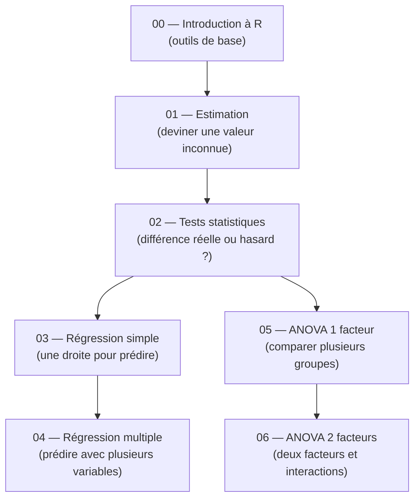

# Guide — Statistiques Descriptives (S6)

Bienvenue dans ce guide de statistiques descriptives, conçu pour être accessible même si tu n'as aucune base solide en mathématiques. L'objectif est simple : te permettre de comprendre les concepts fondamentaux des statistiques, étape par étape, avec des explications claires, des analogies concrètes et du code R que tu peux reproduire immédiatement. Chaque chapitre est **autonome** — tu peux les lire dans l'ordre ou sauter directement à celui qui t'intéresse sans être perdu.

---

## Roadmap d'apprentissage

Voici l'ordre recommandé pour progresser efficacement. Chaque étape s'appuie sur les précédentes, mais tu peux toujours revenir en arrière si un concept te manque.

> **Lecture du diagramme** : les flèches indiquent l'ordre logique. La régression (03–04) et l'ANOVA (05–06) forment deux branches qui partent toutes les deux des tests statistiques (02).

---

## Prérequis

Pas besoin d'un master en maths pour suivre ce guide. Voici le strict minimum :

- **Savoir ce qu'est une moyenne** — additionner des valeurs et diviser par leur nombre, c'est tout.
- **Avoir R installé** — télécharge-le ici : <https://cran.r-project.org/>
- **Avoir RStudio installé** — l'éditeur qui rend R agréable à utiliser : <https://posit.co/downloads/>

Si tu sais calculer `(3 + 5 + 7) / 3 = 5`, tu as le niveau requis.

---

## Comment utiliser ce guide

1. **Lis dans l'ordre** pour une progression naturelle, ou **saute directement** au chapitre qui t'intéresse — chaque fichier est autonome et complet.
2. **Reproduis le code R** en parallèle dans RStudio. Les statistiques s'apprennent en pratiquant, pas en lisant passivement.
3. **Les diagrammes Mermaid** sont rendus automatiquement sur GitHub et dans Obsidian. Si tu lis les fichiers dans un autre éditeur, installe une extension Mermaid pour en profiter.
4. **Ne mémorise pas les formules** — comprends d'abord l'intuition, le reste viendra naturellement.

---

## Table des matières

| # | Chapitre | Description |
|---|----------|-------------|
| 00 | [Introduction à R](00_introduction_R.md) | Installer R, manipuler des données, faire des graphiques — la boîte à outils pour tout le reste. |
| 01 | [Estimation](01_estimation.md) | Estimer une valeur inconnue à partir d'un échantillon — comment généraliser ce qu'on observe. |
| 02 | [Tests statistiques](02_tests_statistiques.md) | Décider si une différence est réelle ou simplement due au hasard. |
| 03 | [Régression linéaire simple](03_regression_simple.md) | Trouver la droite qui prédit le mieux une variable à partir d'une autre. |
| 04 | [Régression multiple](04_regression_multiple.md) | Prédire avec plusieurs variables explicatives en même temps. |
| 05 | [ANOVA à un facteur](05_anova_1_facteur.md) | Comparer les moyennes de plusieurs groupes pour savoir si elles diffèrent vraiment. |
| 06 | [ANOVA à deux facteurs](06_anova_2_facteurs.md) | Analyser l'effet de deux facteurs et détecter leurs interactions. |

---

## Structure d'un chapitre

Chaque chapitre suit la même progression pour t'aider à construire ta compréhension pas à pas :

| Étape | Ce que tu y trouves |
|-------|---------------------|
| **Analogie** | Une situation de la vie courante pour ancrer le concept. |
| **Intuition visuelle** | Un schéma ou diagramme Mermaid pour visualiser l'idée avant toute formule. |
| **Explication progressive** | Le concept expliqué en partant du plus simple vers le plus précis. |
| **Formules** | Les équations mathématiques, introduites seulement quand l'intuition est en place. |
| **Exemple concret** | Un jeu de données réaliste pour voir le concept en action. |
| **Code R** | Le code complet et commenté à reproduire dans RStudio. |
| **Pièges classiques** | Les erreurs fréquentes et comment les éviter. |
| **Récapitulatif** | Un résumé en quelques points pour réviser rapidement. |

> Cette structure est pensée pour que tu puisses toujours comprendre le *pourquoi* avant le *comment*. Si une formule te bloque, reviens à l'analogie — elle contient l'essentiel.
